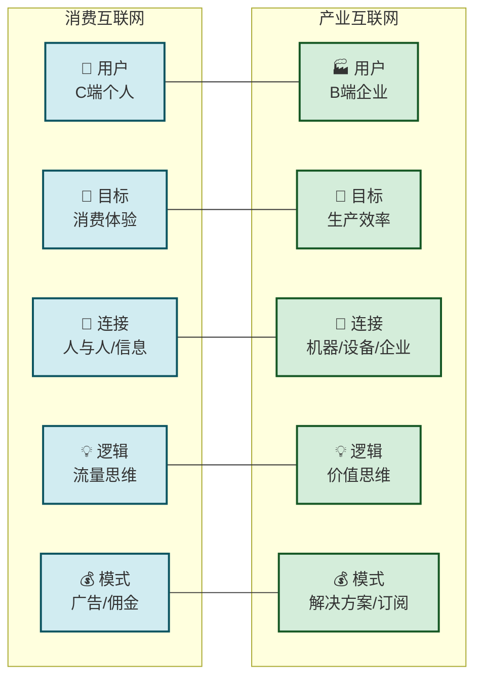
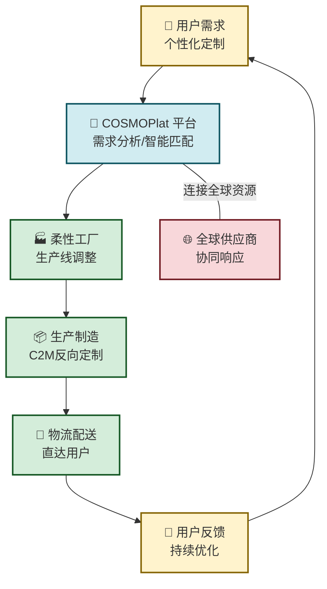

# 5.1 消费互联网与产业互联网区别

> [!abstract] 本节概述
> 过去二十年，互联网经历了从"消费互联网"到"产业互联网"的范式跃迁。消费互联网以"连接人与信息"为核心，催生了淘宝、微信、抖音等亿万级用户平台；产业互联网以"连接万物、赋能生产"为核心，正在重塑制造业、农业、交通、零售等各行各业。本节从核心逻辑、技术架构、商业模式等维度系统对比两者的差异，并以海尔COSMOPlat为案例，展示产业互联网如何通过C2M（用户反向定制）实现"大规模定制"的生产革命。

## 一、从消费互联网到产业互联网的范式跃迁

### 1.1 什么是消费互联网

> [!definition] 消费互联网（Consumer Internet）
> 消费互联网是以**个人用户**为核心，通过互联网连接人与信息、人与服务、人与人的网络形态。它的核心是**流量思维**——用户规模越大，网络价值越高（梅特卡夫定律）。

**消费互联网的典型特征：**

- **用户定位**：C端个人用户，追求便捷、体验和娱乐
- **核心价值**：降低信息不对称、提升消费体验、创造新需求
- **关键技术**：移动互联网、大数据分析、推荐算法
- **商业模式**：广告、佣金、增值服务、会员订阅
- **代表企业**：腾讯、阿里巴巴、字节跳动、美团、京东

### 1.2 什么是产业互联网

> [!definition] 产业互联网（Industrial Internet / Industrial Internet of Things）
> 产业互联网是以**企业/产业**为核心，通过物联网、云计算、大数据、人工智能等技术，连接机器、设备、生产线、工厂、仓库等全要素，重塑研发、生产、供应链、销售等全链条的网络形态。它的核心是**价值思维**——通过数据驱动实现生产效率提升和商业模式创新。

**产业互联网的三大核心特征：**

1. **以企业为中心**：服务对象是B端企业（制造商、供应商、物流商等），核心诉求是降本增效、模式升级
2. **以价值链为载体**：覆盖研发设计、生产制造、供应链管理、销售服务等全价值链环节
3. **以"生产"环节为核心**：区别于消费互联网聚焦"消费"环节，产业互联网聚焦"生产"环节的数字化和智能化

## 二、消费互联网 vs 产业互联网：全方位对比

### 2.1 核心区别对比表

| 对比维度 | 消费互联网 | 产业互联网 |
| -------- | ---------- | ---------- |
| **用户定位** | C端个人用户 | B端企业/产业用户 |
| **核心目标** | 提升消费体验、创造新需求 | 提升生产效率、优化价值链 |
| **连接对象** | 人与人、人与信息、人与服务 | 机器与机器、人与机器、企业与企业 |
| **核心逻辑** | 流量思维（用户规模×转化率） | 价值思维（数据驱动×效率提升） |
| **关键技术** | 移动互联网、推荐算法、社交网络 | 物联网、工业大数据、AI、数字孪生 |
| **商业模式** | 广告、佣金、会员、增值服务 | 设备+平台+服务、解决方案、订阅制 |
| **网络效应** | 边际收益递增（用户越多价值越大） | 网络效应+规模效应（生态协同） |
| **壁垒来源** | 用户规模、品牌、数据积累 | 行业know-how、设备连接数、数据沉淀 |
| **代表企业** | 腾讯、阿里、字节、美团 | 海尔、三一重工、徐工、富士康 |
| **发展阶段** | 成熟（红利消退） | 早期（高速增长期） |

### 2.2 Mermaid 对比图

### 2.3 一个类比理解

> [!tip] 餐厅类比
>
> **消费互联网**像是"大众点评"——它让用户可以方便地找到附近的餐厅、看评价、下单，但餐厅的后厨（生产过程）没有改变。
>
> **产业互联网**像是"餐饮供应链平台"——它不仅连接餐厅和食材供应商，还通过大数据分析预测菜品销量、优化采购计划、监控厨房设备运行，从源头改变整个餐饮的生产方式。
>
> 消费互联网是"连接"，产业互联网是"赋能"。

## 三、产业互联网的核心价值与特征

### 3.1 产业互联网的"ABC"价值框架

> [!info] 产业互联网的三大价值支柱
>
> - **A（AI）**：人工智能赋能生产决策——从"经验驱动"到"数据驱动"
> - **B（Big Data）**：工业数据的采集、分析与应用——从"数据孤岛"到"数据资产"
> - **C（Cloud）**：云计算实现资源弹性共享——从"固定产能"到"弹性产能"

### 3.2 产业互联网的五个核心特征

**1. 全要素连接**
- 不仅连接人，还连接机器、设备、物料、产品、车间、工厂
- 通过传感器、RFID、工业网关实现万物互联

**2. 数据驱动决策**
- 生产过程中每一个环节都产生数据
- 实时数据分析帮助企业做出精准决策（如预测性维护、质量控制）

**3. 柔性生产**
- 从大规模标准化生产转向大规模定制
- 一条生产线可以生产多种产品，满足个性化需求

**4. 协同制造**
- 供应链上下游企业实现数据互通
- 实时协同计划、生产、物流，实现"零库存"理想

**5. 服务化转型**
- 从"卖产品"转向"卖服务"
- 例如：GE从卖燃气轮机转向卖"按使用量付费的电力服务"

## 四、案例：海尔COSMOPlat——全球最大的工业互联网平台

### 4.1 海尔的转型之路

> [!example] 海尔的互联网转型
>
> 海尔集团从2005年开始探索互联网转型，经历了三个阶段：
> 1. **阶段一（2005-2012）**："流程再造"——用信息化手段改造传统业务流程
> 2. **阶段二（2012-2017）**："网络化战略"——搭建COSMOPlat平台，连接用户和工厂
> 3. **阶段三（2017至今）**："人单合一"模式——员工直接对接用户需求，实现大规模定制
>
> 截至2024年，COSMOPlat已成为全球最大的工业互联网生态平台，连接了**全球100多个国家**、**3.4亿用户**、**2000多万台设备**，服务**7.5万家企业**。

### 4.2 COSMOPlat的核心模式

**"人单合一"模式：**

> [!definition] 人单合一
> "人"指员工，"单"指用户订单。"人单合一"意味着**员工直接对接用户需求，从传统的"上级下达任务"转变为"用户驱动任务"**。每个员工都直接面向市场，从"执行者"变成"创业者"。

**COSMOPlat的核心运作逻辑：**

### 4.3 COSMOPlat的三大价值

**1. 对用户：个性化定制**
- 用户可以通过海尔智家APP定制冰箱颜色、洗衣机容量、空调功能等
- 定制产品价格与标准化产品相差无几（规模效应）
- 冰箱定制化率从5%提升到35%，洗衣机定制化率达到25%

**2. 对企业：效率提升**
- 研发周期缩短60%（从6个月缩短到2.4个月）
- 供应链响应速度提升3倍（从45天缩短到15天）
- 产品不良率降低50%

**3. 对产业：生态赋能**
- COSMOPlat已从海尔内部平台演变为开放的生态平台
- 吸引了食品、服装、装备等15个行业的生态方加入
- 赋能中小企业数字化转型，降低转型门槛

### 4.4 C2M：从B2C到C2M的生产革命

> [!definition] C2M（Consumer-to-Manufacturer）
> C2M是**用户反向定制**的生产模式。用户的需求直接驱动工厂的生产计划，消除中间环节，实现"以销定产"甚至"以需定产"。

| 对比维度 | 传统B2C模式 | C2M模式 |
| -------- | ---------- | ------- |
| 生产驱动 | 工厂预测生产 | 用户需求驱动 |
| 库存 | 大量库存 | 零库存/极低库存 |
| 产品差异化 | 标准化为主 | 个性化定制 |
| 中间环节 | 多级经销商 | 直接到用户 |
| 价格优势 | 溢价较多 | 接近成本价 |
| 代表案例 | 传统家电行业 | 海尔COSMOPlat、必要商城 |

> [!warning] C2M的挑战
> 1. **柔性生产能力**：工厂必须具备快速切换生产线的能力（海尔通过COSMOPlat实现了一条生产线生产多种产品）
> 2. **数据驱动**：需要强大的数据分析能力预测用户需求
> 3. **供应链协同**：供应商必须能够快速响应小批量、多品种的采购需求
> 4. **用户参与度**：需要足够大的用户基数支撑定制化需求的聚合

## 五、产业互联网的发展趋势

### 5.1 产业互联网的三个发展阶段

| 阶段 | 核心特征 | 代表案例 |
| ---- | -------- | -------- |
| **第一阶段：数字化** | 设备联网、数据采集、流程数字化 | 工厂设备加装传感器、ERP系统上线 |
| **第二阶段：网络化** | 企业互联、供应链协同、平台化 | 海尔COSMOPlat、三一重工根云平台 |
| **第三阶段：智能化** | AI决策、自动驾驶、数字孪生 | 青岛全要素港口、三一灯塔工厂 |

### 5.2 未来展望

> [!note] 产业互联网的未来
>
> 1. **从"制造"到"智造"**：人工智能将深度融入生产过程，实现自适应、自优化的智能生产
> 2. **从"平台"到"生态"**：产业互联网平台将演变为产业生态，跨行业协同成为主流
> 3. **从"中国"到"全球"**：中国产业互联网平台将加速全球化布局，海尔、三一已在海外市场取得突破
> 4. **从"降本"到"增值"**：产业互联网的价值将从"降本增效"延伸到"创造新商业模式"（如产品即服务）

## 六、易错点

> [!warning] 常见误区
> 1. **产业互联网 = 工业互联网**：产业互联网的范围更广，覆盖工业、农业、服务业等所有产业；工业互联网只是产业互联网的一个重要组成部分
> 2. **产业互联网 = 物联网**：物联网是产业互联网的基础技术之一，但产业互联网还包括云计算、大数据、AI等更广泛的技术栈
> 3. **产业互联网只适合大企业**：事实上，产业互联网平台正在降低中小企业的数字化门槛，让中小企业也能享受智能化的红利
> 4. **产业互联网就是上云**：上云是产业互联网的基础，但远不是全部。产业互联网的核心是数据驱动的价值创造

## 章节导航

- 上一级：[[MOC - 第5章]]
- 下一节：[[5.2 工业互联网平台架构]]
- 习题：[[MOC - 第5章习题]]