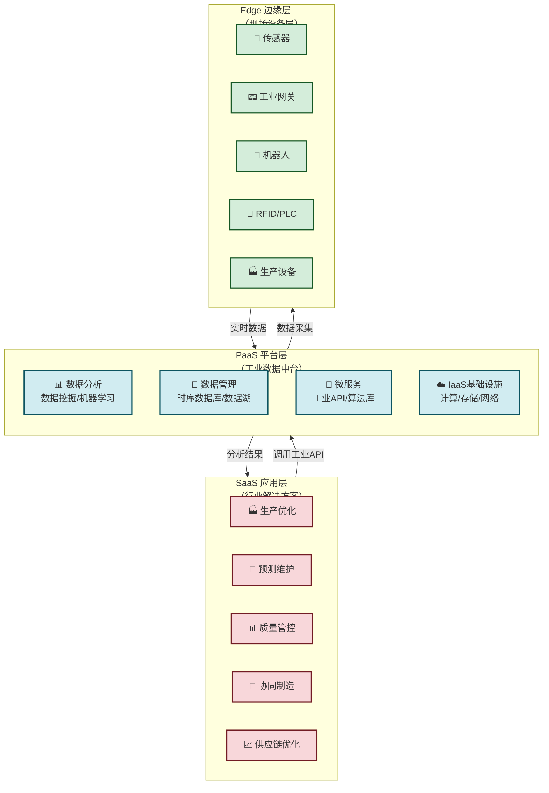
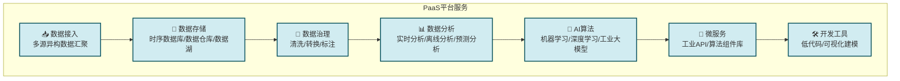

# 5.2 工业互联网平台架构

> [!abstract] 本节概述
> 工业互联网是产业互联网的核心组成部分，其本质是将互联网技术与工业生产深度融合，实现**机器+数据+人的智能协同**。本节系统介绍工业互联网的三层架构（边缘层、平台层、应用层），详细解析各层的核心功能与关键技术，并以三一重工"根云"平台和徐工集团"汉云"平台为案例，展示中国工业互联网平台的建设路径与实践成果。

## 一、工业互联网架构概述

### 1.1 什么是工业互联网平台

> [!definition] 工业互联网平台
> 工业互联网平台是面向制造业数字化、网络化、智能化需求的**基础设施**，它构建在云计算和物联网技术之上，通过数据采集、数据分析和应用部署，实现**机器、设备、车间、工厂、企业之间的互联互通**，支撑生产过程的智能化优化和商业模式的创新。

### 1.2 工业互联网的"三层架构"

工业互联网平台通常采用**"边缘层→平台层→应用层"**的三层架构，这是工信部发布的《工业互联网平台白皮书》中定义的标准架构。

## 二、边缘层：设备连接与数据采集

### 2.1 边缘层的核心功能

边缘层是工业互联网的**"感官系统"**，负责连接现场设备、采集原始数据、进行初步处理。

> [!info] 边缘层的五大核心功能
> 1. **设备接入**：连接各类工业设备（机床、机器人、传感器、PLC等）
> 2. **数据采集**：实时采集设备运行数据、生产数据、环境数据
> 3. **协议转换**：将不同设备的通信协议（OPC UA、Modbus、MQTT等）转换为统一格式
> 4. **边缘计算**：在现场端进行实时数据分析和快速响应
> 5. **数据传输**：将处理后的数据安全传输至云端平台

### 2.2 边缘层的关键技术

| 技术 | 作用 | 典型应用 |
| ---- | ---- | -------- |
| **OPC UA** | 工业互联协议，跨平台数据交换 | 设备互联互通的"普通话" |
| **边缘网关** | 协议转换+数据预处理 | 车间数据采集枢纽 |
| **边缘计算** | 实时计算、低延迟响应 | 自动化生产监控 |
| **5G/WiFi6** | 高速、低时延无线通信 | 柔性生产线、AGV调度 |
| **数字孪生** | 设备/产线的虚拟映射 | 实时监控与仿真 |

### 2.3 边缘层与云计算的协同

> [!tip] 边缘计算 vs 云计算
>
> | 维度 | 边缘计算 | 云计算 |
> | ---- | -------- | ------ |
> | 数据量 | 小（MB级） | 大（TB级） |
> | 响应时间 | 毫秒级 | 秒级/分钟级 |
> | 处理内容 | 实时数据处理、快速决策 | 历史数据分析、复杂模型训练 |
> | 典型任务 | 设备异常检测、生产控制 | 长期趋势分析、AI模型训练 |
>
> 边缘计算是"前线指挥官"，云计算是"后方参谋部"——两者协同工作，实现最优的资源配置。

## 三、平台层：工业数据的汇聚与分析

### 3.1 IaaS：基础设施层

> [!definition] IaaS（Infrastructure as a Service）
> IaaS提供云计算基础设施服务，包括计算资源（服务器）、存储资源、网络资源等，是工业互联网平台的**"地基"**。

**IaaS核心服务：**
- 弹性计算：虚拟机、容器（Docker、Kubernetes）
- 海量存储：对象存储、块存储、文件存储
- 网络服务：VPC、负载均衡、CDN
- 安全服务：防火墙、入侵检测、数据加密

**国内主要工业云服务商：**

| 服务商 | 代表产品 | 核心优势 |
| ------ | -------- | -------- |
| 阿里云 | 阿里云工业云 | 技术成熟、生态完善 |
| 华为云 | 华为云工业互联网平台 | 5G+工业融合优势 |
| 三一重工 | 根云平台 | 工程机械行业know-how |
| 徐工集团 | 汉云平台 | 装备制造行业优势 |
| 海尔 | COSMOPlat | 家电行业全栈服务 |

### 3.2 PaaS：平台服务层

> [!definition] PaaS（Platform as a Service）
> PaaS是工业互联网平台的**"大脑"**，在IaaS基础上提供工业数据处理、分析、建模和应用开发的平台服务。

**PaaS核心功能：**

**PaaS核心价值：**
- **数据资产化**：将分散的工业数据汇聚、治理，转化为可分析、可复用的数据资产
- **算法复用**：将行业知识和AI算法封装为可复用的组件，降低应用开发门槛
- **快速开发**：提供低代码/无代码开发工具，让非IT人员也能快速构建工业应用

### 3.3 工业大数据的价值

> [!example] 工业大数据的价值创造
>
> 三一重工根云平台每天处理超过**100TB**的设备运行数据，通过数据分析实现：
> - **故障预测**：基于振动、温度、电流等数据，提前24小时预测设备故障，准确率达95%
> - **油耗优化**：通过分析工程机械的作业数据，为客户提供驾驶行为优化建议，平均节油15%
> - **产能预测**：基于历史数据和订单数据，为客户提供产能预测和订单分配建议
> - **远程运维**：工程师远程诊断设备问题，现场工程师无需拆解即可了解设备状态，维修效率提升50%

## 四、应用层：行业解决方案

### 4.1 SaaS 应用层核心场景

应用层是工业互联网的**"价值终端"**，面向不同行业提供具体的解决方案。

| 应用场景 | 核心价值 | 代表产品 |
| -------- | -------- | -------- |
| **预测性维护** | 减少设备停机时间，降低维护成本 | 三一根云、海尔COSMOPlat |
| **生产质量优化** | 实时质量监控，降低不良率 | 西门子MindSphere、博世IoT |
| **供应链协同** | 上下游企业数据互通，优化库存 | 海尔COSMOPlat、富士康Fii Cloud |
| **能耗优化** | 实时监控能耗，降低能源成本 | 施耐德EcoStruxure、华为云 |
| **柔性生产调度** | 动态调整生产线，支持多品种小批量 | 海尔COSMOPlat、三一灯塔工厂 |
| **设备远程运维** | 远程诊断和升级，减少现场服务 | 三一根云、卡特彼勒Cat Connect |

### 4.2 工业互联网 App 生态

> [!tip] 工业App的崛起
> 工业互联网平台的核心竞争力不仅在于平台本身，更在于其上的**工业App生态**。海尔COSMOPlat已上线超过**3000个**工业App，覆盖研发、生产、供应链、销售全链条。三一根云平台也拥有超过**2000个**工业App，服务工程机械行业的各类客户。

## 五、案例：三一重工"根云"平台

### 5.1 三一重工的数字化转型

> [!example] 三一重工的"灯塔工厂"之路
>
> 三一重工是中国工程机械行业的龙头企业，也是工业互联网的先行者：
> 1. **2008年**：开始设备远程监控探索，给挖掘机加装GPS模块
> 2. **2013年**：推出"根云"平台（RootCloud），成为国内最早的工业互联网平台之一
> 3. **2018年**：三一"灯塔工厂"（长沙工厂）被世界经济论坛评为全球首批灯塔工厂
> 4. **2020年**：根云平台升级为根云工业互联网平台2.0，连接设备超过**60万台**
> 5. **2023年**：根云平台连接设备突破**120万台**，服务全球**100多个国家**的客户

### 5.2 根云平台的核心应用

**1. 设备远程监控与诊断**
- 实时监控60万台工程机械的位置、工况、油耗、故障
- 通过AI算法预测设备故障，准确率达95%以上
- 远程诊断和升级，维修响应时间从48小时缩短到2小时

**2. 智能服务调度**
- 基于设备位置和状态，智能调度售后服务工程师
- 备件库存优化，备件周转率提升40%
- 服务响应速度提升60%，客户满意度提升30%

**3. 融资租赁风控**
- 通过设备运行数据评估客户的真实经营状况
- 实时监控融资租赁设备的使用情况，降低坏账风险
- 该模式已被多家银行和融资租赁公司采用

**4. 数字孪生工厂**
- 长沙灯塔工厂实现全流程数字孪生
- 生产效率提升45%，产品不良率降低35%
- 能源利用率提升15%

### 5.3 根云平台的商业模式创新

| 传统模式 | 根云模式 | 创新价值 |
| -------- | -------- | -------- |
| 卖设备（硬件一次性收入） | 卖"设备+服务"（硬件+持续服务费） | 从交易型转向关系型 |
| 售后服务为成本中心 | 售后服务为利润中心 | 服务收入占比从5%提升到25% |
| 设备价值在交付时确定 | 设备价值在使用中持续创造 | 设备全生命周期价值最大化 |
| 客户流失后无法连接 | 客户通过平台持续连接 | 形成数据驱动的生态壁垒 |

## 六、案例：徐工集团"汉云"平台

### 6.1 徐工集团的工业互联网实践

> [!example] 徐工汉云的"三种能力"
>
> 徐工集团是中国装备制造行业的领军企业，其"汉云"平台代表了装备制造业工业互联网的领先水平：
>
> **三种核心能力：**
> 1. **连接能力**：连接全球**50万台**徐工设备，实现远程监控和管理
> 2. **分析能力**：构建装备制造行业知识库，沉淀超过**200种**智能分析算法
> 3. **协同能力**：打通研发、生产、供应链、客户全链条数据

**汉云平台的核心成果：**

- **研发周期缩短40%**：通过数字孪生和仿真技术，新品研发周期从18个月缩短到10个月
- **生产效率提升30%**：灯塔工厂实现全流程自动化，人均产值提升50%
- **供应链成本降低20%**：通过供应链协同和精准预测，库存周转率提升35%
- **服务收入增长50%**：基于汉云的增值服务（远程运维、数据分析、金融服务）快速增长

### 6.2 汉云的生态战略

> [!note] 汉云的"开放生态"
> 汉云平台已从徐工内部平台演变为开放的行业生态平台：
> - 连接**5000+** 家上下游企业
> - 服务**10+** 个行业（装备制造、能源、交通、物流等）
> - 联合**200+** 合作伙伴（华为、阿里云、中国移动等）
> - 开发者社区拥有**10万+** 开发者

## 七、工业互联网的挑战与趋势

### 7.1 面临的挑战

| 挑战 | 具体表现 | 应对策略 |
| ---- | -------- | -------- |
| **设备异构性** | 不同品牌、不同年代的设备协议不统一 | 推进OPC UA等标准，使用边缘网关协议转换 |
| **数据安全** | 工业数据涉及企业核心竞争力 | 数据分级分类、加密传输、本地化部署 |
| **人才短缺** | 缺乏既懂工业又懂IT的复合型人才 | 校企合作、在职培训、引进外部人才 |
| **投资回报** | 工业互联网投资大、回报周期长 | 分阶段实施，优先选择ROI明确的场景 |
| **标准缺失** | 不同行业、不同地区的工业互联网标准不统一 | 参与国家标准制定，推动行业标准落地 |

### 7.2 未来趋势

> [!info] 工业互联网的发展趋势
>
> 1. **工业大模型**：基于工业数据训练行业大模型，实现更智能的决策支持（如三一重工的"根云工业大模型"）
> 2. **AI Agent**：AI智能体自主执行复杂任务（如自动调整生产参数、自动调度维修）
> 3. **跨行业融合**：工业互联网与能源互联网、交通互联网融合，构建更大的产业生态
> 4. **绿色低碳**：工业互联网助力"双碳"目标，实现生产过程的精准碳排放管理
> 5. **全球化**：中国工业互联网平台加速出海，输出行业解决方案和标准

## 章节导航

- 上一级：[[MOC - 第5章]]
- 上一节：[[5.1 消费互联网与产业互联网区别]]
- 下一节：[[5.3 智慧农业、智慧交通数字化案例]]
- 习题：[[MOC - 第5章习题]]