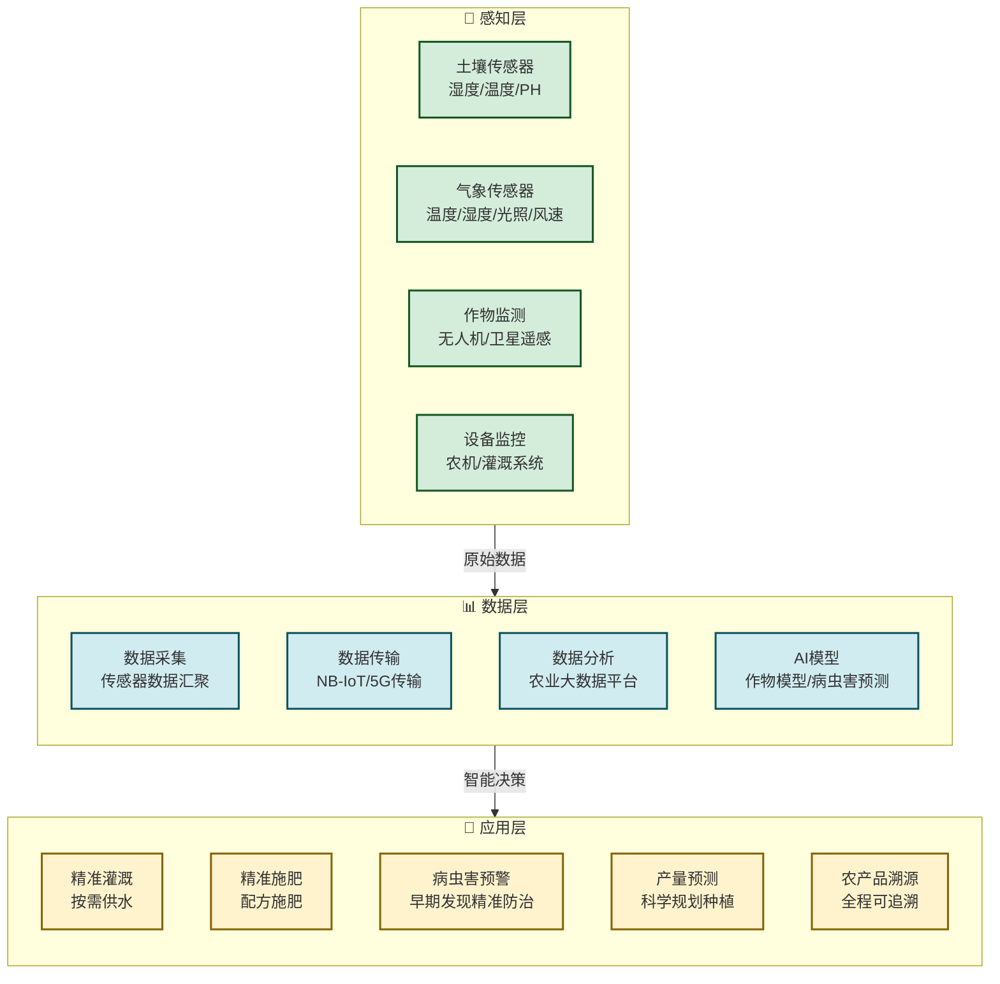
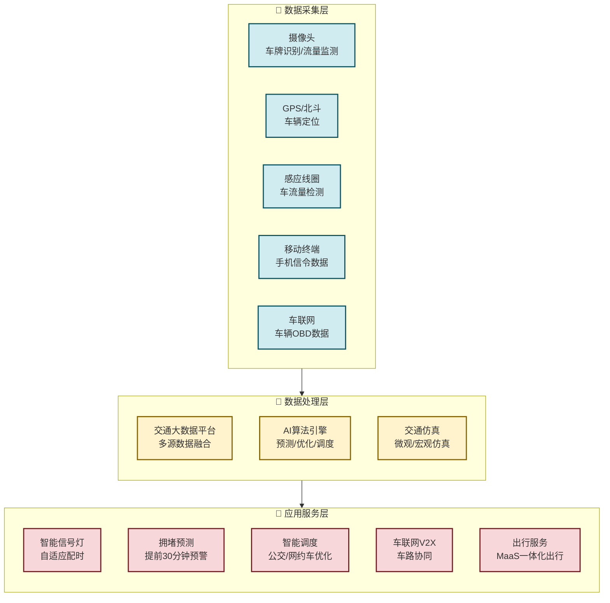

# 5.3 智慧农业、智慧交通数字化案例

> [!abstract] 本节概述
> 产业互联网的价值不仅体现在制造业，更在农业、交通等传统行业中展现出巨大的变革潜力。智慧农业通过传感器、大数据和物联网技术，实现了从"经验农业"到"数据农业"的跨越；智慧交通通过车联网（V2X）、交通大数据和智能调度，正在重塑城市出行的方式。本节以"中农互联"和"高德/滴滴智慧交通"为案例，展示数字化技术如何让传统行业焕发新活力。

## 一、智慧农业：从"面朝黄土"到"数据驱动"

### 1.1 传统农业的痛点

> [!warning] 传统农业面临的核心挑战
>
> 1. **生产效率低**：依赖人工经验，每亩产量波动大
> 2. **资源浪费严重**：大水漫灌、过量施肥，水资源利用率仅40%
> 3. **风险不可控**：病虫害、自然灾害缺乏预警
> 4. **流通环节多**：从田间到餐桌经过5-6层中间商，农民利润被层层压缩
> 5. **数据缺失**：缺乏农田、作物、土壤等核心数据的采集和分析

### 1.2 智慧农业的技术架构

> [!definition] 智慧农业（Smart Agriculture）
> 智慧农业是指运用物联网、大数据、云计算、人工智能等技术，对农业生产的全过程进行数字化监控、智能化决策和精准化执行的新型农业生产方式。

### 1.3 智慧农业的核心技术

| 技术 | 应用场景 | 价值 |
| ---- | -------- | ---- |
| **土壤传感器** | 实时监测土壤湿度、温度、PH值 | 精准灌溉，节水50% |
| **气象站** | 微区域气象数据采集 | 灾害性天气预警 |
| **无人机** | 作物长势遥感监测、精准喷洒 | 效率提升20倍，农药节省30% |
| **卫星遥感** | 大尺度作物监测、产量估算 | 宏观决策支持 |
| **AI图像识别** | 病虫害识别、作物成熟度判断 | 准确率达95%以上 |
| **农产品溯源** | 区块链+物联网溯源体系 | 从田间到餐桌全程追溯 |
| **智慧农机** | 自动驾驶、精准播种/施肥/收割 | 精度达厘米级 |

### 1.4 案例：中农互联——中国智慧农业的先行者

> [!example] 中农互联的"天空地"一体化方案
>
> 中农互联（全称：中农互联科技有限公司）是国内领先的智慧农业服务商，致力于通过数字化技术推动中国农业现代化：
>
> **"天空地"一体化感知体系：**
> - **天**：卫星遥感+无人机航拍，实现大尺度作物监测
> - **空**：农业气象站+无人机，获取微区域气象数据
> - **地**：土壤传感器+作物监测设备，实时采集田间数据
>
> 截至2024年，中农互联已服务全国**30+省份**、**5000+万亩**耕地，覆盖粮食作物、经济作物、设施农业等多种场景。

**核心成果**：

| 应用场景 | 传统方式 | 智慧农业方式 | 提升效果 |
| -------- | -------- | ------------ | -------- |
| **灌溉决策** | 凭经验浇水 | 土壤湿度传感器自动触发 | 节水50%，产量提升15% |
| **施肥决策** | 固定施肥量 | 土壤养分检测+AI配方施肥 | 化肥节省30%，成本降低20% |
| **病虫害防治** | 发现后喷药 | AI图像识别早期预警+精准喷洒 | 农药使用减少40%，减产损失降低60% |
| **产量预测** | 估算 | 卫星遥感+AI产量预测模型 | 预测准确率达90%以上 |
| **农产品溯源** | 无溯源 | 区块链+二维码溯源 | 品牌溢价20-30% |

**具体案例：山东寿光智慧蔬菜大棚**

> [!example] 寿光大棚的数字化改造
>
> 山东寿光蔬菜产业园与中农互联合作，对**10000座**大棚进行数字化改造：
> - 每座大棚安装了12个传感器（温度、湿度、光照、CO₂浓度、土壤墒情等）
> - 数据通过NB-IoT实时上传至中农云平台
> - AI模型自动分析作物生长状态，给出温湿度、灌溉、施肥的精准建议
>
> **改造效果：**
> - 蔬菜产量提升25%
> - 农药使用量减少35%
> - 节水40%
> - 农产品品质显著提升，"寿光蔬菜"品牌溢价能力增强

## 二、智慧交通：从"修路"到"修脑"

### 2.1 传统交通的痛点

> [!warning] 传统交通面临的核心挑战
>
> 1. **交通拥堵**：全国城市平均通勤时间长达42分钟，每年因拥堵造成的经济损失超2000亿元
> 2. **事故率高**：交通事故每年造成近6万人死亡，其中90%为人为因素
> 3. **公共交通效率低**：公交准点率仅85%，高峰时段运力不足
> 4. **出行信息不对称**：乘客无法实时获取最优出行方案
> 5. **交通管理粗放**：信号灯配时固定，无法根据实时流量自适应调整

### 2.2 智慧交通的技术架构

> [!definition] 智慧交通（Smart Transportation / Intelligent Transportation System）
> 智慧交通是指运用物联网、大数据、人工智能、车联网（V2X）等技术，对城市交通系统进行智能化管理和优化的新型交通方式。

### 2.3 车联网（V2X）：智慧交通的核心

> [!definition] 车联网（V2X，Vehicle-to-Everything）
> V2X是车辆与一切事物之间的互联通信技术，包括V2V（车与车）、V2I（车与路）、V2P（车与人）、V2N（车与网络）等。它是实现自动驾驶和智能交通的核心基础。

**V2X的核心应用场景：**

| 场景 | 技术 | 核心价值 |
| ---- | ---- | -------- |
| **交通事故预警** | V2V | 提前3秒预警，避免90%的追尾事故 |
| **交叉路口协同** | V2I | 无信号灯交叉口通行效率提升3倍 |
| **车速引导** | V2I | 公交准点率提升20%，节油15% |
| **危险路段提示** | V2I | 事故率降低50% |
| **盲区监测** | V2V+V2P | 行人/非机动车碰撞事故减少80% |
| **自动驾驶协同** | V2X+AI | 支撑L4/L5级自动驾驶落地 |

### 2.4 案例：高德"智慧交通大脑"

> [!example] 高德的"交通大脑"
>
> 高德"智慧交通大脑"是国内领先的智慧交通解决方案，已在全国**200+城市**落地：
>
> **核心能力：**
> 1. **实时交通感知**：覆盖全国**360+万公里**道路，实时监控交通状态
> 2. **AI预测引擎**：基于历史数据和实时数据，预测未来**15-60分钟**的交通状况
> 3. **智能信号灯优化**：为**10万+路口**提供自适应信号灯配时服务
> 4. **出行路径规划**：为用户提供实时最优出行方案，日均服务**5亿+**用户

**核心成果：**

| 城市 | 应用场景 | 效果 |
| ---- | -------- | ---- |
| **杭州** | 主城区信号灯优化 | 平均车速提升15%，拥堵里程减少20% |
| **广州** | 智慧停车 | 停车找位时间从8分钟缩短到2分钟 |
| **成都** | 公交优先调度 | 公交准点率从82%提升到95% |
| **深圳** | 拥堵预测预警 | 提前30分钟预警，交通事故减少15% |

**高德的"数据+生态"战略：**
- 依托高德地图的**5亿+**月活用户和海量出行数据
- 与交警部门合作，将互联网数据与交通管理数据融合
- 开放交通大脑能力，为城市交通管理提供决策支持
- 推出"城市活力指数"等产品，为城市规划提供数据支撑

### 2.5 案例：滴滴智慧交通

> [!example] 滴滴的"智慧出行"
>
> 滴滴作为全球最大的出行平台之一，其智慧交通实践代表了**以出行服务商为中心**的智慧交通模式：
>
> **数据优势：**
> - 日均处理**5000万+**订单
> - 实时掌握全国主要城市的出行需求和交通状态
> - 积累了**10年+**的出行大数据

**核心应用：**

**1. 智能派单系统**
- AI算法实时匹配乘客与司机，派单效率提升40%
- 高峰期智能加价调度运力，平衡供需
- 乘客平均等待时间从8分钟缩短到5分钟

**2. 运力规划与调度**
- 基于历史数据和实时数据，预测各区域的出行需求
- 提前调度司机前往需求高的区域，减少空载率
- 高峰时段运力利用率提升30%

**3. 与城市交通管理部门合作**
- 向城市交通部门提供实时出行数据，辅助交通管理决策
- 参与城市公共交通规划（如公交线路优化、地铁站点选址）
- 推出"滴滴城市出行指数"，为城市规划提供数据支撑

**4. MaaS（一体化出行服务）**
- 整合网约车、公交、地铁、共享单车等多种出行方式
- 为用户提供一站式出行解决方案（规划+预订+支付）
- 已在广州、杭州等城市试点

## 三、智慧农业 vs 智慧交通：对比分析

| 维度 | 智慧农业 | 智慧交通 |
| ---- | -------- | -------- |
| **数据来源** | 传感器、无人机、卫星、气象站 | GPS、摄像头、手机信令、V2X |
| **核心技术** | 物联网+AI图像识别+区块链 | 车联网+AI预测+大数据 |
| **服务对象** | 农民、农业企业、政府 | 司机、乘客、交通管理部门 |
| **核心价值** | 提升产量、降低成本、保障食品安全 | 提升通行效率、减少事故、改善出行体验 |
| **产业变革** | 从传统农业到现代农业 | 从人工驾驶到智能驾驶 |
| **代表企业** | 中农互联、极飞科技、大北农 | 高德、滴滴、华为、百度Apollo |
| **发展阶段** | 快速发展期 | 规模应用期 |

## 四、智慧产业的共性规律

> [!tip] 从农业和交通看产业互联网的共性
>
> 1. **数据是核心资产**：无论农业还是交通，数据采集和分析都是价值创造的基础
> 2. **场景驱动价值**：产业互联网必须扎根具体行业场景，解决实际痛点
> 3. **生态合作**：单一企业无法独立完成行业数字化，需要构建生态合作体系
> 4. **B2B2C模式**：产业互联网的价值最终要传递到C端用户（农民、乘客）
> 5. **政策驱动**：智慧农业和智慧交通都受到国家政策的大力支持

## 章节导航

- 上一级：[[MOC - 第5章]]
- 上一节：[[5.2 工业互联网平台架构]]
- 下一节：[[5.4 新零售、数字文旅创新模式]]
- 习题：[[MOC - 第5章习题]]