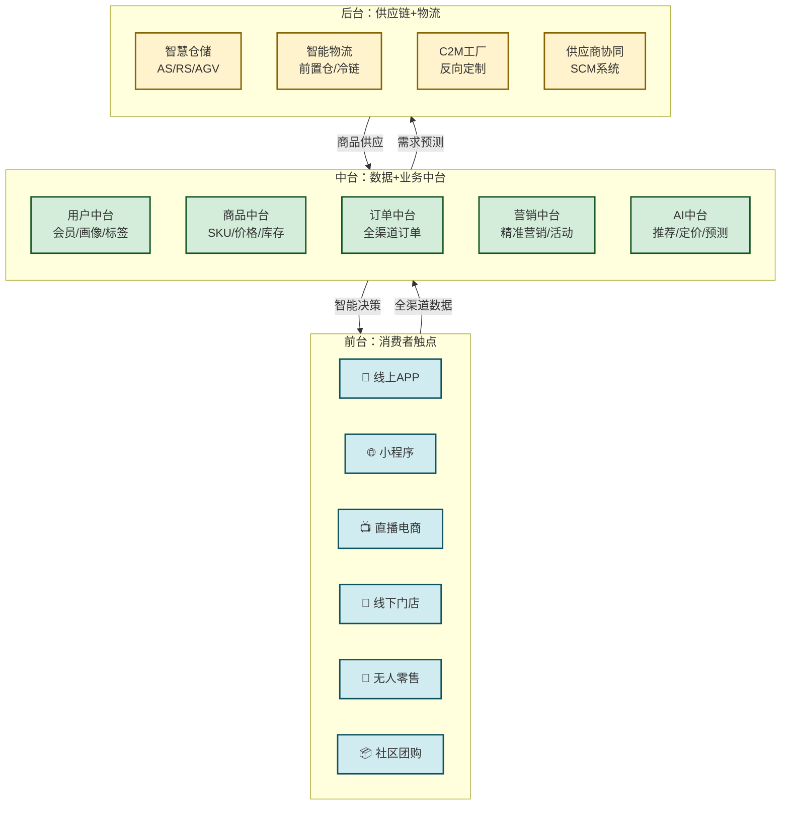
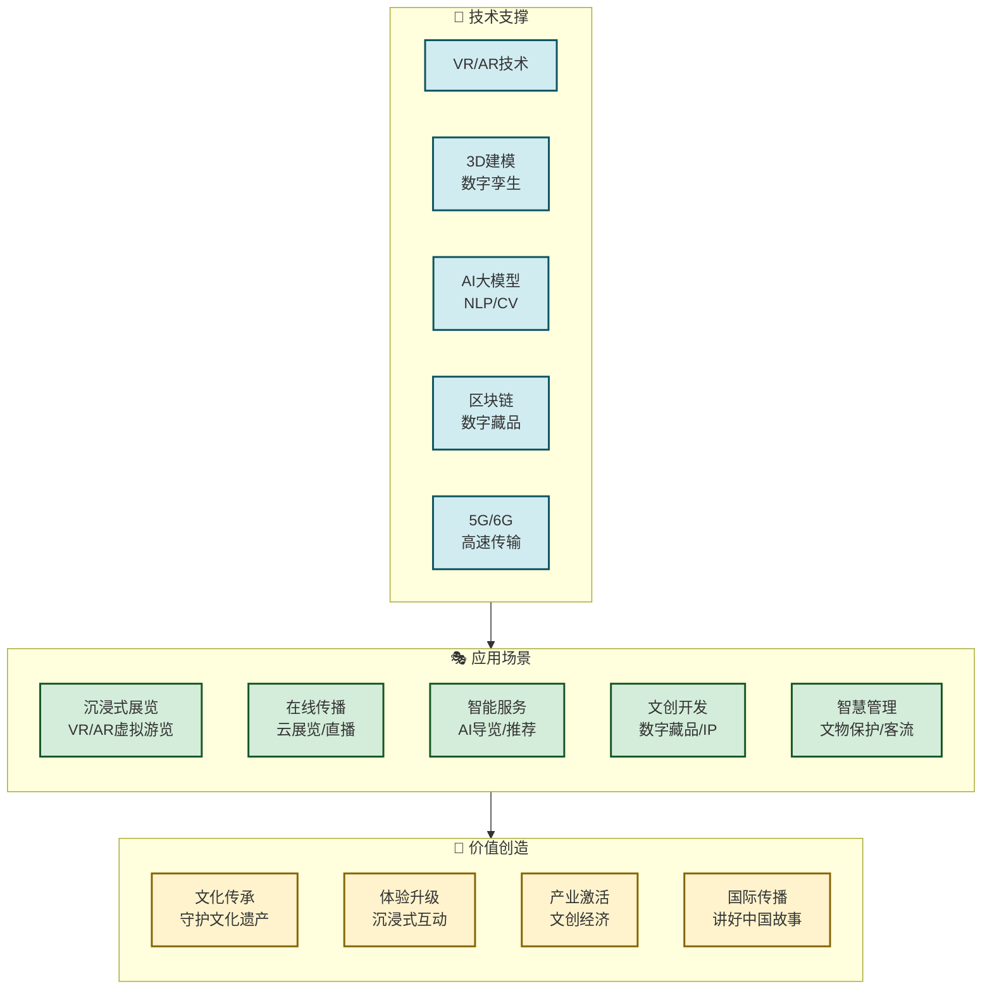

# 5.4 新零售、数字文旅创新模式

> [!abstract] 本节概述
> 如果说工业互联网是产业互联网在"生产端"的变革，那么新零售和数字文旅就是产业互联网在"消费端"的创新实践。新零售通过"线上+线下+物流"的深度融合，正在重塑零售行业的形态；数字文旅通过沉浸式体验和数字技术，让传统文化焕发新活力。本节以盒马鲜生和故宫博物院数字化为案例，展示产业互联网如何在消费场景中创造新价值。

## 一、新零售：线上线下的深度融合

### 1.1 零售业的三次革命

| 阶段 | 核心特征 | 代表业态 | 驱动力 |
| ---- | -------- | -------- | ------ |
| **传统零售** | 实体店交易，人货场分离 | 百货商店、超市 | 供给驱动 |
| **电商零售** | 线上交易，跨时空连接 | 淘宝、京东、拼多多 | 流量驱动 |
| **新零售** | 线上线下融合，人货场合一 | 盒马鲜生、永辉超市、三只松鼠 | 数据驱动 |

> [!definition] 新零售（New Retail）
> "新零售"由马云在2016年提出，是指**线上线下深度融合、以数据为核心驱动力的零售新模式**。其核心是实现"人、货、场"的数字化重构，让消费者在任何场景下都能获得无缝的购物体验。

### 1.2 新零售的"三通"核心

新零售的核心是实现"三通"：

**1. 人通——用户数据通**
- 线上线下用户身份统一（一个会员ID全渠道通行）
- 用户行为数据全面采集（浏览、搜索、购买、社交等）
- 用户画像全渠道整合，实现精准营销

**2. 货通——商品供应链通**
- 商品全生命周期数字化（采购→仓储→销售→售后）
- 供应链实时响应需求变化（C2M反向定制）
- 库存全渠道共享，实现"一盘货"管理

**3. 场通——消费场景通**
- 线上（APP、小程序、直播）与线下（门店、体验店）无缝衔接
- 全渠道一致的商品、价格、服务体验
- 多场景融合的消费体验（如餐饮+零售+娱乐）

### 1.3 新零售的技术架构

### 1.4 案例：盒马鲜生——新零售的标杆

> [!example] 盒马鲜生的"鲜生模式"
>
> 盒马鲜生是阿里巴巴旗下的新零售平台，成立于2015年，是国内新零售的标杆企业：
>
> **核心模式：**
> 1. **线上线下一体化**：线下门店即线上仓库，30分钟送达
> 2. **"生鲜+餐饮"双业态**：超市购物+堂食餐饮融合
> 3. **全渠道会员体系**：支付宝/淘宝账号直接登录，积分通用
> 4. **AI驱动的运营**：智能选品、智能定价、智能调度

**盒马的三大差异化优势：**

**1. 门店即仓库的"仓店一体"模式**

| 对比 | 传统超市 | 盒马鲜生 |
| ---- | -------- | -------- |
| 仓库位置 | 郊区大仓 | 门店即为仓 |
| 配送距离 | 5-50公里 | 0-3公里 |
| 配送时间 | 次日达 | 30分钟达 |
| 库存管理 | 人工盘点 | AI实时监控 |
| 选品策略 | 全国统一 | 千店千面（AI根据周边用户画像选品） |

**2. "鲜"字当头的商品策略**

- 生鲜商品占比高达60-70%（传统超市一般30%）
- 自有品牌占比超40%（如"盒马工坊"熟食、"日日鲜"鲜食）
- 直采比例超80%（绕过中间商，保证品质和价格优势）
- "冰鲜海鲜"现场烹饪，打造体验差异化

**3. AI驱动的精细化运营**

> [!info] 盒马的AI应用
>
> - **智能选品**：AI分析每个门店周边3公里用户的消费偏好，实现"千店千面"
> - **智能定价**：基于供需、库存、竞品等因素动态定价
> - **智能调度**：实时监控订单密度，动态调整配送路线和骑手数量
> - **智能损耗管理**：AI预测商品销量，精准控制进货量，降低损耗
> - **智能推荐**：APP首页"猜你喜欢"基于用户画像精准推荐

**盒马的成果：**

| 指标 | 传统超市 | 盒马鲜生 |
| ---- | -------- | -------- |
| 坪效（万元/㎡/年） | 1.5-2.0 | 3.0-5.0 |
| 毛利率 | 15-20% | 22-25% |
| 线上订单占比 | <5% | 30-50% |
| 客单价 | 50-80元 | 80-120元 |
| 复购率 | 15-20% | 40-50% |
| 库存周转天数 | 30-45天 | 15-20天 |

## 二、数字文旅：让文化"活"起来

### 2.1 传统文旅行业的痛点

> [!warning] 传统文旅面临的核心挑战
>
> 1. **体验单一**：以"看"为主，缺乏参与感和互动感
> 2. **季节性强**：旺季人满为患，淡季门可罗雀
> 3. **传播局限**：依赖线下流量，缺乏线上传播能力
> 4. **资源闲置**：大量文化资源沉睡，无法有效触达受众
> 5. **管理粗放**：游客流量、文物保护等缺乏精细化管理

### 2.2 数字文旅的核心模式

> [!definition] 数字文旅（Digital Cultural Tourism）
> 数字文旅是指运用VR/AR、数字孪生、人工智能、大数据等技术，创新文化遗产保护、展示和传播方式，为游客提供沉浸式、互动式、个性化的文化体验。

**数字文旅的四大核心模式：**

**1. 沉浸式体验**
- VR/AR虚拟游览（如故宫VR游览、敦煌AR体验）
- 沉浸式剧场/展览（如《只有河南》《不眠之夜》）
- 数字孪生还原历史场景

**2. 在线化传播**
- 云展览、云直播（如故宫"数字故宫"小程序）
- 短视频/社交媒体传播
- 数字藏品（NFT/数字文创）

**3. 智能化服务**
- AI导览（智能讲解、路径规划）
- 个性化推荐（基于用户画像的游览路线）
- 无感支付、智能预约

**4. 数据化运营**
- 游客行为数据分析
- 文物预防性保护（环境监控、结构监测）
- 精准营销和文创产品开发

### 2.3 案例：故宫博物院的数字化之路

> [!example] 故宫的"数字故宫"战略
>
> 故宫博物院是中国数字化转型最成功的文化机构之一，其"数字故宫"战略已成为全球文博行业的标杆：
>
> **发展历程：**
> 1. **1998年**：开始数字化探索，建立文物数字档案
> 2. **2008年**：推出"故宫博物院"官网，首次实现线上展览
> 3. **2016年**：推出"数字故宫"小程序+APP，打造多端体验
> 4. **2018年**：推出"紫禁城600年"VR展览，获千万级用户
> 5. **2020年**：疫情期间推出"云游故宫"直播，单场观看超1000万
> 6. **2023年**：推出"数字故宫"2.0，实现AI导览、AR体验等功能

**核心成果：**

**1. 文物数字化**
- 186万件文物中已有**60%**实现数字化存档
- 高精度数字采集（达到亿级像素），可用于文物研究和展示
- 建立文物数字库，向全球研究者开放

**2. 线上体验**
- "数字故宫"APP用户超**1000万**
- VR展览累计访问超**5000万人次**
- 在线教育课程覆盖**3000万+**青少年
- 社交媒体粉丝总量超**2000万**

**3. 文创产品**
- 文创产品年销售额突破**15亿元**
- 数字藏品（NFT）限量发行，每次均秒光
- IP授权覆盖服装、化妆品、食品等多个品类

**4. 智慧管理**
- 实时监控展馆环境（温度、湿度、光照），保护文物
- AI分析游客行为，优化参观路线和服务
- 客流智能调度，避免拥挤

### 2.4 数字文旅的技术架构

## 三、新零售 vs 数字文旅：消费端的两种创新

| 维度 | 新零售 | 数字文旅 |
| ---- | ------ | -------- |
| **行业属性** | 商品零售业 | 文化旅游业 |
| **核心创新** | 线上线下融合 | 沉浸式体验 |
| **驱动力** | 数据驱动的精准运营 | 技术驱动的体验升级 |
| **技术重点** | 全渠道中台、智能供应链 | VR/AR、数字孪生、AI |
| **价值创造** | 效率提升+成本降低 | 体验升级+文化传播 |
| **变现模式** | 商品销售+会员+服务 | 门票+文创+IP授权+数字藏品 |
| **代表企业** | 盒马、永辉、三只松鼠 | 故宫、敦煌、陕西历史博物馆 |
| **发展阶段** | 成熟落地期 | 快速发展期 |

## 四、消费端数字化的启示

> [!tip] 新零售与数字文旅的共同启示
>
> 1. **用户体验是核心**：无论是零售还是文旅，用户体验都是数字化转型的出发点和落脚点
> 2. **线上线下不是对立的**：新零售和数字文旅都证明，线上线下融合才能创造最大价值
> 3. **数据是核心资产**：用户数据、商品数据、行为数据的采集和分析是精细化运营的基础
> 4. **技术要服务于场景**：不能为了技术而技术，要找到技术与业务的最佳结合点
> 5. **生态合作是关键**：单一企业无法覆盖全链条，需要构建开放合作的生态体系

## 章节导航

- 上一级：[[MOC - 第5章]]
- 上一节：[[5.3 智慧农业、智慧交通数字化案例]]
- 下一节：[[5.5 企业上云与数字化改造路径]]
- 习题：[[MOC - 第5章习题]]