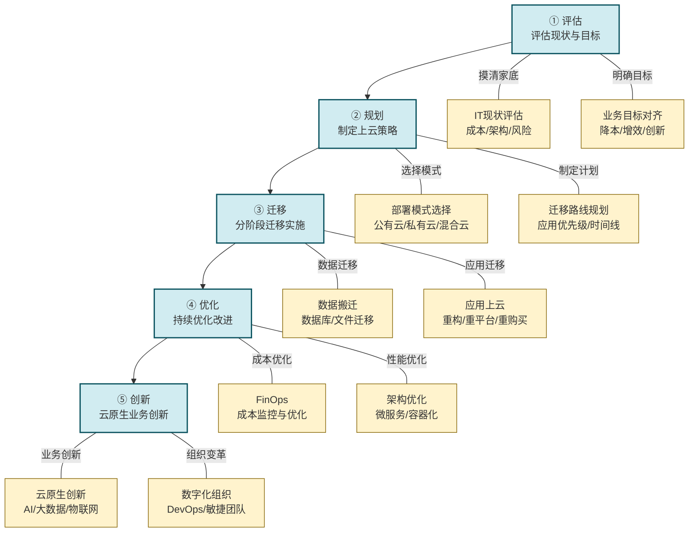

# 5.5 企业上云与数字化改造路径

> [!abstract] 本节概述
> 企业上云是数字化转型的"必答题"而非"选答题"。但上云不是简单的"搬机房"，而是涉及技术架构、业务流程、组织文化的全方位变革。本节系统介绍企业上云的五步路径（评估→规划→迁移→优化→创新），分析上云过程中的主要风险与应对策略，并以海尔和美的的数字化改造为案例，展示中国制造业龙头如何通过上云实现从"传统制造"到"智能创造"的跃迁。

## 一、为什么企业必须上云

### 1.1 从"IT成本中心"到"业务创新引擎"

> [!info] 上云的核心驱动力
>
> 1. **降本增效**：按需付费，告别"烟囱式"IT建设，IT成本降低30-50%
> 2. **敏捷响应**：弹性伸缩，快速应对业务变化（如双十一流量洪峰）
> 3. **数据驱动**：数据集中汇聚，为AI、大数据分析提供基础
> 4. **创新加速**：云原生架构支持快速开发和迭代
> 5. **生态协同**：云平台构建企业间数据互通的基础

### 1.2 企业上云的现状

| 企业类型 | 上云比例 | 主要场景 |
| -------- | -------- | -------- |
| **大型企业** | 85%+ | 核心业务系统、大数据、AI |
| **中型企业** | 60%+ | 办公协同、CRM、ERP |
| **小微企业** | 40%+ | SaaS应用、邮件、存储 |

> [!note] 中国企业上云率
> 截至2024年，中国企业上云率已超过**60%**，但与发达国家（80%+）仍有差距。"十四五"规划明确提出，到2025年企业上云率要达到**80%**。

## 二、企业上云的五步路径

### 2.1 上云路径总览

### 2.2 第一步：评估——摸清家底，明确目标

**核心任务：**
1. **IT现状评估**
   - 盘点所有IT资产（服务器、应用、数据）
   - 分析当前IT成本结构（硬件、软件、运维）
   - 评估现有架构的优缺点和风险点

2. **业务目标对齐**
   - 上云的核心目标是什么？（降本？增效？创新？）
   - 业务部门有哪些痛点可以通过上云解决？
   - 数字化成熟度评估（当前阶段和目标阶段）

> [!tip] 数字化成熟度模型
>
> | 阶段 | 特征 | 核心任务 |
> | ---- | ---- | -------- |
> | **1. 初始级** | IT支撑业务，无数字化战略 | 基础设施建设 |
> | **2. 发展级** | IT与业务初步融合，数据意识萌芽 | 数据中台建设 |
> | **3. 优化级** | 数据驱动决策，业务流程数字化 | 业务中台建设 |
> | **4. 领导级** | 数字化成为核心竞争力，商业模式创新 | 智能决策+生态构建 |

### 2.3 第二步：规划——制定上云策略

**核心任务：**

**1. 部署模式选择**

| 模式 | 特点 | 适用场景 | 代表服务商 |
| ---- | ---- | -------- | ---------- |
| **公有云** | 按需付费，弹性伸缩 | 中小企业、互联网业务、非核心系统 | 阿里云、腾讯云、华为云 |
| **私有云** | 专属资源，安全可控 | 大型企业、金融、政府、核心业务 | 华为Stack、阿里云专有云 |
| **混合云** | 公有云+私有云结合 | 大型企业、需要兼顾安全和弹性 | 多云管理平台 |
| **行业云** | 行业定制化解决方案 | 特定行业（制造、能源、教育） | 三一根云、海尔COSMOPlat |

**2. 应用迁移策略**

| 策略 | 说明 | 适用场景 |
| ---- | ---- | -------- |
| **Rehost（搬迁）** | 直接搬上云，不改架构 | 简单应用、快速上云 |
| **Replatform（平移）** | 做少量优化后上云 | 中等复杂应用 |
| **Repurchase（重购）** | 用SaaS替代原有应用 | CRM、HR等通用系统 |
| **Refactor（重构）** | 云原生架构重构 | 核心业务系统 |
| **Retire（淘汰）** | 淘汰老旧应用 | 无业务价值的系统 |

> [!warning] 应用迁移的"6R"策略
> 上云不是"一刀切"，不同应用应选择不同迁移策略。对于核心业务系统，建议采用"渐进式迁移"——先非核心、后核心；先外围、后中心。

### 2.4 第三步：迁移——分阶段实施

**迁移实施的三大原则：**

1. **先易后难**：先迁移简单、非核心的应用，积累经验
2. **小步快跑**：每个阶段迁移1-2个应用，快速验证
3. **双轨并行**：迁移期间保持新旧系统并行，确保业务连续性

**迁移的五个阶段：**

```mermaid
flowchart LR
    subgraph 阶段1["准备阶段"]
        direction TB
        P1["环境搭建<br/>VPC/网络/安全组"]
        P2["工具部署<br/>迁移工具/监控"]
        P3["培训<br/>团队技能提升"]
    end

    subgraph 阶段2["数据迁移"]
        direction TB
        D1["数据库迁移<br/>全量+增量同步"]
        D2["文件迁移<br/>对象存储同步"]
    end

    subgraph 阶段3["应用迁移"]
        direction TB
        A1["非核心应用<br/>测试环境"]
        A2["核心应用<br/>灰度发布"]
    end

    subgraph 阶段4["切换上线"]
        direction TB
        S1["DNS切换<br/>流量逐步切换"]
        S2["监控优化<br/>性能/稳定性监控"]
    end

    subgraph 阶段5["收尾优化"]
        direction TB
        F1["旧系统下线<br/>清理旧资源"]
        F2["文档归档<br/>运维文档更新"]
    end

    阶段1 --> 阶段2
    阶段2 --> 阶段3
    阶段3 --> 阶段4
    阶段4 --> 阶段5

    classDef phase fill:#d4edda,stroke:#155724,stroke-width:2px
    class P1,P2,P3 phase
    class D1,D2 phase
    class A1,A2 phase
    class S1,S2 phase
    class F1,F2 phase
```

### 2.5 第四步：优化——持续改进

**上云后的优化方向：**

**1. 成本优化（FinOps）**
- 资源利用率监控：识别闲置资源，及时释放
- 预留实例/Spot实例：降低长期使用成本
- 成本分摊：精确计算每个业务线的云成本
- 供应商谈判：批量采购、长期合同

**2. 性能优化**
- 架构优化：微服务拆分、服务网格
- 缓存优化：CDN、Redis缓存策略
- 数据库优化：读写分离、分库分表、数据归档
- 容器化：Docker+Kubernetes，实现弹性伸缩

**3. 安全优化**
- 数据分级分类：敏感数据加密存储和传输
- 零信任架构：所有访问都需验证和授权
- 安全监控：实时监控异常行为和攻击
- 灾备方案：多可用区/多地域容灾

### 2.6 第五步：创新——释放云价值

**上云只是手段，创新才是目的：**

> [!info] 云原生创新方向
>
> 1. **AI+业务**：利用云平台的AI能力，实现智能推荐、预测分析、自然语言处理等
> 2. **大数据分析**：构建数据中台，实现全业务数据的汇聚和分析
> 3. **物联网应用**：云+物联网平台，实现设备互联互通和实时监控
> 4. **微服务架构**：应用微服务化，实现业务的快速迭代和弹性扩展
> 5. **Serverless架构**：按需执行，无需管理服务器，大幅降低运维成本

## 三、上云的主要风险与应对

### 3.1 风险识别与应对

| 风险类型 | 具体表现 | 影响程度 | 应对策略 |
| -------- | -------- | -------- | -------- |
| **数据安全风险** | 数据泄露、数据丢失、合规风险 | 极高 | 加密传输/存储、数据分级、本地化部署 |
| **业务中断风险** | 迁移导致业务停机、性能下降 | 高 | 双轨并行、灰度发布、回滚方案 |
| **成本失控风险** | 云成本超出预期、资源浪费 | 中 | FinOps体系、成本监控、预留实例 |
| **技术锁定风险** | 依赖单一云服务商，迁移成本高 | 中 | 多云策略、容器化、标准化API |
| **人才短缺风险** | 缺乏云原生技术人才 | 中 | 内部培训、外部引进、合作伙伴赋能 |
| **网络延迟风险** | 网络带宽不足、延迟过高 | 中 | 专线接入、CDN加速、边缘计算 |

### 3.2 混合云：平衡安全与弹性的选择

> [!tip] 混合云是大中型企业的主流选择
>
> 对于大中型企业而言，混合云（公有云+私有云）是兼顾安全与弹性的最佳选择：
>
> - **公有云**：承载互联网业务、大数据分析、AI训练等需要弹性的场景
> - **私有云**：承载核心业务系统、敏感数据处理等需要安全的场景
> - **混合云连接**：通过专线/VPN实现公有云和私有云的安全互联
>
> 海尔、美的、三一重工等龙头企业均采用混合云架构。

## 四、案例：海尔的数字化改造

### 4.1 海尔的"上云"之路

> [!example] 海尔的云转型实践
>
> 海尔是中国制造业数字化转型的标杆，其数字化改造经历了三个阶段：
>
> **第一阶段（2012-2016）：基础设施上云**
> - 将内部OA、邮件、HR等系统迁移至公有云
> - 搭建私有云IaaS平台，承载核心业务系统
> - 建立云安全体系，实现数据分级保护
>
> **第二阶段（2016-2020）：数据中台建设**
> - 建设COSMOPlat工业互联网平台
> - 打通研发、生产、供应链、销售全链条数据
> - 构建用户中台，实现用户全生命周期管理
>
> **第三阶段（2020至今）：云原生创新**
> - 应用微服务化改造，实现业务快速迭代
> - 构建AI中台，实现智能推荐、预测分析
> - 推出"人单合一"模式，实现用户驱动的大规模定制

### 4.2 海尔上云的核心成果

| 指标 | 上云前（2012） | 上云后（2024） | 提升幅度 |
| ---- | -------------- | -------------- | -------- |
| IT成本 | 100% | 45% | 降低55% |
| 业务上线周期 | 6个月 | 2周 | 缩短85% |
| 设备联网率 | 5% | 95% | 提升19倍 |
| 数据利用率 | 10% | 70% | 提升6倍 |
| 研发周期 | 6个月 | 2.4个月 | 缩短60% |
| 生产不良率 | 5% | 0.5% | 降低90% |

### 4.3 海尔的数字化组织变革

> [!info] 组织变革是上云成功的关键
>
> 海尔在技术转型的同时，进行了深刻的组织变革：
>
> 1. **从"部门制"到"平台制"**：打破传统部门壁垒，以COSMOPlat为平台，形成开放的生态
> 2. **从"管理者"到"创客"**：员工从被动执行者变为主动创业者，直接面向用户
> 3. **从"瀑布开发"到"敏捷开发"**：所有业务系统采用敏捷开发模式，2周一个迭代
> 4. **从"IT部门"到"数字化部门"**：IT部门从成本中心变为业务创新的核心引擎

## 五、案例：美的的数字化改造

### 5.1 美的的"美云智数"

> [!example] 美的的数字化实践
>
> 美的集团是另一个制造业数字化转型的标杆，其核心实践是"美云智数"：
>
> **核心架构：**
> 1. **Midea M.I.NE平台**：美的全集团的数字化中台，覆盖研发、生产、供应链、销售全链条
> 2. **美云智数**：美的对外输出数字化能力的平台，已服务**5000+** 企业客户
> 3. **美的工业互联网平台**：连接**100+** 工厂、**50万+** 设备的工业互联网体系

**美的上云的关键举措：**

**1. 研发上云**
- 构建全球研发云平台，连接**30+** 研发中心
- CAD/CAE仿真计算上云，研发效率提升40%
- 产品数据管理（PDM）云化，实现全球协同研发

**2. 生产上云**
- 全集团**100+** 工厂部署工业互联网平台
- 设备联网率达**90%+**，实现生产过程实时监控
- 智能排产系统，产能提升25%

**3. 供应链上云**
- 构建供应商协同平台，连接**3000+** 供应商
- 实时协同计划、订单、物流，供应链响应速度提升3倍
- 采购成本降低15%

### 5.2 美的数字化的启示

> [!tip] 美的数字化转型的关键成功因素
>
> 1. **一把手工程**：美的董事长方洪波亲自推动数字化，每月召开数字化专题会议
> 2. **业务驱动**：数字化始终服务于业务目标，而非为了技术而技术
> 3. **中台战略**：通过数据中台和业务中台，实现能力复用和快速迭代
> 4. **生态合作**：与阿里云、华为等云服务商深度合作，共同构建数字化能力
> 5. **持续投入**：数字化是长期投资，美的每年IT投入超过**50亿元**

## 六、企业上云的"坑"与"悟"

### 6.1 常见陷阱

| 陷阱 | 表现 | 破解之道 |
| ---- | ---- | -------- |
| **"上云=搬家"** | 简单把机房搬到云上，不改架构 | 上云是架构重构的机会，不是物理搬迁 |
| **"一步到位"** | 一次性把所有系统搬上云 | 分阶段实施，先易后难，逐步验证 |
| **"重技术轻业务"** | 关注技术架构，忽视业务场景 | 业务为本，技术为用，始终围绕业务价值 |
| **"上云就省钱"** | 以为上云一定能省钱 | 初期成本可能上升，长期看ROI |
| **"忽视组织变革"** | 技术改了，组织和文化没变 | 技术+组织+文化三位一体变革 |

### 6.2 成功关键因素

> [!summary] 企业上云的六大成功要素
> 1. **战略清晰**：明确上云的目标和路线图，与业务战略对齐
> 2. **组织保障**：成立跨部门的上云项目组，获得高层支持
> 3. **循序渐进**：分阶段实施，快速验证，持续迭代
> 4. **数据为本**：将数据作为核心资产进行管理和运营
> 5. **生态合作**：选择合适的云服务商和合作伙伴，共建能力
> 6. **持续创新**：上云不是终点，而是数字化创新的起点

## 章节导航

- 上一级：[[MOC - 第5章]]
- 上一节：[[5.4 新零售、数字文旅创新模式]]
- 习题：[[MOC - 第5章习题]]
- 下一章：[[MOC - 第6章|第6章 互联网安全、合规与治理]]