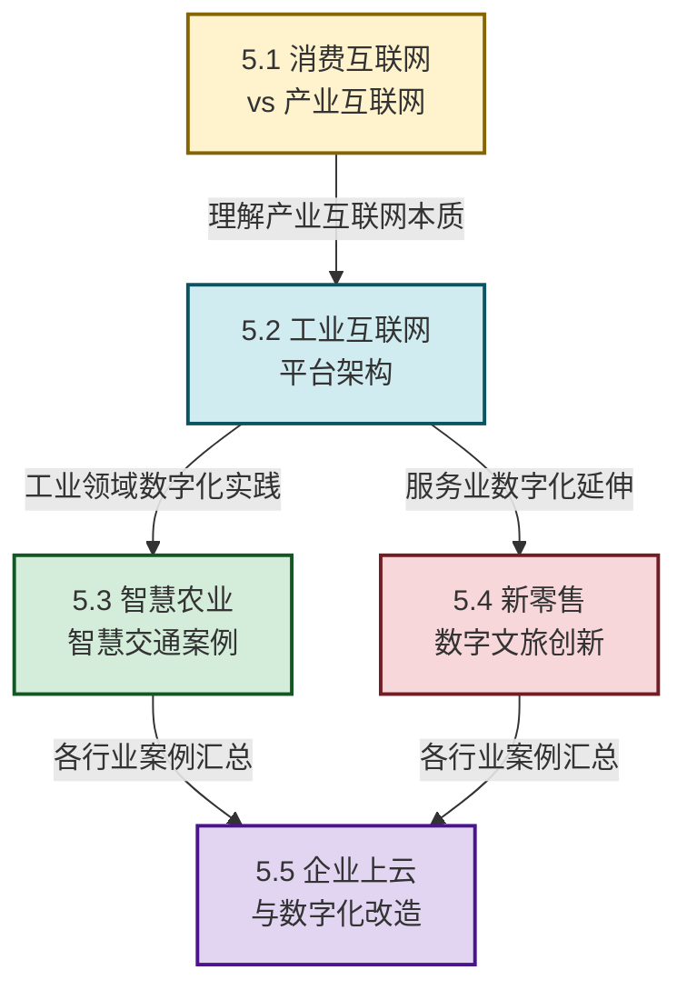

# MOC - 第5章 产业互联网与行业数字化转型

> [!info] 本章定位
> 本章是互联网创新的**产业变革核心章**。它要回答的核心问题是：**互联网如何从"连接人与信息"的消费互联网，演进到"连接万物、赋能产业"的产业互联网？工业互联网、智慧农业、新零售、数字文旅等行业数字化转型的路径和模式是什么？企业如何通过上云实现数字化改造？** 本章将技术能力（第3章）、产品方法（第4章）与产业实践结合，构建"消费互联网→产业互联网→行业数字化→企业上云"的完整产业转型知识体系，是后续 [[MOC - 第6章|第6章 互联网安全、合规与治理]]（产业安全治理）和 [[MOC - 第8章|第8章 互联网前沿创新方向]]（产业前沿趋势）的实践基础。

## 学习路线图

## 知识点导航

| 小节 | 标题 | 核心内容 | 关键概念 |
| ---- | ---- | -------- | -------- |
| [[5.1 消费互联网与产业互联网区别\|5.1]] | 消费互联网与产业互联网 | 核心区别对比、产业互联网特征、海尔COSMOPlat案例 | 消费互联网、产业互联网、C2M、大规模定制 |
| [[5.2 工业互联网平台架构\|5.2]] | 工业互联网平台架构 | 三层架构、核心功能、三一重工/徐工案例 | 边缘层、IaaS、PaaS、SaaS、工业大数据 |
| [[5.3 智慧农业、智慧交通数字化案例\|5.3]] | 智慧农业与智慧交通 | 传感器+大数据、车联网、中农互联、高德案例 | 精准农业、车联网(V2X)、智慧交通大脑 |
| [[5.4 新零售、数字文旅创新模式\|5.4]] | 新零售与数字文旅 | 线上线下融合、沉浸式体验、盒马鲜生、故宫案例 | 新零售、O2O融合、数字孪生、沉浸文旅 |
| [[5.5 企业上云与数字化改造路径\|5.5]] | 企业上云路径 | 上云步骤、风险应对、海尔/美的案例 | 云迁移、数字化成熟度、IT架构演进 |

## 核心考点

> [!summary] 本章核心考点（8 点）
> 1. **消费互联网 vs 产业互联网的核心区别**：消费互联网以"流量"为核心，连接人与信息/服务；产业互联网以"价值"为核心，连接万物、赋能生产。理解用户定位、核心目标、关键技术、商业模式等维度的差异；
> 2. **产业互联网的三大特征**：以企业为中心、以价值链为载体、以"生产"环节为核心。海尔COSMOPlat是全球最大的工业互联网平台之一，其"人单合一"模式体现了产业互联网的核心理念；
> 3. **工业互联网三层架构**：边缘层（设备连接与数据采集）→平台层（IaaS基础设施+PaaS数据分析）→应用层（SaaS行业应用）。三一重工的根云平台、徐工集团的汉云平台是国内领先的工业互联网实践；
> 4. **工业互联网的核心功能**：设备连接与管理、数据采集与分析、生产过程优化、预测性维护、协同制造。理解每个功能如何为企业创造价值；
> 5. **智慧农业的技术路径**：传感器（土壤、气象、作物）+ 大数据分析 + 精准执行（灌溉、施肥）。中农互联案例展示了如何通过数字化实现农业的精细化管理；
> 6. **智慧交通的核心系统**：车联网（V2X）+ 交通大数据 + 智能调度。高德"智慧交通大脑"和滴滴"智慧出行"分别代表了C端和B端的智慧交通实践；
> 7. **新零售的"三通"核心**：人通、货通、场通。盒马鲜生的"线上+线下+物流"一体化模式是新零售的标杆。数字文旅强调"沉浸式体验"，故宫博物院的数字化实践是文化与科技融合的典范；
> 8. **企业上云的五步路径**：评估→规划→迁移→优化→创新。主要风险包括数据安全、业务中断、成本失控，应对策略包括混合云、多活架构、成本监控。海尔、美的的数字化改造是中国制造业上云的标杆案例。

## 章节导航

> [!nav] 导航
> 上级：[[MOC - 互联网创新|课程总览]]
> 上一章：[[MOC - 第4章|第4章 互联网产品创新与设计思维]]（产品方法用于产业创新）
> 下一章：[[MOC - 第6章|第6章 互联网安全、合规与治理]]（产业转型面临新安全挑战）
> 配套习题：[[MOC - 第5章习题|第5章 习题]]