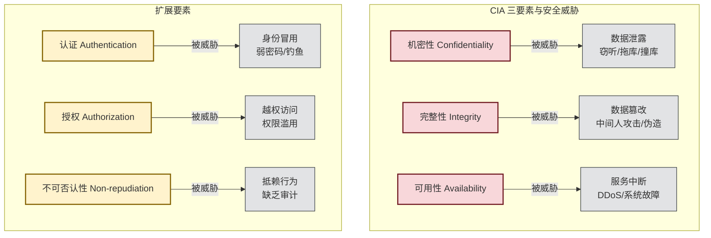
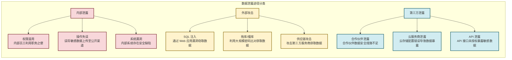

# 6.1 互联网常见网络风险、数据安全风险

> [!abstract] 本节概述
> 互联网安全风险是所有创新活动的"底线约束"。本节系统梳理互联网面临的主要网络攻击类型（主动攻击与被动攻击），解析数据泄露的核心路径与典型案例，建立以 CIA 三要素（机密性、完整性、可用性）为核心的风险分类框架。通过滴滴数据泄露、某教育平台数据泄露等真实案例，帮助读者建立"风险无处不在"的安全意识。

## 一、互联网安全风险全景

### 1.1 什么是网络安全风险

> [!definition] 网络安全风险
> 网络安全风险是指**网络系统中存在的可能导致数据泄露、服务中断、资产损失或声誉损害的脆弱性与威胁的组合**。风险 = 威胁 × 脆弱性 × 影响。互联网企业面临的风险比传统企业更为复杂，因为其业务高度依赖网络基础设施和数据资产。

### 1.2 CIA 三要素：安全的基石

> [!info] CIA 三要素
> CIA 三要素是信息安全的经典框架，定义了安全的三个核心目标：
>
> | 要素 | 英文 | 含义 | 威胁表现 |
> | ---- | ---- | ---- | -------- |
> | **机密性** | Confidentiality | 数据不被未授权方获取 | 数据泄露、窃听 |
> | **完整性** | Integrity | 数据在传输/存储过程中不被篡改 | 数据篡改、伪造 |
> | **可用性** | Availability | 合法用户能正常访问数据和服务 | DDoS、系统故障 |
>
> 后来扩展出 **认证（Authentication）**、**授权（Authorization）**、**不可否认性（Non-repudiation）**，形成 CIA+AAN 的六大要素体系。

## 二、网络攻击类型分类

### 2.1 主动攻击与被动攻击

> [!definition] 主动攻击 vs 被动攻击
>
> | 维度 | 主动攻击（Active Attack） | 被动攻击（Passive Attack） |
> | ---- | ------------------------- | -------------------------- |
> | **核心行为** | 直接修改或破坏系统资源 | 监听和分析数据但不修改 |
> | **典型手段** | DDoS、SQL 注入、中间人攻击 | 网络嗅探、流量分析、窃听 |
> | **危害** | 数据篡改、服务中断、系统破坏 | 数据泄露、隐私侵犯、情报窃取 |
> | **检测难度** | 相对容易（有异常行为特征） | 极其困难（无异常行为） |
> | **防御重点** | 入侵检测、访问控制、数据加密 | 加密传输、流量混淆、隐私保护 |

### 2.2 常见网络攻击详解

#### DDoS 攻击

> [!definition] DDoS 攻击
> DDoS（Distributed Denial of Service，分布式拒绝服务）攻击是通过**控制大量僵尸主机/设备**，向目标服务器发送海量请求，导致服务器资源耗尽、无法为正常用户提供服务。

> [!example] DDoS 攻击案例
> 2023 年某国内大型电商平台遭受 DDoS 攻击，峰值流量超过 1.2 Tbps，导致部分地区用户无法正常下单。攻击者利用了 IoT 设备（摄像头、路由器）组成僵尸网络，发起大规模 SYN Flood 和 UDP Flood 攻击。电商平台通过 CDN 近源清洗+Anycast 路由调度+SYN Cookie 组合防御，成功抵御攻击。

#### SQL 注入攻击

> [!definition] SQL 注入
> SQL 注入是通过在 Web 应用的**输入参数中嵌入恶意 SQL 语句**，诱使数据库执行非预期操作，从而获取、修改或删除数据的攻击手段。

> [!warning] SQL 注入的危害
> 1. **数据窃取**：通过 UNION 查询获取敏感数据（用户密码、身份证号）
> 2. **数据篡改**：通过 UPDATE/DELETE 语句修改数据
> 3. **权限提升**：获取数据库管理员权限
> 4. **服务器控制**：通过 xp_cmdshell 等扩展存储过程控制服务器
>
> **防御措施**：参数化查询（预编译语句）、输入验证、最小权限原则、WAF（Web 应用防火墙）

#### 中间人攻击

> [!definition] 中间人攻击（MITM）
> 中间人攻击是攻击者在通信双方之间**拦截并篡改数据**的攻击方式。通信双方以为在直接对话，实际所有数据都经过攻击者中转。

#### 钓鱼攻击

> [!definition] 钓鱼攻击（Phishing）
> 钓鱼攻击是通过**伪装成可信实体（如银行、电商平台）**，发送虚假邮件/短信/链接，诱骗用户点击并泄露敏感信息（密码、银行卡号）的社会工程学攻击。

## 三、数据泄露风险：互联网的"阿喀琉斯之踵"

### 3.1 数据泄露的主要途径

### 3.2 案例：滴滴 2021 年数据泄露事件

> [!example] 滴滴数据泄露事件
>
> **事件概述**：2021 年 7 月，滴滴在赴美上市前夕，被国家网信办启动网络安全审查。审查发现滴滴存在严重的数据安全风险，涉及 **1000 多万用户的行程数据、地理位置信息、身份证号等敏感数据**。
>
> **泄露原因分析**：
> 1. **数据跨境传输风险**：滴滴将大量中国用户数据存储在境外服务器，存在数据出境安全风险
> 2. **过度收集数据**：滴滴收集了超出业务必要的用户信息（如相册、通讯录），违反数据最小化原则
> 3. **安全管理缺失**：内部权限管控不严，存在内部员工违规访问敏感数据的风险
>
> **处置结果**：
> - 滴滴被要求下架 25 款 App
> - 整改期间禁止新用户注册
> - 创始人程维、柳青被责令整改
> - 此案成为中国数据安全监管的标志性事件

### 3.3 案例：某教育平台数据泄露

> [!example] 教育平台数据泄露案例
>
> **事件概述**：2023 年，某在线教育平台被曝发生大规模数据泄露，涉及 **500 多万学生和家长的身份证号、手机号、家庭住址、学习记录** 等信息。泄露数据在暗网上以每条 0.5 元的价格出售。
>
> **泄露原因**：
> 1. **SQL 注入漏洞**：平台的用户查询接口存在未修复的 SQL 注入漏洞
> 2. **弱密码策略**：数据库使用了弱密码（admin123），且数据库直接暴露在公网
> 3. **加密不足**：用户密码使用 MD5 加密（已被证明不安全），且加密盐值被泄露
>
> **次生危害**：
> - 泄露数据被用于精准诈骗（冒充教育机构退费）
> - 家长收到针对性的诈骗短信和电话
> - 学生身份被冒用申请助学贷款

## 四、风险防御体系

### 4.1 技术防御措施

| 风险类型 | 防御措施 | 技术手段 |
| -------- | -------- | -------- |
| **DDoS** | 流量清洗+负载均衡 | CDN 近源清洗、Anycast、SYN Cookie |
| **SQL 注入** | 参数化查询+输入验证 | 预编译语句、WAF、ORM 框架 |
| **数据泄露** | 加密存储+访问控制 | AES-256、RBAC、数据脱敏 |
| **中间人攻击** | 加密传输+证书认证 | TLS 1.3、HTTPS、双向证书 |
| **钓鱼攻击** | 多因素认证+安全意识 | MFA、反钓鱼 DNS、员工培训 |

### 4.2 管理防御措施

> [!tip] 纵深防御原则
> 网络安全遵循"纵深防御"原则——**不依赖单一安全措施，而是构建多层防御体系**。就像城堡的防御：外墙→护城河→内墙→核心金库，每一层都增加攻击者的成本。互联网安全的纵深防御：
> 1. **网络层**：防火墙、入侵检测系统（IDS）
> 2. **应用层**：WAF、参数化查询、输入验证
> 3. **数据层**：加密存储、访问控制、数据脱敏
> 4. **管理层**：安全策略、员工培训、应急响应

### 4.3 应急响应流程

> [!warning] 数据泄露应急响应
> 1. **发现与报告**：建立安全事件监控和上报机制
> 2. **遏制与隔离**：立即隔离受影响系统，防止进一步泄露
> 3. **调查与取证**：分析攻击路径、泄露范围、影响程度
> 4. **处置与恢复**：修复漏洞、恢复数据、通知受影响用户
> 5. **改进与复盘**：完善安全措施、更新应急预案

## 五、易错点

> [!warning] 常见误区
> 1. **"小公司不会被攻击"** — 攻击者使用自动化工具批量扫描，不区分公司大小。任何有价值的数据都是攻击目标
> 2. **"用了 WAF 就安全了"** — WAF 只能防御已知攻击类型，对 0-day 攻击和社工无效
> 3. **"加密就等于安全"** — 加密是传输/存储的保护，但不能防止内部泄露和权限滥用
> 4. **"安全是一次性的"** — 安全是持续过程，需要定期评估、持续改进
> 5. **"安全阻碍创新"** — 安全是创新的保障，通过左移安全（DevSecOps）可以在开发阶段就融入安全

## 六、与其他小节的联系

- 数据安全风险直接关联 [[6.2 用户隐私保护、个人信息法规基础|隐私保护与法规]]，数据泄露触发个人信息保护法下的通知义务
- 平台面临的外部攻击风险是 [[6.3 网络平台责任、内容监管规则|平台责任]] 的重要来源
- 安全防御能力是识别 [[6.4 网络诈骗、恶意平台识别|网络诈骗]] 的技术基础
- 风险识别是 [[6.5 创新业务合规设计思路|合规设计]] 的输入，合规设计需要覆盖所有已识别的风险

## 章节导航

- 上一级：[[MOC - 第6章]]
- 下一节：[[6.2 用户隐私保护、个人信息法规基础]]
- 习题：[[MOC - 第6章习题]]