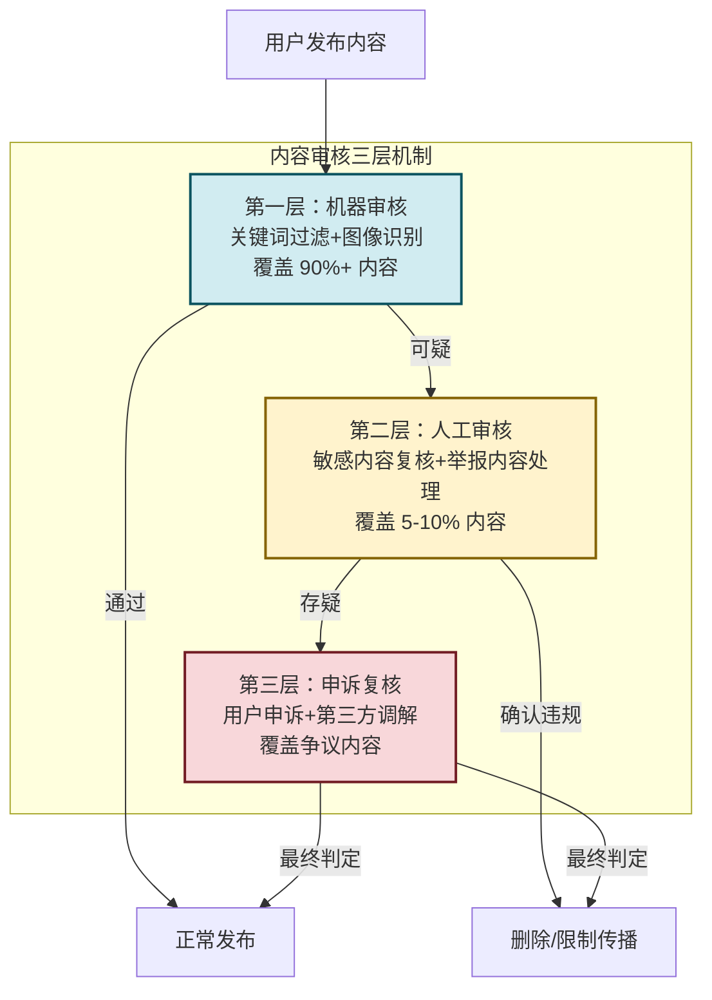

# 6.3 网络平台责任、内容监管规则

> [!abstract] 本节概述
> 互联网平台既是内容的"载体"又是内容的"生产者"，其责任边界一直是监管的焦点。本节解析平台责任的两大核心原则——避风港原则与红旗原则，介绍内容审核的机制与实践，并以抖音"清朗行动"和微信"外链治理"为案例，探讨算法推荐时代的内容治理难题。

## 一、平台责任的法律基础

### 1.1 为什么需要平台责任

> [!info] 平台责任的本质
> 互联网平台（如抖音、微信、微博）的特殊性在于：它们既不是传统的"内容出版商"（内容由用户生产），也不是纯粹的"管道"（平台对内容有编辑和推荐能力）。这种"双重身份"决定了平台责任不能简单套用传统媒体或通信运营商的规则，需要独立的法律框架。

### 1.2 避风港原则

> [!definition] 避风港原则（Safe Harbor）
> 避风港原则源于美国 1998 年《数字千年版权法》（DMCA）第 512 条，后被中国《信息网络传播权保护条例》和《民法典》吸收。其核心含义是：**网络服务提供者在收到权利人的通知后，及时删除或屏蔽侵权内容的，可以免除赔偿责任**。

**避风港原则的三要素**：
1. **通知**：权利人向平台发出符合法定条件的侵权通知
2. **删除**：平台在合理期限内删除或屏蔽被指控的侵权内容
3. **免责**：平台不因此前的存储/传播行为承担赔偿责任

> [!example] 避风港原则的适用
> 某短视频平台用户上传了一部未经授权的电影片段。版权方向平台发出投诉通知，并提供了侵权内容的具体位置。平台在 24 小时内删除了该视频。根据避风港原则，平台无需承担侵权赔偿责任。但如果平台收到通知后拒不删除，则需要承担连带责任。

### 1.3 红旗原则

> [!definition] 红旗原则（Red Flag）
> 红旗原则是避风港原则的"例外"：**如果侵权事实像"红旗"一样显而易见，平台不能以"不知道"为由免责**。即使没有权利人的通知，平台也应当主动采取措施。

> [!warning] 红旗原则的适用场景
>
> | 场景 | 说明 | 平台义务 |
> | ---- | ---- | -------- |
> | **违法内容** | 涉及色情、暴力、恐怖主义等明显违法内容 | 主动发现并删除 |
> | **虚假信息** | 明显的谣言、虚假宣传 | 主动辟谣或限制传播 |
> | **侵权内容** | 热播影视剧的全集、盗版软件等 | 主动屏蔽关键词 |
> | **危害信息** | 涉及诈骗、传销等组织化违法 | 主动识别并干预 |

**避风港 vs 红旗**：

| 维度 | 避风港原则 | 红旗原则 |
| ---- | ---------- | -------- |
| **触发方式** | 被动（收到通知才行动） | 主动（明知/应知即行动） |
| **核心逻辑** | 不知道=无责 | 应知=有责 |
| **平台义务** | 接到通知后及时处理 | 主动巡查、主动干预 |
| **适用场景** | 一般侵权（如普通用户上传的侵权内容） | 明显违法（如公开的色情、暴力内容） |

## 二、内容监管机制

### 2.1 内容审核的三层机制

### 2.2 算法推荐的治理难题

> [!warning] 算法推荐的"信息茧房"与"流量至上"困境
>
> 算法推荐是把双刃剑：
> - **积极面**：个性化推荐提升用户体验，实现"千人千面"的内容分发
> - **消极面**：
>   1. **信息茧房**：用户只看到自己感兴趣的内容，认知越来越狭隘
>   2. **流量至上**：算法倾向于推荐"标题党"、"低俗内容"，劣币驱逐良币
>   3. **沉迷风险**：算法利用心理机制让用户上瘾，尤其是青少年
>   4. **算法黑箱**：推荐决策不透明，用户不知道为什么看到某条内容

### 2.3 算法推荐治理的"阳光法案"

> [!info] 《互联网信息服务算法推荐管理规定》
> 2022 年 3 月 1 日施行，是全球首部专门针对算法推荐的监管法规，核心要求：
>
> | 要求 | 内容 |
> | ---- | ---- |
> | **算法透明** | 平台需提供"算法摘要"，说明推荐逻辑 |
> | **用户权益** | 用户享有"不被推荐"的权利，可关闭个性化推荐 |
> | **未成年人保护** | 向未成年人推送的内容不得诱导沉迷 |
> | **劳动者权益** | 不得用算法确定工作时间、计件报酬，需提供申诉渠道 |
> | **公平公正** | 不得用算法实施大数据杀熟、价格歧视 |

## 三、案例分析

### 3.1 抖音"清朗行动"

> [!example] 抖音内容治理案例
>
> **背景**：2021 年，国家网信办开展"清朗行动"，整治网络直播、短视频领域的突出问题。抖音作为头部短视频平台，是治理重点。
>
> **治理举措**：
>
> **1. 社区规则升级**
> - 发布《抖音社区自律公约》，明确禁止低俗、虚假、暴力等内容
> - 建立"违法违规账号"处置机制，累计封禁违规账号超过 100 万个
>
> **2. 审核能力提升**
> - 建立超过 5000 人的内容审核团队（24 小时轮班）
> - 引入 AI 审核系统，支持图片、视频、文本、语音的多模态识别
> - 与国家违法和不良信息举报中心建立实时数据对接
>
> **3. 算法优化**
> - 调整推荐算法，降低低俗内容的推荐权重
> - 引入"青少年模式"，限制使用时长和内容类型
> - 增加"向上滑动查看更多"功能，打破信息茧房
>
> **4. 主动披露**
> - 定期发布《抖音社区治理报告》，公开处置数据
> - 在设置中提供"个性化推荐管理"选项，用户可关闭
>
> **治理成效**：低俗内容占比从治理前的 8.2% 降至 1.3%，青少年用户使用时长下降 35%，用户满意度提升 22%。

### 3.2 微信"外链治理"

> [!example] 微信生态治理案例
>
> **背景**：微信作为中国最大的社交平台（月活 13 亿+），其内容生态的治理直接关系到数亿用户的信息安全。微信的治理策略是"**开放但有边界**"。
>
> **治理举措**：
>
> **1. 公众号内容管理**
> - 建立"原创声明"机制，鼓励原创内容，打击抄袭
> - 对违规公众号采取"阶梯式处罚"：警告→封禁功能→永久封禁
> - 建立"谣言过滤器"，联合辟谣机构发布权威辟谣信息
>
> **2. 朋友圈治理**
> - 限制朋友圈发布频率（最多 9 张图/次）
> - 对诱导分享（如"不转不是中国人"）进行识别和限制
> - 对广告内容实行分级审核
>
> **3. 外链管理**
> - 2013 年"封杀"淘宝链接，引发"互联互通"大讨论
> - 2021 年国家出台"互联网平台互联互通"政策后，微信逐步恢复部分外链访问
> - 建立"外链安全检测"机制，自动标记风险链接
>
> **4. 小程序治理**
> - 小程序上线前需经过严格审核
> - 对违规小程序采取"下架+封禁"措施
> - 建立小程序分类分级管理体系

## 四、平台责任的新趋势

### 4.1 "互联互通"与平台生态治理

> [!info] 互联互通政策
> 2021 年 9 月，国家网信办启动"互联网平台互联互通"行动，要求大型平台按规定解除外链屏蔽。互联互通的核心是**打破平台壁垒，促进数据和信息的有序流通**，但同时也给平台治理带来新挑战——外部内容涌入如何保障安全？

### 4.2 生成式 AI 时代的内容治理

> [!warning] AI 生成内容（AIGC）的治理挑战
> 生成式 AI（如 ChatGPT、Midjourney）大幅降低了内容生产成本，但也带来新的治理问题：
> 1. **深度伪造（Deepfake）**：AI 生成的假视频、假图片、假音频几乎无法肉眼识别
> 2. **大规模垃圾内容**：AI 批量生产的低质内容充斥平台
> 3. **版权风险**：AI 训练数据可能侵犯他人版权
> 4. **合规应对**：2023 年国家出台《生成式人工智能服务管理暂行办法》，要求 AIGC 内容必须标注、不得生成违法内容

## 五、易错点

> [!warning] 平台责任的常见误区
> 1. **"平台是内容的出版者"** — 大多数内容由用户生成（UGC），平台不是出版者，而是"内容服务提供者"，适用避风港原则
> 2. **"避风港=完全免责"** — 避风港只是"不知道"时的免责 safe harbor，如果平台"知道或应知"侵权内容存在，不能免责（红旗原则）
> 3. **"算法推荐只是技术问题"** — 算法推荐不仅是技术问题，还涉及内容治理、用户权益、社会责任等多维度问题
> 4. **"内容审核=审查所有内容"** — 大型平台内容量巨大（抖音日新增视频数亿条），不可能 100% 人工审核，核心是建立"机器+人工"的分层审核机制
> 5. **"治理就会限制创新"** — 合理的治理反而能促进良性竞争，打击劣币，保护优质内容创作者

## 六、与其他小节的联系

- 平台责任是 [[6.2 用户隐私保护、个人信息法规基础|隐私保护]] 的延伸，平台对用户隐私数据的保护义务源于 PIPL
- 平台内容治理是 [[6.4 网络诈骗、恶意平台识别|反诈工作]]的重要环节，诈骗信息往往通过平台传播
- 平台责任的合规要求是 [[6.5 创新业务合规设计思路|合规设计]] 的重要输入，产品设计需考虑内容治理需求

## 章节导航

- 上一级：[[MOC - 第6章]]
- 上一节：[[6.2 用户隐私保护、个人信息法规基础]]
- 下一节：[[6.4 网络诈骗、恶意平台识别]]
- 习题：[[MOC - 第6章习题]]