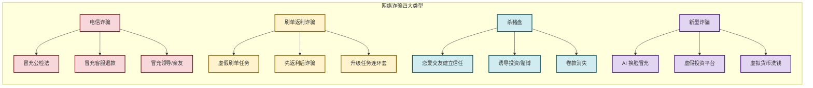
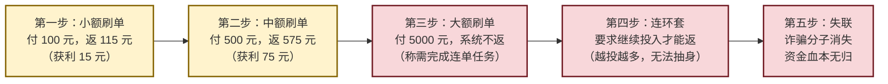

# 6.4 网络诈骗、恶意平台识别

> [!abstract] 本节概述
> 网络诈骗是互联网时代最猖獗的犯罪形式之一，据公安部统计，2023 年全国电信网络诈骗案件造成直接经济损失超过 3000 亿元。本节系统梳理常见网络诈骗类型（电信诈骗、刷单返利、杀猪盘、AI 换脸诈骗等），解析诈骗分子的作案手法和心理操控策略，提供识别和防范方法，并介绍恶意平台的识别特征。

## 一、网络诈骗的时代背景

### 1.1 诈骗的产业化趋势

> [!info] 网络诈骗的产业化特征
> 当代网络诈骗已从"散兵游勇"演变为**组织严密、分工明确的犯罪产业**：
>
> | 环节 | 职责 | 手段 |
> | ---- | ---- | ---- |
> | **引流** | 吸引受害者接触 | 虚假广告、短视频引流、社交平台钓鱼 |
> | **洗脑** | 建立信任、植入观念 | 话术脚本、心理操控、情感绑定 |
> | **转化** | 诱导投资或转账 | 虚假平台、伪造数据、收益截图 |
> | **洗钱** | 转移资金 | 地下钱庄、虚拟货币、跨境转移 |
> | **逃匿** | 销毁证据、消失 | 更换窝点、销毁数据、逃离出境 |

### 1.2 诈骗分子的心理操控术

> [!warning] 诈骗的核心：人性的弱点
> 诈骗分子精准利用人性的三大弱点：
> 1. **贪**：利用高收益、高回报的诱惑（刷单返利、虚假投资）
> 2. **怕**：利用恐惧心理（冒充公检法、冒充客服）
> 3. **情**：利用情感需求（网恋、"杀猪盘"）
>
> **防范核心**：**天上不会掉馅饼，天上掉的都是陷阱**。

## 二、常见网络诈骗类型

### 2.1 诈骗类型全景图

### 2.2 电信诈骗

> [!definition] 电信诈骗
> 电信诈骗是指通过**电话、短信、网络等通信手段**，冒充特定身份（公检法、客服、领导等），以虚假理由要求受害人转账汇款的犯罪行为。

**常见类型**：

| 类型 | 手法 | 典型话术 |
| ---- | ---- | -------- |
> | **冒充公检法** | 冒充警察/法官/检察官，声称受害人涉嫌犯罪 | "您的身份证被用于洗钱，需要将资金转入安全账户" |
> | **冒充客服** | 冒充电商/银行客服，声称产品有问题需要退款 | "您的快递丢失了，我们给您退款，请提供银行卡号" |
> | **冒充领导** | 通过仿冒微信/QQ 冒充领导，要求转账 | "我在外面开会不方便，帮我转一笔钱，回头还你" |
> | **冒充亲友** | 冒充亲友求助，声称遇到紧急情况 | "我是你儿子，我被绑架了，快转钱救我" |

> [!example] 电信诈骗案例
>
> **案例：冒充客服退款诈骗**
>
> 1. 诈骗分子通过非法渠道获取受害人的购物信息（姓名、地址、购买记录）
> 2. 致电受害人，冒充电商平台客服，声称"您购买的商品存在质量问题，需要双倍退款"
> 3. 诱导受害人下载虚假 App 或打开钓鱼网站
> 4. 在虚假 App 中显示"退款进度"，诱导受害人填写银行卡号和验证码
> 5. 在受害人输入验证码的同时，将账户资金转走
>
> **防范要点**：
> - 电商退款一律在**官方 App 内操作**，不通过电话/短信链接
> - 任何要求提供"验证码"的都是诈骗
> - 接到自称客服的电话，**挂断后拨打官方客服电话核实**

### 2.3 刷单返利诈骗

> [!definition] 刷单返利诈骗
> 刷单返利诈骗是指诈骗分子以"刷单返利"为诱饵，先给予小额返利获取信任，再以"系统故障"、"任务升级"等理由诱导大额投入，最终卷款消失。

**作案流程**：

> [!example] 刷单诈骗案例
> 大学生小王在 QQ 群看到"日赚 500，无门槛"的兼职广告。添加客服微信后，客服要求先刷一单小额任务（100 元），5 分钟后返款 115 元。小王尝到甜头，连续刷了 10 单，金额从 100 元涨到 5000 元。第 11 单付了 5000 元后，客服说"系统卡单了，需要再刷 3 单才能激活"。小王又刷了 3 单共 1.5 万元，客服以各种理由继续要求转账。当小王意识到可能被骗时，客服已将其拉黑，共计损失 2.8 万元。

> [!warning] 刷单诈骗的防范
> 1. **所有刷单都是诈骗**——正规电商平台（淘宝、京东）不存在"刷单"兼职
> 2. **不扫描陌生二维码，不下载陌生 App**
> 3. **任何声称"返利"的都是陷阱**——正规兼职不会要求先交钱
> 4. **遇到诈骗立即拨打 96110 反诈专线**

### 2.4 杀猪盘

> [!definition] 杀猪盘
> 杀猪盘是指诈骗分子通过**社交平台伪装身份**（通常伪装为高富帅/白富美），与受害人建立恋爱或深厚友情（"养猪"），在获取信任后诱导受害人投资虚假平台（"杀猪"），最终卷款消失的诈骗方式。

**杀猪盘的典型流程**：

| 阶段 | 时间 | 操作 | 心理操控 |
| ---- | ---- | ---- | -------- |
> | **物色** | 1-3 天 | 在社交平台（Soul、Tinder、微信）物色目标，建立联系 | 选择有一定经济基础、情感需求强烈的对象 |
> | **养猪** | 1-2 周 | 频繁聊天、嘘寒问暖、建立"恋爱"关系 | 利用"情感依赖"建立信任，每日"早安晚安" |
> | **诱导** | 1-3 天 | 不经意提及"投资"、"博彩"，展示虚假收益截图 | 利用"好奇心"和"贪念"，展示"内部消息" |
> | **投入** | 3-7 天 | 引导在虚假平台开户、充值、投资 | 用"小赚"（几百上千）建立信心，诱导大额投入 |
> | **杀猪** | 1-2 天 | 平台显示"盈利"但无法提现，客服要求继续充值 | 利用"沉没成本"，让受害者越陷越深 |
> | **消失** | 最终 | 平台关闭、联系中断、诈骗分子消失 | 损失全部资金，情感双重打击 |

> [!example] 杀猪盘案例
> 40 岁的李女士在社交平台认识"华尔街精英"张某。张某每天与她聊天，嘘寒问暖，两周后确立"恋爱关系"。张某透露自己掌握"内部投资渠道"，展示平台截图显示日收益 5%。李女士先后投入 80 万元，平台显示盈利 30 万元。当李女士尝试提现时，客服要求缴纳 20 万元"税费"。李女士缴纳后，客服又要求缴纳 50 万元"保证金"。李女士这才报警，但张某已消失，共计损失 150 万元。

### 2.5 AI 换脸等新型诈骗

> [!warning] AI 换脸诈骗
> AI 换脸技术（Deepfake）的普及催生了新型诈骗手段：
>
> **1. AI 换脸冒充亲友视频通话**
> - 诈骗分子获取目标亲友的照片或视频
> - 使用 AI 技术生成逼真的换脸视频
> - 通过视频通话冒充亲友，以紧急情况为由要求转账
>
> **2. AI 克隆声音冒充领导**
> - 诈骗分子获取目标领导的语音样本
> - 使用 AI 克隆声音，通过电话冒充领导
>
> **3. 防范方法**：
> - 视频通话中观察**细节**（眨眼频率、面部肌肉微动作通常不自然）
> - 设置**暗号**（只有你们知道的特定问题）
> - 通过**其他渠道核实**（挂断视频后打回电话）

## 三、恶意平台的识别

### 3.1 恶意平台的特征

| 特征 | 说明 | 判断方法 |
| ---- | ---- | -------- |
> | **无备案** | 未在工信部进行 ICP 备案 | 到工信部备案查询系统核实 |
> | **无资质** | 无金融牌照、无相关经营资质 | 要求平台出示相关资质文件 |
> | **高收益承诺** | 承诺超过 20% 的年化收益 | 牢记"收益越高，风险越大" |
> | **推荐充值渠道** | 推荐个人账户、虚拟币、境外账户 | 正规平台只用对公账户 |
> | **频繁变动** | 网站域名频繁更换、服务器在境外 | 通过 Whois 查询域名历史 |
> | **虚假宣传** | 使用"最高"、"第一"、"零风险"等极限词 | 监管部门禁止使用极限词 |
> | **强制升级** | 以"系统升级"、"账户异常"为由要求转账 | 正规平台不会通过私人渠道要求转账 |

### 3.2 常见恶意平台类型

> [!info] 恶意平台黑产图谱
>
> | 类型 | 典型特征 | 危害 |
> | ---- | -------- | ---- |
> | **虚假投资平台** | 伪装成股票、外汇、虚拟货币交易平台，后台可控涨跌 | 诱导投入后无法提现，血本无归 |
> | **虚假购物平台** | 仿冒知名电商（淘宝、京东），以低价为诱饵 | 收取货款后不发货，或发假货 |
> | **虚假贷款平台** | 以"无抵押、秒放款"为诱饵，收取"手续费"、"保证金" | 骗取前期费用，无法放款 |
> | **博彩平台** | 境外网络赌场，以"高赔率"、"百家乐"为诱饵 | 诱导参与网络赌博，违法且资金无保障 |
> | **刷单平台** | 以"刷单返利"为幌子，前期小额返利获取信任 | 连环套诈骗，越投越多 |

## 四、防范诈骗的实用方法

### 4.1 "三不一多"原则

> [!tip] 防范诈骗口诀
>
> | 原则 | 内容 | 记忆口诀 |
> | ---- | ---- | -------- |
> | **不轻信** | 不要轻信来历不明的电话、短信、链接 | 陌生来电多半假 |
> | **不透露** | 不透露身份证号、银行卡号、验证码 | 验证码是命根子 |
> | **不转账** | 不向陌生人转账、汇款 | 转账之前先核实 |
> | **多核实** | 遇到可疑情况，通过官方渠道核实 | 挂掉电话再确认 |

### 4.2 被骗后的应急操作

> [!warning] 被骗后怎么办
> 1. **立即报警**：拨打 110 或 96110 反诈专线
> 2. **保留证据**：保存聊天记录、转账凭证、平台截图
> 3. **及时止付**：联系银行冻结账户，阻止资金转出
> 4. **举报平台**：向网信办、工信部举报虚假平台
> 5. **心理干预**：寻求家人朋友或专业心理疏导支持

## 五、易错点

> [!warning] 反诈的常见误区
> 1. **"我不会被骗"** — 诈骗分子的目标不是"愚蠢的人"，而是"正常的人"。教育程度越高、社会经验越丰富的人反而可能因"自信"而上当
> 2. **"刷单真的能赚钱"** — 99.99% 的刷单都是诈骗。正规电商刷单是严重违规行为，不可能公开招聘
> 3. **"平台有备案就是真的"** — 有些诈骗分子会租用或盗用他人的备案信息，需要核实备案主体与实际运营主体是否一致
> 4. **"被骗金额小不值得报警"** — 即使金额小也要报警，报案记录是追回损失的前提，也能帮助警方掌握犯罪线索
> 5. **"网恋诈骗离我很远"** — 杀猪盘的受害者覆盖所有年龄段，包括高学历、高收入人群。网络交友必须保持警惕

## 六、与其他小节的联系

- 隐私泄露是诈骗得逞的前提，[[6.2 用户隐私保护、个人信息法规基础|隐私保护]]是反诈的第一道防线
- 诈骗信息通过社交媒体传播，[[6.3 网络平台责任、内容监管规则|平台内容治理]]是反诈的重要环节
- 反诈能力建设需要与 [[6.5 创新业务合规设计思路|合规设计]] 结合，金融产品的反诈骗设计是合规的重要组成部分

## 章节导航

- 上一级：[[MOC - 第6章]]
- 上一节：[[6.3 网络平台责任、内容监管规则]]
- 下一节：[[6.5 创新业务合规设计思路]]
- 习题：[[MOC - 第6章习题]]