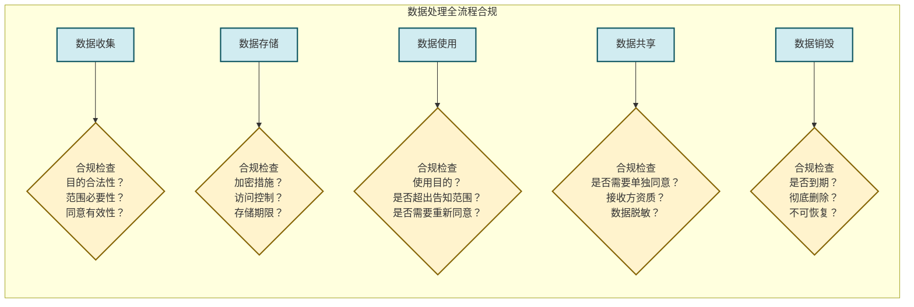
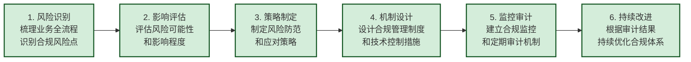

# 6.5 创新业务合规设计思路

> [!abstract] 本节概述
> 合规不是创新的"绊脚石"，而是创新的"安全通行证"。本节提出"合规即设计"（Compliance by Design）的核心理念，系统介绍数据合规、算法合规和业务合规的设计思路，并以互联网金融合规为综合案例，展示如何在严格的监管框架下实现业务创新。

## 一、合规设计的核心理念

### 1.1 从"事后合规"到"事前合规"

> [!info] 合规设计的演进
> 传统合规模式是**"先发展后合规"**——业务跑起来之后再补合规手续，这种模式往往导致：
> - 合规成本高昂（事后整改比事前设计成本高 10 倍以上）
> - 业务被迫暂停（合规整改期间无法运营）
> - 错过市场窗口（合规延误导致竞争劣势）
>
> 现代合规理念转向**"合规即设计"**（Compliance by Design）——在业务设计之初就将合规要求嵌入产品架构，实现"合规驱动创新"。

### 1.2 合规设计的三大原则

| 原则 | 含义 | 实践要点 |
| ---- | ---- | -------- |
> | **合规前置** | 在产品设计阶段就考虑合规要求 | 合规评审与产品设计同步进行 |
> | **风险导向** | 优先处理高风险、高影响的合规事项 | 数据分类分级、风险优先级排序 |
> | **技术赋能** | 用技术手段实现自动化合规 | 隐私增强技术、合规自动化工具 |

## 二、数据合规设计

### 2.1 数据分类分级

> [!definition] 数据分类分级
> 数据分类分级是数据合规的**基础工作**——根据数据的敏感性和重要性，对数据进行分类分级，并实施差异化的保护措施。

**数据分类分级标准**：

| 数据级别 | 类型 | 举例 | 保护要求 |
| -------- | ---- | ---- | -------- |
> | **第 4 级（核心数据）** | 一旦泄露会造成特别严重后果 | 密钥、核心算法、大规模个人敏感信息 | 加密存储、严格访问控制、离线备份 |
> | **第 3 级（重要数据）** | 一旦泄露会造成严重后果 | 身份证号、银行卡号、交易数据 | 加密存储、访问审计、数据脱敏 |
> | **第 2 级（一般数据）** | 一旦泄露会造成一定影响 | 用户名、设备信息、浏览记录 | 加密传输、基础访问控制 |
> | **第 1 级（公开数据）** | 公开后不会造成不良影响 | 公开的产品信息、营销内容 | 无特殊要求 |

### 2.2 数据处理全流程合规

### 2.3 数据跨境传输合规

> [!warning] 数据跨境传输的三种路径
>
> | 路径 | 适用条件 | 要求 |
> | ---- | -------- | ---- |
> | **安全评估** | 关键信息基础设施运营者+重要数据出境 | 向网信办申报安全评估 |
> | **标准合同** | 一般数据出境 | 与境外接收方签订标准合同，向主管部门备案 |
> | **认证机制** | 跨国企业集团内部数据传输 | 通过网信办组织的认证 |
>
> **合规要点**：数据出境需经过**必要性评估**——是否必须出境？是否有境内替代方案？涉及重要数据的出境需要进行**安全评估**。

## 三、算法合规设计

### 3.1 算法合规的三大维度

| 维度 | 合规要求 | 对应法规 |
| ---- | -------- | -------- |
> | **算法透明** | 提供算法摘要，说明推荐逻辑 | 《算法推荐管理规定》 |
> | **算法公平** | 不得利用算法实施大数据杀熟、价格歧视 | 《反垄断法》、《价格法》 |
> | **算法安全** | 防范算法滥用、保障算法安全 | 《网络安全法》、《数据安全法》 |

### 3.2 算法推荐合规设计

> [!info] 算法推荐合规要点
>
> | 合规要求 | 设计方法 | 技术实现 |
> | -------- | -------- | -------- |
> | **算法摘要** | 提供简洁易懂的算法说明 | 独立的算法摘要页面（非隐私政策附件） |
> | **关闭选项** | 提供关闭个性化推荐的功能 | 推荐系统支持"非个性化模式" |
> | **权益保障** | 不得因关闭推荐而限制核心服务 | 关闭推荐后仍可获取基础内容 |
> | **未成年人保护** | 青少年模式限制推荐时长和内容 | 独立的青少年推荐模型 |
> | **反沉迷机制** | 限制使用时长、强制休息 | 时间限制弹窗、防沉迷提醒 |

### 3.3 大数据杀熟的识别与防范

> [!warning] 大数据杀熟
> 大数据杀熟是指平台利用算法分析用户画像，对不同用户展示**不同价格或不同商品**的行为，本质是**价格歧视**。2021 年"双十一"期间，多家电商平台被曝大数据杀熟，引发广泛关注。
>
> **防范方法**：
> 1. 建立**价格公平审计机制**——同一商品对不同用户的价格差不得超过合理范围
> 2. 用户可通过"**比价模式**"查看商品的通用价格
> 3. 监管部门可通过**算法审计**检查是否存在杀熟行为

## 四、业务合规设计

### 4.1 合规风险识别框架

> [!definition] 合规风险识别
> 合规风险识别是业务合规设计的第一步，需要识别业务活动中涉及的所有合规风险点：
>
> | 风险类别 | 风险点 | 示例 |
> | -------- | ------ | ---- |
> | **数据风险** | 数据收集、存储、使用、共享的合规风险 | 过度收集、未加密存储、目的捆绑 |
> | **内容风险** | 内容生产、传播的合规风险 | 违法内容、虚假宣传、版权侵权 |
> | **交易风险** | 交易环节的合规风险 | 价格欺诈、虚假广告、消费者权益 |
> | **资金风险** | 资金流动的合规风险 | 非法集资、洗钱、支付安全 |
> | **劳动风险** | 劳动用工的合规风险 | 算法管理、工时报酬、劳动者权益 |
> | **跨境风险** | 跨境业务的合规风险 | 数据出境、外汇管理、外资准入 |

### 4.2 合规设计流程

## 五、综合案例：互联网金融合规

### 5.1 互联网金融的合规挑战

> [!info] 互联网金融的特殊性
> 互联网金融（如移动支付、网络借贷、股权众筹）兼具**金融属性**和**互联网属性**，面临双重监管：
> - **金融监管**：银保监会、证监会、央行
> - **互联网监管**：网信办、工信部、公安部
>
> 合规要求比一般互联网业务更为严格。

### 5.2 移动支付合规设计

> [!example] 移动支付合规框架
>
> **以微信支付/支付宝为例**，其合规设计覆盖六大维度：
>
> **1. 资金安全合规**
> - 客户备付金全额集中交存央行（2019 年起实施）
> - 支付账户实行实名制，一人一个账户
> - 交易限额管理，防止大额洗钱
> - 建立反洗钱监测系统，可疑交易上报央行
>
> **2. 数据安全合规**
> - 交易数据加密存储（AES-256）
> - 采用令牌化技术保护银行卡信息
> - 严格的数据访问权限控制
> - 定期进行数据保护影响评估
>
> **3. 反诈骗合规**
> - 建立实时风险监测系统，识别可疑交易模式
> - 对高频转账、异地转账、夜间转账进行预警
> - 设置转账延迟到账机制（2 小时内可撤销）
> - 与公安系统对接，实时查询涉案账户
>
> **4. 消费者权益合规**
> - 提供清晰的费率说明
> - 交易短信提醒，每笔交易实时通知
> - 建立 7×24 小时客服体系
> - 提供争议处理和赔付机制
>
> **5. 算法合规**
> - 风控算法透明化，提供算法摘要
> - 利率计算公开透明，年化利率明示
> - 不得利用算法进行差异化定价
> - 定期进行算法审计
>
> **6. 跨境合规**
> - 跨境支付需取得外汇管理局许可
> - 遵守反洗钱和反恐融资国际标准
> - 数据跨境传输需符合相关法规

### 5.3 网络借贷合规设计

> [!warning] 网络借贷的合规红线
>
> | 红线 | 说明 | 法律依据 |
> | ---- | ---- | -------- |
> | **不得吸收公众存款** | 网络借贷平台不得形成资金池 | 《商业银行法》 |
> | **不得非法集资** | 不得向社会不特定对象募集资金 | 《刑法》第 192 条 |
> | **不得高利放贷** | 年化利率不得超过 LPR 的 4 倍（约 15%） | 《最高人民法院关于审理民间借贷案件适用法律若干问题的规定》 |
> | **不得虚假宣传** | 不得承诺保本保息、不得宣传高收益 | 《广告法》、《互联网广告管理办法》 |
> | **资金银行存管** | 客户资金必须由银行独立存管 | 《网络借贷资金存管业务指引》 |

## 六、合规组织与文化

### 6.1 合规组织架构

> [!tip] 合规治理架构
> 成熟的互联网企业通常建立三层合规治理架构：
>
> | 层级 | 职责 | 人员构成 |
> | ---- | ---- | -------- |
> | **决策层** | 制定合规战略、审批合规政策 | CEO、CTO、法务负责人 |
> | **管理层** | 执行合规政策、开展合规培训 | 合规总监、合规团队 |
> | **执行层** | 业务部门落实合规要求 | 产品经理、工程师、运营人员 |
>
> **关键要素**：合规负责人直接向 CEO 汇报，确保合规的独立性和权威性。

### 6.2 合规文化建设

> [!info] 合规文化的核心
> 1. **高层重视**：CEO 和管理层以身作则，将合规作为企业核心价值观
> 2. **全员参与**：每个员工都是合规责任人，而非仅是法务/合规部门的事
> 3. **持续培训**：定期开展合规培训，特别是新产品、新业务的合规培训
> 4. **激励机制**：将合规表现纳入绩效考核，奖励合规行为
> 5. **举报文化**：建立合规举报渠道，鼓励员工举报违规行为

## 七、易错点

> [!warning] 合规设计的常见误区
> 1. **"合规就是不做事"** — 合规不是禁止，而是在规则内创新。合规框架内仍有巨大的创新空间
> 2. **"合规是法务的事"** — 合规涉及产品设计、技术架构、运营流程等方方面面，需要全员参与
> 3. **"合规成本高、不值得"** — 不合规的成本更高（罚款、停业、声誉损失）。滴滴因数据安全问题被整改，损失远超合规投入
> 4. **"合规一劳永逸"** — 法规持续更新，需要持续关注最新监管动态，定期更新合规体系
> 5. **"大平台才需要合规"** — 中小平台同样需要合规，尤其是涉及用户数据和金融的业务。早期合规投入可以避免后期巨大的整改成本

## 八、与其他小节的联系

- 合规设计是 [[6.1 互联网常见网络风险、数据安全风险|风险防御]] 的系统化方法，将安全措施嵌入产品设计
- 数据合规是 [[6.2 用户隐私保护、个人信息法规基础|隐私保护]] 的具体落地方法
- 内容合规是 [[6.3 网络平台责任、内容监管规则|平台治理]] 的合规框架
- 反诈骗合规是 [[6.4 网络诈骗、恶意平台识别|反诈工作]] 的技术保障
- 合规设计贯穿互联网创新的全生命周期，与[[第7章 互联网创业与创新项目落地|创业落地]]紧密相关

## 章节导航

- 上一级：[[MOC - 第6章]]
- 上一节：[[6.4 网络诈骗、恶意平台识别]]
- 下一章：[[MOC - 第7章]]
- 习题：[[MOC - 第6章习题]]