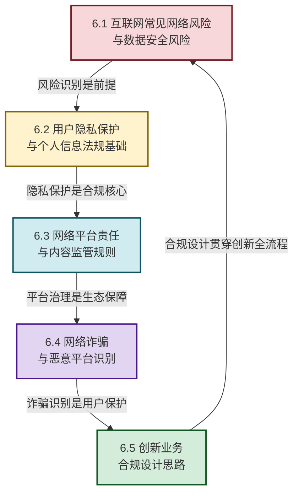

# MOC - 第6章 互联网安全、合规与治理

> [!info] 本章定位
> 本章是互联网创新的**安全保障与治理基石**。它要回答的核心问题是：**互联网创新过程中面临哪些安全风险？如何在合规框架下平衡创新与治理？** 本章从网络风险识别、数据安全与隐私保护、平台责任与内容治理、诈骗防范到合规设计，构建"风险识别—保护机制—治理规则—合规设计"的完整安全治理体系。理解本章是做好任何互联网产品创新的前提——**没有安全的创新是空中楼阁，没有合规的创新是危险游戏**。

## 学习路线图

## 知识点导航

| 小节 | 标题 | 核心内容 | 关键概念 |
| ---- | ---- | -------- | -------- |
| [[6.1 互联网常见网络风险、数据安全风险\|6.1]] | 网络风险与数据安全 | 攻击类型、数据泄露、风险分类、滴滴案例 | DDoS、SQL 注入、数据泄露、CIA 三要素 |
| [[6.2 用户隐私保护、个人信息法规基础\|6.2]] | 隐私保护与法规 | PIPL、GDPR、隐私设计、微信支付案例 | 个人信息主体、同意机制、数据最小化 |
| [[6.3 网络平台责任、内容监管规则\|6.3]] | 平台责任与内容监管 | 责任划分、内容审核、抖音/微信治理 | 避风港原则、红旗原则、算法推荐治理 |
| [[6.4 网络诈骗、恶意平台识别\|6.4]] | 网络诈骗识别 | 诈骗类型、识别方法、杀猪盘/刷单诈骗 | 电信诈骗、刷单返利、AI 换脸诈骗 |
| [[6.5 创新业务合规设计思路\|6.5]] | 合规设计思路 | 合规原则、数据合规、算法合规、金融合规 | 隐私-by-design、数据分类分级、算法透明 |

## 核心考点

> [!summary] 本章核心考点（8 点）
> 1. **网络攻击类型与防御**：区分主动攻击（篡改、伪造）与被动攻击（窃听、流量分析），掌握 CIA 三要素（机密性 Confidentiality、完整性 Integrity、可用性 Availability）与攻防对应关系；
> 2. **数据泄露的主要途径**：内部泄露（权限滥用、操作失误）、外部攻击（SQL 注入、拖库撞库）、第三方泄露（供应链安全），滴滴 2021 年数据泄露事件是典型案例；
> 3. **个人信息保护法（PIPL）核心规则**：告知-同意机制、数据最小化、委托处理协议、个人信息主体权利（查询、复制、更正、删除）、跨境传输条件；
> 4. **GDPR 与 PIPL 的异同**：GDPR 以"数据保护"为核心（欧盟市场准入门槛），PIPL 以"个人信息权益"为核心（中国数据治理基石），两者在同意机制、罚款力度、跨境规则上各有特点；
> 5. **平台责任的"避风港"与"红旗"原则**：避风港原则（通知-删除）为平台提供免责 safe harbor，红旗原则（明知-应知）突破避风港，抖音"清朗行动"和微信"外链治理"是内容治理的代表；
> 6. **常见网络诈骗类型与识别**：刷单返利（虚假刷单+返利诈骗）、杀猪盘（情感操控+投资诈骗）、AI 换脸冒充客服，识别核心是"天上不会掉馅饼"和"核验身份不转账"；
> 7. **合规设计的"隐私-by-design"原则**：数据收集最小化、目的绑定、数据保护贯穿设计全流程，互联网金融合规是数据合规+算法合规的综合案例；
> 8. **创新与合规的动态平衡**：合规不是创新的"刹车"，而是创新的"方向盘"——在合规框架内创新，通过技术手段（差分隐私、联邦学习）实现数据可用不可见，是互联网企业的核心竞争力。

## 章节导航

> [!nav] 导航
> 上级：[[MOC - 互联网创新|课程总览]]
> 上一章：[[MOC - 第5章|第5章 产业互联网与行业数字化转型]]（产业转型面临新安全挑战）
> 下一章：[[MOC - 第7章|第7章 互联网创业与创新项目落地]]（创业需合规护航）
> 配套习题：[[MOC - 第6章习题|第6章 习题]]