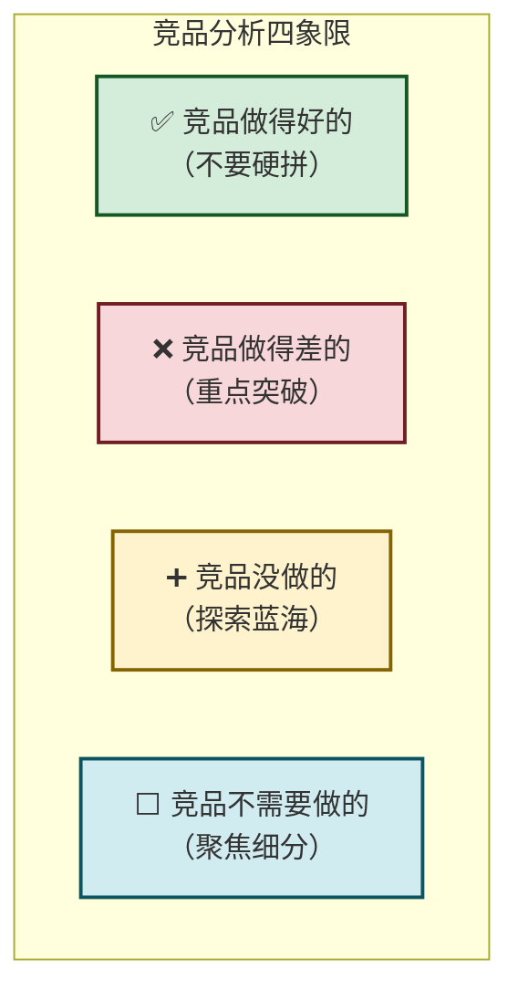
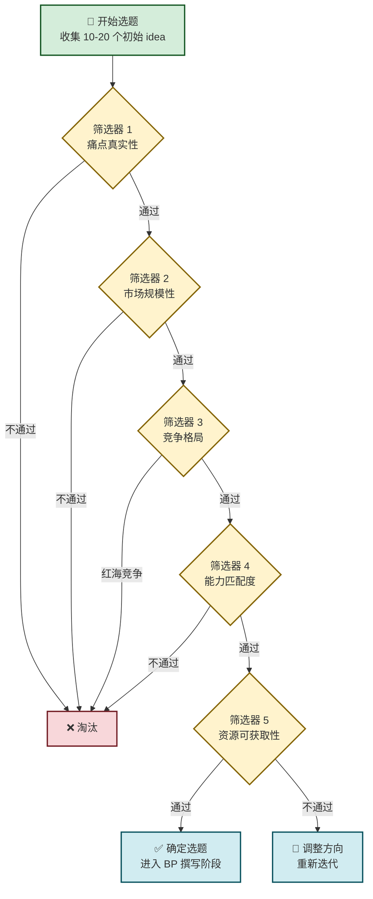

# 7.1 创新选题、痛点分析方法

> [!abstract] 本节概述
> 选题是创业的**起点**，选对了方向，就成功了一半。本节系统介绍选题的核心方法论——从"创意 idea"到"可行选题"的筛选过程，重点讲解痛点挖掘的五种实战方法，并用 Mermaid 流程图展示完整的选题决策路径。最后以"校园互助平台"为案例，展示选题方法论的实际应用。

## 一、选题：创业的第一道生死线

### 1.1 为什么选题如此重要

> [!warning] 选题的残酷现实
> 据统计，全球每年有超过 **1.5 亿** 家新注册企业，其中 **90%** 在 3 年内倒闭。在这些失败案例中，超过 **60%** 的失败归因于"选了一个伪需求或错误赛道"——不是团队不够努力，而是方向本身就错了。
>
> 好的选题是"顺势而为"，差的选题是"逆水行舟"。选错了方向，越多努力可能越多浪费。

### 1.2 好选题的三个标准

> [!definition] 好选题三标准
>
> | 标准 | 内涵 | 核心问题 |
> | ---- | ---- | -------- |
> | **真实痛点** | 用户确实存在且愿意为之付费的需求 | "用户会为这个解决方案付钱吗？" |
> | **足够规模** | 目标市场有足够大的空间支撑商业价值 | "这个市场能撑起多大的生意？" |
> | **可行落地** | 团队有能力在合理时间内做出产品 | "我们能在 6 个月内做出 MVP 吗？" |

### 1.3 选题的核心思维：从"我想做"到"用户需要"

> [!tip] 选题思维转变
> 大多数初学者的选题思维是 **"我想做什么"** —— 我喜欢什么、我擅长什么。但真正成功的选题思维是 **"用户需要什么、市场缺什么、我能做什么"** 的交集：
>
> ```mermaid
> flowchart TD
>     A["我想做的<br/>（兴趣/激情）"]
>     B["用户需要的<br/>（真实痛点）"]
>     C["我能做的<br/>（能力/资源）"]
>     D["市场空缺的<br/>（竞争格局）"]
>
>     A --> X{"最优选题<br/>= 四者交集"}
>     B --> X
>     C --> X
>     D --> X
>
>     classDef input fill:#d1ecf1,stroke:#0c5460,stroke-width:2px
>     classDef result fill:#d4edda,stroke:#155724,stroke-width:3px
>     class A,B,C,D input
>     class X result
> ```

## 二、痛点挖掘的五种方法

### 2.1 方法一：用户访谈法

> [!definition] 用户访谈法
> 通过与目标用户进行面对面或线上深度对话，捕捉用户在具体场景中的**真实痛点**。核心不是问"你想要什么"，而是观察"你在做什么"、"你卡在哪里"。

**访谈核心问题清单（5 类）：**

1. **场景类**："你通常在什么时候/什么情况下会做这件事？"
2. **频率类**："你多久会遇到一次这个问题？"
3. **代价类**："这个问题给你带来了多大的损失/不便？"
4. **现有方案类**："你现在是怎么解决这个问题的？效果如何？"
5. **情感类**："当你遇到这个问题时，你的第一感受是什么？"

> [!example] 校园互助平台的用户访谈片段
>
> 访谈对象：某高校大三学生小李
>
> | 问题 | 回答 | 痛点信号 |
> | ---- | ---- | -------- |
> | 你平时怎么解决打印、跑腿这类小事？ | "我一般自己跑打印店，有时候让室友帮忙，但也不好意思总麻烦别人" | 自己跑麻烦，人情成本高 |
> | 遇到过什么麻烦？ | "上次急着打论文，打印店排队 20 分钟，结果迟到被老师说了" | 时间成本高，有时间敏感性需求 |
> | 如果有个平台能帮你解决这些事，你愿意用吗？ | "要看多少钱吧，如果便宜的话可以试试" | 有意愿，但价格敏感 |

### 2.2 方法二：数据分析挖掘法

通过分析公开数据和行为数据，从数据中发现痛点信号。

> [!info] 数据分析的三个维度
>
> | 数据来源 | 分析目的 | 典型工具 |
> | -------- | -------- | -------- |
> | **搜索数据** | 用户在搜索什么但没找到满意答案 | 百度指数、Google Trends |
> | **社交媒体** | 用户在抱怨什么、吐槽什么 | 微博话题、知乎热榜、小红书笔记 |
> | **竞品数据** | 竞品的差评集中在哪里 | App Store 评论分析、黑猫投诉 |

> [!example] 用搜索数据发现校园服务痛点
> - 在百度指数中搜索"校园打印"，发现"急"、"排队"、"便宜"是高频关联词
> - 在黑猫投诉中分析"校园跑腿"相关投诉，发现"价格不透明"、"超时赔付"是主要投诉点
> - 在知乎搜索"大学生活最头疼的事"，"打印"、"取快递"、"排队"位列前十

### 2.3 方法三：竞品短板分析法

> [!definition] 竞品短板分析法
> 研究现有竞品的不足之处，找到**被忽视的用户痛点**。核心逻辑是：竞品的弱点就是你的机会。

**竞品分析四象限法：**



> [!example] 校园服务竞品短板分析
>
> | 竞品 | 做得好的 | 做得差的 | 没做的 |
> | ---- | -------- | -------- | ------ |
> | 美团/饿了么 | 外卖配送体系 | 校园内部配送不精准 | 校园专属服务（打印、跑腿、失物招领） |
> | 校园跑腿小程序 | 学生身份认证 | 品类单一、价格不透明 | 互助社区、技能交换 |
> | 校内 BBS | 信息真实 | 功能老旧、体验差 | 即时服务匹配 |
>
> **结论**：校园专属服务的垂直场景是蓝海，痛点集中在"品类少、匹配慢、价格不透明"。

### 2.4 方法四：趋势洞察法

> [!definition] 趋势洞察法
> 从宏观趋势（技术、政策、社会、经济）中发现创业机会。核心逻辑是：**站在风口上，猪都能飞起来**。

**四大趋势维度：**

| 趋势类型 | 具体表现 | 创业机会示例 |
| -------- | -------- | ------------ |
| **技术趋势** | AI、大模型、小程序、低代码 | AI 校园助手、智能学习工具 |
| **社会趋势** | Z 世代成为消费主力、银发经济崛起 | Z 世代社交应用、老年智能服务 |
| **政策趋势** | "互联网+"、乡村振兴、双碳目标 | 智慧农业、碳交易平台、政务服务 |
| **经济趋势** | 消费分级、悦己消费、情绪价值 | 情绪消费平台、轻奢定制、兴趣电商 |

> [!tip] 趋势判断的核心原则
> 趋势不是"风口"，而是"结构性变化"。判断趋势要看三个信号：
> 1. **是否有技术基础设施支撑**（如移动互联网普及催生了移动办公）
> 2. **是否有足够的用户规模**（如 Z 世代超过 2.6 亿人口）
> 3. **是否有资本/政策推动**（如新基建、共同富裕）

### 2.5 方法五：跨界迁移法

> [!definition] 跨界迁移法
> 将一个行业的成熟模式**迁移**到另一个行业，创造新的价值。核心逻辑是：他山之石，可以攻玉。

**跨界迁移的三种模式：**

1. **模式迁移**：将 C2C 电商模式迁移到知识付费领域（得到 = 知识版淘宝）
2. **技术迁移**：将短视频技术迁移到在线教育领域（抖音 + 教育 = 知识短视频）
3. **用户迁移**：将游戏化机制迁移到健身领域（Keep = 健身版游戏）

> [!example] 跨界迁移案例
> - 拼多多将"社交+低价"模式从下沉市场迁移到全品类电商
> - 小红书将"标签+种草"模式从美妆领域迁移到全生活方式
> - 校园互助平台 = 美团配送模式 + 校园场景 + 学生互助社交

## 三、选题决策流程

### 3.1 选题全流程图



### 3.2 选题评估打分表

> [!tip] 选题评估打分模板
>
> | 评估维度 | 权重 | 1 分（差） | 3 分（中） | 5 分（好） | 得分 |
> | -------- | ---- | ---------- | ---------- | ---------- | ---- |
> | 痛点真实性 | 25% | 用户无感 | 有一定感知 | 强烈痛点且愿意付费 | |
> | 市场规模 | 20% | 小众需求 | 中等规模 | 大盘市场（百亿+） | |
> | 竞争格局 | 15% | 红海血海 | 有空间 | 蓝海或差异化明显 | |
> | 团队能力 | 15% | 完全不匹配 | 部分匹配 | 核心优势匹配 | |
> | 资源获取 | 15% | 资源匮乏 | 有一定资源 | 资源充足且易得 | |
> | 趋势红利 | 10% | 逆趋势 | 无明显趋势 | 处于上升风口 | |
>
> **总分 = Σ（维度得分 × 权重），满分 5 分。建议选题在 3.5 分以上。**

## 四、案例：校园互助平台选题分析

### 4.1 选题背景

> [!example] 校园互助平台选题全过程
>
> **第一步：收集初始 idea（共 15 个）**
> - Idea 1：校园外卖平台
> - Idea 2：校园互助跑腿服务
> - Idea 3：校园二手交易
> - Idea 4：校园学习互助社区
> - Idea 5：校园活动发布平台
> - ...

**第二步：痛点真实性筛选**

| Idea | 痛点验证 | 结论 |
| ---- | -------- | ---- |
| 校园外卖 | 美团/饿了么已深度覆盖 | ❌ 伪痛点 |
| 校园互助跑腿 | 访谈 20 位同学，80% 表示有需求 | ✅ 真实痛点 |
| 校园二手 | 已有多个平台在做 | ⚠️ 部分痛点 |
| 学习互助 | 需求存在但付费意愿弱 | ⚠️ 可挖掘 |

**第三步：市场规模评估**

> 全国在校大学生约 **4600 万人**，校园服务市场规模超 **2000 亿元/年**。其中，校园跑腿互助市场估算：
> - 目标用户：4600 万大学生
> - 渗透率：10%（早期）
> - 年人均消费：200 元
> - **市场规模 = 4600 万 × 10% × 200 = 9.2 亿元/年**
> - 结论：市场规模足够支撑创业项目

**第四步：竞争格局分析**

| 竞争对手 | 优势 | 劣势 |
| -------- | ---- | ---- |
| 美团/饿了么 | 品牌强、配送体系完善 | 非校园专属、最后 100 米不精准 |
| 校内跑腿小程序 | 学生身份认证 | 品类单一、体验差、无社交属性 |
| 校园社群 | 粘性高 | 信息分散、无结构化管理 |

**差异化定位**：校园版"滴滴 + 58 同城 + 小红书"——**即时服务匹配 + 技能互助社交 + 学生专属优惠**

**第五步：确定选题**

> [!summary] 最终选题：校园互助平台"**校帮**"
>
> - **定位**：大学生专属的即时互助服务平台
> - **核心价值**：让大学生"不出寝室就能解决校园琐事"
> - **差异化**：学生互助（C2C）+ 平台担保 + 技能社交
> - **MVP 功能**：校园跑腿、打印服务、失物招领、技能交换

## 五、易错点

> [!warning] 选题的常见误区
> 1. **"热点 = 机会"**：热点往往意味着竞争最激烈，反而容易成为"接盘侠"。真正的机会是"尚未被关注的趋势"
> 2. **"我喜欢 = 用户需要"**：个人喜好≠市场需求。创业不是做自己喜欢的事，而是做用户愿意付费的事
> 3. **"大市场 = 好市场"**：大市场往往意味着巨头环伺。新兴创业公司更适合从"细分小市场切入，再扩张"
> 4. **"一次选对 = 成功"**：选题不是一次性决策，而是持续迭代的过程。Lean Startup 强调"构建-测量-学习"的快速循环
> 5. **"技术 = 壁垒"**：技术壁垒在互联网时代越来越薄弱。真正的壁垒是网络效应、品牌、用户粘性

## 六、与其他小节的联系

- 选题确定后，下一步进入 [[7.2 商业计划书基本框架|商业计划书]] 撰写阶段，将选题思路结构化
- 选题过程中的调研和分析，需要 [[7.3 市场调研、竞品分析思路|市场调研与竞品分析]] 的方法论支撑
- 选题落地需要 [[7.4 项目资源、团队搭建要点|团队搭建]] 匹配相应的资源和能力
- 最终选题和商业计划是 [[7.5 创新创业赛事备赛思路|创新创业赛事]] 评审的核心内容

## 章节导航

- 上一级：[[MOC - 第7章]]
- 下一节：[[7.2 商业计划书基本框架]]
- 习题：[[MOC - 第7章习题]]