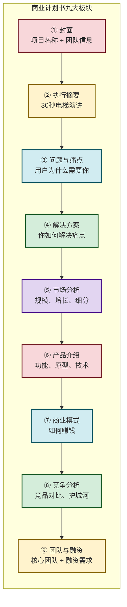
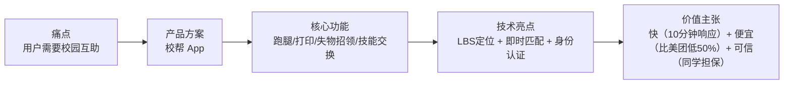

# 7.2 商业计划书基本框架

> [!abstract] 本节概述
> 商业计划书（Business Plan, BP）是创业项目的**"身份证"**——它用结构化的方式回答"你是谁、做什么、为什么能成、需要什么支持"这四个核心问题。本节系统介绍 BP 的九大核心板块、撰写原则和常见陷阱，并用 Mermaid 结构图展示 BP 各板块的逻辑关系。最后以"校帮"项目为案例，展示一份完整的 BP 示例。

## 一、商业计划书：创业项目的"面试答卷"

### 1.1 BP 的核心作用

> [!definition] 商业计划书
> 商业计划书是一份**面向投资人、合作伙伴、评审专家**的正式文档，它系统阐述创业项目的**商业模式、市场分析、产品规划、竞争策略、团队构成和财务预测**，核心目的是回答一个问题：**"为什么你的项目值得投资/合作/支持？"**

**BP 的三大核心受众：**

| 受众 | 关注重点 | BP 侧重点 |
| ---- | -------- | --------- |
| **投资人** | 投资回报率、退出路径、团队能力 | 市场规模、商业模式、财务预测、融资计划 |
| **合作伙伴** | 合作价值、风险可控、互补性 | 产品方案、合作模式、资源整合 |
| **赛事评委** | 创新性、可行性、社会效益 | 创新亮点、落地计划、社会价值 |

### 1.2 BP 的核心原则

> [!tip] BP 撰写三大原则
> 1. **电梯演讲原则**：优秀的 BP 应该能在 **30 秒内**说清楚项目核心。如果不能，说明项目本身还不够清晰
> 2. **数据驱动原则**：每一个论点都要有数据支撑。不要说"市场很大"，要说"市场规模 2025 年预计达 50 亿，年增长率 30%"
> 3. **视觉优先原则**：一张图胜过千言万语。用图表、流程图、用户画像替代大段文字

## 二、BP 九大核心板块

### 2.1 BP 结构全景图

### 2.2 各板块详解

#### ① 封面

> [!definition] 封面要素
> - 项目名称（响亮、易记、有寓意）
> - 一句话 Slogan（如："校帮——让校园生活更简单"）
> - 团队名称 + 成员信息
> - 联系方式（邮箱、电话）
> - 版本号 + 日期

> [!tip] 封面设计要点
> - 简洁大方，不要花哨
> - 使用高质量产品 Logo 或场景图
> - 颜色控制在 3 种以内

#### ② 执行摘要（最重要的部分）

> [!warning] 执行摘要的特殊性
> 投资人看 BP，**90% 的人只看执行摘要**。如果摘要不能吸引他，后面再好也没用。
>
> 执行摘要不是"全文缩写"，而是"30 秒电梯演讲的文字版"。

**执行摘要五要素（300 字以内）：**

| 要素 | 内容 | 示例 |
| ---- | ---- | ---- |
| 一句话定位 | 你是谁、做什么 | "校帮是一家专注于大学生即时互助服务的 C2C 平台" |
| 核心痛点 | 解决什么问题 | "解决大学生校园跑腿贵、打印慢、互助难的三大痛点" |
| 解决方案 | 怎么做 | "通过 C2C 互助模式 + 学生身份认证 + 平台担保，让校园服务快、便宜、可信" |
| 市场亮点 | 市场潜力 | "4600 万大学生，2000 亿校园服务市场，年增长 25%" |
| 融资需求 | 需要什么 | "融资 50 万元，出让 10% 股份，用于产品开发和市场推广" |

#### ③ 问题与痛点

**核心逻辑**：用故事和数据证明"这个痛点真实存在且足够严重"。

> [!example] "校帮"BP 的痛点阐述
>
> **故事引入**："大四学生小张某天急需打印论文，但打印店排队 30 分钟。他试着在 5 个微信群发求助消息，30 分钟后才有一个同学回应。这时他已经迟到了……"
>
> **数据支撑**：
> - 全国 4600 万大学生中，**78%** 表示有"校园跑腿"需求
> - 其中 **62%** 对现有服务的"价格不透明"表示不满
> - **45%** 曾因为"找不到人帮忙"而误事
>
> **痛点总结**：
> - 痛点一：校园琐事（打印、跑腿、取快递）耗时且麻烦
> - 痛点二：现有服务要么价格高（美团），要么体验差（校内小程序）
> - 痛点三：同学之间互助缺乏信任机制和匹配工具

#### ④ 解决方案

**核心逻辑**：清晰描述你的产品如何解决上述痛点。

**解决方案三要素：**

#### ⑤ 市场分析

**核心逻辑**：用数据证明"这个市场足够大、足够好"。

**市场分析三维度：**

> [!info] TAM / SAM / SOM 模型
> - **TAM（Total Addressable Market）**：总可服务市场
>   - 全国校园服务市场 = 2000 亿元/年
> - **SAM（Serviceable Addressable Market）**：可服务细分市场
>   - 大学生即时互助市场 = 500 亿元/年
> - **SOM（Serviceable Obtainable Market）**：可获得市场
>   - 目标城市大学生互助市场 = 5 亿元/年

**市场增长趋势：**
- 校园服务市场年增长率 25%
- Z 世代消费习惯转向"即时、便捷、社交化"
- 校园数字化加速，移动支付渗透率达 98%

#### ⑥ 产品介绍

**核心逻辑**：用可视化的方式展示产品是什么、怎么用。

> [!example] 产品展示要素
> - 产品核心功能列表（3-5 个，不要太多）
> - 产品原型图（低保真即可）
> - 用户使用流程
> - 技术架构图
> - 产品路线图（3-6-12 月规划）

**"校帮"产品核心功能：**

| 功能模块 | 核心描述 | MVP 优先级 |
| -------- | -------- | ---------- |
| 校园跑腿 | 代取快递、代买物品、代排队 | P0 |
| 云端打印 | 上传文档→定点打印→扫码取件 | P0 |
| 失物招领 | 发布/检索校园失物 | P1 |
| 技能交换 | 学习辅导、技能互助 | P2 |

#### ⑦ 商业模式

**核心逻辑**：清晰说明"怎么赚钱"。

> [!definition] 商业模式画布（Business Model Canvas）
> 商业模式画布是描述商业模式的标准工具，包含九大要素：

```mermaid
flowchart TD
    subgraph BMC["商业模式画布"]
        direction TB
        A["关键伙伴<br/>校园商家/打印店/物流"]
        B["关键活动<br/>平台运营/服务匹配/质量管控"]
        C["关键资源<br/>平台/用户数据/校园合作"]
        D["价值主张<br/>快+便宜+可信的校园互助"]
        E["客户关系<br/>C2C互助/社群运营/担保机制"]
        F["渠道通路<br/>App/小程序/校园地推"]
        G["客户细分<br/>在校大学生"]
        H["成本结构<br/>研发/运营/市场/客服"]
        I["收入来源<br/>交易佣金/增值服务/会员费"]
    end

    classDef partner fill:#d1ecf1,stroke:#0c5460,stroke-width:1px
    classDef activity fill:#d4edda,stroke:#155724,stroke-width:1px
    classDef resource fill:#e2d5f1,stroke:#4a148c,stroke-width:1px
    classDef value fill:#fff3cd,stroke:#856404,stroke-width:2px
    classDef relationship fill:#f8d7da,stroke:#721c24,stroke-width:1px
    classDef channel fill:#d1ecf1,stroke:#0c5460,stroke-width:1px
    classDef customer fill:#d4edda,stroke:#155724,stroke-width:1px
    classDef cost fill:#f8d7da,stroke:#721c24,stroke-width:1px
    classDef revenue fill:#d4edda,stroke:#155724,stroke-width:2px

    class A partner
    class B activity
    class C resource
    class D value
    class E relationship
    class F channel
    class G customer
    class H cost
    class I revenue
```

#### ⑧ 竞争分析

**核心逻辑**：证明"你比别人做得好，且有壁垒"。

> [!example] "校帮"竞争分析
>
> | 维度 | 校帮 | 美团/饿了么 | 校内小程序 |
> | ---- | ---- | ---------- | ---------- |
> | 定位 | 校园专属互助 | 全品类外卖 | 校园信息 |
> | 价格 | 比美团低 50% | 较高（含配送费） | 价格不透明 |
> | 速度 | 10 分钟响应 | 30-45 分钟 | 不确定 |
> | 信任 | 学生身份+平台担保 | 品牌保障 | 无保障 |
> | 社交 | 互助社交 | 无 | 无 |
>
> **护城河**：校园地推壁垒 + 学生身份认证 + C2C 网络效应

#### ⑨ 团队与融资

**核心逻辑**：证明"团队靠谱，融资合理"。

**团队介绍三要素：**
1. 核心团队成员背景（学历、经验、技能）
2. 每个人的角色和分工
3. 团队的互补性和凝聚力

**融资计划三要素：**
1. 融资金额（如：50 万元）
2. 出让股份（如：10%）
3. 资金使用计划（如：产品开发 40%、市场推广 30%、运营 20%、预留 10%）

> [!example] "校帮"融资使用计划
>
> | 用途 | 金额（万元） | 占比 | 说明 |
> | ---- | ------------ | ---- | ---- |
> | 产品开发 | 20 | 40% | App/小程序开发、技术团队 |
> | 市场推广 | 15 | 30% | 校园地推、用户激励、品牌建设 |
> | 运营成本 | 10 | 20% | 客服、风控、日常运营 |
> | 预留储备 | 5 | 10% | 应急和后续迭代 |

## 三、BP 撰写进阶技巧

### 3.1 财务预测的"三个假设"

> [!tip] 财务预测的核心逻辑
> 财务预测不是"编数字"，而是"基于合理假设的推演"。一个可信的财务预测需要：
>
> | 假设类型 | 示例 |
> | -------- | ---- |
> | 乐观假设 | 用户渗透率 15%，客单价 15 元，月增长率 10% |
> | 中性假设 | 用户渗透率 8%，客单价 12 元，月增长率 5% |
> | 悲观假设 | 用户渗透率 3%，客单价 10 元，月增长率 2% |
>
> 最好给出三档预测，并说明各档的关键驱动因素。

### 3.2 BP 常见陷阱

> [!warning] BP 撰写的十大陷阱
> 1. **过长过密**：BP 应控制在 15-20 页，超过 25 页投资人不会看完
> 2. **数据空洞**：不要说"市场很大"，要说"500 亿市场，年增 25%"
> 3. **自我感动**：不要写"我们的团队非常努力"，要写"我们的团队有 XX 经验、取得过 XX 成绩"
> 4. **忽视竞争**：不要说"没有竞争对手"，任何市场都有竞争者（包括"用户自己解决"这个隐形竞争者）
> 5. **护城河模糊**：不要说"我们做得好"，要说"我们通过 XX 构建了壁垒，别人难以复制"
> 6. **融资额不合理**：不要"狮子大开口"，融资额应基于"18 个月的 runway"（跑道资金）
> 7. **财务预测过于乐观**：不要"三年做到一个亿"，要给出可信的增长逻辑
> 8. **忽视风险**：主动说明项目风险和应对方案，反而增加可信度
> 9. **格式混乱**：统一字体、颜色、图表风格，专业的 BP 体现专业的团队
> 10. **忘记检查**：错别字、语病会严重影响专业印象

## 四、案例："校帮"项目 BP 结构示例

### 4.1 项目概要

> [!example] "校帮"BP 执行摘要
>
> > **校帮**是一家专注于大学生即时互助服务的 C2C 平台，通过"学生互助+平台担保+社交化"的模式，解决大学生校园跑腿贵、打印慢、互助难的三大痛点。
> >
> > 全国 4600 万大学生构成了 2000 亿元/年的校园服务市场，且以每年 25% 的速度增长。校帮以"校园专属互助"为差异化定位，通过 LBS 定位+即时匹配+学生身份认证，实现 10 分钟内响应的校园服务体验。
> >
> > 目前团队 5 人，核心成员来自 XX 大学计算机学院和商学院，已完成 MVP 开发并在 2 所高校试点运营 3 个月，累计注册用户 5000+，日均订单 200+，次日留存率 42%。
> >
> > 本轮计划融资 **50 万元**，出让 **10%** 股份，资金将用于产品开发（40%）、市场推广（30%）和运营（20%）。

### 4.2 BP 目录结构

1. **封面**：校帮——让校园生活更简单
2. **执行摘要**：（如上）
3. **问题与痛点**：大学生校园服务的三大痛点
4. **解决方案**：校帮 App 的核心功能和技术架构
5. **市场分析**：2000 亿校园服务市场分析
6. **产品介绍**：产品原型和功能路线图
7. **商业模式**：交易佣金 + 增值服务
8. **竞争分析**：对比美团、校内小程序
9. **团队介绍**：核心团队成员背景
10. **融资计划**：50 万融资，18 个月跑道
11. **风险与应对**：三大风险及应对方案
12. **附件**：试点数据、用户反馈、合作意向书

## 五、易错点

> [!warning] BP 撰写的常见误区
> 1. **"BP 是给自己看的"**：BP 是给外部读者（投资人、评委）看的，要站在读者角度思考——他们想看到什么
> 2. **"BP 一次写完"**：BP 是动态文档，需要根据市场反馈、用户数据、融资进展持续更新
> 3. **"技术细节越多越好"**：投资人关注"你解决什么问题、怎么赚钱"，不是"你用了什么技术框架"
> 4. **"越完美越好"**：早期 BP 不需要完美，需要的是"有说服力的故事+可信的数据+靠谱的团队"
> 5. **"忽视退出机制"**：投资人关心的不仅是"能赚多少钱"，还有"怎么退出"（IPO、并购、回购）

## 六、与其他小节的联系

- BP 的基础是 [[7.1 创新选题、痛点分析方法|选题和痛点分析]]，选题的质量直接决定 BP 的说服力
- BP 中的市场分析和竞争分析需要 [[7.3 市场调研、竞品分析思路|市场调研与竞品分析]] 的方法论支撑
- BP 的团队部分需要 [[7.4 项目资源、团队搭建要点|团队搭建]] 的理论指导
- BP 是 [[7.5 创新创业赛事备赛思路|创新创业赛事]] 的核心提交材料

## 章节导航

- 上一级：[[MOC - 第7章]]
- 上一节：[[7.1 创新选题、痛点分析方法]]
- 下一节：[[7.3 市场调研、竞品分析思路]]
- 习题：[[MOC - 第7章习题]]