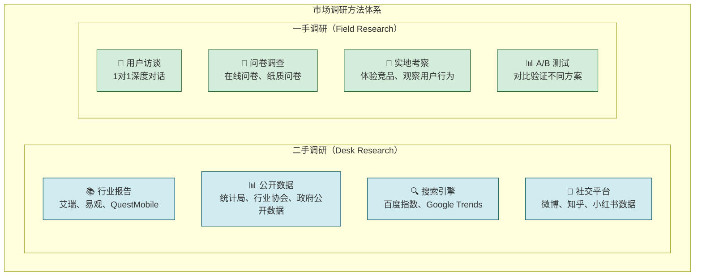
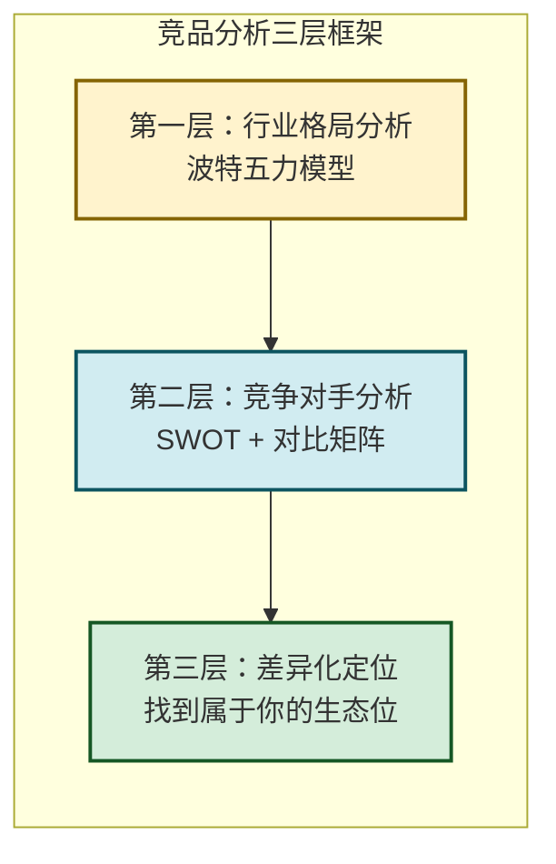
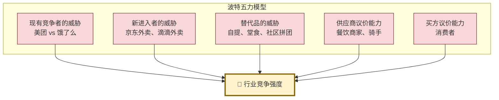

# 7.3 市场调研、竞品分析思路

> [!abstract] 本节概述
> 市场调研和竞品分析是创业决策的**"导航仪"**——没有调研的创业如同闭眼开车。本节系统介绍市场调研的方法体系（二手调研+一手调研）和竞品分析的核心框架（波特五力、SWOT、竞品对比矩阵），并用 Mermaid 图表展示外卖市场的竞争格局分析过程。

## 一、市场调研：用数据代替直觉

### 1.1 市场调研的两大体系

> [!definition] 市场调研
> 市场调研是通过**系统收集、整理、分析**与创业项目相关的市场信息，为决策提供数据支撑的过程。市场调研分为**二手调研**和**一手调研**两大体系。



### 1.2 二手调研：站在巨人肩膀上

> [!tip] 二手调研的核心价值
> 二手调研是"用别人已经收集好的数据"快速了解市场全貌，优势是**快、便宜、信息量大**。缺点是数据可能过时、不够精准。

**二手调研核心数据源：**

| 数据类型 | 来源 | 适用场景 |
| -------- | ---- | -------- |
| 行业报告 | 艾瑞咨询、易观分析、QuestMobile、CNNIC | 了解行业整体规模、增长趋势、竞争格局 |
| 宏观数据 | 国家统计局、行业协会、地方政府 | 了解市场总量、政策环境 |
| 搜索数据 | 百度指数、Google Trends、微信指数 | 了解用户搜索行为、需求热度变化 |
| 社交媒体 | 微博热搜、知乎热榜、小红书笔记 | 了解用户讨论焦点、情感倾向 |
| 竞品数据 | 七麦数据、App Annie、黑猫投诉 | 了解竞品下载量、收入、用户评价 |

> [!example] 外卖市场二手调研示例
>
> - **行业报告**：艾瑞咨询《2024 年中国外卖行业白皮书》显示，外卖市场规模达 **3000 亿元**，年增长率 **18%**
> - **搜索数据**：百度指数显示，"外卖"搜索量年均增长 **15%**，"健康外卖"搜索量年增长 **40%**
> - **社交数据**：微博"外卖"相关话题阅读量超 **1000 亿**，"外卖超时"是高频吐槽点
> - **竞品数据**：美团外卖 App 下载量超 **5000 万**，日均订单 **3000 万+**

### 1.3 一手调研：获取"独一无二"的洞察

#### 用户访谈

> [!definition] 用户访谈
> 用户访谈是通过与目标用户进行面对面或线上深度对话，获取**个体化、深层次**需求的定性研究方法。

**用户访谈操作指南：**

| 步骤 | 操作要点 | 注意事项 |
| ---- | -------- | -------- |
| **招募受访者** | 选择 8-15 位典型目标用户 | 覆盖不同人群画像 |
| **设计提纲** | 5-8 个核心问题，开放式 | 不要引导性提问 |
| **实施访谈** | 30-60 分钟，录音+记录 | 关注行为、场景、情感 |
| **整理分析** | 编码、归类、提炼洞察 | 关注"原话"和"故事" |

> [!tip] 用户访谈的黄金问题
> 1. "请描述一下你最近一次 [相关场景] 的经历"——了解真实行为
> 2. "在这个过程中，哪个环节最让你头疼？"——挖掘核心痛点
> 3. "你现在是怎么解决这个问题的？"——了解现有替代方案
> 4. "如果有一个理想的解决方案，它应该是什么样的？"——探索期望
> 5. "如果这个产品明天就消失了，你会怎么办？"——验证真实需求

#### 问卷调查

**问卷设计的六大原则：**

| 原则 | 说明 | 反例 |
| ---- | ---- | ---- |
| **明确目的** | 围绕核心问题设计 | "请填写以下问卷" |
| **简洁清晰** | 问题不超过 20 个 | 30+ 问题的长问卷 |
| **逻辑顺畅** | 从易到难，从浅到深 | 一开始就问敏感问题 |
| **避免引导** | 中立客观，不暗示答案 | "你不觉得外卖配送太慢吗？" |
| **选项全面** | 穷尽所有可能，加"其他" | 只有 3 个选项 |
| **便于统计** | 尽量使用封闭题 | 过多开放式问题 |

> [!warning] 问卷设计的常见错误
> 1. **双重含义问题**："你认为外卖又贵又慢吗？"——把两个问题合为一个
> 2. **专业术语过多**："你认为 O2O 模式的 LBS 定位体验如何？"——用户可能不懂
> 3. **假设前提错误**："你使用外卖 App 的频率是？"——假设用户已经使用
> 4. **答案互斥**：选项之间有重叠

#### 实地考察

> [!info] 实地考察的核心方法
> - **竞品体验**：亲自使用竞品产品，记录完整体验流程
> - **场景观察**：在用户真实使用场景中观察行为（如餐厅观察点餐流程）
> - **神秘顾客**：以用户身份接触竞品服务，评估服务质量
> - **上下游访谈**：访谈供应商、渠道商、合作伙伴，了解产业链信息

## 二、竞品分析：知己知彼，百战不殆

### 2.1 竞品分析的三层框架



### 2.2 第一层：波特五力模型

> [!definition] 波特五力模型
> 由迈克尔·波特提出，用于分析行业竞争格局的经典框架，包含五种竞争力量：



**外卖市场五力分析示例：**

| 竞争力量 | 强度 | 分析 |
| -------- | ---- | ---- |
| **现有竞争者** | ⭐⭐⭐⭐⭐ | 美团（市占 70%）vs 饿了么（市占 25%），双寡头格局，竞争激烈 |
| **新进入者** | ⭐⭐⭐ | 京东、滴滴等巨头有能力进入，但需要大量补贴 |
| **替代品威胁** | ⭐⭐ | 自提、堂食、预制菜等替代品的威胁有限，外卖仍是最便捷的选择 |
| **供应商议价** | ⭐⭐⭐⭐ | 商家和骑手的议价能力强，平台佣金和配送费是核心争议点 |
| **买方议价** | ⭐⭐⭐⭐⭐ | 用户选择多、切换成本低，价格敏感度高 |

### 2.3 第二层：SWOT 分析

> [!definition] SWOT 分析
> SWOT 是一种战略分析工具，通过分析项目的**优势（Strengths）、劣势（Weaknesses）、机会（Opportunities）、威胁（Threats）**，为战略决策提供依据。

**"校帮"项目 SWOT 分析：**

| | 有利因素 | 不利因素 |
| ---- | -------- | -------- |
| **内部因素** | **优势（S）**<br/>1. 校园垂直场景，定位精准<br/>2. C2C 互助模式，成本低<br/>3. 学生身份认证，信任度高<br/>4. 团队了解校园用户 | **劣势（W）**<br/>1. 品牌知名度低<br/>2. 初期供给侧不足<br/>3. 运营依赖线下地推<br/>4. 技术积累有限 |
| **外部因素** | **机会（O）**<br/>1. Z 世代消费习惯转向即时化<br/>2. 校园数字化加速<br/>3. 现有服务体验不佳<br/>4. 学生社交需求未被满足 | **威胁（T）**<br/>1. 美团/饿了么下沉校园<br/>2. 高校政策限制<br/>3. 用户价格敏感度高<br/>4. 同类竞品涌现 |

### 2.4 第三层：竞品对比矩阵

> [!tip] 竞品对比矩阵模板
> 将主要竞品和自己的产品放在一个矩阵中，选择 **6-8 个关键维度** 进行评分对比，直观展示差异化。

**外卖市场竞品对比矩阵：**

| 维度 | 权重 | 美团 | 饿了么 | 京东外卖 | 校帮（校园） |
| ---- | ---- | ---- | ------ | -------- | ------------ |
| 配送速度 | 20% | 5 | 4 | 3 | 5 |
| 价格竞争力 | 20% | 3 | 3 | 4 | 5 |
| 覆盖范围 | 15% | 5 | 4 | 3 | 2 |
| 用户体验 | 15% | 5 | 4 | 4 | 4 |
| 信任度 | 10% | 5 | 4 | 4 | 5 |
| 社交属性 | 10% | 2 | 2 | 2 | 5 |
| 差异化 | 10% | 3 | 3 | 3 | 5 |
| **加权总分** | 100% | **4.05** | **3.45** | **3.35** | **4.35** |

> [!summary] 对比结论
> 美团在综合实力上依然领先，但在校园垂直场景的**价格竞争力、信任度、社交属性**三个维度上，"校帮"具备明显优势。这就是"校帮"的生态位——**不是在全市场与美团正面竞争，而是在校园垂直场景做深做透**。

## 三、调研执行流程

### 3.1 市场调研全流程图

```mermaid
flowchart TD
    Start["🎯 明确调研目标<br/>（你想回答什么问题？）"] --> S1["📋 制定调研计划<br/>方法、样本、时间、预算"]
    S1 --> S2["🔍 二手调研<br/>收集行业数据、竞品数据"]
    S2 --> S3["👥 一手调研<br/>用户访谈 + 问卷调查"]
    S3 --> S4["📊 整理分析<br/>数据编码、统计、提炼洞察"]
    S4 --> S5["📝 撰写调研报告<br/>结论、建议、行动方案"]
    S5 --> End["✅ 调研结束<br/>指导 BP 撰写和决策"]

    classDef start fill:#d4edda,stroke:#155724,stroke-width:2px
    classDef process fill:#d1ecf1,stroke:#0c5460,stroke-width:1px
    classDef end fill:#fff3cd,stroke:#856404,stroke-width:2px

    class Start start
    class S1,S2,S3,S4 process
    class S5,End end
```

### 3.2 调研样本量的选择

> [!info] 样本量参考标准
>
> | 调研类型 | 建议样本量 | 说明 |
> | -------- | ---------- | ---- |
> | 用户访谈 | 8-15 人 | 饱和即可（不再有新洞察） |
> | 问卷调查 | 100-300 份 | 统计显著性要求 |
> | 竞品分析 | 3-5 家 | 覆盖主要竞争者 |
> | 实地考察 | 2-3 个场景 | 覆盖核心使用场景 |

## 四、案例：外卖市场竞品分析

### 4.1 外卖行业概况

> [!example] 外卖市场分析
>
> **市场规模**：2024 年中国外卖市场规模达 **3000 亿元**，日均订单 **8000 万+**，用户规模 **7 亿+**
>
> **竞争格局**：
> | 平台 | 市场份额 | 核心优势 | 核心劣势 |
> | ---- | -------- | -------- | -------- |
> | 美团 | 70% | 规模效应、配送网络 | 补贴依赖、利润压力 |
> | 饿了么 | 25% | 阿里生态、高端餐饮 | 配送效率略低 |
> | 其他 | 5% | 细分场景、差异化 | 规模小、生存困难 |
>
> **趋势判断**：外卖市场从"补贴驱动"进入"价值驱动"阶段，用户关注的不只是"便宜"，更是"品质、速度、体验"。

### 4.2 外卖用户需求变迁

| 阶段 | 核心需求 | 代表产品 | 时间 |
| ---- | -------- | -------- | ---- |
| 1.0 补贴时代 | 便宜 | 美团/饿了么疯狂补贴 | 2014-2016 |
| 2.0 品质时代 | 品质+速度 | 美团"高品质"、饿了么"蓝骑士" | 2017-2020 |
| 3.0 细分时代 | 场景+健康 | 瑞幸、星巴克、健康餐品牌 | 2021-至今 |

### 4.3 创业启示

> [!tip] 外卖市场分析对创业的启示
> 1. **巨头占据主流市场，但细分场景仍有机会**——校园、社区、高端等垂直领域
> 2. **用户需求在变迁，变化就是机会**——从"便宜"到"品质"到"场景"，每个阶段都有新玩家
> 3. **不要在巨头的优势赛道正面竞争**——美团的优势是"规模和配送网络"，你要找到"巨头做不好的细分"
> 4. **生态位思维**——找到"巨头看不上、做不好、不值得做"的市场

## 五、易错点

> [!warning] 市场调研的常见误区
> 1. **"调研 = 搜百度"**：二手调研只是起点，真正的洞察来自一手调研
> 2. **"样本越多越好"**：质量 > 数量。5 个深度用户访谈 > 50 份无效问卷
> 3. **"只看竞品"**：不要只研究直接竞品，还要研究**替代品**和**用户现有解决方案**
> 4. **"忽视非用户"**：研究"为什么有人不使用"，往往能发现最大的创新机会
> 5. **"数据越多越好"**：聚焦核心问题，不要收集无用数据
> 6. **"调研一次就够了"**：市场是动态的，调研应该是持续的过程

## 六、与其他小节的联系

- 市场调研和竞品分析是 [[7.1 创新选题、痛点分析方法|选题]] 的数据支撑，选题决策依赖调研结论
- 调研结果直接输入 [[7.2 商业计划书基本框架|商业计划书]] 的市场分析和竞争分析板块
- 团队搭建（[[7.4 项目资源、团队搭建要点]]）需要根据调研结果确定所需资源和人才
- 赛事备赛（[[7.5 创新创业赛事备赛思路]]）中，扎实的市场调研数据是评委关注的重点

## 章节导航

- 上一级：[[MOC - 第7章]]
- 上一节：[[7.2 商业计划书基本框架]]
- 下一节：[[7.4 项目资源、团队搭建要点]]
- 习题：[[MOC - 第7章习题]]