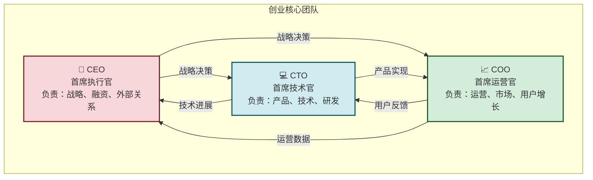
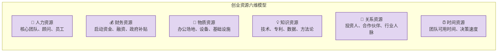
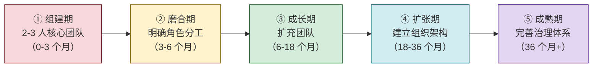

# 7.4 项目资源、团队搭建要点

> [!abstract] 本节概述
> "人、财、物"是创业的三要素，其中**人是核心**——没有合适的团队，再好的选题和 BP 都是空中楼阁。本节系统介绍创业核心团队的角色分工、资源获取的六大路径、团队激励机制以及股权设计的核心要点，并用 Mermaid 团队结构图展示"创业三剑客"的协作模式。

## 一、创业团队：选对人，成事一半

### 1.1 核心团队的三个关键角色

> [!definition] 创业三剑客
> 一个最小可行创业团队通常需要三个核心角色，如同"三驾马车"驱动公司前进：

### 1.2 三大角色的详细职责

| 角色 | 核心职责 | 关键能力 | 典型背景 |
| ---- | -------- | -------- | -------- |
| **CEO** | 制定战略、融资谈判、对外合作、团队建设 | 领导力、沟通力、商业敏感度 | 商科/MBA、咨询、投行、大厂产品 |
| **CTO** | 技术架构、产品开发、团队技术能力建设 | 技术深度、工程能力、产品思维 | 计算机/软件工程、大厂技术岗、开源社区 |
| **COO** | 用户增长、运营体系、市场推广、日常运营 | 执行力、数据思维、用户洞察 | 市场营销、用户运营、增长黑客 |

> [!tip] 团队角色的灵活性
> - 初创团队可以"一人多岗"：早期 CEO 可能兼任 CMO，CTO 兼任产品经理
> - 但**核心角色不能缺失**：如果没有 CTO，产品无法落地；如果没有 CEO，方向容易迷失
> - 创业初期建议 **3-5 人** 的核心团队，保持敏捷和高效

### 1.3 优秀创业团队的五个特质

> [!info] 优秀团队五特质
>
> | 特质 | 说明 | 反面案例 |
> | ---- | ---- | -------- |
| **互补性** | 成员在能力、背景、性格上互补 | 全是技术背景，缺乏商业思维 |
| **凝聚力** | 有共同的价值观和使命感 | 因利益聚在一起，利益冲突时解散 |
| **执行力** | 快速决策、快速行动 | 长时间讨论不出结论 |
| **学习力** | 持续学习、快速迭代 | 固步自封、不愿改变 |
| **信任感** | 相互信任、坦诚沟通 | 互相猜忌、信息不对称 |

## 二、创业资源：在有限资源中创造最大价值

### 2.1 创业资源的六大类别

> [!definition] 创业资源
> 创业资源是指创业过程中所需的**各种有形和无形资产**的总和。可分为六大类别：

### 2.2 资源获取的六大路径

| 资源路径 | 说明 | 适用场景 | 示例 |
| -------- | ---- | -------- | ---- |
| **自筹资金** | 创始人个人出资 | 早期启动 | 创始人拿出积蓄 50 万 |
| **天使投资** | 个人天使投资 | 产品验证期 | 天使投资人投资 100 万 |
| **VC 融资** | 风险投资机构 | 成长期 | 红杉资本投资 500 万 |
| **政府支持** | 创业补贴、税收优惠 | 所有阶段 | 高新技术企业税收减免 |
| **合作伙伴** | 渠道、资源互换 | 运营期 | 与校园商家合作获取流量 |
| **众包/众筹** | 公开募集资金或资源 | 早期验证 | Kickstarter 众筹 |

> [!tip] "最小可行资源"原则
> 创业初期不是资源越多越好，而是**够用就好**。过多的资源反而可能导致：
> - 资源浪费（租大办公室、招多余的人）
> - 决策迟缓（"有钱"的错觉导致不聚焦）
> - 团队膨胀（人多沟通成本高）
>
> **Lean Startup 核心思想**：用最少的资源验证最大的价值假设。

### 2.3 资源杠杆效应

> [!definition] 资源杠杆
> 资源杠杆是指用**少量核心资源撬动大量外部资源**的能力。优秀创业者的核心能力不是"拥有多少资源"，而是"能撬动多少资源"。

**资源杠杆的三种模式：**

| 杠杆模式 | 核心逻辑 | 示例 |
| -------- | -------- | ---- |
| **借势** | 借外部趋势/平台的势 | 借微信生态做小程序、借抖音流量做增长 |
| **借力** | 借他人的资源/能力 | 用合伙人的渠道、用外包团队的产能 |
| **借智** | 借外部智慧/知识 | 找行业顾问、参加创业训练营、获取导师指导 |

## 三、团队激励与股权设计

### 3.1 团队激励的三把"钥匙"

> [!info] 团队激励体系
>
> | 激励类型 | 适用阶段 | 具体方式 |
> | -------- | -------- | -------- |
| **短期激励** | 所有阶段 | 薪资、绩效奖金、带薪休假 |
| **中期激励** | 成长阶段 | 期权池（10-20%）、年度股权激励 |
| **长期激励** | 关键岗位 | 股权（所有权）、分红权、退出权 |

> [!tip] 早期团队激励要点
> 1. **股权 > 现金**：早期用股权（期权）代替高现金，绑定长期利益
> 2. **使命感 > 金钱**：优秀的早期团队成员往往被"愿景"驱动，而不是仅靠工资
> 3. **透明 > 保密**：让团队成员知道公司的股权结构和融资进展，建立信任
> 4. **及时 > 延迟**：激励要及时，不要等到"功成名就"才给奖励

### 3.2 股权设计的核心原则

> [!warning] 股权设计是"创业基因"
> 股权设计不是"分钱"，而是**决定公司的控制权、决策权和未来走向**。早期股权设计的不合理，是导致创业失败的常见原因之一。

**股权设计三大原则：**

| 原则 | 说明 | 反面案例 |
| ---- | ---- | -------- |
| **控制权优先** | 创始人应持有至少 51% 股权 | 股权平均分配（各 33%），导致决策僵局 |
| **动态调整** | 预留期权池（15-20%）给未来员工 | 股权一次性全分完，没有调整空间 |
| **书面约定** | 所有股权约定必须书面化 | 口头约定股权，后期产生纠纷 |

### 3.3 典型早期股权结构

> [!example] "校帮"项目早期股权结构
>
> | 角色 | 持股比例 | 说明 |
> | ---- | -------- | ---- |
> | CEO（创始人） | 60% | 控制权，含未来融资稀释空间 |
> | CTO（联合创始人） | 20% | 核心技术贡献 |
> | COO（联合创始人） | 15% | 核心运营贡献 |
> | 期权池 | 5% | 预留未来员工激励 |
>
> **设计要点**：
> - CEO 持有 60%，保证控制权
> - 联合创始人合计 35%，有足够的激励
> - 期权池 5%（后续可增至 15%）
> - 股权分期成熟（4 年），绑定长期服务

## 四、创业团队的"生命周期"

### 4.1 团队发展五阶段

### 4.2 各阶段核心任务

| 阶段 | 核心任务 | 关键挑战 |
| ---- | -------- | -------- |
| **组建期** | 找到 2-3 个互补的联合创始人 | 信任、共识、角色清晰 |
| **磨合期** | 明确分工、建立决策机制、磨合工作方式 | 冲突解决、沟通效率 |
| **成长期** | 招聘核心员工、建立人才选拔标准 | 文化传承、招聘质量 |
| **扩张期** | 建立部门、流程、制度 | 组织灵活性、避免官僚化 |
| **成熟期** | 完善治理、建立激励体系、培养接班人 | 创新保持、团队稳定 |

## 五、案例：初创团队搭建全过程

### 5.1 "校帮"团队组建实录

> [!example] "校帮"核心团队搭建过程
>
> **第一步：找到联合创始人（第 1 个月）**
>
> | 角色 | 来源 | 选择原因 |
> | ---- | ---- | -------- |
> | CEO | 大学同学（商学院） | 互补：商业敏感度强、有领导力、擅长沟通 |
> | CTO | 技术合伙人（计算机学院） | 互补：技术扎实、有开源项目经验、专注 |
> | COO | 运营合伙人（市场营销专业） | 互补：有用户运营实习经验、数据敏感 |
>
> **选择标准**：
> 1. 能力互补（商业+技术+运营）
> 2. 有共同价值观（都想做"有意义的产品"，而不是"赚快钱"）
> 3. 有时间投入（愿意全职创业）
> 4. 有基本信任（认识超过 1 年）
>
> **第二步：明确分工与决策机制（第 2 个月）**
>
> - **决策原则**：一人一票，重大决策 CEO 有最终决定权
> - **沟通机制**：每日站会（15 分钟）、每周例会（1 小时）、每月战略会（2 小时）
> - **冲突解决**：定期复盘，坦诚沟通，必要时请导师调解
>
> **第三步：招聘第一批员工（第 3-6 个月）**
>
> | 岗位 | 人数 | 招聘标准 | 激励方式 |
> | ---- | ---- | -------- | -------- |
> | 前端开发 | 1 | 有 React/Vue 经验，热爱产品 | 底薪 + 0.5% 期权 |
> | 后端开发 | 1 | 有 Node.js/Python 经验 | 底薪 + 0.5% 期权 |
> | UI 设计 | 1 | 有移动端设计经验 | 底薪 + 0.3% 期权 |
> | 运营实习生 | 2 | 在校大学生，有社团运营经验 | 实习补贴 + 转正期权 |
>
> **第四步：获取外部资源（第 3-6 个月）**
>
> | 资源类型 | 获取方式 | 说明 |
> | -------- | -------- | ---- |
> | 办公场地 | 入驻大学创业孵化器 | 免租金 1 年，提供创业指导 |
> | 启动资金 | 自筹 + 天使投资 | 创始人 20 万 + 天使 30 万 |
> | 行业资源 | 创业导师 + 校友网络 | 邀请行业资深人士担任顾问 |
> | 技术支持 | 云服务优惠 + 开源社区 | AWS 创业计划免费额度 |
>
> **第五步：建立激励体系（第 6 个月）**
>
> - 期权池：15%（预留用于未来员工激励）
> - 激励方案：底薪（市场 80%）+ 期权（4 年分期）+ 年度团建
> - 文化建设：每周"创意日"、每月"庆功会"、每季度"复盘会"

## 六、易错点

> [!warning] 团队搭建的常见误区
> 1. **"找朋友合伙"**：朋友不等于合适的合伙人。友谊和商业是两回事，选合伙人要基于**能力互补和价值观**，而不是感情
> 2. **"股权平均分配"**：股权平均是创业的"死亡陷阱"（33%+33%+33%）。必须有人持有 51% 以上的股权
> 3. **"早期招人越多越好"**：早期团队要小而精，3-5 人足矣。人多沟通成本高、决策慢
> 4. **"只看能力不看人品"**：人品 > 能力。能力可以培养，人品难以改变。一个不靠谱的核心员工可能毁掉整个团队
> 5. **"忽视期权池"**：早期不设期权池，后续融资和招人都会遇到困难。建议预留 15-20%
> 6. **"激励只靠钱"**：早期员工（尤其是优秀的）更多被"愿景"和"成长空间"驱动，金钱只是基础

## 七、与其他小节的联系

- 团队搭建的起点是 [[7.1 创新选题、痛点分析方法|选题]]，选题决定了需要什么样的团队能力
- 团队和资源是 [[7.2 商业计划书基本框架|商业计划书]] 中"团队板块"的核心内容
- 资源获取需要 [[7.3 市场调研、竞品分析思路|市场调研]] 的数据支撑，说服投资人
- 最终的团队和资源配置是 [[7.5 创新创业赛事备赛思路|创新创业赛事]] 评审的重要维度

## 章节导航

- 上一级：[[MOC - 第7章]]
- 上一节：[[7.3 市场调研、竞品分析思路]]
- 下一节：[[7.5 创新创业赛事备赛思路]]
- 习题：[[MOC - 第7章习题]]