# 7.5 创新创业赛事备赛思路

> [!abstract] 本节概述
> 创新创业赛事不仅是一场竞赛，更是**创业项目的"孵化器"**——通过赛事可以获得融资、资源、人脉和品牌曝光。本节系统介绍国内主要创新创业赛事的类型与评审标准、备赛全流程路线图、答辩核心技巧，并用"互联网+"大赛获奖项目为案例，展示从报名到获奖的完整路径。

## 一、创新创业赛事全景

### 1.1 国内主要赛事一览

> [!info] 五大核心创新创业赛事
>
> | 赛事名称 | 主办单位 | 定位 | 面向群体 | 核心评审维度 |
> | -------- | -------- | ---- | -------- | ------------ |
> | **互联网+** | 教育部 | 国家级创新创业大赛 | 大学生 | 创新性、商业价值、团队、社会效益 |
> | **挑战杯** | 共青团中央 | 大学生课外学术科技作品竞赛 | 大学生 | 科技含量、学术水平、应用价值 |
> | **红枫奖** | 人社部等 | 全国创新创业大赛 | 青年创业者 | 项目成熟度、带动就业、社会效益 |
> | **创青春** | 共青团中央 | 大学生创业大赛 | 大学生 | 商业模式、团队能力、市场前景 |
> | **中国创新创业大赛** | 科技部 | 全国性创新创业大赛 | 全年龄段 | 技术创新、商业模式、产业化 |

### 1.2 各赛事特点对比

| 赛事 | 优势 | 适合项目类型 | 典型奖励 |
| ---- | ---- | ------------ | -------- |
| **互联网+** | 覆盖面最广、政府背书强 | 互联网/移动互联网项目 | 国家级奖金 + 投资对接 |
| **挑战杯** | 学术性强、名校参与度高 | 科技含量高的硬科技项目 | 学术荣誉 + 科研经费 |
| **红枫奖** | 注重社会价值和就业带动 | 有就业潜力的项目 | 奖金 + 政策扶持 |
| **创青春** | 创业导向明确 | 早期创业项目 | 创业导师 + 孵化支持 |
| **中国创新创业大赛** | 规格高、产业资源丰富 | 成长期科技项目 | 产业资源 + 融资对接 |

> [!tip] 赛事选择建议
> 1. **早期项目**：参加"互联网+"、"创青春"——侧重创新性和商业潜力
> 2. **科技项目**：参加"挑战杯"——侧重技术含量和学术价值
> 3. **成长项目**：参加"红枫奖"、"中国创新创业大赛"——侧重落地规模和社会效益
> 4. **策略**：同一项目可以参加多个赛事，但需要**针对不同赛事调整材料和答辩重点**

## 二、赛事评审标准深度解析

### 2.1 "互联网+"评审维度

> [!definition] "互联网+"评审五维度
>
> | 维度 | 权重 | 评审要点 | 评委视角 |
> | ---- | ---- | -------- | -------- |
| **创新性** | 25% | 技术创新、模式创新、理念创新 | "这个项目的核心创新点是什么？和现有方案有何不同？" |
| **商业价值** | 25% | 市场规模、商业模式、盈利潜力 | "这个项目能做大吗？能赚钱吗？" |
| **团队能力** | 20% | 团队互补性、执行力、经验 | "这个团队能把事做成吗？" |
| **社会效益** | 15% | 社会价值、就业带动、产业促进 | "这个项目对社会有什么贡献？" |
| **可行性** | 15% | 技术可行性、落地计划、资源配置 | "这个项目真的能做出来吗？" |

### 2.2 评审标准的底层逻辑

> [!tip] 评委的核心思维
> 评委（尤其是投资人评委）看项目的核心思维是 **"投资思维"**——
> 1. **创新性** = "这个项目有什么壁垒？别人容易抄吗？"
> 2. **商业价值** = "这个项目值多少钱？我能获得多少回报？"
> 3. **团队能力** = "这个团队是最佳选择吗？换一个团队能做成吗？"
> 4. **社会效益** = "这个项目有政策支持吗？政府会推动吗？"
> 5. **可行性** = "这个项目的风险有多大？成功的概率有多高？"

### 2.3 评审常见"雷区"

> [!warning] 评委的"一票否决"项
> 1. **伪创新**：只是"换了个壳"，没有实质创新
> 2. **伪需求**：痛点不真实，用户没有付费意愿
> 3. **团队不匹配**：团队能力无法支撑项目落地
> 4. **数据造假**：虚构市场数据、用户数据、财务数据
> 5. **过度包装**：夸大技术能力、商业模式不可持续

## 三、备赛全流程

### 3.1 备赛路线图

```mermaid
flowchart TD
    Start["🎯 确定参赛项目<br/>选择最成熟的项目"] --> P1{"阶段一：<br/>材料准备<br/>（2-4 周）"}
    P1 --> P1a["📝 撰写/优化 BP<br/>（针对赛事调整）"]
    P1a --> P1b["🎨 制作答辩 PPT<br/>（15-20 页）"]
    P1b --> P1c["🎬 录制演示视频<br/>（3-5 分钟）"]
    P1c --> P2{"阶段二：<br/>内部评审<br/>（1-2 周）"}
    P2 --> P2a["👥 模拟答辩<br/>（至少 3 次）"]
    P2a --> P2b["📊 收集反馈<br/>修改优化材料"]
    P2b --> P3{"阶段三：<br/>提交报名<br/>（1 周）"}
    P3 --> P3a["📋 提交报名材料"]
    P3a --> P3b["✅ 资格审查"]
    P3b --> P4{"阶段四：<br/>初赛/复赛<br/>（2-4 周）"}
    P4 --> P4a["🗣️ 线上/线下答辩"]
    P4a --> P4b["📈 晋级公示"]
    P4b --> P5{"阶段五：<br/>决赛<br/>（2-3 周）"}
    P5 --> P5a["🏆 现场答辩"]
    P5a --> P5b["🎉 颁奖与资源对接"]

    classDef start fill:#d4edda,stroke:#155724,stroke-width:2px
    classDef phase1 fill:#d1ecf1,stroke:#0c5460,stroke-width:1px
    classDef phase2 fill:#fff3cd,stroke:#856404,stroke-width:1px
    classDef phase3 fill:#e2d5f1,stroke:#4a148c,stroke-width:1px
    classDef phase4 fill:#f8d7da,stroke:#721c24,stroke-width:1px
    classDef phase5 fill:#d4edda,stroke:#155724,stroke-width:2px

    class Start start
    class P1,P1a,P1b,P1c phase1
    class P2,P2a,P2b phase2
    class P3,P3a,P3b phase3
    class P4,P4a,P4b phase4
    class P5,P5a,P5b phase5
```

### 3.2 BP 的赛事化调整

> [!tip] 针对"互联网+"的 BP 调整要点
>
> | BP 板块 | 调整方向 | 原因 |
> | -------- | -------- | ---- |
> | **执行摘要** | 突出"创新性+社会效益" | 赛事评委更关注社会价值 |
> | **问题与痛点** | 强调痛点的普遍性和紧迫性 | 证明项目的必要性 |
> | **解决方案** | 突出技术创新和模式创新 | 创新性是核心评审维度 |
> | **市场分析** | 强调市场规模和增长潜力 | 证明商业价值 |
> | **产品介绍** | 展示产品完成度和用户数据 | 证明可行性 |
> | **商业模式** | 说明盈利路径和成本结构 | 证明商业价值 |
> | **竞争分析** | 突出差异化和护城河 | 证明创新性 |
> | **团队** | 强调团队的互补性和执行力 | 证明团队能力 |
> | **社会效益** | 新增板块，详细阐述 | 15% 权重，不能忽视 |

## 四、答辩核心技巧

### 4.1 答辩 PPT 的黄金结构

> [!definition] 1+3+1 答辩结构
>
> | 部分 | 内容 | 时长占比 |
> | ---- | ---- | -------- |
> | **1 个核心故事** | 用一个真实故事引入痛点和解决方案 | 20% |
> | **3 个支撑论点** | 市场（有多大）、产品（怎么做）、团队（谁来做） | 60% |
> | **1 个行动呼吁** | 融资需求、资源对接、愿景展望 | 20% |

**PPT 页数分配（以 15 分钟答辩为例）：**

| 页码 | 内容 | 时长 | 核心目的 |
| ---- | ---- | ---- | -------- |
| 1 | 封面（项目名+团队+Slogan） | 10 秒 | 第一印象 |
| 2 | 核心故事（痛点故事） | 1 分钟 | 建立情感连接 |
| 3 | 痛点分析（数据+案例） | 1 分钟 | 证明问题真实 |
| 4 | 解决方案（产品介绍） | 2 分钟 | 展示产品形态 |
| 5 | 核心功能（功能列表+原型） | 2 分钟 | 展示产品价值 |
| 6 | 市场分析（TAM/SAM/SOM） | 1 分钟 | 证明市场规模 |
| 7 | 商业模式（怎么赚钱） | 1 分钟 | 证明商业价值 |
| 8 | 竞争分析（对比矩阵） | 1 分钟 | 证明差异化 |
| 9 | 团队介绍（核心成员） | 1 分钟 | 证明团队能力 |
| 10 | 运营数据（成果展示） | 1 分钟 | 证明可行性 |
| 11 | 社会效益（就业/公益） | 1 分钟 | 证明社会价值 |
| 12 | 融资计划（需求+用途） | 30 秒 | 明确需求 |
| 13 | 发展规划（3 年路线图） | 30 秒 | 展示未来 |
| 14 | 结尾（愿景+感谢） | 10 秒 | 留下深刻印象 |

### 4.2 答辩演讲三大技巧

> [!info] 演讲核心原则
>
> | 技巧 | 说明 | 示例 |
> | ---- | ---- | ---- |
> | **故事化** | 用故事代替数据，让评委"共情" | "去年冬天，有个同学因为打印论文迟到被老师批评……" |
> | **视觉化** | 用图片、原型、视频代替文字 | 展示产品原型而非描述产品 |
> | **节奏化** | 控制演讲节奏，重点突出 | 痛点和创新点放慢语速、加重语气 |

### 4.3 常见评委问题与应对

**高频问题清单：**

| 问题类型 | 典型问题 | 应对策略 |
| -------- | -------- | -------- |
| **市场类** | "你的目标市场规模是多少？" | 给出 TAM/SAM/SOM 三层数据，说明计算方法 |
| **竞争类** | "美团为什么不做这个？" | 说明你的差异化定位，巨头的"不做"正是你的机会 |
| **盈利类** | "你怎么赚钱？什么时候盈利？" | 清晰说明商业模式，给出盈亏平衡时间点 |
| **团队类** | "你的团队为什么能做成？" | 展示团队互补性和相关经验 |
| **风险类** | "这个项目最大的风险是什么？" | 主动说明风险和应对方案，体现思考深度 |
| **技术类** | "你的技术壁垒是什么？" | 说明核心技术点和专利/算法壁垒 |
| **数据类** | "你的用户数据是怎么来的？" | 说明数据来源和统计方法，确保真实可信 |

> [!warning] 答辩"四不"原则
> 1. **不要撒谎**：任何数据造假都是"一票否决"
> 2. **不要回避**：遇到不会的问题，坦诚回答"这个问题我们还在研究"
> 3. **不要超时**：严格控制答辩时间，超时会被打断
> 4. **不要攻击对手**：竞品分析要客观，不要贬低对手

## 五、案例："互联网+"大赛获奖项目分析

### 5.1 获奖项目："校帮"

> [!example] "互联网+"大赛获奖项目复盘
>
> **项目基本信息**
> - 项目名称：校帮——大学生即时互助服务平台
> - 赛道：高教主赛道
> - 团队：5 人（CEO + CTO + COO + 前端 + 运营）
> - 成绩：**国家级银奖**
>
> **获奖关键因素分析**
>
> | 评审维度 | 得分亮点 | 评委反馈 |
> | -------- | -------- | -------- |
> | **创新性** | C2C 校园互助模式+学生身份认证+社交化 | "定位精准，差异化明显" |
> | **商业价值** | 2000 亿校园市场，5 亿 SOM，MVP 验证数据 | "数据可信，路径清晰" |
> | **团队能力** | 跨学科团队（计算机+商科+设计），有创业经验 | "互补性强，执行力好" |
> | **社会效益** | 促进校园互助、降低生活成本、创造就业 | "社会价值突出" |
> | **可行性** | 已在 3 所高校试点，5000+ 用户，200+ 日均订单 | "落地扎实，数据真实" |
>
> **答辩核心亮点**
> 1. **开场故事**：用"大四学生打印论文迟到"的故事引入，瞬间抓住评委注意力
> 2. **产品演示**：现场演示 App 核心功能，评委直接体验
> 3. **真实数据**：展示试点运营的真实截图、用户评价、订单记录
> 4. **社会效益**：提出"帮助 100 万大学生降低生活成本"的社会目标
> 5. **融资诉求**：融资 50 万，出让 10%，资金用途清晰
>
> **备赛时间线**
> | 时间 | 任务 | 产出 |
> | ---- | ---- | ---- |
> | 第 1-2 月 | 确定参赛项目、完成 MVP | 可用产品、初始 BP |
> | 第 3 月 | 校园试点运营、收集用户数据 | 5000+ 用户数据 |
> | 第 4 月 | 优化 BP 和 PPT、内部模拟答辩 | 终版材料、3 次模拟 |
> | 第 5 月 | 提交报名、参加校级赛 | 校级金奖 |
> | 第 6 月 | 参加省级赛、优化答辩 | 省级金奖 |
> | 第 7-8 月 | 参加国家级复赛和决赛 | 国家级银奖 |

## 六、易错点

> [!warning] 赛事备赛的常见误区
> 1. **"为了比赛而比赛"**：赛事的核心价值不是获奖，而是**验证项目、获取资源、打磨团队**。把赛事当作创业的"加速器"，而不是"终点"
> 2. **"过度包装"**：不要为了获奖而夸大数据、虚构故事。评委经验丰富，很容易识破虚假信息
> 3. **"忽视社会效益"**：很多赛事（尤其是"互联网+"）将社会效益作为重要评审维度，不能只讲商业价值
> 4. **"材料一次性完成"**：BP 和 PPT 需要根据不同赛事的特点进行调整，"一份材料打天下"效果不好
> 5. **"忽视模拟答辩"**：模拟答辩是正式答辩成功的关键，至少进行 3 次以上模拟
> 6. **"不重视评委提问环节"**：评委提问环节（5-10 分钟）往往比陈述环节更重要，是展示思维深度的关键时刻

## 七、与其他小节的联系

- 赛事备赛的基础是 [[7.1 创新选题、痛点分析方法|选题]]——好选题是获奖的前提
- 参赛材料的核心是 [[7.2 商业计划书基本框架|商业计划书]]——BP 是赛事评审的核心依据
- 赛事数据支撑来自 [[7.3 市场调研、竞品分析思路|市场调研与竞品分析]]
- 团队能力展示基于 [[7.4 项目资源、团队搭建要点|团队搭建]]的成果

## 章节导航

- 上一级：[[MOC - 第7章]]
- 上一节：[[7.4 项目资源、团队搭建要点]]
- 习题：[[MOC - 第7章习题]]
- 下一章：[[MOC - 第8章]]