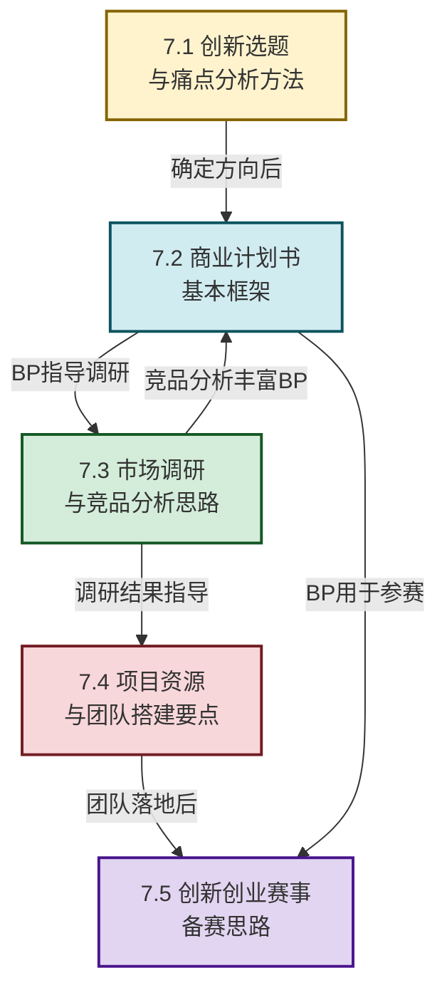

# MOC - 第7章 互联网创业与创新项目落地

> [!info] 本章定位
> 本章是互联网创新的**实践落地章**。它要回答的核心问题是：**从一个创意想法到一个真实创业项目，中间需要经历哪些关键步骤？如何选题、如何写商业计划书、如何做市场调研与竞品分析、如何搭建团队、如何在创新创业大赛中脱颖而出？** 本章将前面各章的产品方法论、商业模式、技术工具整合为一套完整的创业落地方法论，是将"知识"转化为"行动"的桥梁，为第8章前沿创新方向的学习提供实践视角。

## 学习路线图

## 知识点导航

| 小节 | 标题 | 核心内容 | 关键概念 |
| ---- | ---- | -------- | -------- |
| [[7.1 创新选题、痛点分析方法\|7.1]] | 创新选题与痛点分析 | 选题方法论、痛点挖掘、案例分析 | 选题三问、痛点三角、校园互助平台 |
| [[7.2 商业计划书基本框架\|7.2]] | 商业计划书框架 | BP核心要素、典型模板、案例分析 | BP九大板块、商业模式画布、融资计划 |
| [[7.3 市场调研、竞品分析思路\|7.3]] | 市场调研与竞品分析 | 调研方法、竞品分析框架、案例 | 波特五力、SWOT、外卖市场分析 |
| [[7.4 项目资源、团队搭建要点\|7.4]] | 项目资源与团队搭建 | 核心角色、资源获取、案例分析 | 创业三剑客、资源拼图、精益创业 |
| [[7.5 创新创业赛事备赛思路\|7.5]] | 创新创业赛事备赛 | 竞赛类型、评审标准、答辩技巧 | 互联网+、挑战杯、红枫奖 |

## 核心考点

> [!summary] 本章核心考点（8 点）
> 1. **选题方法论**：掌握"选题三问"（做什么？为谁做？凭什么做？）和痛点挖掘的五种方法（用户访谈、数据分析、竞品短板、趋势洞察、跨界迁移），理解好选题的三个标准——真实痛点、足够规模、可行落地；
> 2. **商业计划书核心要素**：BP 的九大板块（封面、摘要、问题、解决方案、市场、产品、商业模式、竞争、团队），其中**执行摘要**是 BP 的"电梯演讲"，决定了投资人是否继续阅读；
> 3. **市场调研方法体系**：区分二手调研（ Desk Research ）与一手调研（用户访谈、问卷调查、实地考察），理解样本选择、问卷设计、数据分析的核心要点；
> 4. **竞品分析框架**：掌握波特五力模型（行业竞争、供应商议价、买方议价、替代品威胁、新进入者威胁）和 SWOT 分析，能够构建竞品对比矩阵；
> 5. **团队搭建要点**：理解创业"三剑客"（CEO/CTO/COO）的角色分工，核心团队的互补性原则，以及早期团队的激励机制（股权、期权、使命感）；
> 6. **资源获取路径**：认识创业资源的六大类别（人、财、物、信息、关系、时间），理解"最小可行资源"原则和资源杠杆效应；
> 7. **创新创业赛事评审标准**：各大赛事（互联网+、挑战杯、红枫奖）的评审维度——创新性、可行性、商业价值、团队能力、社会效益；
> 8. **答辩技巧**：掌握"1+3+1"答辩结构（1个核心故事+3个支撑论点+1个行动呼吁），以及常见评委问题的应对策略。

## 章节导航

> [!nav] 导航
> 上级：[[MOC - 互联网创新|课程总览]]
> 上一章：[[MOC - 第6章|第6章 互联网安全、合规与治理]]
> 下一章：[[MOC - 第8章|第8章 互联网前沿创新方向]]
> 配套习题：[[MOC - 第7章习题|第7章 习题]]