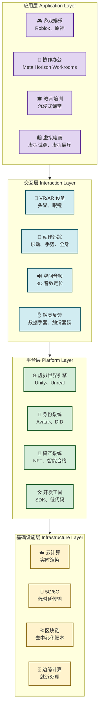

# 8.1 元宇宙、沉浸式互联网应用

> [!abstract] 本节概述
> 元宇宙是互联网从"二维信息空间"向"三维沉浸式空间"演进的重要方向。本节从元宇宙的定义与核心特征入手，解析沉浸感、交互性、持久性、去中心化四大支柱，通过 Mermaid 架构图展示元宇宙的技术栈与生态体系，并以 Roblox 和 Meta Horizon 为案例，分析当前元宇宙的两种主流实现路径与商业化探索。

## 一、元宇宙：互联网的下一次范式迁移

### 1.1 什么是元宇宙

> [!definition] 元宇宙（Metaverse）
> 元宇宙是一个**融合了虚拟现实（VR）、增强现实（AR）、互联网和实时交互**的三维虚拟世界。用户以数字化身（Avatar）的形式进入其中，进行社交、娱乐、工作、交易等活动，且这些活动不受物理世界限制，具有**持久性**——即使用户下线，虚拟世界依然持续运转。

**元宇宙概念的起源**：1992 年 Neal Stephenson 在科幻小说《雪崩》（Snow Crash）中首次提出"Metaverse"一词，描述了一个供人们逃避现实的虚拟三维空间。2021 年 Roblox 上市、Facebook 改名 Meta、英伟达发布 Omniverse，标志着元宇宙从科幻走向产业落地。

### 1.2 元宇宙的四大核心特征

| 特征 | 内涵 | 技术支撑 | 用户价值 |
| ---- | ---- | -------- | -------- |
| **沉浸感（Immersion）** | 感官被虚拟世界完全接管，产生"身临其境"的体验 | VR 头显、全景渲染、眼动追踪、触觉反馈 | 超越屏幕的体验边界，从"看"到"身在其中" |
| **交互性（Interactivity）** | 用户可以实时与虚拟环境、虚拟物品和其他用户互动 | 6DoF 追踪、手势识别、语音交互、物理引擎 | 从"浏览信息"到"操控世界"，参与感大幅提升 |
| **持久性（Persistence）** | 虚拟世界不受用户上下线影响，持续运转和演进 | 分布式服务器、云端同步、状态持久化存储 | 虚拟世界成为"另一个现实"，而非一次性体验 |
| **去中心化（Decentralization）** | 虚拟资产和身份由用户拥有，不被单一平台控制 | 区块链、NFT、分布式身份（DID）、智能合约 | 用户拥有数据主权，虚拟资产可跨平台流转 |

> [!info] 元宇宙 vs 传统虚拟世界
> 元宇宙与早期虚拟世界（如 Second Life、QQ 秀）的核心区别在于：
> - **规模不同**：元宇宙面向数亿乃至数十亿用户，传统虚拟世界仅服务百万级
> - **交互深度不同**：元宇宙支持自然的肢体交互和多感官体验，传统虚拟世界依赖键鼠
> - **资产确权不同**：元宇宙通过区块链实现虚拟资产的确权和自由交易，传统虚拟世界的资产归平台所有
> - **开放程度不同**：元宇宙强调跨平台互通，传统虚拟世界是封闭的"花园"

## 二、元宇宙技术架构

### 2.1 技术栈全景

### 2.2 关键技术解析

> [!tip] 元宇宙的"技术栈拼图"
> 元宇宙并不是某一项技术的突破，而是多种技术的**融合**：
>
> | 技术领域 | 核心作用 | 代表技术 |
> | -------- | -------- | -------- |
> | **沉浸渲染** | 生成逼真的三维虚拟环境 | Unreal Engine 5 的 Nanite 几何体、Lumen 全局光照 |
> | **实时交互** | 捕捉用户动作并实时反馈 | Meta Quest 的 Hand Tracking、苹果 Vision Pro 的 EyeSight |
> | **网络传输** | 低延迟、高带宽的内容传输 | 5G 毫米波、6G 卫星通信 |
> | **资产确权** | 虚拟物品的所有权证明和交易 | Ethereum、Solana、Polygon、OpenSea |
> | **跨平台互通** | 不同虚拟世界之间的互联互通 | OpenXR、互操作协议（Interoperability Protocol） |

## 三、两大主流元宇宙路径

### 3.1 Roblox：UGC 驱动的"少年元宇宙"

> [!example] Roblox 模式解析
>
> Roblox 是当前全球用户量最大的元宇宙平台（月活跃用户超过 **7000 万**），其核心模式是 **UGC（用户生成内容）驱动**：
>
> | 维度 | 具体表现 |
> | ---- | -------- |
> | **用户画像** | 核心用户为 17 岁以下青少年（占比超 60%），全球 Z 世代聚集地 |
> | **内容生产** | 超过 **1000 万** 创作者在 Roblox Studio 中开发虚拟场景和游戏 |
> | 经济系统 | Robux 虚拟货币体系，创作者可通过作品获取收入 |
> | 交互方式 | 以虚拟化身（Avatar）的形式在虚拟空间中社交、玩耍、创作 |
> | 商业化 | 游戏内虚拟物品销售、品牌合作（如 Nike 虚拟球鞋、Gucci 虚拟手袋） |
>
> **核心优势**：Roblox 通过"低门槛创作工具 + 虚拟经济激励"形成了强大的内容生态网络效应——越多创作者→越多内容→越多用户→吸引更多创作者。
>
> **局限**：去中心化程度有限（资产不互通），内容质量参差不齐，成人用户转化率较低。

### 3.2 Meta Horizon：软硬件一体化的"成人元宇宙"

> [!example] Meta Horizon 模式解析
>
> Meta（原 Facebook）选择了"**硬件 + 软件 + 社交**"一体化的元宇宙路径：
>
> | 维度 | 具体表现 |
> | ---- | -------- |
> | **硬件入口** | Meta Quest 系列 VR 头显（全球累计出货超 **2000 万台**） |
> | **软件平台** | Horizon Worlds（虚拟社交空间）、Horizon Workrooms（虚拟办公）、Horizon Venues（虚拟活动） |
> | **核心体验** | Presence（临场感）——用户无需头显也能通过手机视频加入虚拟空间 |
> | 社交生态 | 依托 Facebook 29 亿用户基础，从熟人社交切入元宇宙 |
> | 商业化策略 | 硬件亏损销售（Quest 3 售价低于成本），内容和服务盈利 |
>
> **核心优势**：软硬件深度整合带来极致体验，Facebook 社交基因降低了冷启动门槛。
>
> **挑战**：硬件渗透率仍然较低，内容生态相对封闭，用户留存率有待提升。

### 3.3 两种路径对比

| 对比维度 | Roblox | Meta Horizon |
| -------- | ------ | ------------ |
| **目标用户** | 青少年为主 | 全年龄段，侧重成人 |
| **核心驱动力** | UGC 内容生态 | 软硬件一体化体验 |
| **入口设备** | 多平台（PC、移动、VR） | Quest VR 头显为主 |
| **去中心化** | 低（封闭经济体系） | 低（封闭生态） |
| **社交基因** | 兴趣社交 | 熟人社交 |
| **商业化** | 虚拟物品 + 品牌合作 | 硬件 + 订阅 + 企业服务 |
| **用户规模** | ~7000 万 DAU | ~1000 万 DAU |
| **技术壁垒** | 低（跨平台部署） | 高（硬件 + 空间计算技术） |

## 四、元宇宙的挑战与展望

### 4.1 当前面临的核心挑战

> [!warning] 元宇宙的四大"落地鸿沟"
>
> | 挑战 | 具体表现 | 严重程度 |
> | ---- | -------- | -------- |
> | **硬件鸿沟** | VR 头显价格仍较高（Quest 3 约 500 美元），重量和舒适度有待改善 | ⭐⭐⭐⭐ |
> | **内容鸿沟** | 高质量内容稀缺，大部分虚拟世界缺乏足够的"可玩性"和"可逛性" | ⭐⭐⭐⭐⭐ |
> | **互通鸿沟** | 不同元宇宙平台之间几乎无法互通，虚拟资产和身份无法跨平台使用 | ⭐⭐⭐⭐ |
> | **治理鸿沟** | 虚拟世界中的违法犯罪、内容审核、未成年人保护等问题尚无成熟解决方案 | ⭐⭐⭐ |

### 4.2 未来发展趋势

> [!note] 元宇宙的三个演进方向
>
> 1. **轻量化入口**：VR 头显将变得更轻、更便宜，AR 眼镜（如苹果 Vision Pro）将成为日常穿戴设备，元宇宙从"专用设备"走向"通用设备"
> 2. **AI 原生内容**：生成式 AI 将赋能元宇宙内容生产——用户用自然语言即可生成虚拟场景、虚拟物品甚至虚拟人物，大幅降低创作门槛
> 3. **Web3 互操作**：基于区块链的去中心化身份（DID）和跨链资产协议将实现元宇宙之间的互通，用户可以带着自己的虚拟身份和资产自由穿梭于不同虚拟世界

## 五、与其他小节的联系

- 元宇宙的沉浸感依赖 [[3.1 云计算、虚拟化与资源共享|云计算]] 的实时渲染能力和 [[3.3 物联网与万物互联应用|物联网]] 的多感官数据采集
- 元宇宙的去中心化属性与 [[3.5 区块链基础与互联网价值创新|区块链]] 技术密不可分
- 元宇宙中的内容生产将深度依赖 [[8.2 生成式 AI 驱动互联网产品变革|生成式 AI]] 实现低成本创作
- 元宇宙的低延迟交互需要 [[8.3 边缘计算、分布式网络创新|边缘计算]] 的就近处理能力支撑

## 章节导航

- 上一级：[[MOC - 第8章]]
- 下一节：[[8.2 生成式 AI 驱动互联网产品变革]]
- 习题：[[MOC - 第8章习题]]