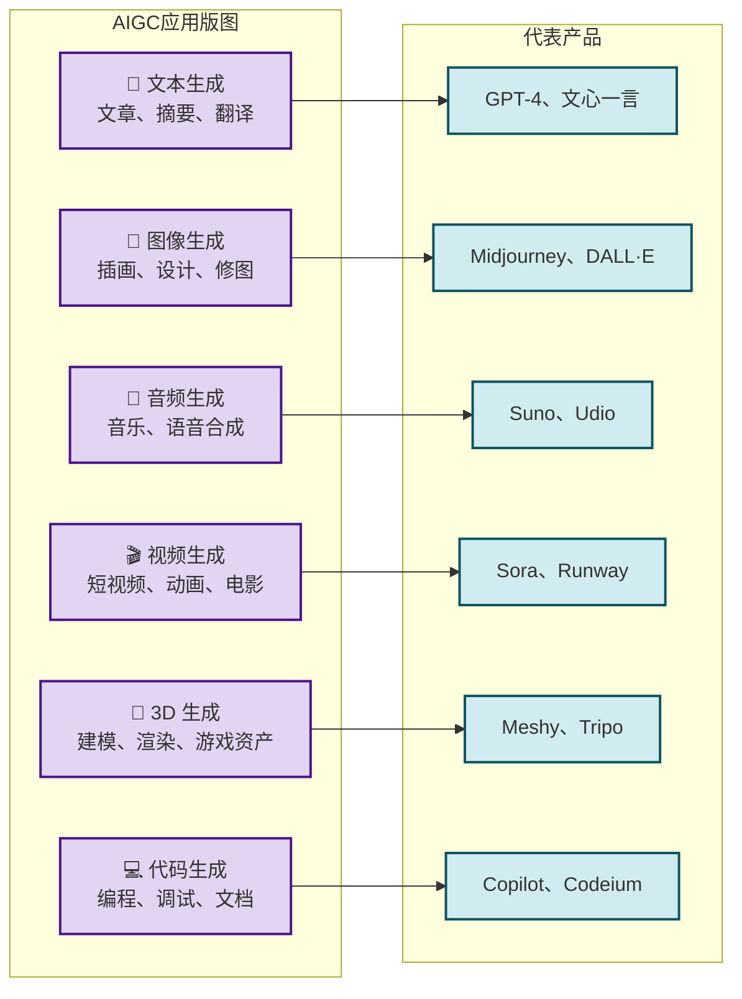
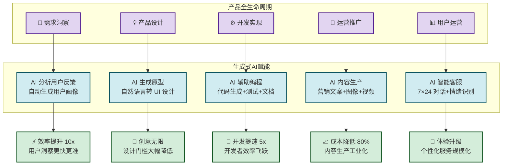

# 8.2 生成式 AI 驱动互联网产品变革

> [!abstract] 本节概述
> 生成式 AI 是继 Web2.0 之后互联网最深刻的技术变革。本节从生成式 AI 的技术原理切入，解析 AIGC（AI 生成内容）的六大应用领域，重点探讨 AI Agent 如何从"工具"演进为"自主智能体"，通过 Mermaid 赋能链路图展示生成式 AI 如何重塑互联网产品的全生命周期，并以 Sora、Midjourney、AutoGPT 为案例分析其商业化路径。

## 一、生成式 AI：互联网的"内容工业革命"

### 1.1 什么是生成式 AI

> [!definition] 生成式 AI（Generative AI）
> 生成式 AI 是指能够**基于训练数据学习其分布规律，并生成与训练数据具有相似特征但全新的内容**的人工智能技术。与传统 AI（判别式 AI，用于分类和预测）不同，生成式 AI 的核心能力是"**创造**"——生成文本、图像、音频、视频乃至代码等多种模态的内容。

**生成式 AI 的技术基础**：

| 技术类型 | 核心原理 | 代表模型 | 生成能力 |
| -------- | -------- | -------- | -------- |
| **大语言模型（LLM）** | 基于 Transformer 架构，通过海量文本预训练学习语言规律 | GPT-4、Claude 3、文心一言、通义 | 文本生成、对话、代码、翻译、推理 |
| **扩散模型（Diffusion）** | 从噪声逐步"去噪"生成高质量图像/视频 | DALL·E 3、Midjourney、Stable Diffusion、Sora | 图像、视频、3D 模型生成 |
| **生成对抗网络（GAN）** | 生成器与判别器的对抗训练 | StyleGAN、CycleGAN | 图像风格迁移、人脸生成 |
| **变分自编码器（VAE）** | 学习数据的隐变量分布 | — | 数据压缩、异常检测 |

> [!info] 生成式 AI 的演进时间线
>
> | 时间 | 里程碑 | 意义 |
> | ---- | ------ | ---- |
> | 2014 | GAN 模型诞生 | 首次实现高质量图像生成 |
> | 2018 | BERT 发布 | NLP 进入预训练时代 |
> | 2020 | GPT-3 发布（1750 亿参数） | 大模型展示通用语言能力 |
> | 2022 | Stable Diffusion 开源 | AI 图像生成走向大众 |
> | 2023 | GPT-4、Sora 发布 | 多模态能力涌现，视频生成突破 |
> | 2024 | Sora 视频、Claude 3 Opus | 长视频生成、Agent 能力增强 |

### 1.2 生成式 AI vs 传统 AI

| 对比维度 | 传统 AI（判别式） | 生成式 AI |
| -------- | ---------------- | -------- |
| **核心任务** | 分类、预测、识别 | 生成、创造、合成 |
| **输入输出** | 输入数据→输出标签 | 输入提示→输出全新内容 |
| **数据需求** | 需要标注数据 | 主要用无标注数据预训练 |
| **应用场景** | 人脸识别、垃圾邮件过滤、推荐系统 | 内容创作、智能对话、代码生成 |
| **产品形态** | "助手"——辅助人类完成任务 | "合作者"——独立完成创作任务 |
| **商业模式** | 嵌入式功能（API、SDK） | 原生应用（Chat、创作工具、Agent） |

## 二、AIGC：内容生产的全模态变革

### 2.1 AIGC 的六大应用领域

> [!definition] AIGC（AI-Generated Content）
> 由生成式 AI 模型自动生成的内容，涵盖文本、图像、音频、视频、3D 模型和代码等多种模态，是继 UGC（用户生成内容）、PGC（专业生成内容）之后的第三种内容生产方式。

### 2.2 三大标杆产品解析

> [!example] Sora：文本到视频的突破
>
> 美国 OpenAI 推出的 Sora 是全球首个能够生成**长达 60 秒高质量视频**的生成式 AI 模型：
> - **核心能力**：用户通过自然语言描述（如"一位瑜伽教练在樱花树下晨练，镜头环绕拍摄"），即可生成对应视频
> - **技术亮点**：基于 Transformer 架构统一处理文本和视频，支持多镜头、多角色、多场景的复杂视频生成
> - **产业意义**：将视频制作从"专业团队 + 数月周期"压缩到"一句话 + 几分钟"，催生了"AI 视频制作师"这一新兴职业
> - **商业模式**：通过 API 开放给开发者，按生成时长计费

> [!example] Midjourney：AI 图像创作工具
>
> Midjourney 是目前用户量最大的 AI 图像生成工具（通过 Discord 提供服务，注册用户超 **1500 万**）：
> - **核心能力**：将文本描述转化为高质量艺术图像，支持风格化（油画、水彩、赛博朋克等）
> - **创作流程**：用户输入 Prompt（提示词）→ Midjourney 生成 4 张候选图→ 用户选择/迭代→ 最终成品
> - **社区生态**：Discord 社区中用户分享 Prompt 和作品，形成了活跃的"提示词工程（Prompt Engineering）"文化
> - **商业模式**：订阅制（$10-$60/月），企业版提供定制化模型训练

> [!example] AutoGPT：自主任务执行的 AI Agent
>
> AutoGPT 是开源社区推出的**自主 AI Agent**项目，标志着 AI 从"工具"到"智能体"的跨越：
> - **核心理念**：给定一个目标（如"帮我研究竞品并整理报告"），AutoGPT 能自主分解任务、调用工具（浏览器、文件、API）、迭代执行，最终交付结果
> - **技术架构**：LLM 作为大脑 + 工具调用模块 + 长期记忆系统 + 任务规划器
> - **产业意义**：AI Agent 正在成为"数字员工"，可以 7×24 小时不间断工作，完成复杂的多步骤任务
> - **挑战**：执行稳定性有待提升，成本控制和安全治理是当前核心难题

## 三、生成式 AI 如何重塑互联网产品

### 3.1 赋能链路全景

### 3.2 AI Agent：从工具到智能体的跃迁

> [!definition] AI Agent（AI 智能体）
> AI Agent 是一种能够**自主感知环境、进行决策、执行动作**以达成特定目标的 AI 系统。与传统 AI 工具（被动响应用户指令）不同，AI Agent 具备主动性——它能够自主规划任务、调用工具、从经验中学习。

**AI Agent 的核心能力矩阵**：

| 能力 | 内涵 | 技术支撑 | 应用场景 |
| ---- | ---- | -------- | -------- |
| **规划（Planning）** | 将复杂目标分解为可执行的子任务 | 链式思维（CoT）、任务分解算法 | 自动撰写商业计划书、竞品分析 |
| **工具使用（Tool Use）** | 调用外部工具（浏览器、计算器、API） | 函数调用（Function Calling）、API 编排 | 自动订票、自动数据分析 |
| **记忆（Memory）** | 存储和检索历史交互信息 | 向量数据库、长期记忆机制 | 个性化助手、会话上下文保持 |
| **反思（Reflection）** | 对执行结果进行评估和自我修正 | 自我评估算法、强化学习 | 自动优化方案、错误自修复 |
| **协作（Collaboration）** | 与其他 Agent 或人类协作 | 多 Agent 通信协议、人机对话 | 团队协作、复杂项目管理 |

### 3.3 三种典型的 AI Agent 产品形态

| 形态 | 代表产品 | 核心价值 | 用户交互方式 |
| ---- | -------- | -------- | ------------ |
| **对话式 Agent** | ChatGPT、Claude、文心一言 | 自然语言交互，解决各类知识问题 | 单轮/多轮对话 |
| **任务式 Agent** | AutoGPT、Devin、Cursor | 给定目标，自主完成多步骤任务 | 目标导向，过程透明 |
| **嵌入式 Agent** | Copilot、Grammarly、Notion AI | 嵌入现有工作流，提供智能辅助 | 按需触发，无缝集成 |

## 四、生成式 AI 的挑战与展望

### 4.1 核心挑战

> [!warning] 生成式 AI 的五大风险
>
> | 风险类别 | 具体表现 | 影响范围 |
> | -------- | -------- | -------- |
> | **内容安全** | 生成虚假信息、恶意内容、偏见内容 | 社会稳定、公共秩序 |
> | **知识产权** | 训练数据的版权归属不明确，生成物的版权保护 | 创作者权益、商业模式 |
> | **模型幻觉** | AI 生成看似合理但实际错误的内容 | 专业领域（医疗、法律） |
> | **数据隐私** | 训练数据可能包含个人敏感信息 | 用户隐私权 |
> | **算力能耗** | 大模型训练和推理消耗大量电力和计算资源 | 环境可持续性 |

### 4.2 未来趋势

> [!tip] 生成式 AI 的三个发展方向
>
> 1. **从单模态到全模态**：AI 将同时理解和生成文本、图像、视频、3D、音频等多种模态，实现"一个模型，万物可生"
> 2. **从工具到 Agent 到员工**：AI Agent 将成为企业的"数字员工"，7×24 小时自主工作，承担越来越复杂的业务任务
> 3. **从通用到垂直**：通用大模型将与行业数据结合，孵化医疗 AI、法律 AI、教育 AI 等垂直领域的专家级 AI 产品

## 五、与其他小节的联系

- 生成式 AI 是 [[3.4 人工智能赋能互联网产品|人工智能]] 赋能互联网的核心技术突破
- 生成式 AI 与 [[8.1 元宇宙、沉浸式互联网应用|元宇宙]] 结合，将实现 AI 原生虚拟世界——用户用自然语言即可创造虚拟场景
- 生成式 AI 的算力需求推动 [[8.3 边缘计算、分布式网络创新|边缘计算]] 的发展，实现低延迟的 AI 推理
- 生成式 AI 的开源化趋势与 [[8.4 开源生态与社区创新模式|开源生态]] 深度关联，形成了活跃的 AI 开源社区

## 章节导航

- 上一级：[[MOC - 第8章]]
- 上一节：[[8.1 元宇宙、沉浸式互联网应用]]
- 下一节：[[8.3 边缘计算、分布式网络创新]]
- 习题：[[MOC - 第8章习题]]