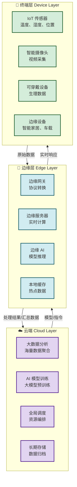

# 8.3 边缘计算、分布式网络创新

> [!abstract] 本节概述
> 边缘计算是互联网架构从"中心化"向"分布式"演进的核心技术。本节对比边缘计算与云计算的差异，解析边缘计算的三层架构（云-边-端），通过 Mermaid 架构图展示数据从源头到云端的完整处理链路，并以智能边缘和 CDN 为案例，说明边缘计算如何支撑低延迟、高并发的新型互联网应用。

## 一、从云计算到边缘计算：架构范式的迁移

### 1.1 为什么需要边缘计算

> [!note] 云计算的"最后一公里"瓶颈
>
> 传统云计算模式将所有数据集中传输到云端处理，面临三大挑战：
>
> | 挑战 | 具体表现 | 影响程度 |
> | ---- | -------- | -------- |
> | **带宽压力** | 全球 IoT 设备数量已超 **150 亿**，每天产生的数据量达 **2.5 EB**，全部传输到云端将导致网络拥堵 | ⭐⭐⭐⭐⭐ |
> | **时延问题** | 视频通话、在线游戏、工业控制等场景要求端到端时延低于 **20ms**，云端处理的网络往返无法满足 | ⭐⭐⭐⭐⭐ |
> | **隐私风险** | 敏感数据（如医疗数据、摄像头画面）传输到云端处理存在隐私泄露风险 | ⭐⭐⭐⭐ |

> [!definition] 边缘计算（Edge Computing）
> 边缘计算是将**计算、存储和网络资源下沉到数据源附近**的网络架构。数据不再需要全部传输到云端处理，而是在"边缘节点"（如基站、路由器、网关、边缘服务器）就近完成处理，仅将必要的结果或汇总数据上传云端。

### 1.2 边缘计算 vs 云计算

| 对比维度 | 云计算（Cloud） | 边缘计算（Edge） |
| -------- | --------------- | ---------------- |
| **数据处理位置** | 中心化数据中心 | 数据源附近的边缘节点 |
| **时延** | 高（100ms-秒级） | 低（1-20ms） |
| **带宽占用** | 高（原始数据全量传输） | 低（仅传输处理结果） |
| **计算能力** | 极强（GPU 集群、超级计算） | 有限（嵌入式芯片、轻量模型） |
| **数据量** | 适合海量数据集中处理 | 适合实时数据就地处理 |
| **隐私性** | 数据离开本地，存在风险 | 数据在本地处理，隐私性好 |
| **可靠性** | 依赖网络连接，断网即停 | 离线也可运行，韧性强 |
| **典型场景** | 大数据分析、AI 模型训练、海量存储 | 实时视频分析、工业 IoT、自动驾驶 |

> [!tip] 互补关系而非替代关系
> 边缘计算与云计算是**互补**关系，不是替代关系。实践中通常采用"**云-边-端**"三层协同架构：
> - **端**（Device）：数据采集源头，负责原始数据采集和简单预处理
> - **边**（Edge）：就近处理节点，负责实时分析和快速响应
> - **云**（Cloud）：中心化处理节点，负责全局分析和模型训练
>
> 一个形象的比喻：云计算是"总部"，边缘计算是"地方办事处"，终端设备是"前线员工"——前线员工在地方办事处处理日常事务，总部只处理需要全局协调的重大决策。

## 二、边缘计算架构

### 2.1 三层协同架构图

### 2.2 关键技术组件

| 组件 | 功能 | 代表技术/产品 |
| ---- | ---- | ------------- |
| **边缘网关** | 协议转换、数据预处理、设备管理 | AWS Greengrass、Azure IoT Edge、华为 Hi3861 |
| **边缘服务器** | 运行容器化应用、提供实时服务 | 5G 基站边缘单元、CDN 边缘节点、边缘 AI 盒子 |
| **边缘 AI** | 在边缘端运行轻量化 AI 模型 | TensorFlow Lite、ONNX Runtime、NCNN |
| **边缘数据库** | 本地数据缓存和查询 | SQLite、RocksDB、时序数据库 |
| **边缘编排** | 边缘应用的部署和管理 | Kubernetes Edge、KubeEdge、OpenYurt |

### 2.3 MEC：5G 时代的边缘计算

> [!definition] MEC（Multi-Access Edge Computing）
> MEC 是欧洲电信标准协会（ETSI）提出的**多接入边缘计算**架构，将云计算能力下沉到 5G 基站侧，为用户提供低时延（<20ms）、高带宽的实时服务。

**MEC 的应用场景**：

| 场景 | 时延要求 | MEC 的作用 | 业务价值 |
| ---- | -------- | ---------- | -------- |
| **工业互联网** | <10ms | 实时控制工业机器人，检测产品缺陷 | 提升生产效率和质量 |
| **车联网** | <20ms | 实时车辆通信和防撞预警 | 提升驾驶安全 |
| **AR/VR 云渲染** | <20ms | 在边缘端渲染高质量画面，终端轻量化 | 降低硬件门槛，提升体验 |
| **智慧医疗** | <50ms | 实时监控患者生命体征，远程手术指导 | 提升医疗响应速度 |

## 三、边缘计算的典型应用案例

### 3.1 智能边缘：工业互联网的边缘实践

> [!example] 某汽车制造工厂的边缘计算部署
>
> **痛点**：工厂有 **2000+ 台工业设备**，每秒产生 **50 万条** 传感器数据。传统方式将数据全部传输到云端分析，导致网络拥堵、响应延迟。
>
> **边缘计算方案**：
>
> | 层级 | 部署内容 | 处理逻辑 |
> | ---- | -------- | -------- |
> | **端层** | 每个设备加装边缘传感器 | 采集温度、振动、电流等原始数据 |
> | **边层** | 车间部署 5 台边缘服务器 | 实时分析设备数据，检测异常（温度过高、振动异常） |
> | **云层** | 集团数据中心 | 汇总各车间边缘数据，进行全局设备维护规划 |
>
> **效果**：
> - 数据传输量减少 **85%**（仅异常数据和汇总数据上传云端）
> - 设备故障检测时延从 **分钟级** 降至 **秒级**
> - 设备故障率降低 **30%**，维护成本降低 **40%**

### 3.2 CDN：边缘计算的"鼻祖级"应用

> [!example] CDN（内容分发网络）
>
> CDN 是边缘计算思想的最早、最成功的商业化应用。全球 CDN 市场规模超 **300 亿美元**：
>
> | 维度 | 说明 |
> | ---- | ---- |
> | **核心原理** | 将网站内容（图片、视频、静态文件）缓存到全球各地的边缘节点，用户就近获取 |
> | **技术本质** | 边缘计算的一种形态——边缘节点就是"缓存服务器" |
> | **代表企业** | Cloudflare（全球 300+ 节点）、Akamai、阿里云 CDN、腾讯云 CDN |
> | **性能提升** | 网站加载速度提升 **5-10 倍**，源站压力降低 **90%** |
> | **新趋势** | CDN 正在向"边缘计算平台"演进——Cloudflare Workers、阿里云 Edge Functions 允许开发者在 CDN 节点上运行自定义代码，实现更灵活的边缘逻辑 |

### 3.3 边缘 AI 案例：智能安防

> [!example] 边缘 AI 在智能安防中的应用
>
> 传统安防系统将摄像头视频全部上传云端分析，面临带宽和隐私双重压力。边缘 AI 方案：
>
> | 对比项 | 传统云端方案 | 边缘 AI 方案 |
> | ------ | ------------ | ------------ |
> | 视频处理位置 | 云端数据中心 | 摄像头本地（边缘 AI 芯片） |
> | 带宽需求 | 1080P 视频全量上传 | 仅上传事件告警（<10KB） |
> | 响应时延 | 3-5 秒 | <200ms |
> | 隐私保护 | 视频全部离开本地 | 视频在本地处理，不上传 |
> | 存储成本 | 云端海量存储 | 本地存储 7-30 天 |
>
> **代表产品**：海康威视的"明眸"边缘 AI 摄像机、大华股份的边缘 AI 网关

## 四、分布式网络创新

### 4.1 从中心化到分布式

> [!info] 互联网架构的演进趋势
>
> | 阶段 | 架构特征 | 代表技术 |
> | ---- | -------- | -------- |
> | **Web1.0** | 中心化：门户网站集中发布内容 | HTTP、DNS、CDN |
> | **Web2.0** | 半去中心化：用户生成内容，平台集中管理 | Web 2.0、云计算、大数据 |
> | **Web3.0** | 分布式：用户拥有数据，点对点交互 | 区块链、边缘计算、联邦学习 |
> | **Web4.0（展望）** | 全分布式：AI Agent 自主协作的网络 | 6G、空间计算、AI Agent 网络 |

### 4.2 分布式计算的新兴方向

| 方向 | 核心思想 | 技术支撑 | 应用场景 |
| ---- | -------- | -------- | -------- |
| **联邦学习** | 数据不动，模型动——在本地训练模型，仅上传模型参数 | 联邦学习框架（FATE、TensorFlow Federated） | 医疗数据联合建模、风控联合建模 |
| **区块链计算** | 去中心化的账本和计算能力 | Ethereum、Solana、Polkadot | 去中心化金融（DeFi）、NFT、DAO |
| **P2P 计算** | 利用闲置的个人设备算力进行分布式计算 | BOINC、Folding@home、分布式渲染 | 科学计算、药物研发、3D 渲染 |
| **服务网格（Service Mesh）** | 微服务之间的分布式通信和治理 | Istio、Linkerd、Envoy | 云原生应用的服务治理 |

## 五、边缘计算的挑战与展望

### 5.1 核心挑战

> [!warning] 边缘计算的落地挑战
>
> | 挑战 | 说明 | 解决思路 |
> | ---- | ---- | -------- |
> | **标准不统一** | 各厂商的边缘计算平台互不兼容 | 推动 ETSI、3GPP 等标准化组织制定统一标准 |
> | **应用开发门槛高** | 边缘应用需要同时考虑云端和边缘的协同 | 低代码/无代码边缘开发平台、Serverless Edge |
> | **安全风险** | 边缘节点分散，物理安全和网络安全更难保障 | 边缘安全框架、可信执行环境（TEE） |
> | **运维复杂** | 成千上万的边缘节点的运维和升级 | 自动化运维、远程管理、边缘编排 |
> | **商业模式不清晰** | 边缘计算的价值如何定价和变现 | 按调用计费、设备买断+订阅、SLA 服务分级 |

### 5.2 未来展望

> [!tip] 边缘计算的三个演进方向
>
> 1. **边缘智能**：边缘设备将具备越来越强的 AI 能力，实现"AI 即边缘"——每一个边缘节点都是一个 AI 推理引擎
> 2. **边缘原生应用**：将出现一大批为边缘计算量身打造的应用——云游戏、实时协作、智能工厂、车联网
> 3. **空间计算融合**：边缘计算将与空间计算（如苹果 Vision Pro）融合，实现"计算随空间而动"——用户走到哪里，计算能力就到哪里

## 六、与其他小节的联系

- 边缘计算是 [[3.1 云计算、虚拟化与资源共享|云计算]] 的延伸和补充，形成"云-边-端"的协同架构
- 边缘计算的实时处理能力支撑 [[8.1 元宇宙、沉浸式互联网应用|元宇宙]] 中的低延迟交互
- 边缘计算的分布式属性与 [[3.5 区块链基础与互联网价值创新|区块链]] 的去中心化理念相互呼应
- 边缘计算的低功耗需求与 [[8.5 绿色低碳互联网发展方向|绿色低碳互联网]] 的节能目标一致

## 章节导航

- 上一级：[[MOC - 第8章]]
- 上一节：[[8.2 生成式 AI 驱动互联网产品变革]]
- 下一节：[[8.4 开源生态与社区创新模式]]
- 习题：[[MOC - 第8章习题]]