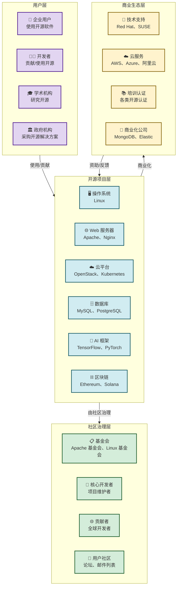

# 8.4 开源生态与社区创新模式

> [!abstract] 本节概述
> 开源不仅是一种软件开发模式，更是一种互联网时代的创新范式。本节从开源的核心理念与发展脉络入手，解析六种主流开源商业模式，探讨开源社区的治理结构与激励机制，通过 Mermaid 生态图展示开源生态的参与主体与价值流转，并以 Linux、Apache 和区块链开源为案例，说明开源如何驱动互联网的底层创新。

## 一、开源：从软件开发模式到创新范式

### 1.1 什么是开源

> [!definition] 开源（Open Source）
> 开源是一种**软件发布模式**，其核心特征是：软件的源代码对外公开，任何人都可以免费使用、修改、分发。开源不仅是一种技术开发方式，更是一种**协作哲学和创新范式**——它打破了传统的"封闭开发→授权使用"模式，构建了"开放协作→共享成果"的新型创新体系。

**开源发展的关键里程碑**：

| 时间 | 事件 | 意义 |
| ---- | ---- | ---- |
| 1991 | Linus Torvalds 发布 Linux 内核 | 开源操作系统的开端 |
| 1998 | 网景发布 Mozilla 浏览器源代码 | 开源进入主流商业领域 |
| 1999 | Apache HTTP Server 成为全球最流行的 Web 服务器 | 开源在基础设施领域确立地位 |
| 2008 | GitHub 上线 | 开源协作的社交化平台 |
| 2014 | Docker 开源容器技术 | 开源推动云原生革命 |
| 2018 | 以太坊开源 | 区块链成为重要的开源生态 |
| 2022 | 开源大模型（如 LLaMA、Alpaca）涌现 | AI 时代的开源新浪潮 |

### 1.2 开源 vs 闭源

| 对比维度 | 闭源模式 | 开源模式 |
| -------- | -------- | -------- |
| **源代码** | 不公开 | 公开 |
| **使用限制** | 需要付费授权 | 免费使用 |
| **修改权限** | 不能修改 | 可以修改 |
| **协作方式** | 公司内部开发 | 全球开发者协作 |
| **创新速度** | 慢（依赖内部团队） | 快（全球智慧） |
| **质量保障** | 厂商质保 | 社区共治 |
| **生态控制** | 厂商主导 | 社区主导 |
| **商业模式** | 许可证费 + 维护费 | 服务、支持、云托管、商业化 |

> [!info] 开源的"自由"含义
> 开源软件遵循 **自由软件四自由**（由 Richard Stallman 提出）：
> 1. **自由 0**：可以为任何目的运行程序
> 2. **自由 1**：可以研究程序如何工作，并修改它
> 3. **自由 2**：可以重新发布副本，帮助他人
> 4. **自由 3**：可以发布修改后的版本，让社区受益
>
> 开源不是"免费"（Free as in "Free Speech"，不是"Free Beer"），它允许商业化，但必须保障上述自由。

## 二、开源生态体系

### 2.1 开源生态全景图

### 2.2 开源的商业价值

> [!tip] 开源的"商业悖论"
> 开源软件虽然"免费"，但已成为全球数字经济的**基础设施**：
> - 全球超 **90%** 的服务器运行 Linux
> - 全球超 **70%** 的网站使用 Apache 或 Nginx
> - 全球超 **80%** 的云原生应用运行在 Kubernetes 上
> - 全球超 **60%** 的区块链项目基于开源协议
>
> 开源每年为全球经济贡献的价值估算超过 **5000 亿美元**（据 Linux 基金会研究报告）

## 三、开源商业模式

### 3.1 六种主流开源商业模式

| 模式 | 核心思路 | 代表企业/项目 | 收入来源 |
| ---- | -------- | ------------ | -------- |
| **服务支持模式** | 软件免费，付费提供技术支持和咨询 | Red Hat（IBM 以 $340 亿收购）、SUSE | 年度订阅费、支持服务 |
| **云托管模式** | 软件免费，付费提供云端托管服务 | MongoDB Atlas、Elastic Cloud、Confluent Cloud | 云服务订阅费 |
| **双许可证模式** | 社区版免费，企业版收费（功能/安全性增强） | Elasticsearch、GitLab、MongoDB | 企业版许可证费 |
| **核心开源+附加商业** | 核心开源，周边商业化（插件、集成、增值功能） | WordPress（主题/插件市场）、Splunk | 增值产品和服务 |
| **开源+硬件** | 软件开源，硬件/设备收费 | 树莓派（Raspberry Pi）、Arduino | 硬件销售 |
| **基金会资助模式** | 非营利基金会运作，接受企业和个人捐赠 | Apache 基金会、Linux 基金会、Mozilla | 捐赠、赞助、认证 |

### 3.2 商业模式对比分析

| 模式 | 盈利稳定性 | 规模化能力 | 社区友好度 | 适用场景 |
| ---- | ---------- | ---------- | ---------- | -------- |
| 服务支持 | ⭐⭐⭐⭐ | ⭐⭐⭐ | ⭐⭐⭐⭐⭐ | 基础设施软件、企业级软件 |
| 云托管 | ⭐⭐⭐⭐⭐ | ⭐⭐⭐⭐⭐ | ⭐⭐⭐⭐ | 云原生应用、开发者工具 |
| 双许可证 | ⭐⭐⭐⭐ | ⭐⭐⭐⭐ | ⭐⭐⭐ | 需要持续研发投入的软件 |
| 核心+附加 | ⭐⭐⭐ | ⭐⭐⭐ | ⭐⭐⭐⭐⭐ | 生态型软件、CMS |
| 开源+硬件 | ⭐⭐⭐ | ⭐⭐⭐ | ⭐⭐⭐⭐ | IoT 设备、开发板 |
| 基金会 | ⭐⭐ | ⭐⭐ | ⭐⭐⭐⭐⭐ | 公共基础设施、标准项目 |

## 四、开源社区治理

### 4.1 社区治理结构

> [!definition] 开源社区治理
> 开源社区的治理核心是**如何在没有强制权力的情况下，协调全球分散的贡献者，保持项目的长期健康发展**。

**三种典型的治理模式**：

| 治理模式 | 核心特征 | 代表项目 | 优点 | 挑战 |
| -------- | -------- | -------- | ---- | ---- |
| **仁慈独裁者模式（BDFL）** | 由创始人终身担任最终决策者 | Linux（Linus Torvalds）、Python（Guido van Rossum） | 决策高效、方向明确 | 依赖个人威望、可能出现"独裁者"问题 |
| **基金会治理模式** | 由非营利基金会托管，董事会决策 | Apache 基金会、Linux 基金会、Mozilla | 制度化、可持续、避免个人依赖 | 决策流程较慢、可能脱离社区 |
| **精英治理模式** | 贡献越多，话语权越大 | Apache 项目、许多 GitHub 项目 | 激励贡献者、公平透明 | 可能形成精英集团、新贡献者门槛高 |

### 4.2 社区激励机制

> [!info] 开源社区的激励体系
>
> 开源社区的参与者动机多样，有效激励需要"**内在动机+外在激励**"结合：
>
> | 动机类型 | 具体表现 | 激励方式 |
> | -------- | -------- | -------- |
> | **内在动机** | 学习新技术、获得成就感、表达创意 | 贡献者排行榜、徽章、荣誉称号 |
> | **职业发展** | 提升简历价值、获得工作机会 | GitHub 贡献档案、开源经验认证 |
> | **商业利益** | 商业公司雇员在工作时间贡献开源 | 企业支持开源项目、捐赠、赞助 |
> | **利他主义** | 认为开源是正确的理念 | 社区文化建设、理念传播 |
> | **技术影响力** | 希望自己的代码被广泛使用 | 合并请求（PR）被接受、代码被引用 |

## 五、典型案例分析

### 5.1 Linux：开源基础设施的标杆

> [!example] Linux 的成功密码
>
> Linux 是全球最成功的开源项目之一，内核代码量超 **3000 万行**，贡献者超 **50000 人**：
>
> | 维度 | 具体表现 |
> | ---- | -------- |
> | **治理模式** | BDFL（仁慈独裁者）+ 分层维护者体系 |
> | **贡献构成** | 个人贡献者（40%）、企业雇员（60%，包括 Google、Intel、Red Hat 等） |
> | **商业生态** | Red Hat（被 IBM $340 亿收购）、SUSE、Canonical 等数百家公司围绕 Linux 商业化 |
> | **技术影响** | 支撑全球超 90% 的服务器、所有主要云平台、大部分移动设备（Android 基于 Linux 内核） |
> | **核心经验** | 1. 强大的"技术吸引力"——内核的技术深度吸引顶尖开发者；2. 高效的协作流程——Git 版本控制 + 邮件列表讨论；3. 明确的技术路线——Linus 始终关注"技术卓越性" |

### 5.2 Apache：开源商业软件的典范

> [!example] Apache 软件基金会的治理实践
>
> Apache 软件基金会（ASF）是全球最大的开源基金会之一，管理超 **350 个开源项目**：
>
> | 维度 | 具体表现 |
> | ---- | -------- |
> | **治理模式** | 基金会董事会 + PMC（项目管理委员会）制 |
> | **成功项目** | Apache HTTP Server（全球 70% 网站使用）、Apache Hadoop（大数据）、Apache Spark（AI 计算）、Apache Kafka（消息队列） |
> | **商业价值** | Apache 项目已成为云计算、大数据、AI 领域的事实标准，支撑了数千家企业的商业模式 |
> | **治理特色** | "社区优先"——每个项目必须由至少 3 个独立组织的贡献者组成 PMC，避免单一公司控制；Apache License 允许闭源商业使用，鼓励了最广泛的商业采用 |

### 5.3 区块链开源：去中心化的创新模式

> [!example] 区块链开源的独特治理
>
> 区块链项目几乎全部采用开源模式，但其治理方式有独特之处：
>
> | 维度 | 具体表现 |
> | ---- | -------- |
> | **开源程度** | 100% 开源——协议、客户端、智能合约全部开源 |
> | **治理创新** | 链上治理——通过代币持有者投票决定协议升级（如以太坊 EIP 改进提议） |
> | **激励机制** | 代币激励——贡献者可获得代币奖励，代币具有经济价值 |
> | **代表项目** | Bitcoin（中本聪开创的去中心化项目）、Ethereum（Vitalik Buterin 发起）、Solana、Polkadot |
> | **商业模式** | 不同于传统开源的"服务收费"，区块链通过代币经济、交易手续费、生态基金等方式实现价值循环 |

## 六、开源的挑战与展望

### 6.1 当前挑战

> [!warning] 开源生态面临的新挑战
>
> | 挑战 | 说明 | 影响程度 |
> | ---- | ---- | -------- |
> | **可持续性问题** | 核心项目贡献者大多是志愿者，面临经济压力（"捐助人困境"） | ⭐⭐⭐⭐⭐ |
> | **安全风险** | 开源项目的安全漏洞影响范围广（如 Log4Shell、Heartbleed） | ⭐⭐⭐⭐⭐ |
> | **商业化陷阱** | 过度商业化可能损害社区信任（如 Elasticsearch 更改许可证） | ⭐⭐⭐⭐ |
> | **治理困境** | 社区规模扩大后，决策效率下降、派系分化 | ⭐⭐⭐ |
> | **AI 冲击** | AI 大模型可能"吞掉"开源社区的贡献（用于训练数据但不回馈） | ⭐⭐⭐⭐ |

### 6.2 未来趋势

> [!tip] 开源的三个发展方向
>
> 1. **AI 开源**：生成式 AI 模型的开源化将成为趋势——开源大模型（如 LLaMA、Mistral、Qwen）将推动 AI 的普及和创新
> 2. **开源商业化创新**：新的商业模式将涌现——代币经济、Web3 捐赠、可持续基金会等
> 3. **开源治理现代化**：引入 AI 辅助代码审查、自动化安全检测、透明的决策流程等

## 七、与其他小节的联系

- 开源是 [[3.1 云计算、虚拟化与资源共享|云计算]] 和 [[8.3 边缘计算、分布式网络创新|边缘计算]] 的核心支撑——全球主要云平台和边缘平台都基于开源技术构建
- 开源社区的去中心化理念与 [[3.5 区块链基础与互联网价值创新|区块链]] 的去中心化架构相互呼应
- 开源 AI 模型与 [[8.2 生成式 AI 驱动互联网产品变革|生成式 AI]] 结合，正在推动 AI 技术的民主化
- 开源倡导的绿色共享理念与 [[8.5 绿色低碳互联网发展方向|绿色低碳互联网]] 的可持续发展目标一致

## 章节导航

- 上一级：[[MOC - 第8章]]
- 上一节：[[8.3 边缘计算、分布式网络创新]]
- 下一节：[[8.5 绿色低碳互联网发展方向]]
- 习题：[[MOC - 第8章习题]]