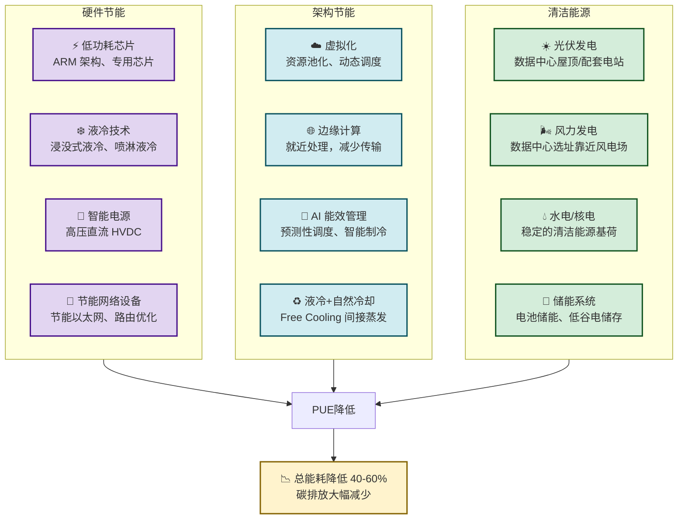

# 8.5 绿色低碳互联网发展方向

> [!abstract] 本节概述
> 互联网在推动社会进步的同时，其自身的能耗问题日益严峻——全球数据中心的耗电量已超过日本一国的用电量。本节分析互联网能耗的主要来源，解析绿色数据中心的核心节能技术，通过 Mermaid 节能路径图展示从硬件到架构的全方位优化方案，并以阿里巴巴绿色计算和谷歌碳中和为案例，探讨互联网企业的可持续发展实践。

## 一、互联网能耗：被忽视的环境代价

### 1.1 互联网的碳足迹

> [!warning] 严峻的能耗现状
>
> | 数据维度 | 具体数值 | 数据来源 |
> | -------- | -------- | -------- |
> | 全球数据中心耗电量 | 约 **460 TWh/年**（占全球总电力消耗的 1.5-2%） | IEA 2024 |
> | 数据中心用电量年增长 | **4-6%** | Uptime Institute |
> | 单次 Google 搜索能耗 | 约 **0.3 Wh**（相当于一盏灯泡亮 1 秒） | Google 官方 |
> | 1 小时视频推流能耗 | 约 **100 Wh** | 清华大学研究 |
> | 全球视频流媒体年碳排放 | 约 **3 亿吨 CO₂** | 2023 年研究 |
> | AI 大模型训练单次能耗 | 最高 **数千 kWh** 到 **数 GWh** | 业界估算 |
>
> 如果全球数据中心是一个国家，它将是世界第 **11** 大电力消费国。

### 1.2 能耗的三大来源

| 能耗来源 | 占比 | 核心问题 |
| -------- | ---- | -------- |
| **数据中心基础设施** | ~45% | IT 设备（服务器、存储、网络）+ 散热（空调、UPS） |
| **网络传输** | ~30% | 核心路由器、光纤传输、无线基站的电力消耗 |
| **终端设备** | ~25% | 智能手机、PC、平板等用户设备的能耗 |

## 二、绿色数据中心：节能的核心战场

### 2.1 PUE：衡量数据中心能效的关键指标

> [!definition] PUE（Power Usage Effectiveness）
> PUE = **数据中心总用电量 / IT 设备用电量**。这是衡量数据中心能源使用效率的核心指标。
>
> - PUE = 1.0：理论最优（所有电力都用于 IT 设备，现实中不存在）
> - PUE = 1.2-1.4：**业界领先水平**（Google、Meta、阿里巴巴）
> - PUE = 1.5-1.8：**平均水平**（传统数据中心）
> - PUE > 2.0：**低效水平**（老旧数据中心）

**全球主要企业的 PUE**：

| 企业 | PUE | 技术特点 |
| ---- | --- | -------- |
| Google | 1.10 | 自研服务器 + AI 智能制冷 + 自然冷却 |
| Meta | 1.12 | 定制化数据中心 + 液冷技术 |
| 阿里巴巴 | 1.13 | 浸没式液冷 + 风电/光伏 + AI 能效管理 |
| Microsoft | 1.15 | 水下数据中心 + 可再生能源 |
| Amazon | 1.18 | 大规模冷冻水系统 + 实时监控 |
| 传统数据中心平均 | 1.6-2.0 | 风冷为主，能效低 |

### 2.2 核心节能技术

### 2.3 关键节能技术详解

#### 液冷技术

> [!example] 浸没式液冷
>
> 将服务器主板直接浸泡在**不导电的绝缘液体**（如氟化液、矿物油）中，液体吸收热量后通过热交换器散热。相比传统风冷：
>
> | 对比项 | 传统风冷 | 浸没式液冷 |
> | ------ | -------- | ---------- |
> | 散热效率 | 1x | 3000-5000x |
> | PUE | 1.5-1.8 | 1.05-1.15 |
> | 服务器密度 | 30-50 kW/机柜 | 100-200 kW/机柜 |
> | 噪音 | 高（风扇） | 极低 |
> | 代表企业 | 传统数据中心 | 阿里巴巴、谷歌、Meta、宁德时代 |

#### AI 能效管理

> [!example] Google 的 AI 制冷系统
>
> Google 2018 年开始将 **DeepMind 的 AI** 应用于数据中心的制冷系统优化：
> - AI 模型实时监控数据中心的温度、湿度、能耗等 **120+ 变量**
> - 预测未来几小时的制冷需求，自动调节冷却系统参数
> - 上线后，数据中心 PUE 平均降低 **15%**，部分数据中心降至 **1.10**
> - Google 将这套 AI 系统开源，供其他企业使用

#### 绿色电力

> [!info] 可再生能源替代方案
>
> | 方案 | 具体做法 | 代表案例 |
> | ---- | -------- | -------- |
> | 直购电（PPA） | 与风电场/光伏电站签订长期购电协议 | Google 累计购电超 **10GW** 可再生能源 |
> | 自建电站 | 在数据中心附近建设风电/光伏电站 | 阿里巴巴张北数据中心配套 100MW 光伏电站 |
> | 就近消纳 | 数据中心选址在清洁能源充裕的地区 | 冰岛数据中心（利用地热）、挪威数据中心（利用水电） |
> | 碳抵消 | 购买碳信用额度抵消剩余排放 | Microsoft 承诺 2030 年实现碳中和，2050 年实现负碳 |

## 三、互联网各环节的节能路径

### 3.1 全链路节能地图

| 环节 | 能耗占比 | 节能措施 | 节能潜力 |
| ---- | -------- | -------- | -------- |
| **数据中心** | 45% | 液冷、AI 制冷、可再生能源 | 高（可降 50%+） |
| **核心网络** | 15% | 节能路由、网络虚拟化、流量优化 | 中（可降 20-30%） |
| **接入网络** | 15% | 5G 基站智能关断、Wi-Fi 节能优化 | 中（可降 20-40%） |
| **CDN/边缘** | 10% | 边缘节点就近处理、CDN 缓存优化 | 中（可降 15-25%） |
| **终端设备** | 15% | 低功耗芯片、长续航设计、节能模式 | 低-中（可降 10-20%） |

### 3.2 AI 时代的"能耗悖论"

> [!warning] AI 带来的新挑战
>
> 生成式 AI 的崛起带来了新的能耗挑战：
>
> | AI 环节 | 能耗特征 | 节能方向 |
> | ------- | -------- | -------- |
> | **模型训练** | 单次训练能耗可达 **数百 kWh 到数 GWh** | 模型蒸馏、混合精度训练、专用 AI 芯片（如 TPU、NPU） |
> | **模型推理** | 全球每天有数十亿次 AI 查询，推理能耗总量巨大 | 边缘推理、模型压缩（量化、剪枝）、专用推理芯片 |
> | **数据传输** | AI 应用的数据往返传输增加网络负载 | 联邦学习（数据不动模型动）、边缘 AI |
>
> AI 的"能耗悖论"：AI 提升了效率，但 AI 本身也在消耗越来越多的能源。预计到 2027 年，AI 数据中心的能耗将占全球电力消耗的 **10%**。

## 四、典型案例分析

### 4.1 阿里巴巴绿色计算：云端的绿色实践

> [!example] 阿里巴巴绿色数据中心
>
> 阿里巴巴在绿色数据中心领域处于全球领先地位：
>
> | 维度 | 具体实践 |
> | ---- | -------- |
> | **液冷技术** | 自研"浸没式液冷"方案，服务于阿里云张北、河源等多个数据中心 |
> | **AI 能效** | "飞天"云操作系统内置 AI 能效管理，动态调度资源，年均节能 **5%** |
> | **清洁能源** | 张北数据中心配套 100MW 光伏电站，年发电量约 **1.5 亿度** |
> | **PUE 水平** | 河源数据中心 PUE 低至 **1.13**，处于全球第一梯队 |
> | **绿色算力** | "东数西算"工程的践行者，将东部算力需求引导至西部清洁能源充裕的地区 |
> | **ESG 目标** | 承诺 2030 年碳中和，数据中心 100% 使用清洁能源 |

**"东数西算"工程**：

> [!info] 国家"东数西算"战略
>
> "东数西算"是国家于 2022 年启动的重大战略工程，核心思路是：
> - **东部数据**：将东部沿海地区的算力需求（如长三角、粤港澳大湾区）引导至西部
> - **西部计算**：利用西部丰富的清洁能源（风电、光伏、水电）进行数据处理
> - **8 大枢纽节点**：京津冀、长三角、粤港澳大湾区、成渝、内蒙古、贵州、甘肃、宁夏
>
> 这一战略实现了"**数据从东到西、能源从西到东**"的优化配置，预计每年可降低数据中心能耗 **数百万吨标准煤**。

### 4.2 谷歌碳中和：科技巨头的可持续之路

> [!example] Google 的 24/7 无碳能源目标
>
> Google 在绿色能源领域是全球最激进的企业之一：
>
> | 时间 | 里程碑 |
> | ---- | ------ |
> | 2007 | 实现碳中和（所有业务活动的净碳排放为零） |
> | 2017 | 成为全球最大的可再生能源企业，购电超 **3GW** |
> | 2020 | 全球所有数据中心和办公室实现 **24/7 无碳能源**运营（全天候使用清洁能源） |
> | 2023 | 承诺 2030 年所有数据中心和供应链实现 **24/7 无碳能源** |
>
> **核心策略**：
> 1. **直接购电（PPA）**：与全球 50+ 个可再生能源项目签订长期购电协议
> 2. **就近选址**：数据中心优先选址在风电、光伏、水电充裕的地区
> 3. **AI 优化**：DeepMind AI 优化数据中心制冷（节能 15%）和供电（节能 3%）
> 4. **产品创新**：推出碳智能计算平台，自动将计算任务调度到清洁能源最充裕的时间和地点执行

### 4.3 微软水下数据中心

> [!example] 微软 Natick 项目
>
> 微软自 2018 年起开展**水下数据中心**实验：
>
> | 维度 | 具体实践 |
> | ---- | -------- |
> | **原理** | 将数据中心潜入深海，利用海水自然冷却，无需空调系统 |
> | **实验规模** | 2020 年在苏格兰海岸部署了一个 12 米长的水下数据中心，包含 864 台服务器 |
> | **优势** | PUE 低至 **1.07**（全球最低），运维成本低（无人值守），低碳 |
> | **挑战** | 设备防水防腐、海底维护、海底电缆铺设 |
> | **前景** | 微软计划 2030 年实现水下数据中心商业化，可服务沿海城市的低延迟计算需求 |

## 五、绿色互联网的挑战与展望

### 5.1 核心挑战

> [!warning] 绿色互联网的五大挑战
>
> | 挑战 | 说明 | 严重程度 |
> | ---- | ---- | -------- |
> | **清洁能源供给** | 风电、光伏等清洁能源不稳定，需要储能和电网升级 | ⭐⭐⭐⭐⭐ |
> | **基础设施改造** | 全球现有数据中心超过 50 万个，改造和替换成本巨大 | ⭐⭐⭐⭐ |
> | **AI 能耗治理** | AI 大模型的能耗增长速度超过节能技术的进步速度 | ⭐⭐⭐⭐⭐ |
> | **标准与测量** | 碳排放的测量和报告标准尚未统一 | ⭐⭐⭐ |
> | **经济激励** | 绿色数据中心的初始投资高，回收周期长 | ⭐⭐⭐⭐ |

### 5.2 未来趋势

> [!tip] 绿色互联网的三个演进方向
>
> 1. **算力网络绿色化**：国家"东数西算"工程将构建全国一体化的绿色算力网络，实现算力的优化调度
> 2. **AI 绿色化**：专用 AI 芯片（TPU、NPU）将推动 AI 训练和推理的能效比大幅提升，绿色 AI 成为新的研究前沿
> 3. **循环经济**：数据中心硬件的循环利用（服务器再利用、旧设备回收）、液冷液体的循环使用等将形成绿色闭环

## 六、与其他小节的联系

- 绿色低碳的核心目标之一是降低 [[3.1 云计算、虚拟化与资源共享|云计算]] 和 [[8.3 边缘计算、分布式网络创新|边缘计算]] 的能耗
- [[8.2 生成式 AI 驱动互联网产品变革|生成式 AI]] 的能耗问题是绿色互联网需要应对的新挑战
- 绿色计算与 [[8.4 开源生态与社区创新模式|开源生态]] 结合，开源的能效优化工具和绿色数据中心标准正在形成
- [[8.1 元宇宙、沉浸式互联网应用|元宇宙]] 等沉浸式应用对算力的高需求，更加凸显了绿色计算的重要性

## 章节导航

- 上一级：[[MOC - 第8章]]
- 上一节：[[8.4 开源生态与社区创新模式]]
- 习题：[[MOC - 第8章习题]]