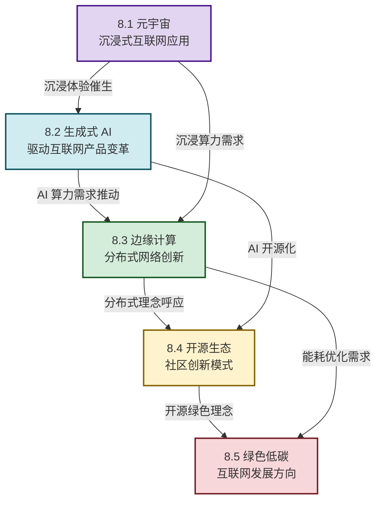

# MOC - 第8章 互联网前沿创新方向

> [!info] 本章定位
> 本章是互联网创新的**未来展望章**。它要回答的核心问题是：**互联网的下一个十年将走向何方？哪些前沿技术将重塑互联网的形态？从沉浸式体验到生成式 AI，从分布式架构到开源生态，再到绿色低碳发展，本章将五大前沿创新方向串联成一幅互联网未来发展的全景图，为学习者打开互联网创新的想象力空间。**

## 学习路线图

## 知识点导航

| 小节 | 标题 | 核心内容 | 关键概念 |
| ---- | ---- | -------- | -------- |
| [[8.1 元宇宙、沉浸式互联网应用\|8.1]] | 元宇宙与沉浸式互联网 | 元宇宙定义、四大特征、技术架构、案例分析 | 沉浸感、交互性、持久性、去中心化、Roblox、Meta Horizon |
| [[8.2 生成式 AI 驱动互联网产品变革\|8.2]] | 生成式 AI 与产品变革 | 生成式 AI 原理、AIGC 应用、AI Agent、案例 | LLM、扩散模型、AIGC、AI Agent、Sora、Midjourney |
| [[8.3 边缘计算、分布式网络创新\|8.3]] | 边缘计算与分布式网络 | 边缘 vs 云计算、云-边-端架构、分布式创新 | MEC、CDN、联邦学习、PUE、智能边缘 |
| [[8.4 开源生态与社区创新模式\|8.4]] | 开源生态与社区创新 | 开源模式、六种商业模式、社区治理、案例 | BDFL、基金会治理、Red Hat、Linux、Apache |
| [[8.5 绿色低碳互联网发展方向\|8.5]] | 绿色低碳互联网 | 能耗分析、节能技术、绿色数据中心、案例 | PUE、液冷、AI 制冷、东数西算、碳中和 |

## 核心考点

> [!summary] 本章核心考点（8 点）
> 1. **元宇宙四大核心特征**：沉浸感、交互性、持久性、去中心化。理解每个特征的技术支撑和用户价值，并能区分元宇宙与传统虚拟世界的差异；
> 2. **元宇宙两大路径对比**：Roblox（UGC 驱动、青少年用户、跨平台）vs Meta Horizon（软硬件一体化、成人用户、VR 头显），理解两种路径的优劣势；
> 3. **生成式 AI 技术分类**：LLM（Transformer 架构）、扩散模型（Diffusion）、GAN 三种核心技术的原理差异和生成能力；
> 4. **AIGC 六大应用领域**：文本、图像、音频、视频、3D、代码。掌握 Sora（视频生成）、Midjourney（图像生成）、AutoGPT（AI Agent）三大标杆案例的核心能力和商业模式；
> 5. **AI Agent 的核心能力**：规划、工具使用、记忆、反思、协作五大能力，以及对话式、任务式、嵌入式三种产品形态；
> 6. **边缘计算 vs 云计算**：从处理位置、时延、带宽、计算能力等维度对比，理解"云-边-端"三层协同架构，掌握 MEC 和 CDN 的应用场景；
> 7. **六种开源商业模式**：服务支持、云托管、双许可证、核心+附加、开源+硬件、基金会资助。理解三种社区治理模式（BDFL、基金会、精英治理）；
> 8. **绿色数据中心核心指标与技术**：PUE 的含义和业界水平，液冷技术、AI 能效管理、绿色电力（PPA、自建电站）三大节能路径，以及"东数西算"工程的战略意义。

## 章节导航

> [!nav] 导航
> 上级：[[MOC - 互联网创新|课程总览]]
> 上一章：[[MOC - 第7章|第7章 互联网创业与创新项目落地]]
> 配套习题：[[MOC - 第8章习题|第8章 习题]]
> （本章为最后一章，无下一章）