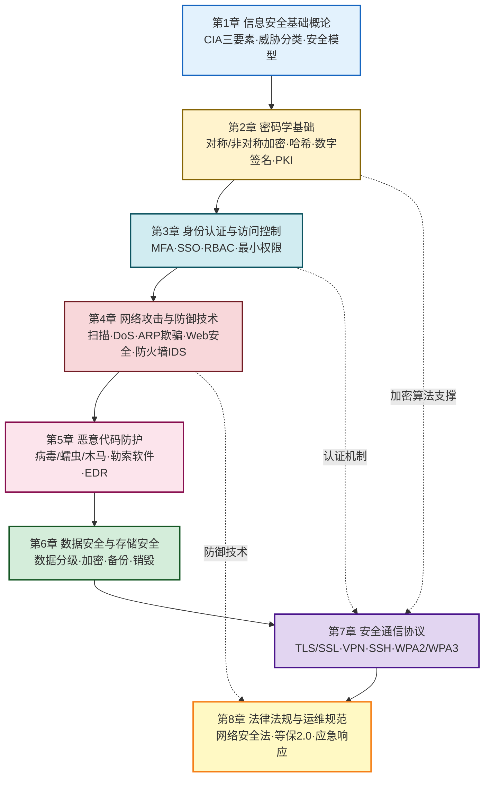
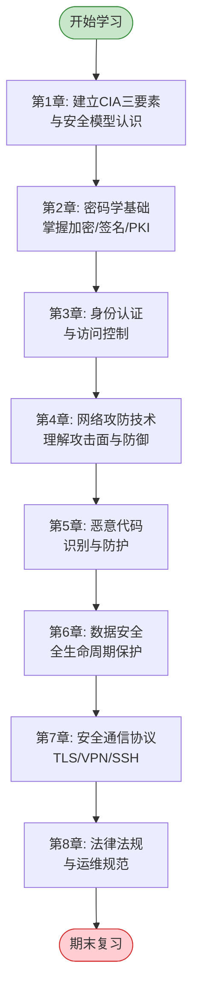

# MOC - 信息安全技术

本页是本科《信息安全技术》课程标准化知识库的总入口，围绕"**威胁建模→密码学基础→身份认证→网络攻防→恶意代码→数据安全→通信协议→法律合规**"八条主线，系统构建信息安全知识框架。

> [!abstract] 核心问题
> 信息安全技术研究的是：在开放网络环境中，如何保护信息资产的**保密性（Confidentiality）、完整性（Integrity）、可用性（Availability）**——即 CIA 三要素，并在认证、授权、不可否认性等维度建立可验证的安全保障体系。

> [!info] 课程定位
> - 先修课程：[[MOC - 计算机网络|计算机网络A]]
> - 后续课程：网络安全工程、渗透测试实践
> - 参考教材：范红《信息安全技术》、William Stallings《密码学与网络安全》
> - 关联知识库：[[MOC - 互联网创新|互联网创新]]（第6章 安全合规与治理）

> [!warning] 安全声明
> - 本知识库中的攻击技术、扫描命令、漏洞分析**仅供授权实验环境使用**
> - 所有实操内容需写明目标范围、风险评估和恢复方法
> - 禁止将技术内容用于未授权的真实第三方目标

## 课程知识地图

## 章节导航

| 章节 | 知识点 MOC | 习题 MOC | 核心内容 |
| ---- | ---------- | -------- | -------- |
| 第1章 | [[MOC - 第1章\|信息安全基础概论]] | [[MOC - 第1章习题\|第1章习题]] | CIA三要素、威胁/风险/漏洞分类、安全体系框架、安全生命周期 |
| 第2章 | [[MOC - 第2章\|密码学基础]] | [[MOC - 第2章习题\|第2章习题]] | 古典密码、DES/AES、RSA、哈希函数、数字签名/PKI、混合加密 |
| 第3章 | [[MOC - 第3章\|身份认证与访问控制]] | [[MOC - 第3章习题\|第3章习题]] | 口令/生物/令牌认证、SSO/MFA、DAC/MAC/RBAC、最小权限 |
| 第4章 | [[MOC - 第4章\|网络攻击与防御技术]] | [[MOC - 第4章习题\|第4章习题]] | 端口扫描/嗅探、DoS/DDoS、ARP欺骗、SQL注入/XSS/CSRF、防火墙/IDS |
| 第5章 | [[MOC - 第5章\|恶意代码防护]] | [[MOC - 第5章习题\|第5章习题]] | 病毒/蠕虫/木马、勒索软件、传播途径、杀毒/EDR |
| 第6章 | [[MOC - 第6章\|数据安全与存储安全]] | [[MOC - 第6章习题\|第6章习题]] | 数据分级脱敏、数据库加密、备份容灾、数据销毁 |
| 第7章 | [[MOC - 第7章\|安全通信协议]] | [[MOC - 第7章习题\|第7章习题]] | HTTPS/TLS握手、IPSec/SSL VPN、SSH、WPA2/WPA3 |
| 第8章 | [[MOC - 第8章\|法律法规与运维规范]] | [[MOC - 第8章习题\|第8章习题]] | 网络安全法/数据安全法/个保法、等保2.0、安全审计、应急响应 |

## 核心概念速查

### 安全属性对照

| 安全属性 | 英文 | 含义 | 对应威胁 | 典型技术 |
| -------- | ---- | ---- | -------- | -------- |
| 保密性 | Confidentiality | 信息不被未授权获取 | 窃听、泄露 | 加密、访问控制 |
| 完整性 | Integrity | 信息不被篡改 | 篡改、伪造 | 哈希、数字签名 |
| 可用性 | Availability | 服务可被合法访问 | DoS、勒索 | 冗余、备份 |
| 认证性 | Authentication | 确认身份真实性 | 身份冒充 | 口令、证书、MFA |
| 授权 | Authorization | 控制访问权限 | 越权访问 | RBAC、ACL |
| 不可否认性 | Non-repudiation | 不能否认已发生操作 | 抵赖 | 数字签名、审计日志 |

### 密码学算法分类

| 类型 | 算法 | 密钥特点 | 典型应用 |
| ---- | ---- | -------- | -------- |
| 对称加密 | DES、3DES、AES | 单密钥，加解密相同 | 数据加密、文件加密 |
| 非对称加密 | RSA、ECC | 公钥/私钥对 | 密钥交换、数字签名 |
| 哈希函数 | MD5、SHA-1、SHA-256 | 无密钥 | 完整性校验、口令存储 |
| 消息认证码 | HMAC | 共享密钥+哈希 | 消息完整性+认证 |
| 数字签名 | RSA签名、DSA | 私钥签名/公钥验签 | 不可否认性 |

## 学习路径

## 考试重点速览

> [!warning] 高频考点
> 1. **CIA 三要素**与安全属性辨析（选择题/简答题）
> 2. **对称加密 vs 非对称加密**原理对比与算法识别
> 3. **RSA 加密/签名计算**（模运算、密钥生成、加解密过程）
> 4. **数字签名与 PKI 体系**流程（证书签发、验证链）
> 5. **TCP 三次握手与 SYN Flood 攻击**关系
> 6. **SQL 注入 / XSS / CSRF** 原理与防御
> 7. **TLS 握手流程**（密钥交换、证书验证、会话密钥）
> 8. **等保 2.0** 等级划分与基本要求

---

## 相关知识库

- [[MOC - 计算机网络|计算机网络A]] — 网络协议基础，先修课程
- [[MOC - 互联网创新]] — 互联网安全合规与治理（第6章）
