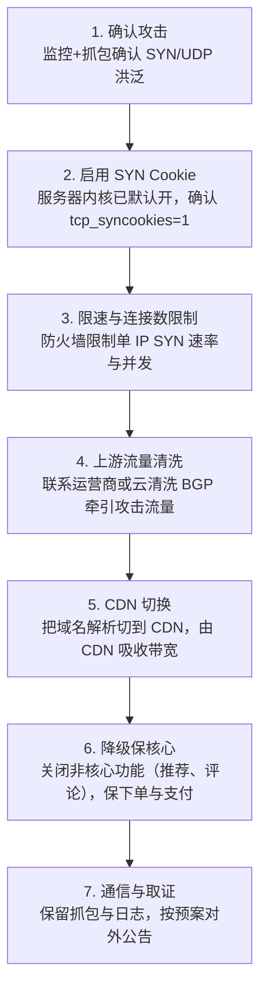
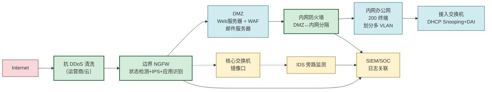

# MOC - 第4章 习题

本页为《信息安全技术》[[MOC - 第4章|第4章 网络攻击与防御技术]] 的配套习题集，共 **18 题**：选择题 6、填空题 3、简答题 4、攻击场景分析题 5。每题答案默认折叠，建议先独立作答再展开核对。攻击场景分析题需完整给出攻防分析（攻击原理 → 利用流程 → 防御措施）。

> [!info] 使用说明
> - 答案使用 `<details>` 折叠，点击"查看答案"展开
> - 题目覆盖 4.1–4.5 全部小节考点，标注对应知识点链接
> - 攻击场景分析题需写明"资产/信任边界/威胁模型/缓解措施"，呼应网络与安全局部规则
> - 末尾有考点统计表与复习建议，便于按薄弱点回看

> [!warning] 伦理提示
> 习题中涉及的攻击手法仅用于原理理解与授权环境实验。任何对真实第三方的扫描、嗅探、欺骗、注入行为均属违法。

---

## 一、选择题（6 题）

### 第 1 题　端口扫描类型辨析　[[4.1 信息收集、端口扫描、嗅探技术|📖 4.1]]

关于 TCP SYN 扫描与 TCP Connect 扫描的区别，下列说法**正确**的是：

A. SYN 扫描会完成完整三次握手，Connect 扫描只发 SYN
B. SYN 扫描不需 root 权限，Connect 扫描需要 root 权限
C. SYN 扫描隐蔽性更好，因为不建立完整连接，应用层不会记录
D. Connect 扫描速度比 SYN 扫描快，因为调用了系统优化过的 `connect()`

<details>
<summary>查看答案</summary>

**答案：C**

- A 反了：SYN 扫描只发 SYN（半开），Connect 扫描完成完整三次握手
- B 反了：SYN 扫描需 root（原始套接字），Connect 扫描用系统调用不需特权
- C 正确：SYN 扫描不建立完整连接，应用层无从感知，日志记录少，更隐蔽
- D 错误：Connect 扫描要完成握手再断开，开销更大，速度通常更慢
</details>

---

### 第 2 题　SYN Flood 半连接原理　[[4.2 DoS、DDoS 攻击原理与防御|📖 4.2]]

SYN Flood 攻击能够拒绝服务的根本原因是：

A. 攻击者发送大量数据填满服务器磁盘
B. 攻击者伪造源 IP 使服务器半连接队列被占满
C. 攻击者利用 UDP 无连接特性发送大量 ICMP 包
D. 攻击者通过慢速发送 HTTP 请求占用线程池

<details>
<summary>查看答案</summary>

**答案：B**

- A 错误：SYN Flood 不针对磁盘
- B 正确：SYN Flood 利用 TCP 三次握手，伪造源 IP 发 SYN，服务器为每个 SYN 分配 TCB 放入半连接队列等待 ACK，队列满后新连接（含合法用户）被丢弃
- C 错误：ICMP Flood 是带宽型攻击，与 SYN Flood 的协议状态耗尽不同
- D 描述的是慢攻击（Slowloris），不是 SYN Flood
</details>

---

### 第 3 题　ARP 欺骗协议缺陷　[[4.3 ARP 欺骗、中间人攻击|📖 4.3]]

ARP 协议之所以容易被欺骗，**根本原因**是：

A. ARP 报文使用明文传输，可被嗅探
B. ARP 响应无认证，且主动响应会被无条件接受更新缓存
C. ARP 只能在交换网络使用，共享网络天然安全
D. ARP 使用 TCP 保证可靠性，但握手可被劫持

<details>
<summary>查看答案</summary>

**答案：B**

- A 错误：明文传输是嗅探问题，不是 ARP 欺骗根因
- B 正确：ARP 响应没有任何认证机制，且主机收到主动 ARP 响应（即便是未请求的）也会无条件更新缓存，这是协议设计缺陷
- C 错误：恰恰相反，共享网络更易嗅探；ARP 在两种网络都可被欺骗
- D 错误：ARP 是链路层协议，不使用 TCP
</details>

---

### 第 4 题　CSRF 攻击前提　[[4.4 Web 安全：SQL 注入、XSS、CSRF|📖 4.4]]

以下**不是** CSRF 攻击成立的必要前提的是：

A. 用户已在目标站点登录并持有有效 Cookie
B. 目标站点仅凭 Cookie 鉴权，无额外来源验证
C. 攻击者已通过 XSS 窃取到用户的 Cookie 内容
D. 攻击者能诱导用户访问恶意页面

<details>
<summary>查看答案</summary>

**答案：C**

- A、B、D 都是 CSRF 的必要前提
- C 错误：CSRF **不需要**攻击者读取 Cookie 内容。CSRF 正是利用"攻击者无法跨域读取 Cookie（同源策略保护），但浏览器会自动携带 Cookie"这一特性。攻击者只需让浏览器发请求，Cookie 自动带上即可。若能读 Cookie 则是 XSS 会话窃取，性质不同
</details>

---

### 第 5 题　IDS vs IPS 部署差异　[[4.5 防火墙、入侵检测 IDS、IPS 基础|📖 4.5]]

关于 IDS 与 IPS 的区别，下列说法**错误**的是：

A. IDS 通常旁路镜像部署，IPS 通常在线串联部署
B. IDS 只能告警不能阻断，IPS 可实时丢弃恶意包
C. IDS 故障不影响业务连通，IPS 故障可能断网
D. IDS 误报会阻断正常流量，IPS 误报只产生噪音告警

<details>
<summary>查看答案</summary>

**答案：D**

- D 错误且说反了：IDS 误报只产生噪音告警（旁路不阻断）；IPS 误报会**阻断正常流量**影响业务，这才是 IPS 规则更保守的原因
- A、B、C 均正确
</details>

---

### 第 6 题　SQL 注入防御首选　[[4.4 Web 安全：SQL 注入、XSS、CSRF|📖 4.4]]

防御 SQL 注入**最根本**的手段是：

A. 对用户输入做正则黑名单过滤
B. 关闭数据库错误回显
C. 使用参数化查询（预编译语句）
D. 部署 WAF

<details>
<summary>查看答案</summary>

**答案：C**

- A 黑名单过滤易被绕过（编码、大小写、注释等），不能单独依赖
- B 关闭错误回显只能防报错注入，不能防盲注，治标不治本
- C 正确：参数化查询让用户输入仅作数据不作 SQL 代码，从根本上无法改变 SQL 结构，是根治手段
- D WAF 是辅助手段，可被绕过，且依赖规则维护
</details>

---

## 二、填空题（3 题）

### 第 7 题　嗅探与混杂模式　[[4.1 信息收集、端口扫描、嗅探技术|📖 4.1]]

网络嗅探需将网卡设置为（1）______ 模式以接收链路上所有帧。共享式以太网使用（2）______（设备）天然向所有端口广播，故极易被嗅探；交换网络默认每端口只收目的 MAC 为自己的帧，攻击者常用（3）______ 攻击撑爆交换机 CAM 表使其退化为广播。在授权环境使用 nmap 进行 TCP 半开扫描的参数是（4）______，扫描全部 65535 端口的参数是（5）______。

<details>
<summary>查看答案</summary>

- (1) 混杂（Promiscuous）
- (2) Hub（集线器）
- (3) MAC 泛洪（MAC Flooding）
- (4) `-sS`
- (5) `-p-`

补充：交换网络防御 MAC 泛洪可在交换机端口配置 port-security 限制可学习 MAC 数量。
</details>

---

### 第 8 题　SYN Cookie 与 DDoS 架构　[[4.2 DoS、DDoS 攻击原理与防御|📖 4.2]]

DDoS 三级控制架构为攻击者 →（1）______ → 僵尸网络 → 目标。SYN Flood 利用 TCP（2）______ 队列被占满导致拒绝服务；防御 SYN Flood 的协议层手段（3）______ 服务器在收到 SYN 时不分配半连接资源，而是把连接信息编码进（4）______ 返回，收到 ACK 后反算验证。反射放大攻击的共同模式是攻击者伪造（5）______ 为目标 IP，向开放 UDP 服务的第三方发请求。

<details>
<summary>查看答案</summary>

- (1) 控制端 / C2（Command and Control）服务器
- (2) 半连接（SYN Queue）
- (3) SYN Cookie
- (4) SYN/ACK 的初始序列号（ISS）
- (5) 源 IP

补充：从根本杜绝 IP 伪造需运营商实施源地址验证（BCP38/uRPF）。
</details>

---

### 第 9 题　防火墙与 Snort 规则　[[4.5 防火墙、入侵检测 IDS、IPS 基础|📖 4.5]]

防火墙二代技术（1）______ 检测通过维护（2）______ 表跟踪 TCP 会话状态，相比无状态包过滤可支持动态端口协议。IDS 检测模型中，把已知攻击特征写成规则匹配的是（3）______ 检测，建立正常基线后偏离即告警的是（4）______ 检测。Snort 规则 `alert tcp $EXTERNAL_NET any -> $HOME_NET 80` 中 `alert` 是（5）______，`any` 是（6）______。

<details>
<summary>查看答案</summary>

- (1) 状态（Stateful Inspection）
- (2) 连接状态（Connection State）
- (3) 误用（基于特征/签名）
- (4) 异常（Anomaly-based）
- (5) 动作（Action，告警）
- (6) 源端口（任意端口）

补充：状态检测仍不深检应用层，应用语义需应用层网关（ALG）。
</details>

---

## 三、简答题（4 题）

### 第 10 题　端口扫描类型对比　[[4.1 信息收集、端口扫描、嗅探技术|📖 4.1]]

对比 TCP SYN 扫描、TCP Connect 扫描、FIN/Xmas/Null 扫描、UDP 扫描四种扫描的原理、隐蔽性、速度与典型用途，并说明 FIN/Xmas/Null 扫描为何对 Windows 系统不可靠。

<details>
<summary>查看答案</summary>

| 扫描类型 | 原理 | 隐蔽性 | 速度 | 典型用途 |
| -------- | ---- | ------ | ---- | -------- |
| TCP SYN | 发 SYN，收 SYN/ACK 判开放，发 RST 不完成握手 | 较高（不建立完整连接，应用层无日志） | 快 | 默认首选，需 root |
| TCP Connect | 调 `connect()` 完成三次握手 | 低（应用层会记录完整连接） | 慢 | 无特权时用，兼容性好 |
| FIN/Xmas/Null | 发 FIN/FIN+URG+PSH/无标志，收 RST 判关闭，无响应判开放 | 高（绕过部分防火墙） | 中 | 隐蔽扫描，区分 open/filtered |
| UDP | 发空 UDP 包，收 ICMP 不可达判关闭，收 UDP 响应判开放 | 中 | 极慢 | 探测 DNS/SNMP 等 UDP 服务 |

**FIN/Xmas/Null 对 Windows 不可靠的原因**：
- 此类扫描依据 RFC 793：对未发过 SYN 的连接收到非标准标志包，关闭端口应回 RST，开放端口应忽略（无响应）
- 但 Windows TCP/IP 栈不严格遵循 RFC，无论端口开放与否都可能回 RST，导致扫描器把开放端口误判为关闭
- 故此类扫描对 Linux/Unix 系统较可靠，对 Windows 系统不可靠

补充：这也说明"协议未强制的行为"会被攻击者利用，同时也会因实现差异而失效。
</details>

---

### 第 11 题　DDoS 分类与防御　[[4.2 DoS、DDoS 攻击原理与防御|📖 4.2]]

简述 DDoS 按攻击层次的分类及每类的典型代表，并说明 SYN Cookie、流量清洗、CDN 三种防御手段分别在哪个层次发挥作用、各自能应对哪类攻击。

<details>
<summary>查看答案</summary>

**DDoS 三类**：

| 类型 | 原理 | 典型代表 |
| ---- | ---- | -------- |
| 带宽型（体积型） | 填满入口链路带宽 | UDP Flood、ICMP Flood、DNS/NTP/Memcached 放大 |
| 协议型 | 耗尽协议状态资源 | SYN Flood、连接耗尽、慢攻击（Slowloris） |
| 应用层 | 模拟合法请求耗尽应用资源 | HTTP Flood、CC 攻击、慢速 POST |

**三种防御手段的层次与应对**：

| 防御手段 | 作用层次 | 应对类型 | 机制 |
| -------- | -------- | -------- | ---- |
| SYN Cookie | 协议层 | SYN Flood | 服务器收到 SYN 不分配半连接，把连接信息编码进 SYN/ACK 序列号，收到 ACK 反算验证才分配资源，半连接队列不再被占满 |
| 流量清洗 | 网络层 | 带宽型为主，兼顾协议型 | 上游清洗中心识别攻击流量并丢弃，仅放行干净流量到目标，通常 BGP 牵引 |
| CDN/Anycast | 网络层 | 带宽型 | 把流量分散到全球节点，单点带宽不足时由全网吸收，隐藏源站 IP |

补充：应用层攻击（HTTP Flood）需 WAF + 行为分析 + 限流，SYN Cookie 与流量清洗均不直接生效；纵深防御需组合使用。
</details>

---

### 第 12 题　ARP 欺骗 MITM 流程与防御　[[4.3 ARP 欺骗、中间人攻击|📖 4.3]]

完整描述 ARP 欺骗实施中间人攻击（MITM）的流程（含双向欺骗与流量转发），并给出三层防御措施（终端层、交换机层、协议层）。

<details>
<summary>查看答案</summary>

**ARP 欺骗 MITM 流程**：

1. 攻击者接入受害者与网关所在同一广播域
2. 攻击者开启 IP 转发（`net.ipv4.ip_forward=1`），以便把劫持流量转发到真实目的
3. **双向欺骗**：
   - 向受害者发送伪造 ARP 响应："网关 IP → 攻击者 MAC"，使受害者把发往网关的流量送到攻击者
   - 向网关发送伪造 ARP 响应："受害者 IP → 攻击者 MAC"，使网关把发往受害者的流量送到攻击者
4. 攻击者周期性重发伪造 ARP 响应（如每秒 1 次），防止缓存过期被真实响应纠正
5. 受害者上网正常（IP 转发维持），但全部流量经攻击者，攻击者可监听明文、篡改 HTTP 页面、注入脚本、窃取 Cookie，甚至配合 DNS 欺骗把用户引到钓鱼站

**三层防御**：

| 层次 | 措施 | 原理 |
| ---- | ---- | ---- |
| 终端层 | 静态 ARP 绑定网关 IP→MAC | 手动绑定后不接受伪造响应，适用于服务器等关键主机 |
| 交换机层 | DHCP Snooping + 动态 ARP 检测（DAI） | Snooping 建立 IP↔MAC↔端口绑定表，DAI 基于该表验证 ARP 包，伪造包被丢弃 |
| 协议层 | IPSec/TLS 加密 | 即使流量被劫持，攻击者只能看到密文，机密性与完整性得以保障，是根本缓解 |

补充：DHCP Snooping + DAI 是企业接入层最佳实践；公共 Wi-Fi 下应始终用 HTTPS/VPN。
</details>

---

### 第 13 题　XSS 与 CSRF 区别　[[4.4 Web 安全：SQL 注入、XSS、CSRF|📖 4.4]]

从攻击目标、根因、是否需用户登录、危及的安全目标四个维度对比 XSS 与 CSRF，并说明为什么 HttpOnly Cookie 能缓解 XSS 窃取会话却不能直接防 CSRF。

<details>
<summary>查看答案</summary>

| 维度 | XSS | CSRF |
| ---- | --- | ---- |
| 攻击目标 | 用户浏览器（注入脚本在受害者浏览器执行） | 服务器会话（冒用身份执行业务操作） |
| 根因 | 用户可控输入被原样输出到页面且未编码 | 浏览器跨站请求自动携带 Cookie + 服务器仅凭 Cookie 鉴权 |
| 是否需用户登录 | 否（但窃会话针对登录用户） | 是（必须有有效会话） |
| 危及的安全目标 | 完整性、机密性（用户侧）、认证（会话劫持） | 完整性（业务操作被冒用） |

**HttpOnly 能缓解 XSS 窃取会话却不能防 CSRF 的原因**：
- HttpOnly 限制 JavaScript 读取 Cookie，XSS 注入的脚本 `document.cookie` 读不到会话 Cookie，从而缓解会话窃取
- 但 CSRF 的根本机制不是"攻击者读 Cookie"，而是"浏览器自动携带 Cookie"。即使设了 HttpOnly，浏览器在跨站请求时仍会把 Cookie 带上，攻击者无需读取即可让请求被服务器当作合法会话
- 防 CSRF 需让服务器验证请求"来源意图"，即 CSRF Token（攻击者跨域读不到 Token）或 SameSite Cookie（浏览器层阻断跨站携带）

补充：XSS 与 CSRF 可组合——XSS 窃取 CSRF Token 后可绕过 CSRF 防御，故 XSS 必须先防住。
</details>

---

## 四、攻击场景分析题（5 题）

### 第 14 题　内网嗅探与 ARP 欺骗综合场景　[[4.1 信息收集、端口扫描、嗅探技术|📖 4.1]]　[[4.3 ARP 欺骗、中间人攻击|📖 4.3]]

某公司办公网络为单一 VLAN（192.168.1.0/24），员工反映最近内网偶发断网且网银登录后出现异常转账。安全工程师在核心交换机镜像口抓包发现大量 ARP 响应包，且部分主机的 ARP 缓存中网关 MAC 被指向一台非网关设备。请分析：

(1) 最可能的攻击类型及攻击者所处位置；
(2) 完整攻击链条（从信息收集到造成危害）；
(3) 立即处置与长期防御措施。

<details>
<summary>查看答案</summary>

**(1) 攻击类型与位置**：
- 最可能：**ARP 欺骗 + 中间人攻击（MITM）**，叠加 DNS 欺骗或会话劫持
- 攻击者位置：**同一广播域内的某台内网主机**（已被入侵或内部恶意主机），非网关设备 MAC 即攻击者 MAC

**(2) 完整攻击链条**：


- 侦察：攻击者先用 [[4.1 信息收集、端口扫描、嗅探技术|4.1 nmap]] 扫描内网，确定网关与受害者 IP/MAC
- ARP 欺骗：向受害者和网关双向发伪造 ARP 响应，把流量劫持到攻击者
- 转发维持：开启 IP 转发，受害者上网无明显异常（偶发断网可能是攻击者转发不稳或重欺骗瞬间）
- 窃听篡改：嗅探 HTTP 明文凭证；对 HTTPS 可尝试 SSL Strip（降级）；注入恶意 JS
- 危害升级：DNS 欺骗把 `bank.com` 解析到钓鱼站，用户在伪站输入网银凭证导致转账

**(3) 处置与防御**：

**立即处置**：
- 在受影响主机执行 `arp -d *` 清空缓存，或绑定网关真实 MAC
- 通过交换机日志或抓包定位发出伪造 ARP 响应的物理端口，临时 shutdown 该端口
- 隔离可疑主机进行取证

**长期防御（三层）**：
| 层次 | 措施 |
| ---- | ---- |
| 交换机层 | 启用 DHCP Snooping + 动态 ARP 检测（DAI），从根本阻断伪造 ARP；端口安全限制 MAC 数量 |
| 终端层 | 关键主机静态绑定网关 ARP；统一部署 EDR 监测异常 ARP |
| 协议层 | 全站 HTTPS（HSTS 防 SSL Strip）；网银等关键业务强制二次认证；DNS 用 DoH/DoT |

补充：单 VLAN 办公网应按部门划分多 VLAN 缩小广播域，降低 ARP 欺骗影响范围。
</details>

---

### 第 15 题　DDoS 攻击应急响应　[[4.2 DoS、DDoS 攻击原理与防御|📖 2]]　[[4.5 防火墙、入侵检测 IDS、IPS 基础|📖 4.5]]

某电商网站在促销高峰期突然出现访问缓慢、部分用户无法下单，监控显示入口带宽从 1Gbps 飙升至 12Gbps，服务器 CPU 正常但 SYN 队列满，同时存在大量源端口随机的 UDP 包。请分析：

(1) 判断攻击类型与层次（结合 SYN 队列满与 UDP 带宽飙升两个现象）；
(2) 短期应急响应步骤（按时间顺序）；
(3) 中长期防御体系建设。

<details>
<summary>查看答案</summary>

**(1) 攻击类型判断**：
- **混合型 DDoS**，同时包含：
  - **协议型 SYN Flood**：SYN 队列满，半连接耗尽，是协议状态耗尽
  - **带宽型 UDP Flood**：入口带宽飙升至 12Gbps（远超 1Gbps 基线），是带宽洪泛
- 攻击者同时发起两类攻击，既有协议层状态耗尽又有带宽层洪泛，属典型混合 DDoS

**(2) 短期应急响应（按时间顺序）**：



**(3) 中长期防御体系**：

| 层次 | 措施 |
| ---- | ---- |
| 网络层 | 常态接入 CDN + Anycast 分散流量；与运营商签清洗 SLA；出口带宽冗余 |
| 协议层 | SYN Cookie 持续开启；防火墙 SYN Proxy；连接数限制 |
| 应用层 | WAF 防 HTTP Flood；限流降级熔断；非核心功能可一键降级 |
| 监控层 | 实时带宽与协议状态监控，自动触发清洗；IPS 识别 DDoS 特征告警 |
| 预案层 | 定期 DDoS 演练，明确清洗切换流程与责任人 |

补充：纯带宽型攻击单靠服务器侧无法抵御，必须靠上游清洗或 CDN 分散；SYN Cookie 只解 SYN Flood，不解带宽洪泛。
</details>

---

### 第 16 题　SQL 注入场景分析　[[4.4 Web 安全：SQL 注入、XSS、CSRF|📖 4.4]]

某站点登录接口代码为：
```php
$user = $_POST['user']; $pass = $_POST['password'];
$sql = "SELECT * FROM users WHERE name='$user' AND pass='$pass'";
$db->query($sql);
```
攻击者输入用户名 `admin' -- `，密码任意，登录成功。请分析：

(1) 漏洞类型与根因；
(2) 攻击 payload 生成的实际 SQL 及绕过认证的原理；
(3) 攻击者下一步可能如何扩大危害（盲注思路）；
(4) 修复方案与纵深防御措施。

<details>
<summary>查看答案</summary>

**(1) 漏洞类型与根因**：
- 类型：**SQL 注入（认证绕过型）**
- 根因：用户输入直接**字符串拼接**进 SQL，未做参数化，输入中的 `'` 与 `--` 改变了 SQL 语义

**(2) 实际 SQL 与绕过原理**：
攻击者输入 `admin' -- ` 后，拼接生成的 SQL 为：
```sql
SELECT * FROM users WHERE name='admin' --' AND pass='任意'
```
- `'admin'` 闭合了 name 字段的引号
- `--` 是 SQL 注释符，注释掉后面的 `' AND pass='任意'`
- 实际执行：`SELECT * FROM users WHERE name='admin'`
- 只要库中存在 admin 用户即返回非空，应用判断"查到记录即登录成功"，攻击者无需密码即以 admin 身份登录

**(3) 扩大危害的盲注思路**：
- 登录后若页面有数据回显，可用 `UNION SELECT` 拼接查询其他表（如用户表全量）
- 若无回显，用**布尔盲注**：构造 `AND (SELECT substr(password,1,1) FROM users WHERE name='admin')='a'`，根据页面是否正常返回逐字符猜解密码
- 若布尔无差异，用**时间盲注**：`AND IF(substr(password,1,1)='a', SLEEP(5), 0)`，根据响应时间判断
- 进一步可尝试堆叠查询执行 `INSERT`/`UPDATE`/`DROP`（取决于驱动），或利用 `xp_cmdshell`、`LOAD_FILE`、`INTO OUTFILE` 等数据库特性提权

**(4) 修复与纵深防御**：

| 措施 | 说明 |
| ---- | ---- |
| **参数化查询（根治）** | `cur.execute("SELECT * FROM users WHERE name=? AND pass=?", (user, pass))`，参数仅作数据 |
| 输入验证 | 白名单校验用户名格式，纵深防御 |
| 密码哈希存储 | 存 bcrypt 哈希而非明文，即使注入拿到哈希也难破解 |
| 最小权限账号 | 应用 DB 账号仅 SELECT 必要表，禁 FILE/DROP 权限 |
| 关闭错误回显 | 生产环境不返回数据库错误，防报错注入 |
| WAF | 规则识别注入特征，辅助拦截 |

补充：参数化是根治，其余为纵深；ORM 默认参数化但拼接原生 SQL 仍可注入，需代码审计。
</details>

---

### 第 17 题　XSS + CSRF 综合场景　[[4.4 Web 安全：SQL 注入、XSS、CSRF|📖 4.4]]

某论坛的评论功能存在存储型 XSS 漏洞（评论内容未编码输出），且论坛的"修改邮箱"接口仅凭 Cookie 鉴权、无 CSRF Token。攻击者在评论中植入恶意脚本。请分析：

(1) 攻击链条（从植入脚本到接管账户）；
(2) 该场景中 XSS 与 CSRF 各自的角色与为何 XSS 让 CSRF 防御失效；
(3) 完整防御方案（针对 XSS 与 CSRF 分别给出）。

<details>
<summary>查看答案</summary>

**(1) 攻击链条**：


**(2) XSS 与 CSRF 的角色**：
- **XSS 的角色**：在受害者浏览器执行脚本，是攻击的"立足点"。脚本与论坛同源，可读取页面任意内容（含 CSRF Token）、可发起同源请求
- **CSRF 的角色**：XSS 脚本通过伪造"修改邮箱"请求完成关键业务操作。若无 XSS，攻击者跨站发起 CSRF 会被 CSRF Token 拦截（攻击者跨域读不到 Token）
- **为何 XSS 让 CSRF 防御失效**：CSRF Token 的前提是"攻击者跨域读不到 Token"。但 XSS 让脚本与目标站同源，可直接从 DOM 读取 Token 并附在伪造请求上，CSRF 防御形同虚设。这说明**XSS 是最严重的 Web 漏洞之一，必须优先防住**

**(3) 完整防御方案**：

| 针对 | 措施 | 作用 |
| ---- | ---- | ---- |
| XSS（根治） | 输出编码（上下文感知）：输出到 HTML/属性/JS/URL 时分别转义特殊字符 | 阻止脚本注入 |
| XSS（纵深） | CSP：`script-src 'self'`，禁内联脚本与外部加载 | 即便注入也无法执行 |
| XSS（缓解） | Cookie 设 HttpOnly，JS 读不到会话 Cookie | 降低 XSS 窃取会话危害（但不防 CSRF） |
| XSS（流程） | 框架默认转义（React/Vue），禁用 `dangerouslySetInnerHTML` | 开发侧默认安全 |
| CSRF（根治） | CSRF Token：服务端为会话下发随机 Token，写操作必须携带且校验 | 阻断跨站伪造 |
| CSRF（根治） | SameSite Cookie：`SameSite=Lax/Strict`，跨站不携带 Cookie | 浏览器层阻断 |
| CSRF（辅助） | 写操作禁用 GET，仅 POST/PUT；关键操作二次确认 | 防 GET CSRF，防越权 |

补充：本场景因 XSS 窃取 Token 使 CSRF Token 失效，故必须先根治 XSS；同时部署 SameSite 与 Token 双重防御，并对修改邮箱等关键操作要求原密码二次确认。
</details>

---

### 第 18 题　企业边界防御部署　[[4.5 防火墙、入侵检测 IDS、IPS 基础|📖 4.5]]　[[4.2 DoS、DDoS 攻击原理与防御|📖 4.2]]　[[4.4 Web 安全：SQL 注入、XSS、CSRF|📖 4.4]]

某中型企业需对互联网提供 Web 服务（www.example.com）与邮件服务，内部有 200 名员工办公网。已知威胁包括：外部端口扫描、DDoS、Web 攻击（SQL 注入/XSS）、内部 ARP 欺骗。请设计完整边界与内网防御方案，要求：

(1) 给出网络拓扑（含 Internet、边界、DMZ、内网分层）；
(2) 说明各层部署的设备及其职责（防火墙/IPS/IDS/WAF/交换机安全）；
(3) 针对四类已知威胁分别说明由哪层设备如何应对；
(4) 给出运维与持续改进建议。

<details>
<summary>查看答案</summary>

**(1) 网络拓扑**：



**(2) 各层设备与职责**：

| 层次 | 设备 | 职责 |
| ---- | ---- | ---- |
| Internet 接入 | 抗 DDoS 清洗 | 上游分流 DDoS 流量，保护出口带宽 |
| 边界 | NGFW（状态检测+IPS+应用识别） | 默认拒绝，仅放行 80/443 到 DMZ Web、25 到邮件；IPS 在线阻断已知攻击 |
| DMZ | WAF（Web 服务器前） | 防 SQL 注入/XSS/CSRF 等 Web 攻击 |
| DMZ | 邮件服务器反垃圾 | 过滤垃圾邮件与钓鱼 |
| DMZ↔内网 | 第二道防火墙 | 仅放行内网→DMZ 管理、DMZ Web→内网 DB 的 3306（限源 IP），DMZ 被攻破不直连内网 |
| 内网接入 | 交换机（DHCP Snooping+DAI+端口安全） | 阻断 ARP 欺骗与 MAC 泛洪；多 VLAN 缩小广播域 |
| 监测 | IDS（核心交换机镜像口） | 旁路全流量监测，发现 IPS 漏报与内部异常，做溯源 |
| 关联 | SIEM/SOC | 汇聚防火墙/IPS/IDS/EDR 日志，关联分析降噪 |

**(3) 四类威胁的应对**：

| 威胁 | 应对层 | 应对机制 |
| ---- | ------ | -------- |
| 外部端口扫描 | 边界 NGFW | 默认拒绝，仅放行业务端口；扫描 SYN 到非开放端口被丢弃；IPS 识别扫描特征告警 |
| DDoS | 抗 DDoS 清洗 + NGFW + CDN | 上游清洗分流带宽型；NGFW 限速与 SYN Cookie 防 SYN Flood；CDN 分散流量隐藏源站 |
| Web 攻击（SQL注入/XSS/CSRF） | WAF + 安全编码 | WAF 规则识别注入/XSS 特征拦截；根本靠参数化查询、输出编码、CSRF Token（应用层） |
| 内部 ARP 欺骗 | 接入交换机 | DHCP Snooping 建绑定表 + DAI 验证 ARP 包；端口安全限 MAC；多 VLAN 缩小广播域 |

**(4) 运维与持续改进**：
- **规则更新**：IPS/IDS/WAF 规则库持续更新（订阅 Talos/Emerging Threats 等），新规则先 IDS 观察再 IPS 阻断
- **变更管理**：防火墙规则变更走工单审批，留回退方案，定期清理过期规则
- **监控值守**：SIEM 配告警规则与值班响应，定期演练 DDoS 与入侵应急
- **自查**：定期用 nmap 自扫暴露面、用 dorking 自查敏感页面、用 [[4.4 Web 安全：SQL 注入、XSS、CSRF|OWASP ZAP]] 做应用层扫描
- **分段与最小权限**：内网按部门分 VLAN，DMZ Web→DB 限源 IP 与最小权限 DB 账号
- **员工教育**：防钓鱼邮件培训，降低内部主机被入侵沦为跳板的风险
- **演进**：向零信任架构演进，身份 + 设备 + 上下文动态授权，弱化网络边界信任

补充：纵深防御核心是"多层异构 + 持续运维"，单点设备无法应对所有威胁，需组合并持续改进。
</details>

---

## 考点统计与复习建议

### 考点分布统计

| 小节 | 选择 | 填空 | 简答 | 场景分析 | 合计 |
| ---- | ---- | ---- | ---- | -------- | ---- |
| [[4.1 信息收集、端口扫描、嗅探技术\|4.1 侦察]] | 1（第1题） | 1（第7题） | 1（第10题） | 1（第14题） | 4 |
| [[4.2 DoS、DDoS 攻击原理与防御\|4.2 DDoS]] | 1（第2题） | 1（第8题） | 1（第11题） | 1（第15题） | 4 |
| [[4.3 ARP 欺骗、中间人攻击\|4.3 ARP/MITM]] | 1（第3题） | 0 | 1（第12题） | 1（第14题） | 3 |
| [[4.4 Web 安全：SQL 注入、XSS、CSRF\|4.4 Web]] | 2（第4、6题） | 0 | 1（第13题） | 2（第16、17题） | 5 |
| [[4.5 防火墙、入侵检测 IDS、IPS 基础\|4.5 防御体系]] | 1（第5题） | 1（第9题） | 0 | 1（第18题） | 3 |
| **合计** | **6** | **3** | **4** | **5** | **18** |

### 高频考点与难度

| 考点 | 题号 | 难度 | 复习要点 |
| ---- | ---- | ---- | -------- |
| SYN vs Connect 扫描 | 1、10 | 易 | 半开 vs 全开，隐蔽性、权限差异 |
| SYN Flood 半连接 | 2 | 易 | 伪造源 IP 占满半连接队列 |
| ARP 协议无认证缺陷 | 3 | 易 | 响应无认证 + 主动响应被无条件接受 |
| CSRF 前提（不需读 Cookie） | 4 | 中 | 浏览器自动携带 Cookie，攻击者不读 |
| IDS vs IPS 部署差异 | 5 | 中 | 旁路 vs 在线，误报代价不同 |
| SQL 注入根治 | 6 | 中 | 参数化查询是根本 |
| 嗅探混杂模式 + nmap 参数 | 7 | 中 | Hub/交换/MAC 泛洪，-sS/-p- |
| DDoS 架构 + SYN Cookie | 8 | 中 | C2 三级，ISS 编码，源 IP 伪造 |
| 状态检测 + Snort 规则 | 9 | 中 | 连接状态表，误用 vs 异常 |
| 四类扫描对比 | 10 | 中 | 隐蔽性、速度、Windows 不可靠 |
| DDoS 分类与防御层次 | 11 | 中 | 带宽/协议/应用层，三层防御对应 |
| ARP MITM 完整流程 | 12、14 | 难 | 双向欺骗 + 转发 + 三层防御 |
| XSS vs CSRF 四维对比 | 13 | 难 | HttpOnly 不防 CSRF 的原因 |
| SQL 注入认证绕过 + 盲注 | 16 | 难 | payload 拼接原理 + 盲注思路 |
| XSS + CSRF 组合攻击 | 17 | 难 | XSS 窃 Token 使 CSRF 防御失效 |
| DDoS 应急响应 | 15 | 难 | 混合攻击判断 + 七步应急 |
| 企业边界纵深部署 | 18 | 难 | 拓扑 + 设备职责 + 四威胁应对 |

### 复习建议

> [!tip] 按薄弱点回看
> 1. **概念辨析类易错**（第1、3、4、5题）：牢记 SYN/Connect 隐蔽性差异、ARP 无认证根因、CSRF 不需读 Cookie、IDS/IPS 误报代价相反
> 2. **参数记忆类**（第7、8、9题）：动手默写 nmap 关键参数、SYN Cookie 编码对象、Snort 规则头各字段
> 3. **对比类**（第10、11、13题）：默写四类扫描对比表、DDoS 三类对比表、XSS vs CSRF 四维对比表
> 4. **流程分析类**（第12、14题）：能画出 ARP MITM 时序图与内网嗅探攻击链，标注"双向欺骗 + 转发维持 + 周期续欺骗"
> 5. **场景分析类**（第14–18题）：先判攻击类型，再画攻击链，最后按"资产/信任边界/威胁模型/缓解措施"四段式写防御；务必区分"根治"与"纵深"措施
> 6. **跨节关联**：4.1 侦察为 4.2–4.4 提供入口；4.5 防御体系覆盖 4.1–4.4 全部威胁；场景题常需贯通多节，复习时按"侦察→攻击→防御"主线串起来

> [!warning] 答题注意
> - 场景分析题务必写明"资产/信任边界/威胁模型/缓解措施"，呼应网络与安全局部规则
> - 涉及攻击手法时务必标注"仅限授权实验环境"
> - 区分"根治"与"纵深"防御，参数化查询、输出编码、CSRF Token、DHCP Snooping+DAI 是对应漏洞的根治手段
> - IDS 与 IPS 的误报代价必须分清：IDS 噪音告警，IPS 阻断正常流量

## 章节导航

- 上级：[[MOC - 信息安全技术|信息安全技术总览]]
- 本章：[[MOC - 第4章|第4章 网络攻击与防御技术]]
- 上一章习题：[[MOC - 第3章习题|第3章 习题]]
- 下一章习题：[[MOC - 第5章习题|第5章 习题]]
- 知识点：[[4.1 信息收集、端口扫描、嗅探技术|4.1]] · [[4.2 DoS、DDoS 攻击原理与防御|4.2]] · [[4.3 ARP 欺骗、中间人攻击|4.3]] · [[4.4 Web 安全：SQL 注入、XSS、CSRF|4.4]] · [[4.5 防火墙、入侵检测 IDS、IPS 基础|4.5]]
