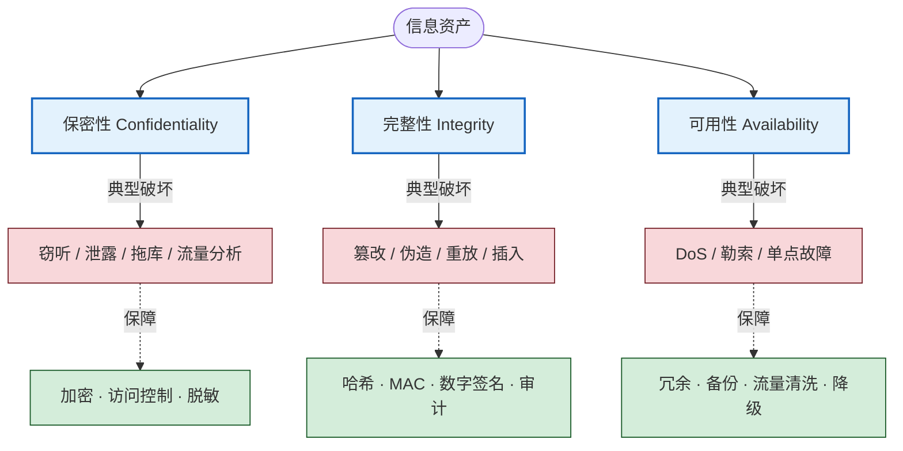

# 1.1 信息安全三大目标：保密性、完整性、可用性

> [!abstract] 本节概述
> 信息安全的一切机制——加密、认证、访问控制、审计、容灾——最终都服务于几个可度量的"安全目标"。其中最经典、最基础的是 **CIA 三要素**：保密性（Confidentiality）、完整性（Integrity）、可用性（Availability）。本节明确三者的定义、判定方法与对应威胁，并扩展到认证性、授权、不可否认性、可追溯性等附加属性，最后讨论它们之间的张力与权衡。理解 CIA 是后续 [[1.2 信息安全威胁、风险、漏洞、攻击分类|威胁建模]] 与 [[1.3 信息安全模型、安全体系框架|安全体系设计]] 的前提。

## 一、为什么需要"安全目标"

"安全"本身是一个模糊词。在没有明确目标时，无法判断系统"是否安全"，也无法选择防御措施。安全目标的作用是：

1. 把模糊的"要安全"翻译成**可验证的属性**（如"数据未被未授权读取"）。
2. 为威胁分类提供映射轴——每种威胁破坏哪个属性。
3. 为安全机制选型提供依据——每个机制保障哪个属性。

> [!info] 资产、信任边界与安全目标
> 本节讨论的安全目标都隐含一个语境：存在**信息资产**（数据、服务、凭证），存在**信任边界**（内部可信域 / 外部不可信域），存在**攻击者能力**（如可监听网络、可投递恶意输入、可物理接触设备）。脱离这三个前提谈"保密性"没有意义——这是本库 [[AGENTS]] 与网络与安全局部规则要求的安全笔记要素。

## 二、CIA 三要素

> [!definition] CIA 三要素
> CIA 三要素（CIA Triad）是信息安全最基础的目标框架，由三个相互独立的属性构成：
> - **保密性（Confidentiality）**：信息仅被授权的实体在授权的方式下访问，不被未授权方获取。
> - **完整性（Integrity）**：信息在存储、传输和处理过程中保持准确与完整，不被未授权地修改、插入、删除或伪造，且其变更可被检测。
> - **可用性（Availability）**：授权实体在需要时能够及时、可靠地访问并使用信息和资源。

### 2.1 保密性（Confidentiality）

保密性回答"**谁能看**"的问题。判定要点：

- **授权粒度**：主体（用户/进程）对客体（文件/字段）的访问是否在授权范围内。
- **泄漏途径**：不仅是读取，还包括**流量分析、侧信道、残留数据**等间接推断。
- **时效性**：保密性有有效期，过期密钥与失效凭证需及时撤销。

> [!example] 保密性的破坏场景
> - 网络嗅探明文 HTTP 传输的会话 Cookie → 会话劫持
> - 数据库拖库：未授权批量导出用户表
> - 打印机缓存中残留的涉密文档被恢复

**保障手段**：对称/非对称加密、TLS 传输加密、访问控制（ACL/RBAC）、密钥管理（[[MOC - 第2章|密码学基础]]）、数据脱敏与最小化。

### 2.2 完整性（Integrity）

完整性回答"**能不能改**"和"**改了能不能被发现**"的问题。注意完整性包含两层含义：

1. **防止未授权修改**：阻止篡改发生。
2. **检测未授权修改**：即使篡改发生，也能被发现并定位。

> [!note] 完整性 ≠ 防止篡改
> 完整性并不要求"绝对不可改"——授权主体本就需要修改数据。关键是**变更必须可追溯、可验证**，未授权变更必须可检测。哈希与数字签名解决"检测"，访问控制解决"防止"。

**保障手段**：密码学哈希（SHA-256）、消息认证码（HMAC）、数字签名、版本控制与审计日志、写前校验（如双记账、对账）。

### 2.3 可用性（Availability）

可用性回答"**用得了用不了**"的问题。它常被忽视，但对业务连续性至关重要。判定要点：

- **服务等级**：响应时间、吞吐量、成功率是否满足承诺（SLA）。
- **抗毁性**：在故障或攻击下能否降级运行而非完全瘫痪。
- **恢复性**：故障后的恢复时间目标（RTO）与恢复点目标（RPO）。

> [!example] 可用性的破坏场景
> - DDoS 攻击耗尽带宽或连接表，导致正常用户无法访问
> - 勒索软件加密业务数据，系统虽在线但数据不可用
> - 单点故障：核心数据库宕机无备用节点

**保障手段**：冗余与负载均衡、备份与容灾（双活/异地）、DDoS 流量清洗、限流与降级、容量规划。

### 2.4 CIA 关系图



## 三、扩展安全属性

CIA 是最小集，工程实践中常扩展为六到八个属性。下表区分六个易混概念——按网络与安全局部规则，**不得用"安全"替代这些具体保证**。

| 属性 | 英文 | 解决的问题 | 典型机制 | 与 CIA 的关系 |
| ---- | ---- | ---------- | -------- | -------------- |
| 认证性 | Authentication | 实体身份是否真实 | 口令、证书、MFA | 保密性/完整性的前置 |
| 授权 | Authorization | 实体能做什么 | RBAC、ACL、ABAC | 保密性/可用性的执行 |
| 不可否认性 | Non-repudiation | 行为发生后能否抵赖 | 数字签名、审计日志 | 完整性的延伸 |
| 可追溯性 | Traceability | 行为能否被回溯定位 | 审计日志、链路标记 | 责任认定基础 |
| 可信性 | Trustworthiness | 系统行为是否符合预期 | 可信计算、远程证明 | 完整性的系统层 |

> [!tip] 认证 ≠ 授权
> 这是最高频的混淆点：
> - **认证（Authentication）**回答"你是谁"——验证身份真实性。
> - **授权（Authorization）**回答"你能做什么"——决定访问权限。
> 认证通过不代表授权通过；登录成功（认证）后仍可能因越权被拒绝（授权失败）。

> [!definition] 不可否认性（Non-repudiation）
> 不可否认性指行为发起方事后**不能合理地否认**自己曾发起该行为。它依赖数字签名（发送方不可否认）与审计日志/签收凭证（接收方不可否认），是电子合同、电子发票等业务的法律基础。

## 四、CIA 之间的张力与权衡

CIA 三者并非总是协同，常常相互制约。安全设计的本质是**针对具体资产和威胁做权衡**，而非同时最大化三者。

```mermaid
flowchart LR
    C[保密性↑] --|强加密/严格访问控制| T1[可用性↓<br/>开销增加/访问受阻]
    A[可用性↑] --|多副本/宽松访问| T2[保密性↓<br/>攻击面增大]
    I[完整性↑] --|强校验/审批流| T3[可用性↓<br/>流程变慢]
    C --|加密/签名| I2[完整性↑ 同步增强]
    I --|签名| N[不可否认性↑]

    classDef goal fill:#e3f2fd,stroke:#1565c0,stroke-width:2px
    classDef trade fill:#fff3cd,stroke:#856404,stroke-width:1px
    classDef gain fill:#d4edda,stroke:#155724,stroke-width:1px
    class C,A,I goal
    class T1,T2,T3 trade
    class I2,N gain
```

### 4.1 安全性 vs 可用性

最典型的权衡。强化保密性（多重加密、严格访问控制、网络隔离）会降低可用性——延迟升高、误拦截合法访问、运维复杂度上升。反之，为追求高可用而开放过多入口、放松校验，会削弱保密性与完整性。

> [!example] 强认证的代价
> 银行网银引入短信验证码 + U 盾 + 人脸识别三因素认证，显著提升认证强度，但：
> - 用户在弱网环境下收不到验证码 → 可用性下降
> - 老年用户操作困难 → 可达性下降
> - 风控误拦截导致正常转账被拦 → 业务损失
> 设计需在风险等级与便利性间分层：小额免验、大额强验。

### 4.2 完整性 vs 性能

完整性校验（签名、对账、写前校验）带来计算与流程开销。实时强校验可能拖垮高吞吐场景，需用批校验、异步对账折中。

### 4.3 权衡的原则

1. **风险导向**：高价值资产优先保密性/完整性，业务连续性优先可用性。
2. **分层分域**：不同区域用不同权重，核心库重保密，边缘接入重可用。
3. **量化指标**：用 RTO/RPO、误拦截率、延迟增量等度量权衡结果，避免拍脑袋。

## 五、案例：银行系统的 CIA 分析

> [!example] 银行系统 CIA 三要素分析
>
> **资产**：客户账户数据、交易流水、身份凭证（密码/PIN）、支付指令、风控规则。
> **信任边界**：银行内网（可信）／互联网客户端与 ATM（不可信）／第三方支付通道（半可信）。
> **攻击者能力**：可发起任意网络请求、可物理接触 ATM、可对社会工程用户。
>
> | 属性 | 保护对象 | 威胁 | 保障措施 |
> | ---- | -------- | ---- | -------- |
> | 保密性 | 卡号、密码、余额、流水 | 拖库、中间人窃听、侧信道 | TLS 传输加密、数据库字段级加密、PIN 由 HSM 硬件加密、屏显脱敏（仅末四位） |
> | 完整性 | 交易金额、收款账号、流水序号 | 篡改金额、重放支付指令、伪造流水 | 数字签名、MAC、双记账复式记账、日终对账、幂等控制 |
> | 可用性 | 网银、ATM、柜面系统 | DDoS、勒索、单点故障 | 双活数据中心、DDoS 流量清洗、降级方案（断网下 ATM 限额服务）、异地灾备 |
>
> **权衡实例**：
> - 大额转账强制 U 盾 + 人脸 + 短信三因素，提升认证强度但牺牲便利性（可用性↓）。
> - 为保障 7×24 可用性而保留冗余入口，攻击面相应增大（保密性↓），用 WAF 与风控弥补。
> - 完整性优先于实时性：跨行转账采用异步清算与日终对账，避免强实时校验拖垮吞吐。

## 六、易错点

> [!warning] 常见误区
> 1. **把"加密"等同于"安全"**：加密只保障保密性，不解决完整性（需 MAC/签名）和可用性。
> 2. **完整性 = 不可修改**：完整性允许授权修改，关键是变更可追溯、未授权变更可检测。
> 3. **忽视可用性**：CIA 中可用性常被低估，但勒索软件、DDoS 的现实危害正是破坏可用性。
> 4. **认证与授权混用**：登录成功不等于有权访问，必须区分。
> 5. **脱离资产与威胁谈 CIA**：CIA 是目标不是措施，需结合资产价值和威胁模型落地。

## 章节导航

- 上级：[[MOC - 第1章|第1章 信息安全基础概论]]
- 下一节：[[1.2 信息安全威胁、风险、漏洞、攻击分类|1.2 威胁、风险、漏洞、攻击分类]]
- 习题：[[MOC - 第1章习题|第1章 习题]]
