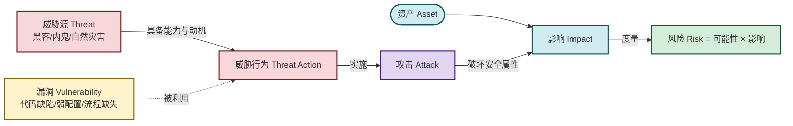
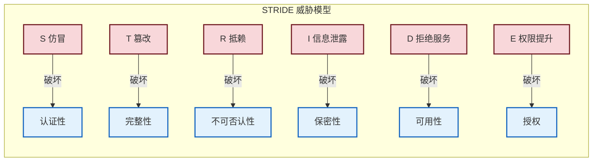

# 1.2 信息安全威胁、风险、漏洞、攻击分类

> [!abstract] 本节概述
> 上一节定义了"要保护什么"（[[1.1 信息安全三大目标：保密性、完整性、可用性|CIA 与扩展属性]]），本节回答"被谁、以什么方式、利用什么破坏"。本节厘清四个易混概念——**威胁、风险、漏洞、攻击**——及其因果关系，介绍微软 **STRIDE** 威胁分类模型，区分**被动攻击与主动攻击**，并用 Equifax 数据泄露事件做完整分析。本节是 [[1.3 信息安全模型、安全体系框架|安全体系设计]] 与 [[1.4 信息安全生命周期管理|风险管理]] 的输入。

## 一、四个核心概念与关系

> [!definition] 威胁、漏洞、风险、攻击
> - **威胁（Threat）**：可能对资产造成损害的潜在原因，由**威胁源（谁）**和**威胁行为（怎么做）**构成。如"外部攻击者利用漏洞拖库"。
> - **漏洞（Vulnerability）**：系统中可被威胁利用的**弱点**，存在于代码、配置、流程或人员。如未打补丁的组件、弱口令、缺乏审计。
> - **风险（Risk）**：威胁利用漏洞导致资产受损的**可能性与影响的组合**。风险是度量值，不是具体行为。
> - **攻击（Attack）**：威胁源**实际实施**的、试图破坏安全属性的恶意行为。攻击是风险的现实化。

四者关系可概括为：

$$
\text{风险} = P(\text{威胁利用漏洞}) \times \text{影响}
$$

> [!info] 概念区分要点
> - **漏洞是系统内部的弱点**，**威胁是外部的潜在危害源**——两者独立存在，只有"威胁遇上漏洞"才形成风险。
> - **风险是事前度量**，**攻击是事中/事后行为**。一次未发生攻击前，只能谈风险；攻击发生后，影响已落实。
> - **零漏洞 ≠ 零风险**：还存在配置错误、人员社工、供应链等非漏洞类风险。

### 1.1 威胁-漏洞-攻击关系图

### 1.2 风险的度量与等级

风险评级常用**风险矩阵**：横轴为可能性（低/中/高），纵轴为影响（低/中/高），交叉得风险等级（可接受 / 需关注 / 不可接受）。处置策略有四种：**降低（Mitigate）、转移（Transfer）、接受（Accept）、规避（Avoid）**——详见 [[1.4 信息安全生命周期管理|1.4 风险评估流程]]。

## 二、STRIDE 威胁模型

STRIDE 是微软提出的威胁分类法，把威胁按"破坏的安全属性"分为六类，便于系统化枚举。

> [!definition] STRIDE 六类威胁
> STRIDE 是六类威胁英文首字母的缩写，每类对应一个安全属性：
>
> | 字母 | 威胁 | 中文 | 破坏的属性 | 典型场景 |
> | ---- | ---- | ---- | ---------- | -------- |
> | S | Spoofing | 身份仿冒 | 认证性 | 冒充他人登录、伪造 IP |
> | T | Tampering | 篡改 | 完整性 | 修改传输数据、改库 |
> | R | Repudiation | 抵赖 | 不可否认性 | 否认下过单、签过名 |
> | I | Information Disclosure | 信息泄露 | 保密性 | 拖库、报错泄露、越权读 |
> | D | Denial of Service | 拒绝服务 | 可用性 | DDoS、耗尽连接 |
> | E | Elevation of Privilege | 权限提升 | 授权 | 提权到 root、越权管理 |

> [!tip] STRIDE 的工程用法
> 在系统设计评审中，对每个**数据流/组件/信任边界**逐一过 STRIDE 六问："这里会不会被仿冒？会不会被篡改？……"，从而把"找威胁"变成可执行的清单，避免凭经验遗漏。

## 三、攻击分类：被动攻击 vs 主动攻击

按是否修改系统资源，攻击分为两类。这是本课程后续 [[MOC - 第4章|第4章 网络攻击与防御技术]] 的分类基础。

> [!definition] 被动攻击 vs 主动攻击
>
> | 维度 | 被动攻击（Passive） | 主动攻击（Active） |
> | ---- | ------------------- | ------------------ |
> | 核心行为 | 只监听/分析，不改系统 | 修改/伪造/中断系统资源 |
> | 典型手段 | 嗅探、流量分析、窃听 | 篡改、伪造、重放、DDoS、提权 |
> | 对 CIA 的破坏 | 主要破坏保密性 | 破坏完整性、可用性（也可破坏保密性） |
> | 检测难度 | 极难（无行为异常） | 相对容易（有异常特征） |
> | 防御重点 | 加密传输、流量混淆 | 入侵检测、访问控制、完整性校验 |

> [!note] 为什么被动攻击难检测
> 被动攻击不产生任何"偏离正常"的行为，受害者无法从系统日志发现。因此对被动攻击的防御思路是**预防（加密）而非检测**——即使被监听，攻击者也无法读懂密文。这与主动攻击"重在检测与响应"的思路相反。

### 3.1 其他常见攻击分类轴

- **按攻击面**：网络层攻击（DDoS、ARP 欺骗）、应用层攻击（SQL 注入、XSS）、物理攻击（旁路、硬件篡改）、社会工程攻击（钓鱼）。
- **按攻击者位置**：远程攻击 / 本地攻击 / 物理接触攻击。
- **按发起方式**：直接攻击 / 通过中间节点（如僵尸网络）。
- **按是否需要认证**：未认证攻击（可匿名触发）/ 认证后攻击（需先获得低权限账户）。

> [!warning] 安全声明
> 本节及后续章节出现的所有攻击技术、扫描命令、漏洞利用方法**仅供授权实验环境使用**，须写明目标范围、风险评估与恢复方法，禁止用于未授权的真实第三方目标。

## 四、案例：Equifax 数据泄露事件分析

> [!example] Equifax 2017 数据泄露事件
>
> **事件概述**：2017 年 9 月，美国三大征信机构之一 Equifax 披露数据泄露，约 **1.47 亿美国人**的姓名、社会安全号（SSN）、出生日期、地址、部分信用卡号被窃。这是美国迄今规模最大的征信数据泄露之一。
>
> **资产与信任边界**：
> - 资产：消费者征信数据库、争议查询门户（在线争议系统 Apache Struts2 应用）
> - 信任边界：互联网用户（不可信）→ Web 应用 → 内网数据库（可信）
> - 攻击者能力：可从互联网访问 dispute 门户，可投递恶意 HTTP 请求
>
> **威胁、漏洞、攻击链映射**：
>
> | 概念 | 本案体现 |
> | ---- | -------- |
> | 漏洞 | Apache Struts2 CVE-2017-5638（OGNL 远程代码执行），Equifax 未及时打补丁（补丁发布后逾两个月未修复） |
> | 威胁 | 外部攻击者具备 RCE 利用能力与拖库动机 |
> | 攻击 | 通过恶意 Content-Type 头触发 OGNL 注入 → 获取 Web 服务器 shell → 横向移动 → 拖库 |
> | 风险 | 极高可能性（漏洞已公开 PoC）× 极高影响（SSN 等核心身份信息）= 不可接受风险 |
> | 破坏的属性 | 保密性（数据被读走）、完整性（攻击者可能篡改日志掩盖痕迹）、不可否认性受损（审计被清理） |
>
> **根本原因**：
> 1. **补丁管理失效**：漏洞公告与补丁已发布，但未在 SLA 内完成修复。
> 2. **资产可见性差**：安全团队不清楚哪些系统用了 Struts2，无法精准定位受影响面。
> 3. **检测失效**：攻击持续逾两个月，IDS/WAF 未能识别 OGNL 利用流量；SSL 设备解密流量未及监控。
> 4. **凭据管理薄弱**：明文存储数据库凭据，攻击者获取后直接拖库。
>
> **缓解与整改**：
> - 建立资产清单与组件级漏洞扫描（SCA），对第三方组件做依赖追踪
> - 缩短补丁 SLA，对公开 RCE 漏洞 72 小时内修复
> - 部署 WAF 规则与流量解密监控，覆盖 OGNL/反序列化特征
> - 数据库凭据加密存储、最小权限、网络隔离
> - 引入 STRIDE 评审在线争议系统的信任边界
>
> **教训**：本案例不是"加密不够"，而是**漏洞与补丁管理、资产可见性、检测响应**的综合失败。它说明安全是 [[1.4 信息安全生命周期管理|生命周期管理]] 的持续过程，而非一次性建设。

## 五、易错点

> [!warning] 常见误区
> 1. **威胁 = 漏洞**：威胁是外部危害源，漏洞是内部弱点，两者必须区分。
> 2. **风险 = 攻击**：风险是事前度量，攻击是事后行为；有风险未必有攻击，但无风险隐患也应处置。
> 3. **STRIDE 只对应 CIA**：STRIDE 还覆盖认证、授权、不可否认性，不要只记 CIA 三项。
> 4. **被动攻击可被检测**：被动攻击几乎不可检测，应靠加密预防。
> 5. **漏洞修补即安全**：还需考虑配置、人员、供应链等非代码漏洞。

## 章节导航

- 上级：[[MOC - 第1章|第1章 信息安全基础概论]]
- 上一节：[[1.1 信息安全三大目标：保密性、完整性、可用性|1.1 CIA 三要素]]
- 下一节：[[1.3 信息安全模型、安全体系框架|1.3 安全模型、安全体系框架]]
- 习题：[[MOC - 第1章习题|第1章 习题]]
