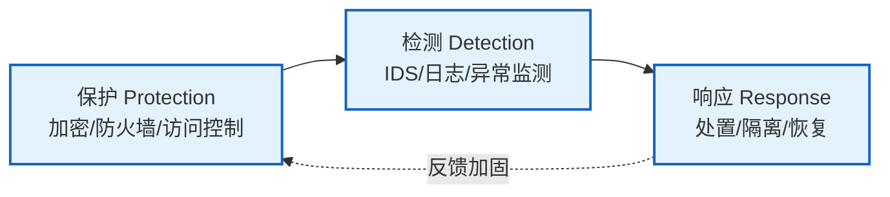
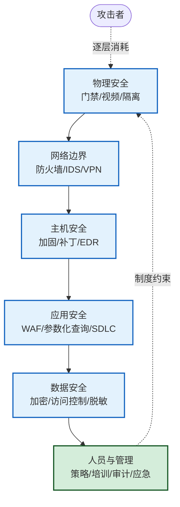

# 1.3 信息安全模型、安全体系框架

> [!abstract] 本节概述
> 明确了 [[1.1 信息安全三大目标：保密性、完整性、可用性|安全目标]] 与 [[1.2 信息安全威胁、风险、漏洞、攻击分类|威胁分类]] 后，需要一个把目标、威胁、机制组织起来的"骨架"——安全模型与体系框架。本节介绍经典的 **PDR / PPDR 动态模型**、**深度防御（Defense in Depth）** 策略，以及 **OSI 安全体系结构**（五类安全服务 + 八类安全机制），并说明它们如何映射到工程实践。模型不是装饰，而是指导"在哪一层、用什么机制、防什么威胁"的决策工具。

## 一、PDR 模型：最早的动态安全模型

> [!definition] PDR 模型
> PDR（Protection-Detection-Response）模型把安全看作一个动态闭环：**保护（P）→ 检测（D）→ 响应（R）**。它承认没有绝对牢不可破的保护，因此用检测发现绕过保护的攻击，用响应把损失控制在最小。



### 1.1 PDR 的时间理论

PDR 用三个时间量衡量安全性：

- $P_t$：保护时间，即攻击者突破保护所需时间。
- $D_t$：检测时间，即从攻击发生到被检测到的时间。
- $R_t$：响应时间，即从检测到处置完成的时间。

> [!tip] 安全性判定公式
> 若 $P_t > D_t + R_t$，即"突破保护的时间长于检测+响应的时间"，则系统在该攻击场景下是**安全的**——攻击尚未得手就被发现并处置。提升安全的途径有三：增大 $P_t$（加固保护）、减小 $D_t$（更快检测）、减小 $R_t$（更快响应）。

> [!note] PDR 的局限
> PDR 假设保护总会被绕过，但未明确"依据什么策略保护"。它也忽略了威胁是持续演化的——这促成了 PPDR 的出现。

## 二、PPDR 模型：策略驱动的动态模型

> [!definition] PPDR 模型
> PPDR（Policy-Protection-Detection-Response）在 PDR 前加入**策略（Policy）**作为核心。策略定义资产、威胁、风险等级与可接受行为，保护/检测/响应都**围绕策略执行**。模型强调安全是随威胁演化而持续调整的过程。

```mermaid
flowchart TB
    Pol[策略 Policy<br/>资产分级/威胁评估/合规要求] --> P[保护 Protection]
    Pol --> D[检测 Detection]
    Pol --> R[响应 Response]
    P --> D
    D --> R
    R --|调整策略与防护| Pol

    classDef core fill:#fff3cd,stroke:#856404,stroke-width:2px
    classDef stage fill:#e3f2fd,stroke:#1565c0,stroke-width:2px
    class Pol core
    class P,D,R stage
```

> [!example] 策略如何驱动三阶段
> 某企业策略规定"核心交易库为 4 级资产，须 7×24 在线，RTO≤15 分钟"。据此：
> - **保护**：数据库网络隔离 + 字段加密 + 最小权限；
> - **检测**：部署数据库审计 + 异常查询监测，$D_t$ 目标 ≤ 5 分钟；
> - **响应**：自动隔离异常会话 + 切换灾备，$R_t$ 目标 ≤ 10 分钟。
> 三阶段指标都从策略反推，而非各自为政。

### PDR 与 PPDR 对比

| 维度 | PDR | PPDR |
| ---- | --- | ---- |
| 核心驱动 | 时间公式 $P_t > D_t + R_t$ | 策略统一驱动 |
| 是否动态 | 是 | 是，且强调持续调整 |
| 适用场景 | 已有保护措施的运营阶段 | 全生命周期，含策略制定 |
| 关键贡献 | 引入检测/响应闭环 | 引入策略中枢，闭环反馈调整 |

## 三、深度防御（Defense in Depth）

> [!definition] 深度防御
> 深度防御（Defense in Depth）主张**不依赖任何单一安全措施**，而是在从物理到管理的多个层级部署互补的机制。任一层被突破，后续层仍能延缓或阻断攻击，从而把"单点失效"变成"多层叠加"。



> [!tip] 深度防御的设计原则
> 1. **异构冗余**：不同层用不同技术（如网络层防火墙 + 应用层 WAF），避免同源失效。
> 2. **失败安全（Fail-Safe）**：任一层失效时默认拒绝而非放行。
> 3. **最小权限**：每层只授予完成任务所需的最小权限。
> 4. **可观测**：每层都产生日志，支撑跨层关联分析。

> [!note] 深度防御 ≠ 简单堆砌
> 深度防御不是"越多越好"。盲目堆叠会造成运维复杂、误报增多、性能下降。正确做法是按威胁建模结果，在**攻击链的关键节点**部署互补机制，并保证层间可协同（如 SIEM 汇聚多层日志）。

## 四、OSI 安全体系结构

OSI 安全体系结构（ITU-T X.800 / ISO 7498-2）从**安全服务**与**安全机制**两个维度规范安全能力，是理解"在哪里提供什么保护"的经典框架。

### 4.1 五类安全服务

> [!definition] 五类安全服务
> X.800 定义五类安全服务，恰好覆盖 [[1.1 信息安全三大目标：保密性、完整性、可用性|CIA 与扩展属性]]：
>
> | 服务 | 英文 | 含义 | 对应属性 |
> | ---- | ---- | ---- | -------- |
> | 认证 | Authentication | 对等实体认证 / 数据起源认证 | 认证性 |
> | 访问控制 | Access Control | 限制主体对资源的使用 | 授权 |
> | 数据保密性 | Data Confidentiality | 防止未授权披露（含连接/无连接/选择字段） | 保密性 |
> | 数据完整性 | Data Integrity | 检测未授权修改（含恢复/无恢复） | 完整性 |
> | 不可否认 | Non-repudiation | 防止发送方/接收方抵赖 | 不可否认性 |

> [!info] 可用性在哪？
> X.800 的五类服务以"信息保护"为主，**可用性**未单列为一类服务，而是通过审计、恢复等机制与工程冗余间接保障。现代教材常把可用性作为第六类补充。考试作答时需注意：严格按 X.800 是五类，含可用性的六类是扩展提法。

### 4.2 八类安全机制

> [!definition] 八类安全机制
> X.800 列出八类**特定安全机制**，用于实现上述服务：
>
> | 机制 | 英文 | 典型用途 |
> | ---- | ---- | -------- |
> | 加密 | Encipherment | 保密性、部分完整性 |
> | 数字签名 | Digital Signature | 完整性、认证、不可否认 |
> | 访问控制 | Access Control | 授权 |
> | 数据完整性 | Data Integrity | 完整性校验 |
> | 认证交换 | Authentication Exchange | 认证 |
> | 流量填充 | Traffic Padding | 防流量分析 |
> | 路由控制 | Routing Control | 选择安全路径 |
> | 公证 | Notarization | 不可否认（第三方见证） |
>
> 此外还有**普遍安全机制**：可信功能、安全标签、事件检测、安全审计跟踪、安全恢复——它们不针对某一层，而是跨层支撑。

### 4.3 服务、机制与 OSI 层的映射（要点）

安全服务由特定机制实现，并落在 OSI 的某些层次上。例如：

- **加密**可在网络层（IPsec）、传输层（TLS）、应用层（应用自身加密）实现。
- **认证交换**常在传输层（TLS 握手）与应用层（HTTP 鉴权）实现。
- **数据完整性**可由 MAC/哈希在网络层及以上各层实现。
- **访问控制**多在应用层与系统层实现（RBAC、ACL）。

> [!tip] 不要把服务、机制、层次混为一谈
> - "服务"是要达成的安全目标（如数据完整性）；
> - "机制"是实现手段（如 HMAC）；
> - "层次"是部署位置（如传输层）。
> 一次具体实现（如 TLS 中的 HMAC）同时涉及三者：提供完整性服务、用数据完整性机制、部署在传输层。

## 五、案例：企业安全架构实践

> [!example] 某企业安全架构的模型落地
>
> **背景**：一家中型互联网企业，核心业务为在线交易，需满足等保 2.0 三级要求。
>
> **以 PPDR 为骨架组织安全能力**：
>
> | 阶段 | 策略依据 | 落地能力 |
> | ---- | -------- | -------- |
> | 策略 | 资产分级（交易库为 4 级）、威胁评估（参考 [[1.2 信息安全威胁、风险、漏洞、攻击分类|STRIDE]]）、合规（等保 2.0） | 《信息安全管理制度》《数据分级规范》 |
> | 保护 | 深度防御六层 | 防火墙 + WAF + 数据库加密 + 最小权限 + 堡垒机 |
> | 检测 | $D_t$ 目标 ≤ 5 分钟 | IDS/IPS + 数据库审计 + SIEM 跨层关联 |
> | 响应 | $R_t$ 目标 ≤ 15 分钟 | SOAR 自动隔离 + 应急响应预案 + 灾备切换 |
>
> **深度防御分层落地**：
> - **物理**：机房门禁、视频监控、专线接入。
> - **网络边界**：下一代防火墙、DMZ、Anti-DDoS。
> - **主机**：基线加固、补丁管理、EDR。
> - **应用**：SDLC 安全左移、WAF、API 网关。
> - **数据**：字段级加密、脱敏、数据库审计。
> - **管理**：安全培训、权限审批、应急演练、审计闭环。
>
> **OSI 服务的覆盖核对**：用五类服务清单核对各层是否提供对应能力——如"认证"在传输层由 TLS 提供、在应用层由 OAuth/JWT 提供；"不可否认"通过交易数字签名 + 时间戳 + 审计实现。
>
> **效果**：通过等保 2.0 三级测评；某次 0.8 Tbps DDoS 在网络层被清洗，业务 $D_t$≈2 分钟、$R_t$≈8 分钟，满足 $P_t > D_t + R_t$，未出现业务中断。

## 六、易错点

> [!warning] 常见误区
> 1. **PDR/PPDR 是产品**：它们是组织安全能力的模型，不是具体设备。
> 2. **深度防御即堆砌设备**：应是按威胁建模在攻击链关键节点的互补部署。
> 3. **OSI 五类服务含可用性**：严格 X.800 是五类，可用性通过工程冗余与恢复间接保障。
> 4. **服务 = 机制**：服务是目标，机制是手段，二者不可混同。
> 5. **PPDR 与 PDR 二选一**：PPDR 是 PDR 的策略化扩展，工程中常并用。

## 章节导航

- 上级：[[MOC - 第1章|第1章 信息安全基础概论]]
- 上一节：[[1.2 信息安全威胁、风险、漏洞、攻击分类|1.2 威胁、风险、漏洞、攻击分类]]
- 下一节：[[1.4 信息安全生命周期管理|1.4 信息安全生命周期管理]]
- 习题：[[MOC - 第1章习题|第1章 习题]]
