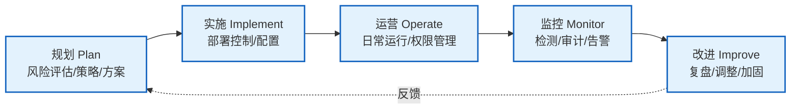
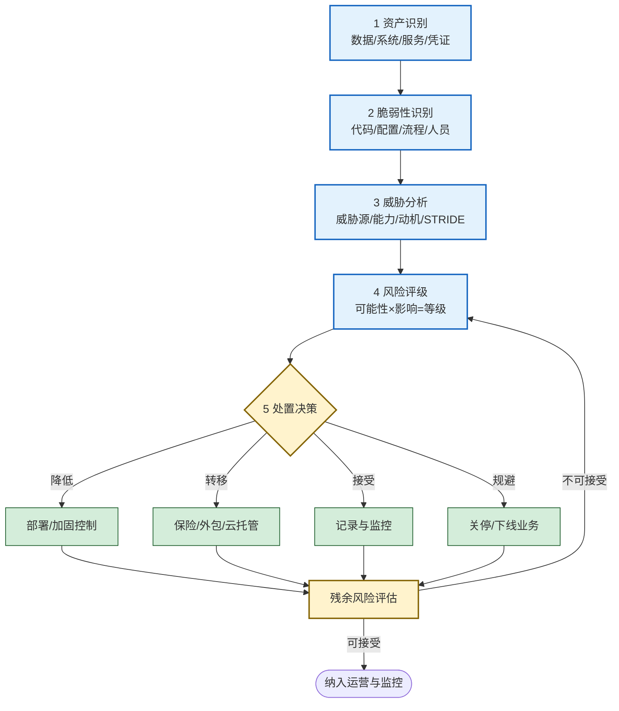
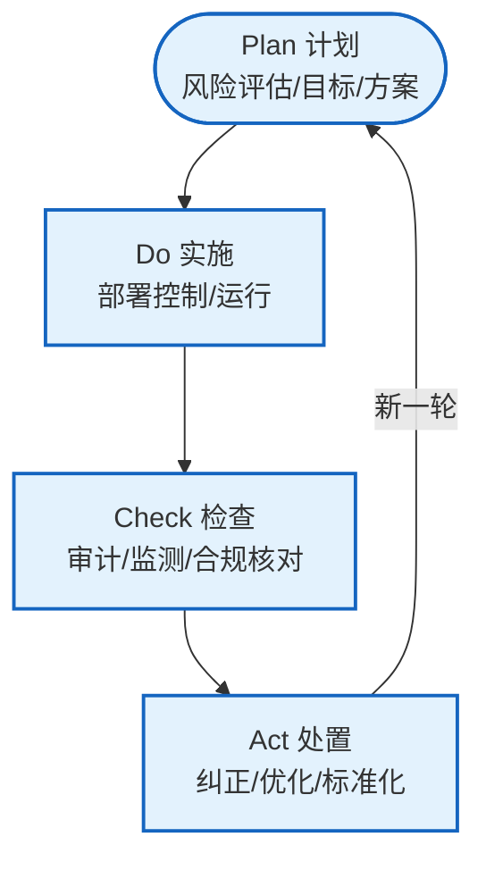

# 1.4 信息安全生命周期管理

> [!abstract] 本节概述
> 安全是持续过程而非一次性建设——这是 [[1.3 信息安全模型、安全体系框架|PPDR 模型]] "持续调整"理念的延伸。本节把信息安全组织为一个**规划 → 实施 → 运营 → 监控 → 改进**的生命周期，详述**风险评估流程**（资产识别 → 威胁分析 → 风险评级 → 处置），并用 **PDCA** 模型说明持续改进机制。第 8 章的等保 2.0 与应急响应都以生命周期管理为底座。

## 一、为什么需要生命周期管理

威胁演化、资产变动、漏洞持续被发现——任何"一次性建成"的安全体系都会随时间失效。生命周期管理的核心价值：

1. **对抗衰减**：控制措施随业务变化而失效，需周期性重新评估。
2. **闭环反馈**：把运营中发现的威胁与失效控制反哺到规划，形成改进。
3. **合规要求**：等保 2.0、ISO 27001 等均要求建立并维护持续改进的安全管理过程。

## 二、信息安全生命周期五阶段

> [!definition] 生命周期五阶段
>
> | 阶段 | 核心任务 | 关键产出 |
> | ---- | -------- | -------- |
> | 规划（Plan） | 资产识别、风险评估、制定安全策略与方案 | 资产清单、风险评估报告、安全策略 |
> | 实施（Implement） | 部署控制措施、系统加固、配置基线 | 加固后的系统、控制矩阵、上线验收 |
> | 运营（Operate） | 日常运行、权限管理、变更管理、用户支持 | 运行日志、权限台账、变更记录 |
> | 监控（Monitor） | 入侵检测、审计、告警、合规检查 | 告警事件、审计报告、合规差距 |
> | 改进（Improve） | 事件复盘、控制优化、策略调整、培训 | 改进项清单、更新后的策略与控制 |

> [!tip] 五阶段不是瀑布
> 改进阶段的输出会回流到规划，形成闭环。任一阶段发现重大变化（如新业务上线、新漏洞爆发）都可直接触发新一轮规划。把生命周期理解为**可迭代的循环**而非一次性流水线。

## 三、风险评估流程

风险评估是规划阶段的核心，也是连接 [[1.2 信息安全威胁、风险、漏洞、攻击分类|威胁/漏洞概念]] 与工程的桥梁。

### 3.1 五步详解

> [!definition] 风险评估五步
> 1. **资产识别**：清点数据、系统、服务、凭证，标注机密性/完整性/可用性要求与价值等级。
> 2. **脆弱性识别**：通过扫描、代码审计、配置核查、人员访谈找出漏洞与弱点。
> 3. **威胁分析**：识别威胁源（外部黑客/内鬼/自然/供应链），用 STRIDE 枚举威胁行为，评估其能力与动机。
> 4. **风险评级**：用风险矩阵（可能性 × 影响）对每条"威胁-漏洞-资产"组合评级，区分可接受/需关注/不可接受。
> 5. **处置决策**：按"降低/转移/接受/规避"四种策略处置，评估残余风险，不可接受则回到评级循环。

> [!example] 风险评估实例
> - **资产**：用户密码库（4 级，保密性极高）。
> - **脆弱性**：使用 MD5 无盐存储。
> - **威胁**：拖库后离线爆破。
> - **评级**：可能性中（拖库需先突破边界）、影响极高（密码泄露引发撞库）→ **不可接受**。
> - **处置**：降低——升级为 bcrypt + 强制密码复杂度 + 全量重置；残余风险：用户复用密码 → 配合"是否在已知泄露库中"检测。

### 3.2 四种处置策略

| 策略 | 含义 | 适用场景 | 注意 |
| ---- | ---- | -------- | ---- |
| 降低（Mitigate） | 部署控制降低可能性或影响 | 大多数技术风险 | 不能降到零，需评估残余风险 |
| 转移（Transfer） | 把损失后果转给第三方 | 灾难性低频风险 | 仅转移损失，不转移责任 |
| 接受（Accept） | 明确记录并持续监控 | 低影响、处置成本过高的风险 | 必须有书面记录与审批 |
| 规避（Avoid） | 停止或退出引发风险的活动 | 风险超出承受且无法降低 | 业务代价大，慎用 |

## 四、PDCA 持续改进模型

PDCA（Plan-Do-Check-Act）是 ISO 27001 等管理体系采用的持续改进循环，与生命周期五阶段高度对应。

> [!definition] PDCA 四环节
> - **Plan（计划）**：基于风险评估设定安全目标与方案（对应生命周期"规划"）。
> - **Do（实施）**：部署并运行控制措施（对应"实施 + 运营"）。
> - **Check（检查）**：审计、监测、合规核对，发现偏差（对应"监控"）。
> - **Act（处置）**：纠正偏差、优化控制、把成熟经验标准化（对应"改进"）。

> [!tip] PDCA 与 PPDR 的关系
> PDCA 是**管理体系**层面的持续改进循环；PPDR 是**技术运营**层面的动态防护闭环。两者层级不同但互补：PDCA 决定"做什么、怎么持续"，PPDR 决定"运营中如何保护-检测-响应"。成熟的组织两者并用。

### 4.1 持续改进的关键指标

- **检测时间 $D_t$、响应时间 $R_t$**：来自 [[1.3 信息安全模型、安全体系框架|PDR]]，按周期收敛。
- **补丁 SLA 达成率**：高危漏洞修复时长是否达标。
- **事件复发率**：同类事件是否重复发生，反映改进有效性。
- **控制有效性**：通过红蓝对抗、渗透测试度量控制是否实际生效。

## 五、案例：某企业安全生命周期实践

> [!example] 某企业安全生命周期与 PDCA 实践
>
> **背景**：一家 SaaS 企业，曾因第三方组件漏洞发生一次小规模数据泄露，决定建立完整的安全生命周期。
>
> **第一轮 PDCA**：
> - **Plan**：完成首次资产清点（300+ 系统）与风险评估，识别 12 项不可接受风险，制定《漏洞管理规范》（高危 7 天、严重 72 小时修复 SLA）。
> - **Do**：部署 WAF、EDR、SIEM，建立堡垒机与权限审批流；上线 SCA 做第三方组件追踪。
> - **Check**：季度渗透测试 + 月度合规核对发现：8 个系统仍存在已知高危漏洞超期，2 类接口缺审计。
> - **Act**：补丁 SLA 与绩效挂钩、补齐接口审计、把 SCA 接入 CI/CD 卡门。
>
> **第二轮 PDCA（基于监控反馈）**：
> - 触发：SIEM 发现针对 API 的异常高频查询（疑似数据爬取），$D_t$≈10 分钟、$R_t$≈30 分钟，未达策略目标。
> - Plan：增设 API 速率限制与行为基线监测，目标 $D_t$≤3 分钟、$R_t$≤10 分钟。
> - Do/Check/Act：上线后下季度红蓝对抗验证，$D_t$ 降至 2 分钟、$R_t$ 降至 8 分钟，满足 $P_t > D_t + R_t$。
>
> **持续改进闭环**：把"API 行为基线"经验标准化为通用监测模板，复用到其他业务线；每半年重做一次风险评估，对应 [[1.3 信息安全模型、安全体系框架|PPDR]] 的"策略随威胁演化调整"。
>
> **效果**：两年内未再发生数据泄露；通过 ISO 27001 认证；安全运营成本下降（自动化卡门减少人工审核）。

## 六、易错点

> [!warning] 常见误区
> 1. **风险评估是一次性项目**：资产与威胁持续变化，风险评估必须周期性重做。
> 2. **接受风险 = 不处理**：接受必须有书面记录、审批与持续监控，不是放任。
> 3. **PDCA 与 PPDR 重复**：PDCA 是管理闭环，PPDR 是技术闭环，层级不同。
> 4. **残余风险可忽略**：处置后必须评估残余风险，不可接受要继续处置。
> 5. **只建不改**：监控和审计若不回流到改进，等于没有闭环。

## 章节导航

- 上级：[[MOC - 第1章|第1章 信息安全基础概论]]
- 上一节：[[1.3 信息安全模型、安全体系框架|1.3 安全模型、安全体系框架]]
- 习题：[[MOC - 第1章习题|第1章 习题]]
