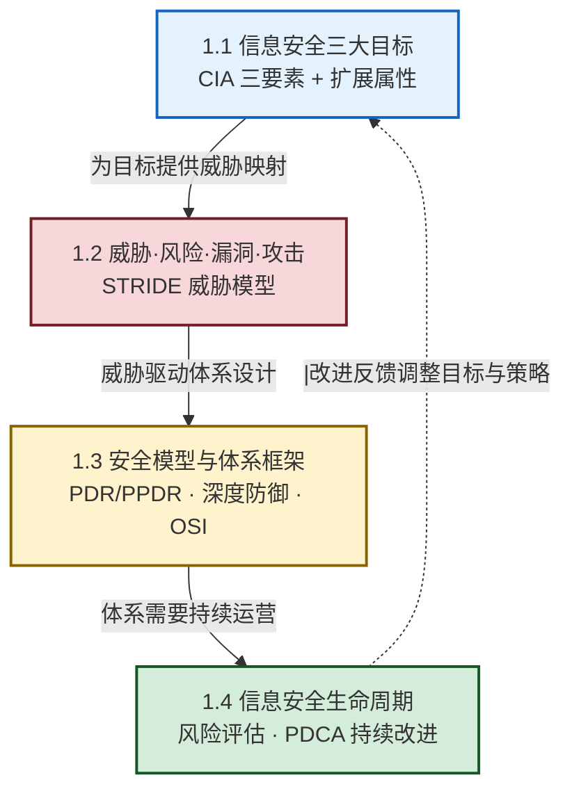

# MOC - 第1章 信息安全基础概论

> [!info] 本章定位
> 本章是整门《信息安全技术》课程的**概念地基与统一语言**。它要回答四个递进问题：要保护什么（[[1.1 信息安全三大目标：保密性、完整性、可用性|CIA 与扩展属性]]）？被谁、以什么方式破坏（[[1.2 信息安全威胁、风险、漏洞、攻击分类|威胁/风险/漏洞/攻击与 STRIDE]]）？如何把目标、威胁、机制组织成体系（[[1.3 信息安全模型、安全体系框架|PDR/PPDR、深度防御、OSI 安全体系]]）？如何让安全持续有效（[[1.4 信息安全生命周期管理|生命周期与 PDCA]]）？本章不深入具体技术，而是为后续密码学、认证、攻防等章节提供共同的"安全坐标系"。**没有这一章的共同语言，后续章节会各自为政、无法协同**。

## 学习路线图



## 知识点导航

| 小节 | 标题 | 核心内容 | 关键概念 |
| ---- | ---- | -------- | -------- |
| [[1.1 信息安全三大目标：保密性、完整性、可用性\|1.1]] | CIA 三要素 | 保密性/完整性/可用性、认证与授权、不可否认性、CIA 权衡 | CIA Triad、认证 vs 授权、安全性-可用性张力 |
| [[1.2 信息安全威胁、风险、漏洞、攻击分类\|1.2]] | 威胁·风险·漏洞·攻击 | 四概念关系、STRIDE 模型、被动/主动攻击、Equifax 案例 | STRIDE、Threat/Vulnerability/Risk/Attack、被动攻击难检测 |
| [[1.3 信息安全模型、安全体系框架\|1.3]] | 安全模型与体系框架 | PDR/PPDR、深度防御分层、OSI 五服务八机制 | $P_t > D_t + R_t$、Defense in Depth、X.800 |
| [[1.4 信息安全生命周期管理\|1.4]] | 安全生命周期 | 五阶段生命周期、风险评估五步、PDCA 持续改进 | Plan-Implement-Operate-Monitor-Improve、风险处置四策略 |

## 核心考点

> [!summary] 本章核心考点（8 点）
> 1. **CIA 三要素定义与辨析**：保密性（谁能看）、完整性（能不能改、改了能否发现）、可用性（用得了用不了），三者各自的典型威胁与保障机制——这是选择题/简答题最高频考点。
> 2. **认证 ≠ 授权**：认证回答"你是谁"，授权回答"你能做什么"；登录成功不等于有权访问。扩展属性还包括不可否认性、可追溯性、可信性。
> 3. **威胁/漏洞/风险/攻击四概念关系**：漏洞是内部弱点、威胁是外部危害源，"威胁遇上漏洞"才形成风险；风险 = 可能性 × 影响；攻击是风险的现实化。
> 4. **STRIDE 六类威胁与安全属性映射**：S 仿冒→认证、T 篡改→完整性、R 抵赖→不可否认、I 信息泄露→保密性、D 拒绝服务→可用性、E 权限提升→授权。
> 5. **被动攻击 vs 主动攻击**：被动攻击只监听不改、主要破坏保密性、极难检测（靠加密预防）；主动攻击修改/伪造/中断、破坏完整性与可用性、相对可检测（靠检测响应）。
> 6. **PDR/PPDR 模型与时间公式**：PPDR 在 PDR 前加策略；安全性判定 $P_t > D_t + R_t$，提升安全的三个方向（增大 $P_t$、减小 $D_t$、减小 $R_t$）。
> 7. **深度防御与 OSI 安全体系**：深度防御是多层互补、失败安全、最小权限；OSI 五类安全服务（认证/访问控制/保密性/完整性/不可否认）与八类安全机制（加密/签名/访问控制/完整性/认证交换/流量填充/路由控制/公证）。
> 8. **安全生命周期与 PDCA**：五阶段（规划-实施-运营-监控-改进）是可迭代闭环；风险评估五步（资产识别-脆弱性识别-威胁分析-风险评级-处置）；风险处置四策略（降低/转移/接受/规避）；PDCA 是管理闭环、PPDR 是技术闭环。

## 本章贯穿线索

```mermaid
flowchart LR
    Goal[1.1 安全目标<br/>要保护什么] --> Threat[1.2 威胁分析<br/>被谁怎么破坏]
    Threat --> Model[1.3 安全体系<br/>如何组织防御]
    Model --> LC[1.4 生命周期<br/>如何持续有效]
    LC -.|改进反馈| Goal

    Goal -.- Crypto[[MOC - 第2章|第2章 密码学]]
    Goal -.- Auth[[MOC - 第3章|第3章 认证与访问控制]]
    Threat -.- Attack[[MOC - 第4章|第4章 网络攻防]]
    Model -.- Protocol[[MOC - 第7章|第7章 安全通信协议]]
    LC -.- Law[[MOC - 第8章|第8章 法律法规与运维]]

    classDef ch fill:#e3f2fd,stroke:#1565c0,stroke-width:2px
    classDef rel fill:#d4edda,stroke:#155724,stroke-width:1px
    class Goal,Threat,Model,LC ch
    class Crypto,Auth,Attack,Protocol,Law rel
```

> [!tip] 后续章节如何承接本章
> - **第 2 章 密码学**：提供 1.1 中"保密性/完整性/不可否认性"的核心机制（加密、哈希、签名）。
> - **第 3 章 认证与访问控制**：实现 1.1 的认证性与授权、1.3 的访问控制服务。
> - **第 4 章 网络攻防**：展开 1.2 的攻击分类与对应防御。
> - **第 7 章 安全通信协议**：在 OSI 各层落地 1.3 的安全服务。
> - **第 8 章 法律与运维**：把 1.4 的生命周期落到合规与应急响应。

## 章节导航

> [!nav] 导航
> 上级：[[MOC - 信息安全技术|课程总览]]
> 下一章：[[MOC - 第2章|第2章 密码学基础]]（用密码学机制实现本章的安全目标）
> 配套习题：[[MOC - 第1章习题|第1章 习题]]
