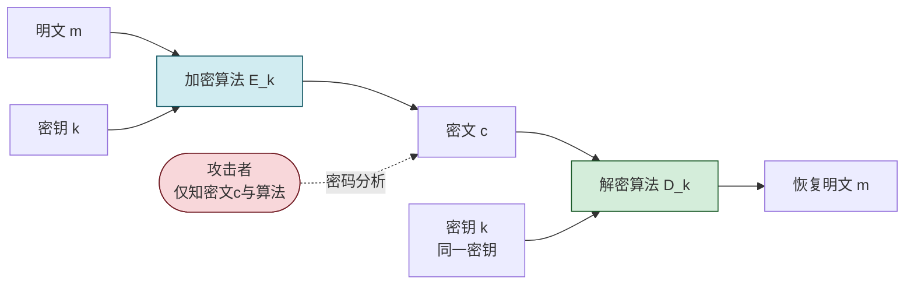
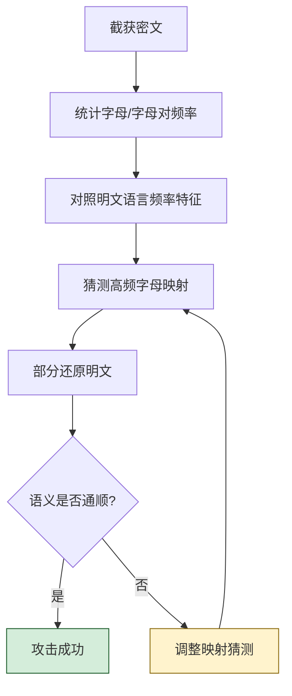

# 2.1 古典密码：移位密码、置换密码

> [!abstract] 本节概述
> 古典密码是现代密码学的思想源头。本节建立密码学基本模型（明文、密文、密钥、加密、解密五元组），介绍两类最基础的变换——**代换（Substitution，改变字符本身）** 与 **置换（Permutation，改变字符位置）**，并以凯撒密码、维吉尼亚密码和列置换密码为例说明。最后通过频率分析说明为何这些密码在现代已不安全，引出对更强算法和柯克霍夫原则的需要。

## 密码学基本概念

> [!definition] 密码学五元组
> 一个密码体制可用五元组 $(\mathcal{P}, \mathcal{C}, \mathcal{K}, \mathcal{E}, \mathcal{D})$ 描述：
> - $\mathcal{P}$ 明文空间（Plaintext space）：所有可能的明文集合。
> - $\mathcal{C}$ 密文空间（Ciphertext space）：所有可能的密文集合。
> - $\mathcal{K}$ 密钥空间（Key space）：所有可能的密钥集合。
> - $\mathcal{E}$ 加密算法（Encryption）：$\mathcal{E}_k: \mathcal{P} \to \mathcal{C}$，由密钥 $k$ 参数化。
> - $\mathcal{D}$ 解密算法（Decryption）：$\mathcal{D}_k: \mathcal{C} \to \mathcal{P}$，且对任意 $m \in \mathcal{P}$ 有 $\mathcal{D}_k(\mathcal{E}_k(m)) = m$。

| 术语 | 英文 | 含义 |
| ---- | ---- | ---- |
| 明文 | Plaintext | 未加密的原始信息，记作 $m$ 或 $P$ |
| 密文 | Ciphertext | 加密后的不可读信息，记作 $c$ 或 $C$ |
| 密钥 | Key | 控制加解密行为的参数，记作 $k$ 或 $K$ |
| 加密 | Encryption | $c = E_k(m)$ |
| 解密 | Decryption | $m = D_k(c)$ |
| 密码分析 | Cryptanalysis | 在不知密钥下从密文恢复明文的攻击 |

> [!note] 柯克霍夫原则（Kerckhoffs's Principle）
> 密码系统的安全性应**只依赖于密钥的保密**，而不依赖于算法的保密。即使加密算法、解密算法和系统设计全部公开，只要密钥未泄露，系统仍应是安全的。这是现代密码学区别于"隐蔽式安全"（security by obscurity）的根本准则。

## 古典加密流程

> [!tip] 代换 vs 置换
> - **代换密码（Substitution Cipher）**：改变字符本身，但字符位置不变。如 A→D、B→E。
> - **置换密码（Permutation/Transposition Cipher）**：字符本身不变，只改变字符位置。如 `HELLO`→`LEHOL`。
> 现代分组密码（如 AES）实际上是代换与置换的多轮组合（SPN 结构）。

## 移位密码（凯撒密码）

> [!definition] 凯撒密码（Caesar Cipher）
> 凯撒密码是最简单的单表代换密码，将字母表中每个字母向后移动固定的 $k$ 位。$k$ 即为密钥，取值范围 $0 \sim 25$。

设字母 A~Z 映射为 $0 \sim 25$，明文字母 $x$ 的加解密为：

$$
E_k(x) = (x + k) \bmod 26 \quad (\text{加密})
$$

$$
D_k(y) = (y - k) \bmod 26 \quad (\text{解密})
$$

其中 $k$ 为密钥，$x$ 为明文数字，$y$ 为密文数字。

> [!example] 凯撒密码加解密示例（$k=3$）
> 明文：`HELLO` → 数字：`7 4 11 11 14`
>
> 加密：$(7+3)\bmod26=10,\ (4+3)\bmod26=7,\ (11+3)\bmod26=14,\ (14+3)\bmod26=17$
>
> 密文：`KHOOR`
>
> 解密：$(10-3)\bmod26=7,\ \dots$ → 恢复 `HELLO`。

> [!warning] 凯撒密码的弱点
> - 密钥空间仅 26，穷举即可破译。
> - 字母频率不变，单表代换可被频率分析直接攻击。
> - $k=0$ 时密文=明文，无任何保密性。

## 置换密码

置换密码不改变字母本身，而是按规则重排位置。

### 列置换密码

> [!definition] 列置换（Columnar Transposition）
> 将明文按行写入固定列数的矩阵，再按密钥指定的列顺序读出密文。

> [!example] 列置换示例（列数=4，读出顺序 3-1-4-2）
> 明文：`ATTACK AT DAWN`（去掉空格：`ATTACKATDAWN`）
>
> 按行填入 4 列矩阵：
>
> | 行\列 | 1 | 2 | 3 | 4 |
> | ----- | - | - | - | - |
> | 1 | A | T | T | A |
> | 2 | C | K | A | T |
> | 3 | D | A | W | N |
>
> 按 3-1-4-2 顺序读列：列3 `TAW`、列1 `ACD`、列4 `ATN`、列2 `TKA`
>
> 密文：`TAWACDATNTKA`

### 行置换密码

行置换与列置换对称：按列写入，按密钥指定的行顺序读出。两者本质都是位置重排，安全强度都不高。

> [!note] 置换密码的局限
> 置换密码保留了明文的字母频率统计特征。攻击者通过双字母/三字母组合频率分析（如英文中 `TH`、`HE` 高频）即可恢复排列规则。

## 维吉尼亚密码（多表代换）

> [!definition] 维吉尼亚密码（Vigenère Cipher）
> 维吉尼亚密码是多表代换密码的代表，使用一个密钥字（keyword）循环与明文对齐，每个明文字母用密钥对应字母决定的移位量加密，从而打破单表代换的固定频率特征。

设密钥字 $K=k_1k_2\dots k_n$（每个 $k_i$ 为字母对应的数字），明文 $m=m_1m_2\dots$，则：

$$
c_i = (m_i + k_{(i-1) \bmod n + 1}) \bmod 26
$$

$$
m_i = (c_i - k_{(i-1) \bmod n + 1}) \bmod 26
$$

> [!example] 维吉尼亚加密示例（密钥 `KEY`）
> 明文：`HELLO`，密钥循环对齐：`KEYKE`
>
> | 位置 | 明文 | 数字 | 密钥 | 数字 | 密文数字 | 密文 |
> | ---- | ---- | ---- | ---- | ---- | -------- | ---- |
> | 1 | H | 7 | K | 10 | 17 | R |
> | 2 | E | 4 | E | 4 | 8 | I |
> | 3 | L | 11 | Y | 24 | 9 | J |
> | 4 | L | 11 | K | 10 | 21 | V |
> | 5 | O | 14 | E | 4 | 18 | S |
>
> 密文：`RIJVS`

> [!tip] 维吉尼亚密码的安全性
> 维吉尼亚密码在 300 年间曾被称为"不可破译"（le chiffre indéchiffrable），但 19 世纪由 Babbage 和 Kasiski 独立破解。其致命弱点是密钥周期性重复——一旦密钥长度 $n$ 被确定，密文可拆成 $n$ 组单表代换，每组分别做频率分析即可。

## 频率分析攻击

> [!definition] 频率分析（Frequency Analysis）
> 频率分析利用自然语言的统计特征：在英文中字母 `E` 出现频率约 12.7%，`T` 约 9.1%，而 `Z` 仅约 0.07%。单表代换密码不改变字母频率分布，攻击者统计密文字母频率，对照明文语言频率表即可还原代换表。

> [!warning] 多表代换也不能完全抵御频率分析
> 维吉尼亚密码虽通过多表打散了整体频率，但密钥周期性使每张"子表"仍呈单表特征。只要密钥长度 $n$ 可被 Kasiski 测试或重合指数法（Index of Coincidence）确定，频率分析依然有效。

## 古典密码的现代启示

| 启示 | 含义 | 现代体现 |
| ---- | ---- | -------- |
| 柯克霍夫原则 | 安全依赖密钥而非算法保密 | AES、RSA 算法全公开 |
| 密钥空间要够大 | 抵抗穷举 | AES-128 密钥空间 $2^{128}$ |
| 消除统计特征 | 抵抗频率分析 | 分组密码多轮 SPN、扩散混淆 |
| 扩散与混淆 | Shannon 提出的设计准则 | AES 的 MixColumns（扩散）与 SubBytes（混淆） |

> [!info] 扩散与混淆（Diffusion & Confusion）
> - **扩散**：明文中 1 位的变化应影响密文的多位，使明文统计特征被分散到整个密文。
> - **混淆**：密钥与密文之间的统计关系应尽可能复杂，使攻击者难以从密文推出密钥。
> 这两条由 Shannon 于 1949 年提出，是 [[2.2 对称加密算法：DES、AES 原理|DES/AES]] 设计的理论基础。

## 本节小结

- 古典密码分为**代换**与**置换**两大类，分别改变字符值与字符位置。
- 凯撒密码是单表移位代换，安全性极低；维吉尼亚密码是多表代换，被频率分析破解。
- 置换密码保留字母频率，可用双字母/三字母频率分析攻击。
- 柯克霍夫原则与扩散/混淆思想为现代密码设计奠定基础。

## 章节导航

- ⬆️ 上级：[[MOC - 第2章|第2章 密码学基础 MOC]]
- ⬅️ 上一节：[[MOC - 第1章|第1章 信息安全基础概论]]
- ➡️ 下一节：[[2.2 对称加密算法：DES、AES 原理|2.2 对称加密算法]]
- 📝 习题：[[MOC - 第2章习题|第2章 习题]]
