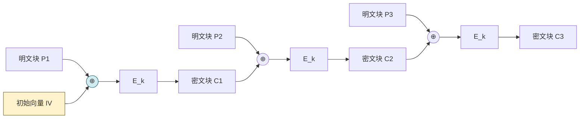

# 2.2 对称加密算法：DES、AES 原理

> [!abstract] 本节概述
> 对称加密是密码学中加解密**使用同一密钥**的体制，因效率高而承担"大量数据加密"的主力角色。本节介绍对称加密原理与分组密码两大经典结构——**Feistel 网络（DES 代表）** 与 **SPN 结构（AES 代表）**，详细说明 DES、AES 的参数与轮函数，并对比 ECB/CBC/CFB/OFB/CTR 五种工作模式的特性与适用场景。

## 对称加密原理

> [!definition] 对称加密（Symmetric Encryption）
> 加密与解密使用**相同密钥**（或可由一方轻易推出另一方）的密码体制。通信双方必须事先共享密钥 $k$，发送方 $c = E_k(m)$，接收方 $m = D_k(c)$。

```mermaid
flowchart LR
    subgraph 发送方
        M1[明文 m] --> E[加密 E_k]
    end
    K[(共享密钥 k<br/>需安全协商)] --> E
    E -->|密文 c| Net[[(不安全信道)]]
    Net --> D[解密 D_k]
    K --> D
    D --> M2[明文 m]

    style K fill:#fff3cd,stroke:#856404
    style Net fill:#f8d7da,stroke:#721c24
```

> [!warning] 对称加密的核心难题：密钥分发
> 对称加密速度比非对称快 100~1000 倍，但双方必须先安全地共享密钥。这正是 [[2.3 非对称加密：RSA、公钥私钥机制|非对称加密]] 与 [[2.6 混合加密通信流程|混合加密]] 要解决的问题。

对称加密分为两类：

| 类型 | 处理单位 | 代表算法 | 特点 |
| ---- | -------- | -------- | ---- |
| 分组密码（Block Cipher） | 固定长度数据块 | DES、AES | 主流，需配合工作模式 |
| 流密码（Stream Cipher） | 逐位/逐字节 | RC4（已弃用）、ChaCha20 | 适合实时流 |

## DES 算法

> [!definition] DES（Data Encryption Standard）
> DES 由 IBM 设计、美国 NBS（现 NIST）于 1977 年发布为联邦标准（FIPS PUB 46），是首个公开的商业级分组密码。基于 **Feistel 网络**结构。

### DES 参数

| 参数 | 取值 | 说明 |
| ---- | ---- | ---- |
| 分组长度 | 64 位 | 明文/密文分组 |
| 密钥长度 | 64 位输入，有效 56 位 | 每 8 位 1 位奇偶校验被丢弃 |
| 轮数 | 16 轮 | Feistel 迭代 |
| 子密钥 | 每轮 48 位 | 由 56 位主密钥经 PC-2 选位 |

> [!warning] DES 的密钥长度不足
> 56 位有效密钥空间仅 $2^{56} \approx 7.2 \times 10^{16}$。1998 年 EFF "Deep Crack" 专用机器约 56 小时即可穷举破解。DES 已于 2005 年被 NIST 正式废止，仅 3DES 在过渡期使用。

### Feistel 网络结构

> [!definition] Feistel 网络
> Feistel 网络将分组等分为左半 $L$ 和右半 $R$，每轮做：
> $$L_i = R_{i-1}$$
> $$R_i = L_{i-1} \oplus F(R_{i-1}, K_i)$$
> 其中 $F$ 是轮函数（无需可逆），$K_i$ 是轮密钥。其精妙之处在于**解密与加密使用同一结构**，只需把子密钥逆序使用——这正是 $F$ 不必可逆的原因。

```mermaid
flowchart TD
    IN[64位明文] --> IP[初始置换 IP]
    IP --> L0[L0: 32位]
    IP --> R0[R0: 32位]

    subgraph 第i轮 1≤i≤16
        L0 --> L1["L_i = R_(i-1)"]
        R0 --> F["F(R_(i-1), K_i)<br/>扩展置换→S盒→P盒"]
        L0 --> XOR((⊕))
        F --> XOR
        XOR --> R1["R_i = L_(i-1) ⊕ F(...)"]
    end

    L1 --> SWAP[16轮后交换]
    R1 --> SWAP
    SWAP --> FP[逆置换 IP⁻¹]
    FP --> OUT[64位密文]

    style F fill:#d1ecf1,stroke:#0c5460
    style XOR fill:#fff3cd,stroke:#856404
```

### DES 轮函数 F

DES 轮函数 $F(R, K_i)$ 由三步构成：

1. **扩展置换 E**：将 32 位 $R$ 扩展为 48 位（部分位重复使用）。
2. **与子密钥异或**：48 位结果 $\oplus$ 48 位 $K_i$。
3. **S 盒代换**：48 位分为 8 组 6 位，每组经一个 S 盒（$S_1 \dots S_8$）压缩为 4 位，共得 32 位。
4. **P 盒置换**：对 32 位做固定位置换输出。

> [!note] S 盒是 DES 安全性的核心
> S 盒是 DES 中唯一的非线性部件，提供"混淆"。若 S 盒改为线性，整个 DES 将退化为可被代数攻击瞬间破解的线性变换。

## AES 算法

> [!definition] AES（Advanced Encryption Standard）
> AES 是 NIST 于 2001 年发布的分组密码标准（FIPS PUB 197），取代 DES。由比利时密码学家 Joan Daemen、Vincent Rijmen 设计的 **Rijndael** 算法胜出。AES 采用 **SPN（Substitution-Permutation Network）结构**，而非 Feistel。

### AES 参数

| 参数 | 取值 | 说明 |
| ---- | ---- | ---- |
| 分组长度 | 128 位（4×4 字节状态矩阵） | 固定 |
| 密钥长度 | 128 / 192 / 256 位 | 三档可选 |
| 轮数 | 10 / 12 / 14 | 随密钥长度递增 |
| 每轮操作 | SubBytes、ShiftRows、MixColumns、AddRoundKey | 最后一轮无 MixColumns |

### AES 轮函数

```mermaid
flowchart TD
    ST[128位明文] --> AK0[AddRoundKey 初始轮密钥加]
    AK0 --> R1[第1轮]

    subgraph 第1~N-1轮 每轮4步
        R1 --> SB[SubBytes 字节代换<br/>S盒非线性替换]
        SB --> SR[ShiftRows 行移位<br/>第i行循环左移i字节]
        SR --> MC[MixColumns 列混淆<br/>GF(2⁸)上矩阵乘]
        MC --> AK[AddRoundKey 轮密钥加]
        AK --> R2[下一轮...]
    end

    R2 --> RN[最后一轮]
    subgraph 最后一轮 无MixColumns
        RN --> SB2[SubBytes]
        SB2 --> SR2[ShiftRows]
        SR2 --> AK2[AddRoundKey]
    end
    AK2 --> CT[128位密文]

    style SB fill:#d1ecf1,stroke:#0c5460
    style SR fill:#d4edda,stroke:#155724
    style MC fill:#fff3cd,stroke:#856404
    style AK fill:#e2d5f1,stroke:#4a148c
```

> [!note] AES 四个步骤的分工
> - **SubBytes**：字节级非线性代换，提供**混淆**（对应 DES 的 S 盒）。
> - **ShiftRows**：行方向移位，提供行间**扩散**。
> - **MixColumns**：列方向 GF($2^8$) 矩阵乘，提供列间**扩散**（对应 DES 的 P 盒但更彻底）。
> - **AddRoundKey**：与轮密钥异或，引入密钥。
>
> 多轮迭代使明文 1 位的变化经过若干轮后扩散到整个分组（**雪崩效应**）。

### 密钥扩展（Key Expansion）

AES 将原始密钥扩展为 $(N_r+1)$ 个 128 位轮密钥（$N_r$ 为轮数）。例如 AES-128 生成 $11 \times 128$ 位。扩展使用 RotWord、SubWord、与轮常量 Rcon 异或等操作，保证密钥位的充分扩散。

## DES vs AES 对比

| 维度 | DES | AES |
| ---- | --- | --- |
| 标准号 | FIPS 46（1977） | FIPS 197（2001） |
| 结构 | Feistel 网络 | SPN 网络 |
| 分组长度 | 64 位 | 128 位 |
| 有效密钥长度 | 56 位 | 128/192/256 位 |
| 轮数 | 16 | 10/12/14 |
| 轮函数是否可逆 | F 不必可逆（Feistel 特性） | 每一步都可逆 |
| 安全性 | 已不安全，可穷举 | 安全，抗已知攻击 |
| 软件实现 | 较慢 | 快，支持 AES-NI 指令 |
| 状态 | 已废止（3DES 过渡） | 当前标准 |

> [!tip] 3DES（TDES）
> 3DES 用 3 个 56 位密钥 $K_1, K_2, K_3$，做 $c = E_{K_3}(D_{K_2}(E_{K_1}(m)))$（加密-解密-加密，EDE 模式）。中间用解密是为了兼容单 DES（当 $K_1=K_2=K_3$ 时退化为 DES）。有效密钥长度 112 或 168 位，但速度约为 DES 的 1/3、AES 的 1/10，已被 NIST 限制使用（2023 年后仅允许 112 位强度用于解密遗留数据）。

## 分组密码工作模式

分组密码一次只加密固定长度分组。处理任意长度数据需指定工作模式（NIST SP 800-38A）。

| 模式 | 全称 | 加密方式 | 是否需要 IV | 并行性 | 安全性 |
| ---- | ---- | -------- | ----------- | ------ | ------ |
| ECB | Electronic CodeBook | 每组独立加密 | 否 | 加密可并行 | ❌ 相同明文→相同密文，泄露模式 |
| CBC | Cipher Block Chaining | $C_i = E_k(P_i \oplus C_{i-1})$ | 是（IV 不可预测） | 加密不可并行，解密可 | ✅ 常用 |
| CFB | Cipher FeedBack | 流式反馈 | 是 | 加密不可并行 | ✅ 可作流密码 |
| OFB | Output FeedBack | 输出反馈作密钥流 | 是 | 不可并行 | ✅ 适合流 |
| CTR | Counter | $C_i = P_i \oplus E_k(Nonce\|i)$ | 是（Nonce） | 加解密均可并行 | ✅ 推荐 |

> [!warning] ECB 模式不可用于有结构数据
> ECB 下相同明文块产生相同密文块。著名例子：ECB 加密的企鹅图像仍能看出企鹅轮廓。任何有重复模式的数据（如位图、数据库字段）都不应使用 ECB。

### CBC 模式流程



> [!note] 初始向量 IV 的要求
> - CBC/CFB/OFB 模式的 IV **无需保密**，但必须是**不可预测**的（对 CBC 尤其重要，否则会遭受选择明文攻击）。
> - CTR 模式的 Nonce **必须唯一**，重复使用同一 Nonce 加密两条消息会泄露明文异或。
> - IV 不应固定为常量，也不应用同一密钥下重复使用。

> [!example] AES-CBC 加密实践要点
> ```bash
> # OpenSSL 使用 AES-256-CBC 加密文件，IV 随机生成并写入密文头
> openssl enc -aes-256-cbc -salt -pbkdf2 -in plaintext.txt -out cipher.bin
> # 解密
> openssl enc -d -aes-256-cbc -pbkdf2 -in cipher.bin -out plaintext.txt
> ```
> 说明：`-pbkdf2` 用口令派生密钥（实际生产应直接使用随机密钥而非口令），`-salt` 防止相同口令生成相同密钥。该命令环境为 Linux/macOS OpenSSL 1.1.1+ 或 Windows 同等版本。

## 认证加密与 GCM 模式

> [!info] AEAD（Authenticated Encryption with Associated Data）
> 单纯加密只保证保密性，不保证完整性。现代实践采用 **AEAD** 模式同时提供两者：
> - **GCM（Galois/Counter Mode）**：CTR 加密 + GHASH 认证，NIST SP 800-38D，TLS 1.2/1.3 主流。
> - **CCM（Counter with CBC-MAC）**：用于无线 WPA2/802.11i。
> 这是 [[MOC - 第7章|第7章 TLS]] 中 AEAD 套件的基础。

## 本节小结

- 对称加密单密钥、速度快，瓶颈在密钥分发。
- DES 基于 Feistel，56 位密钥已不安全；AES 基于 SPN，128/192/256 位密钥是当前标准。
- AES 四步轮函数：SubBytes（混淆）→ ShiftRows → MixColumns（扩散）→ AddRoundKey。
- 工作模式中 ECB 禁用、CBC/CTR 常用、GCM 提供认证加密。

## 章节导航

- ⬆️ 上级：[[MOC - 第2章|第2章 密码学基础 MOC]]
- ⬅️ 上一节：[[2.1 古典密码：移位密码、置换密码|2.1 古典密码]]
- ➡️ 下一节：[[2.3 非对称加密：RSA、公钥私钥机制|2.3 非对称加密]]
- 📝 习题：[[MOC - 第2章习题|第2章 习题]]
