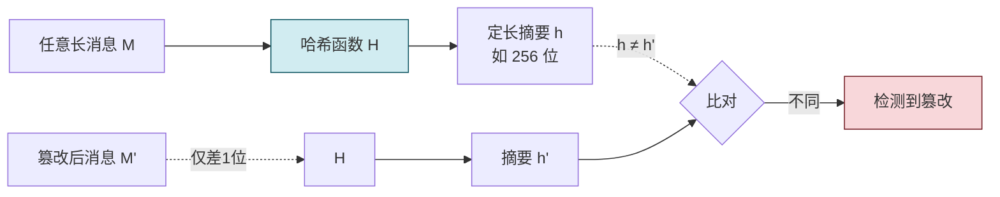
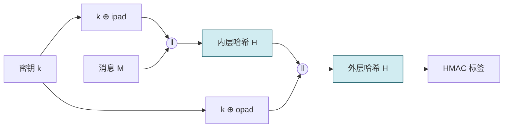
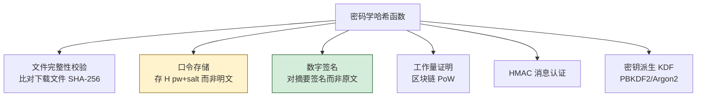

# 2.4 哈希函数、MD5、SHA 系列、消息摘要

> [!abstract] 本节概述
> 哈希函数将任意长度输入压缩为**定长摘要**，是密码学中唯一**无密钥**的组件，承担完整性校验的根基。本节介绍哈希的三大安全性质（单向性、抗弱碰撞、抗强碰撞）、MD5/SHA 系列算法、消息认证码 MAC 与 HMAC，并分析生日攻击如何决定哈希输出长度的下限。

## 哈希函数的性质

> [!definition] 密码学哈希函数（Cryptographic Hash Function）
> 哈希函数 $H: \{0,1\}^* \to \{0,1\}^n$ 将任意长度输入映射为定长 $n$ 位输出 $h = H(M)$，称为**消息摘要（message digest）**。密码学哈希须满足：

| 性质 | 英文 | 含义 |
| ---- | ---- | ---- |
| 单向性 | Preimage Resistance | 给定 $h$，找出满足 $H(M)=h$ 的 $M$ 在计算上不可行 |
| 抗弱碰撞（第二原像） | Second Preimage Resistance | 给定 $M_1$，找出 $M_2 \neq M_1$ 使 $H(M_1)=H(M_2)$ 不可行 |
| 抗强碰撞 | Collision Resistance | 找到任意一对 $M_1 \neq M_2$ 使 $H(M_1)=H(M_2)$ 不可行 |

> [!note] 三个性质的关系
> - 抗强碰撞 ⇒ 抗弱碰撞（强包含弱）。
> - 抗弱碰撞 ⇏ 单向性，单向性 ⇏ 抗弱碰撞，二者独立。
> - 设计哈希时三者都要满足；但攻击者只要攻破最弱一环即可。



## MD5

> [!definition] MD5（Message Digest 5）
> MD5 由 Ron Rivest 于 1992 年设计（RFC 1321），输入任意长度，输出 **128 位（16 字节）** 摘要。采用 Merkle-Damgård 结构，分 512 位分组，经 64 轮压缩函数处理。

> [!warning] MD5 已不安全，禁止用于安全用途
> - 2004 年王小云团队给出 MD5 强碰撞的实际攻击方法。
> - 2008 年研究人员构造出伪造的 CA 证书（利用 MD5 碰撞）。
> - 当前普通 PC 数秒即可生成 MD5 碰撞。
> MD5 **不可用于**数字签名、证书、完整性校验等安全场景；仅可用于非安全用途（如文件去重、缓存键）。

## SHA 系列

SHA（Secure Hash Algorithm）由 NIST 标准化，分三代：

### SHA-1

- 输出 **160 位**，1995 年发布（FIPS 180-1）。
- 结构类似 MD5，分 512 位分组，80 轮。
- 2017 年 Google 与 CWI 联合完成首次公开碰撞攻击（SHAttered），**已不安全**。
- 各大浏览器自 2017 年起停止信任 SHA-1 证书。

### SHA-2（FIPS 180-4）

| 变体 | 输出长度 | 分组长度 | 轮数 | 安全状态 |
| ---- | -------- | -------- | ---- | -------- |
| SHA-224 | 224 位 | 512 位 | 64 | 安全 |
| SHA-256 | 256 位 | 512 位 | 64 | ✅ 推荐 |
| SHA-384 | 384 位 | 1024 位 | 80 | 安全 |
| SHA-512 | 512 位 | 1024 位 | 80 | 安全 |

SHA-256 是当前最主流的哈希算法，用于 TLS、区块链（比特币）、数字签名。

### SHA-3（FIPS 202）

- 2015 年发布，采用 **Keccak** 算法的 **海绵结构（sponge construction）**，与 SHA-1/2 的 Merkle-Damgård 完全不同。
- 输出可变：SHA3-224/256/384/512。
- 设计上免疫对 SHA-2 结构的延伸攻击，作为 SHA-2 的备份方案。
- 还派生出 SHAKE（可扩展输出函数 XOF）。

## MD5 / SHA-1 / SHA-256 对比

| 维度 | MD5 | SHA-1 | SHA-256 |
| ---- | --- | ----- | ------- |
| 输出长度 | 128 位 | 160 位 | 256 位 |
| 分组长度 | 512 位 | 512 位 | 512 位 |
| 轮数 | 64 | 80 | 64 |
| 结构 | Merkle-Damgård | Merkle-Damgård | Merkle-Damgård |
| 抗强碰撞（理论） | $2^{64}$ | $2^{80}$ | $2^{128}$ |
| 实际碰撞攻击 | ✅ 已破（秒级） | ✅ 已破（SHAttered） | ❌ 仍安全 |
| 安全用途 | ❌ 禁用 | ❌ 禁用 | ✅ 推荐 |
| 速度 | 最快 | 较快 | 中等 |

> [!tip] 输出长度与安全强度
> 由于生日攻击（见下），$n$ 位哈希的抗强碰撞强度仅为 $2^{n/2}$。因此：
> - SHA-256（256 位）抗碰撞强度 128 位，与 AES-128 匹配。
> - SHA-1（160 位）抗碰撞仅 80 位，已不足。
> - 想匹配 AES-256 需用 SHA-512。

## 消息认证码 MAC 与 HMAC

> [!definition] MAC（Message Authentication Code）
> MAC 用**共享密钥** $k$ 生成认证标签，同时保证**完整性**与**认证**（确认消息来自持密钥者）：
> $$\text{tag} = \text{MAC}_k(M)$$
> 接收方用同一密钥重算并比对。与单纯哈希的区别：MAC 需要密钥，无密钥者无法伪造。

> [!warning] MAC 不提供不可否认性
> 由于双方共享同一密钥，任何一方都能生成合法 MAC，发生争议时无法证明是哪一方所发。需要不可否认性时必须用[[2.5 数字签名、数字证书、PKI 体系|数字签名]]。

> [!definition] HMAC（Hash-based MAC, RFC 2104）
> HMAC 是用任意密码学哈希 $H$ 构造 MAC 的标准方法，避免直接用 `H(k‖m)` 的长度扩展攻击：
>
> $$\text{HMAC}_k(M) = H\big((k \oplus \text{opad}) \,\|\, H((k \oplus \text{ipad}) \,\|\, M)\big)$$
>
> 其中 $\text{ipad}=0x36\cdots36$、$\text{opad}=0x5c\cdots5c$ 是填充常量，$k$ 不足分组长度则补零，过长则先哈希。常用 HMAC-SHA256。



> [!note] 长度扩展攻击与 HMAC 的必要性
> Merkle-Damgård 结构的哈希（MD5、SHA-1、SHA-256）存在长度扩展弱点：已知 $H(\text{secret} \| M)$，无需知道 secret 即可计算 $H(\text{secret} \| M \| \text{padding} \| M')$。因此 `H(secret‖message)` 这种朴素构造不安全，必须用 HMAC。SHA-3 的海绵结构免疫此攻击。

## 生日攻击

> [!definition] 生日攻击（Birthday Attack）
> 基于生日悖论：23 人中两人同生日的概率已超 50%。推广到哈希：对 $n$ 位输出空间，找到碰撞只需约 $2^{n/2}$ 次计算（而非 $2^n$），由"概率论中 $N$ 个元素中两两配对数约 $N^2/2$"决定。

生日悖论的直观推导：在 $N$ 个可能值中随机取 $q$ 个，存在重复的概率约为：

$$
P \approx 1 - e^{-q^2/(2N)}
$$

当 $q \approx \sqrt{N} = 2^{n/2}$ 时 $P \approx 0.5$。

> [!warning] 生日攻击对设计的约束
> - 80 位哈希（如 SHA-1 抗碰撞）只需 $2^{80}$ 次即可碰撞，已被实际攻击。
> - 想达到 128 位抗碰撞强度，输出至少 256 位 → SHA-256。
> - 这也解释了为何 SHA-1 在签名中被淘汰：160 位输出经生日攻击后实际强度仅 80 位，低于现代 112 位下限。

## 哈希的典型应用



> [!example] 文件完整性校验实践
> ```bash
> # Linux/macOS 计算 SHA-256（验证 ISO/软件下载）
> shasum -a 256 ubuntu-24.04.iso
> # 或
> sha256sum ubuntu-24.04.iso
> # 输出形如：3a5c2e...（64 位十六进制=256 位）
> ```
> 与官方公布的校验值比对，一致则文件未被篡改。环境：Linux shell 或 macOS 终端；Windows 可用 `Get-FileHash`（PowerShell）。

> [!warning] 口令存储必须加盐
> 直接存 $H(\text{password})$ 会被彩虹表（预计算的哈希-口令表）秒破。正确做法：每用户生成随机**盐** salt，存 $H(\text{password} \,\|\, \text{salt})$ 与 salt。更优是用专门的慢哈希 KDF：PBKDF2、bcrypt、scrypt、Argon2，通过迭代/内存代价抵抗暴力穷举。详见 [[MOC - 第3章|第3章 身份认证]]。

## 本节小结

- 哈希无密钥，提供完整性；MAC 加密钥，提供完整性+认证；签名用私钥，提供不可否认。
- MD5、SHA-1 已被碰撞攻破，禁用于安全场景；SHA-256、SHA-3 是当前推荐。
- 生日攻击使 $n$ 位哈希的抗碰撞强度仅 $2^{n/2}$，决定输出长度下限。
- HMAC 是用哈希构造 MAC 的安全标准，避免长度扩展攻击。

## 章节导航

- ⬆️ 上级：[[MOC - 第2章|第2章 密码学基础 MOC]]
- ⬅️ 上一节：[[2.3 非对称加密：RSA、公钥私钥机制|2.3 非对称加密]]
- ➡️ 下一节：[[2.5 数字签名、数字证书、PKI 体系|2.5 数字签名与 PKI]]
- 📝 习题：[[MOC - 第2章习题|第2章 习题]]
