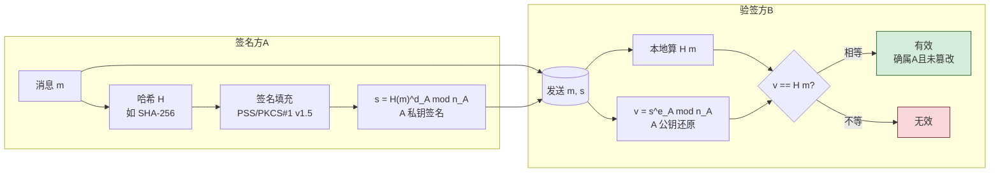
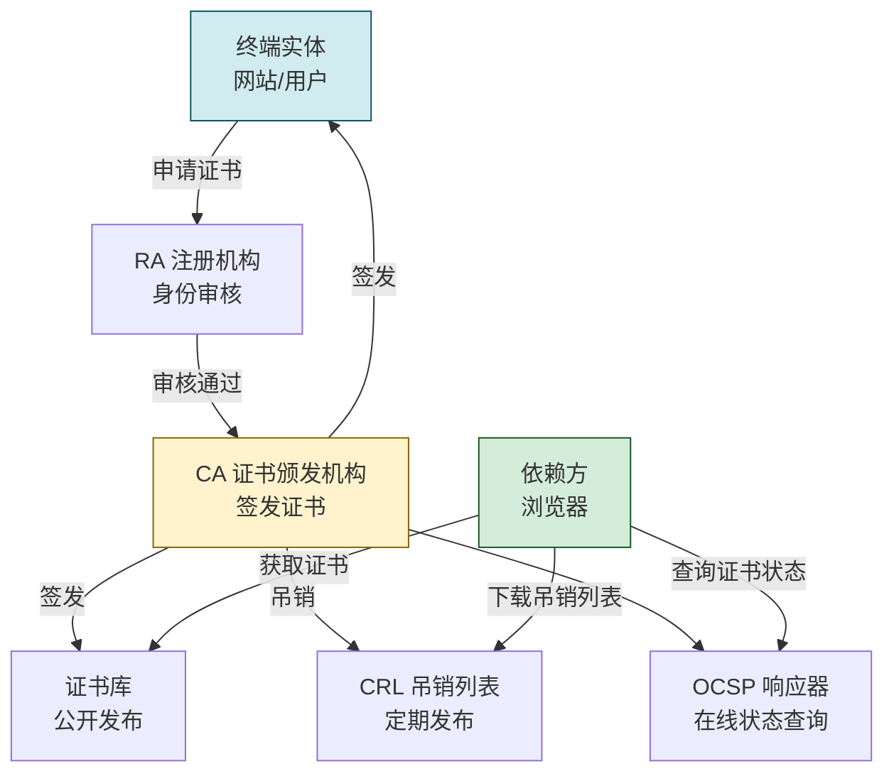
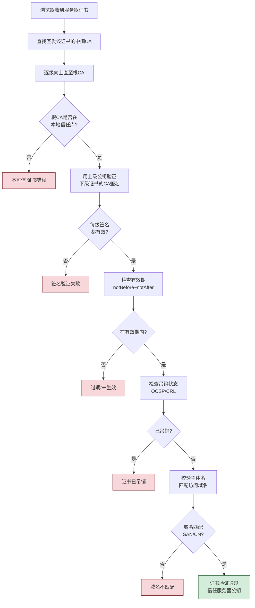

# 2.5 数字签名、数字证书、PKI 体系

> [!abstract] 本节概述
> 数字签名解决"消息确实来自声称的发送方且未被篡改"的问题，提供**完整性、认证、不可否认性**。但签名本身无法证明公钥归属——这需要数字证书与 PKI 体系把公钥与真实身份绑定。本节介绍签名原理（RSA/DSA）、X.509 证书结构、PKI 的 CA/RA/CRL/OCSP 组成与证书链验证流程，并以 HTTPS 证书验证为例说明工程实践。

## 数字签名原理

> [!definition] 数字签名（Digital Signature）
> 发送方用**自己私钥**对消息摘要做签名，接收方用**发送方公钥**验签。签名与手写签名的关键区别：它与具体消息内容绑定，不同消息签名不同，不可复制挪用。

签名流程（结合 [[2.3 非对称加密：RSA、公钥私钥机制|2.3 RSA]] 与 [[2.4 哈希函数、MD5、SHA 系列、消息摘要|2.4 哈希]]）：

> [!note] 为什么先哈希再签名
> 1. **效率**：直接对 GB 级消息做模幂不可行，哈希后只签 256 位。
> 2. **长度**：签名长度固定（等于模长 $n$）。
> 3. **安全**：哈希抗碰撞保证攻击者找不到另一段消息套用旧签名（防" Existential Forgery"）。

## RSA 签名与 DSA 签名

| 算法 | 数学难题 | 签名速度 | 验签速度 | 签名长度 | 备注 |
| ---- | -------- | -------- | -------- | -------- | ---- |
| RSA 签名 | 大整数分解 | 慢（私钥模幂） | 快（公钥小指数 $e=65537$） | 等于模长（2048 位=256 字节） | 加密/签名同算法，用途广 |
| DSA | 离散对数 | 快 | 慢 | 320 位（两 160 位分量） | 仅签名，不能加密 |
| ECDSA | 椭圆曲线离散对数 | 较快 | 较快 | 约两倍密钥长（256 位曲线→64 字节） | 移动端/TLS 主流 |

> [!warning] RSA 签名的填充必须规范
> - 旧式 PKCS#1 v1.5 填充存在 Bleichenbacher 类攻击隐患。
> - 新系统应使用 **PSS（Probabilistic Signature Scheme）** 填充，带随机盐，安全性可证明。
> - DSA/ECDSA 中随机数 $k$ 必须**密码学随机且永不重复**，否则私钥可被恢复（如 2010 年索尼 PS3 私钥泄露事件，因 $k$ 固定）。

## 数字证书与 X.509

> [!definition] 数字证书（Digital Certificate）
> 数字证书是**可信第三方（CA）对"公钥 ←→ 身份"绑定的数字签名背书**。它解决"我拿到的公钥真的是对方持有的吗"这一公钥信任问题。最通用的格式是 **X.509**（RFC 5280）。

### X.509 证书结构

| 字段 | 含义 | 示例 |
| ---- | ---- | ---- |
| 版本 | X.509 v1/v2/v3 | v3（当前主流） |
| 序列号 | CA 内唯一编号 | `04:8F:...` |
| 签名算法 | CA 用来签本证书的算法 | sha256WithRSAEncryption |
| 颁发者（Issuer） | 签发本证书的 CA 名 | DigiCert Global CA |
| 有效期 | notBefore / notAfter | 2025-01-01 ~ 2026-12-31 |
| 主体（Subject） | 证书持有者身份 | example.com |
| 主体公钥 | 持有者的公钥及算法 | RSA 2048 公钥 |
| 扩展 | 密钥用途、SAN、基本约束 | KeyUsage=digitalSignature；SAN 含多个域名 |
| CA 签名 | CA 用私钥对以上内容的签名 | CA 签名值 |

> [!note] 主体备用名 SAN（Subject Alternative Name）
> 现代 HTTPS 证书不再用 Subject 的 CN 字段标识域名，而是用 SAN 扩展。一张证书可包含多个 SAN（如 `example.com` 与 `www.example.com`），即"多域名证书"。

## PKI 体系

> [!definition] PKI（Public Key Infrastructure，公钥基础设施）
> PKI 是签发、管理、撤销、验证数字证书的完整体系，由以下角色组成：

| 组件 | 全称 | 职责 |
| ---- | ---- | ---- |
| CA | Certificate Authority 证书颁发机构 | 签发证书，是信任锚 |
| RA | Registration Authority 注册机构 | 审核申请者身份，不直接签发 |
| CRL | Certificate Revocation List 证书吊销列表 | 离线公布已撤销证书序列号 |
| OCSP | Online Certificate Status Protocol | 在线查询某证书是否有效 |
| 证书库 | Repository | 存放已签发证书供查询 |
| 终端实体 | End Entity | 证书持有者（服务器/用户） |
| CPS | Certification Practice Statement | CA 的运营规范 |

> [!info] 信任锚与根证书
> 根 CA（Root CA）自签证书预装在操作系统/浏览器的信任库中，是整个信任链的起点。根 CA 的私钥离线存放，只用来签发中间 CA；中间 CA 在线签发终端证书。这种分层既安全又便于吊销。

## 证书链验证流程

> [!tip] 证书链验证的五个要点
> 1. **信任链完整**：从终端证书可追溯到本地信任库中的根 CA。
> 2. **签名有效**：每一级证书的 CA 签名用上一级公钥验证通过。
> 3. **有效期**：当前时间在 notBefore 与 notAfter 之间。
> 4. **未吊销**：经 OCSP 或 CRL 确认未被撤销。
> 5. **主体匹配**：证书 SAN/CN 与实际访问的域名一致。

## CRL vs OCSP

| 维度 | CRL | OCSP |
| ---- | --- | ---- |
| 形式 | 离线列表 | 在线请求/响应 |
| 时效 | 滞后（下次更新前不知新吊销） | 准实时 |
| 带宽 | 列表可能很大 | 单次查询小 |
| 隐私 | 不泄露访问目标 | 查询会暴露用户访问的站点 |
| 改进 | — | OCSP Stapling（服务器代查附在握手中） |

> [!warning] OCSP 的隐私问题与 Stapling
> 浏览器查 OCSP 会向 CA 暴露"用户正在访问哪个站点"。OCSP Stapling 让服务器在 TLS 握手时主动附上 CA 的 OCSP 响应，既实时又保护隐私，是 TLS 1.3 推荐做法。

## 案例：HTTPS 证书验证过程

> [!example] 浏览器访问 `https://example.com` 的证书验证
> 1. 服务器在 TLS 握手时发送**证书链**：终端证书 + 中间 CA 证书。
> 2. 浏览器用中间 CA 公钥验证终端证书签名；用根 CA 公钥验证中间 CA 证书签名。
> 3. 根 CA 证书在系统信任库 → 信任链建立。
> 4. 检查有效期、吊销状态（OCSP Stapling）、域名匹配 SAN。
> 5. 全部通过后，浏览器信任证书中的服务器公钥，进入密钥交换阶段（见 [[2.6 混合加密通信流程|2.6 混合加密]] 与 [[MOC - 第7章|第7章 TLS]]）。
>
> 浏览器地址栏的锁形图标即表示证书验证通过。

> [!info] 自签名证书
> 自己生成密钥对、自己签发证书即"自签名证书"。由于不在系统信任库中，浏览器会警告"不受信任"。自签名证书仅适用于内部测试或私有环境，正式服务必须使用受信任 CA 签发的证书（如 Let's Encrypt 免费签发）。

## 本节小结

- 数字签名 = 私钥签名 + 公钥验签，提供完整性、认证、不可否认；必须先哈希再签。
- RSA 签名用 PSS 填充；DSA/ECDSA 的随机数 $k$ 必须绝不重复。
- X.509 证书由 CA 把"公钥↔身份"绑定并签名背书。
- PKI 由 CA/RA/CRL/OCSP 组成，证书链验证需检查信任链、签名、有效期、吊销、主体名五项。

## 章节导航

- ⬆️ 上级：[[MOC - 第2章|第2章 密码学基础 MOC]]
- ⬅️ 上一节：[[2.4 哈希函数、MD5、SHA 系列、消息摘要|2.4 哈希函数]]
- ➡️ 下一节：[[2.6 混合加密通信流程|2.6 混合加密通信]]
- 📝 习题：[[MOC - 第2章习题|第2章 习题]]
