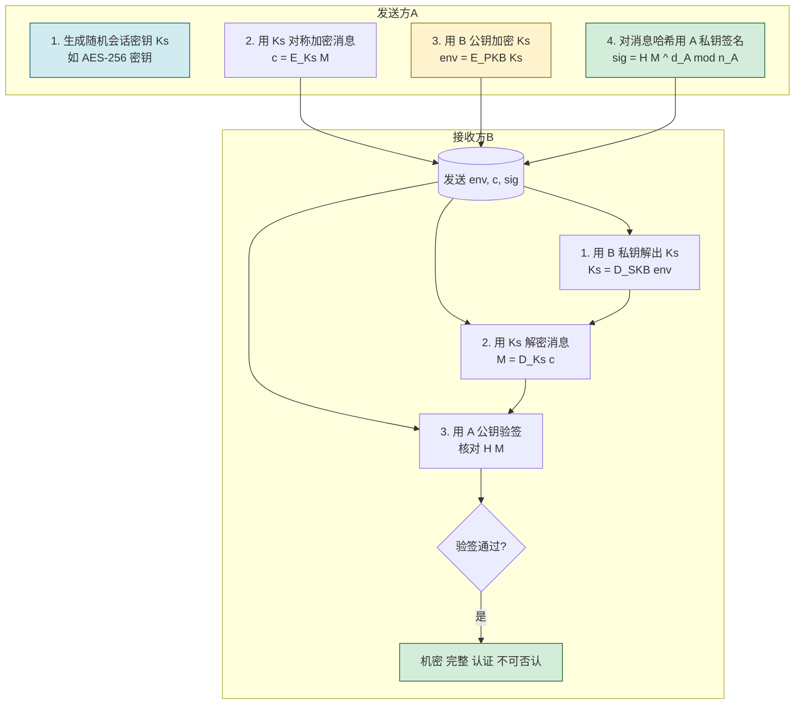
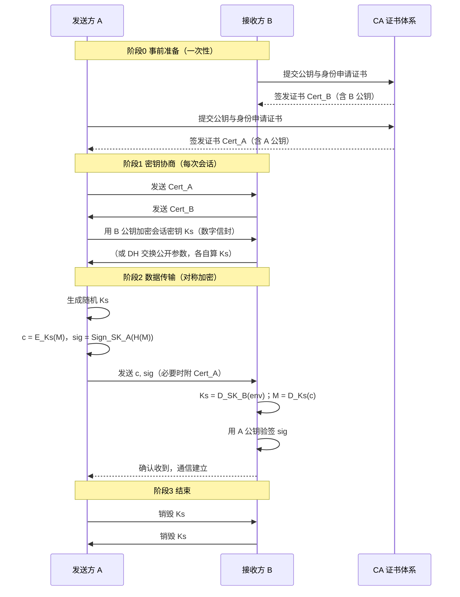

# 2.6 混合加密通信流程

> [!abstract] 本节概述
> 对称加密快但密钥分发难，非对称加密解决密钥分发但速度慢。混合加密取两者之长：**用非对称加密协商或包裹一次性会话密钥，再用对称加密处理实际数据，并辅以数字签名保证身份与不可否认**。本节给出会话密钥协商、数字信封、签名与加密的组合顺序，并以 PGP 邮件为例展示完整流程，是 [[MOC - 第7章|TLS 握手]] 的雏形。

## 为什么需要混合加密

> [!definition] 混合加密（Hybrid Encryption）
> 把对称与非对称加密结合的体制：非对称算法负责少量但关键的密钥分发/认证，对称算法负责大量数据的快速加解密。

| 单一对称 | 单一非对称 | 混合加密 |
| -------- | ---------- | -------- |
| 速度极快 | 速度慢（1/100~1/1000） | 整体接近对称速度 |
| 密钥分发难（需安全信道） | 公钥可公开分发 | 非对称解决分发 |
| $n$ 人需 $n(n-1)/2$ 密钥 | $n$ 人需 $n$ 对密钥 | $n$ 人需 $n$ 对长期密钥 |
| 不支持签名 | 支持签名 | 同时获得签名能力 |
| 不适合开放网络 | 不适合大数据 | 适合开放网络大数据 |

> [!note] 会话密钥（Session Key）
> 每次通信临时生成的对称密钥，用完即弃。会话密钥保证了**前向安全性**的雏形：即使长期私钥日后泄露，过去已用会话密钥加密的会话也无法被解密（前提是会话密钥不被长期保存且协商时使用临时密钥对，如 DHE/ECDHE）。

## 会话密钥协商

会话密钥的建立有两种主流方式：

### 方式一：密钥传输（数字信封）

> [!definition] 数字信封（Digital Envelope）
> 发送方生成随机会话密钥 $K_s$，用**接收方公钥**加密 $K_s$ 形成"信封"，连同用 $K_s$ 加密的消息一并发送。接收方用自己私钥解出 $K_s$，再用它解密消息。

$$
\text{信封} = E_{PK_B}(K_s), \quad \text{密文} = E_{K_s}(M)
$$

### 方式二：密钥协商（Diffie-Hellman）

> [!definition] Diffie-Hellman 密钥交换
> 双方在公开信道上各自生成临时密钥对，交换公开参数，各自计算出相同的共享密钥，而窃听者无法从公开参数推出该密钥。基于离散对数困难问题。

| 步骤 | A | 公开信道 | B |
| ---- | - | -------- | - |
| 1 | 选私钥 $a$，算 $A=g^a \bmod p$ | → $A$ | |
| 2 | | ← $B$ | 选私钥 $b$，算 $B=g^b \bmod p$ |
| 3 | 算 $K = B^a \bmod p = g^{ab}\bmod p$ | | 算 $K = A^b \bmod p = g^{ab}\bmod p$ |

双方得到相同 $K$，但窃听者只知 $g, p, A, B$，求 $a$ 或 $b$ 需解离散对数。

> [!warning] 原始 DH 无身份认证，易遭中间人攻击
> 攻击者 C 可在中间分别与 A、B 各做一次 DH，A 实际与 C 协商、B 也与 C 协商，C 解密转发。**必须结合数字签名/证书**对 DH 公开参数签名（即 DHE/ECDHE in TLS），才能确认对方身份。

## 数字信封完整流程



## 完整混合加密时序



## 签名与加密的组合顺序

> [!warning] 三种组合的安全性差异
> 设 $E$ 加密、$S$ 签名，消息 $M$：
>
> | 顺序 | 操作 | 问题 |
> | ---- | ---- | ---- |
> | 签名再加密 | $C = E_{PK_B}(M, S_{SK_A}(M))$ | ✅ 安全，签名在密文内受保护 |
> | 加密再签名 | $C = E_{PK_B}(M)$，再 $S_{SK_A}(C)$ | ❌ 中间人可替换签名伪装发送，且签名暴露密文特征 |
> | 先签名再加密再签名 | — | 复杂且未必更安全 |
>
> PGP 与 S/MIME 推荐"**先签名后加密**"（sign-then-encrypt），签名覆盖原始明文，接收方解密后即可验签，且签名不泄露给第三方。

## 案例：PGP/GPG 加密邮件

> [!example] PGP（Pretty Good Privacy）邮件加密流程
> PGP 由 Phil Zimmermann 于 1991 年设计，是混合加密的经典实现。其信任模型是"**信任网（Web of Trust）**"——去中心化，用户相互签名彼此公钥，而非依赖 CA。开源实现 GnuPG（GPG）遵循 OpenPGP（RFC 4880）。
>
> 一封 PGP 加密邮件的生成步骤：
> 1. 发件方对邮件正文做哈希，用**自己私钥**签名。
> 2. 生成随机会话密钥 $K_s$。
> 3. 用 $K_s$ 对（邮件 + 签名）做对称加密（AES-CFB）。
> 4. 用**收件方公钥**加密 $K_s$（可对多个收件人各加密一次）。
> 5. 把加密的 $K_s$ 与密文打包为 ASCII Armor 输出。
>
> 收件方反向操作：私钥解出 $K_s$ → 解密邮件 → 用发件方公钥验签。
>
> ```bash
> # GPG 加密并发送（环境：Linux GnuPG 2.x）
> gpg --encrypt --sign --armor -r recipient@example.com message.txt
> # 生成 message.txt.asc，可粘贴到邮件正文
> # 收件方解密：
> gpg --decrypt message.txt.asc > message.txt
> ```
> 说明：`--sign` 同时签名，`-r` 指定收件人公钥，`--armor` 输出 Base64 文本。

## 与 TLS 的关系

> [!info] 混合加密是 TLS 的雏形
> [[MOC - 第7章|第7章 TLS]] 握手正是 2.6 的工程化：
> - 证书验证 ← 2.5 PKI
> - 密钥交换 ← 2.6 DH/ECDHE 或 RSA 密钥传输（TLS 1.3 已弃用 RSA 传输）
> - 对称加密 ← 2.2 AES-GCM
> - 完整性 ← 2.4 AEAD（GCM 自带认证）/ 2.4 HMAC（旧版 CBC 套件）
>
> 区别：TLS 增加了版本协商、密码套件协商、扩展（ALPN/SNI）、前向安全（临时密钥）等工程细节。

## 安全性要点小结

> [!warning] 混合加密的工程红线
> 1. **会话密钥必须随机**：用密码学安全 PRNG（如 `/dev/urandom`、`CryptGenRandom`），不可用 `rand()`。
> 2. **会话密钥一次性使用**：不复用、不长期保存。
> 3. **协商须认证**：DH/ECDHE 必须配合签名防中间人。
> 4. **先签名后加密**：避免加密再签名的安全漏洞。
> 5. **使用 AEAD 模式**：CBC+HMAC 已被 GCM/ChaCha20-Poly1305 取代，避免实现错误（如 Padding Oracle）。
> 6. **前向安全**：优先使用 DHE/ECDHE 而非 RSA 密钥传输，使长期私钥泄露不危及旧会话。

## 本节小结

- 混合加密 = 非对称协商/分发会话密钥 + 对称加密数据 + 数字签名认证。
- 数字信封用对方公钥包会话密钥；DH 密钥交换在公开信道协商共享密钥，二者都需认证防中间人。
- 推荐"先签名后加密"顺序；会话密钥须随机、一次性。
- PGP/GPG 是混合加密的典型应用，TLS 是其工程化标准。

## 章节导航

- ⬆️ 上级：[[MOC - 第2章|第2章 密码学基础 MOC]]
- ⬅️ 上一节：[[2.5 数字签名、数字证书、PKI 体系|2.5 数字签名与 PKI]]
- ➡️ 下一章：[[MOC - 第3章|第3章 身份认证与访问控制]]
- 📝 习题：[[MOC - 第2章习题|第2章 习题]]
