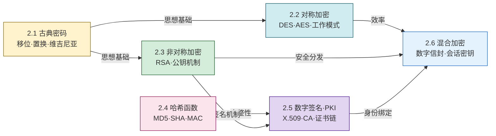

# MOC - 第2章 密码学基础

密码学是信息安全的基石。本章从古典密码的代换与置换思想出发，系统建立**对称加密、非对称加密、哈希函数、数字签名与 PKI** 五大支柱，并以混合加密通信流程将各组件串联为可工程化的安全方案。理解本章是学习 [[MOC - 第7章|安全通信协议]]（TLS/VPN/SSH）的前提。

> [!info] 本章定位
> - **承上**：承接 [[2.1 古典密码：移位密码、置换密码|第1章]] 的 CIA 三要素，把"保密性、完整性、不可否认性"转化为可计算的密码学保证。
> - **启下**：为第 3 章身份认证（口令哈希、证书认证）、第 4 章网络攻防（加密对抗嗅探）、第 7 章 TLS 握手提供算法基础。
> - **核心线索**：单钥 ↔ 双钥 ↔ 无钥（哈希）↔ 组合（签名/PKI）↔ 工程集成（混合加密）。
> - **安全边界**：本章只描述标准构造与已公开攻击原理，不设计新密码方案，不混淆编码/哈希/加密。

## 本章学习路线

## 知识点导航

| 小节 | 文件 | 核心内容 | 关键算法/标准 |
| ---- | ---- | -------- | ------------- |
| 2.1 | [[2.1 古典密码：移位密码、置换密码]] | 明文/密文/密钥模型、凯撒移位、列置换、维吉尼亚、频率分析 | Caesar、Vigenère |
| 2.2 | [[2.2 对称加密算法：DES、AES 原理]] | Feistel 网络、SPN 结构、轮函数、ECB/CBC/CFB/OFB/CTR | DES、3DES、AES、NIST SP 800-38A |
| 2.3 | [[2.3 非对称加密：RSA、公钥私钥机制]] | 公钥体制、大整数分解困难、密钥生成、模幂运算、安全长度 | RSA、PKCS#1 |
| 2.4 | [[2.4 哈希函数、MD5、SHA 系列、消息摘要]] | 单向性、抗碰撞、生日攻击、MAC/HMAC | MD5、SHA-1、SHA-2、SHA-3、HMAC |
| 2.5 | [[2.5 数字签名、数字证书、PKI 体系]] | 私钥签名/公钥验签、X.509、CA/RA、CRL/OCSP、证书链 | RSA签名、DSA、X.509、RFC 5280 |
| 2.6 | [[2.6 混合加密通信流程]] | 数字信封、会话密钥协商、签名+加密组合、PGP/TLS 雏形 | PGP/OpenPGP、数字信封 |

## 密码学五大支柱对照

| 支柱 | 解决的安全属性 | 密钥特征 | 代表算法 | 典型用途 |
| ---- | -------------- | -------- | -------- | -------- |
| 对称加密 | 保密性 | 单密钥（共享） | AES、DES | 大量数据加密 |
| 非对称加密 | 保密性、密钥分发 | 公钥/私钥对 | RSA、ECC | 小数据、密钥交换 |
| 哈希函数 | 完整性 | 无密钥 | SHA-256 | 摘要、口令存储 |
| 消息认证码 | 完整性、认证 | 共享密钥 | HMAC | 消息认证 |
| 数字签名 | 完整性、认证、不可否认 | 私钥签/公钥验 | RSA签名、DSA | 签名、证书 |

## 核心考点

> [!warning] 高频考点（8 点）
> 1. **密码学五元组**：明文、密文、密钥、加密算法、解密算法的语义关系；柯克霍夫原则。
> 2. **对称 vs 非对称**：密钥数量、加解密速度、密钥分发、典型场景对比。
> 3. **DES 与 AES**：分组长度、密钥长度、轮数、结构（Feistel vs SPN）、安全性差异。
> 4. **工作模式**：ECB 不推荐原因、CBC 的 IV 要求、CTR 的并行性、相同明文在不同模式下的密文差异。
> 5. **RSA 计算**：密钥生成（$p,q,n,\varphi(n),e,d$）、加密 $c=m^e\bmod n$、解密 $m=c^d\bmod n$、签名/验签，要求能做小数手算。
> 6. **哈希性质**：单向性、抗弱碰撞、抗强碰撞；生日攻击与输出长度的关系（$2^{n/2}$）。
> 7. **数字签名与 PKI**：签名流程、X.509 证书字段、CA 信任链、CRL/OCSP 作用。
> 8. **混合加密**：数字信封为何"用非对称包对称"，会话密钥一次性使用，签名与加密的顺序。

## 与其他章节的关联

- [[MOC - 第1章|第1章 信息安全基础概论]]：CIA 三要素、安全属性定义是本章密码学目标的理论来源。
- [[MOC - 第3章|第3章 身份认证与访问控制]]：口令存储用哈希+盐，证书认证依赖 PKI。
- [[MOC - 第4章|第4章 网络攻击与防御技术]]：嗅探/中间人攻击靠加密与证书对抗。
- [[MOC - 第7章|第7章 安全通信协议]]：TLS 握手 = RSA/ECDHE 密钥交换 + 数字签名 + 对称加密，是本章 2.6 的工程化。

## 章节导航

- ⬆️ 上级：[[MOC - 信息安全技术|信息安全技术 MOC]]
- ⬅️ 上一章：[[MOC - 第1章|第1章 信息安全基础概论]]
- ➡️ 下一章：[[MOC - 第3章|第3章 身份认证与访问控制]]
- 📝 习题：[[MOC - 第2章习题|第2章 习题]]