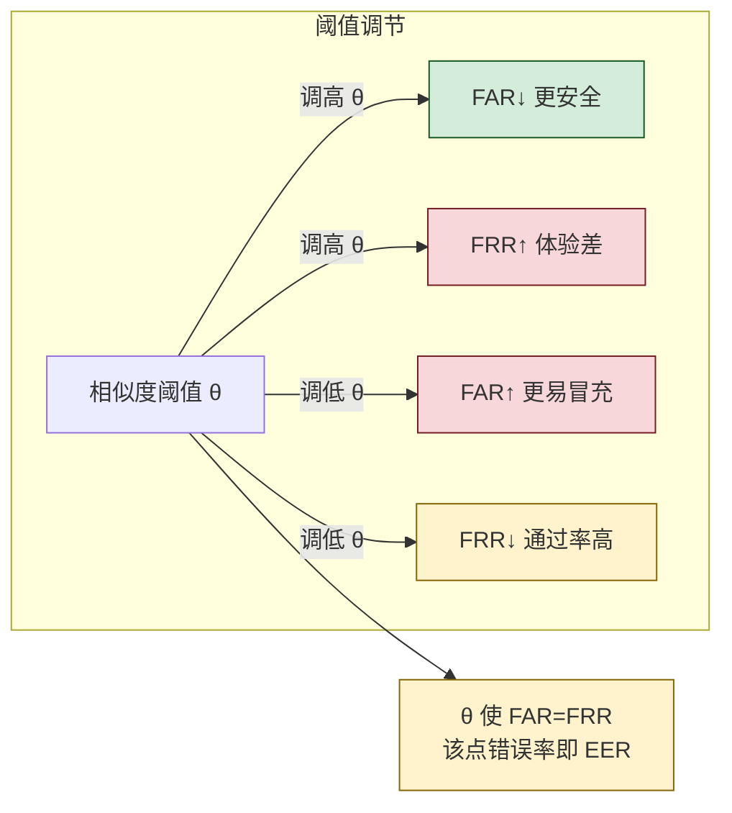
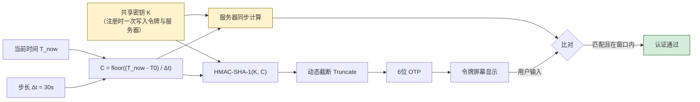

# 3.1 认证方式：口令、生物特征、硬件令牌

> [!abstract] 本节概述
> 本节解决"系统如何相信你就是你声称的那个实体"这一基本问题。围绕**三种认证因素**——你知道什么（口令）、你拥有什么（硬件令牌）、你是什么（生物特征）——梳理各类凭证的产生、验证、存储与典型攻击防御，为 [[3.2 单点登录、多因素认证 MFA|3.2 MFA]] 的多因素组合奠定基础。

## 认证与授权的区分

> [!definition] 认证（Authentication, AuthN）
> 验证一个实体是否为其所声称身份的过程，输出二元结果"是/否"。认证只关心**身份真伪**，不关心该身份能做什么。

> [!definition] 授权（Authorization, AuthZ）
> 在身份已通过认证的前提下，决定该身份对哪些资源可执行哪些操作。授权关心**权限范围**，其落地模型见 [[3.3 访问控制模型：自主、强制、角色 RBAC|3.3 访问控制模型]]。

> [!warning] 易混点
> 日常语境常把"登录"统称为"认证授权"，但工程上二者是先后两步：先 AuthN 得到身份，再 AuthZ 决定能访问什么。混淆会导致把访问控制缺陷误判为认证缺陷，反之亦然。

| 维度 | 认证 AuthN | 授权 AuthZ |
| ---- | ---------- | ---------- |
| 回答的问题 | 你是谁？ | 你能做什么？ |
| 输入 | 凭证（口令/令牌/生物模板） | 身份 + 资源 + 操作 |
| 输出 | 身份标识 / 拒绝 | 允许 / 拒绝 |
| 失败后果 | 冒充登录 | 越权访问 |
| 本章归属 | 3.1、3.2 | 3.3、3.4 |

## 三种认证因素

> [!info] 资产与信任边界
> - **核心资产**：凭证数据库、生物特征模板库、令牌种子密钥
> - **信任边界**：用户终端 ↔ 认证服务；任何凭证在边界传输都必须经 TLS 等通道保护
> - **安全目标**：凭证不可逆、不可重放、可撤销；生物特征因不可撤销需额外保护

| 因素 | 英文 | 典型凭证 | 优势 | 主要威胁 |
| ---- | ---- | -------- | ---- | -------- |
| 你知道什么 | Something you know | 口令、PIN、密保 | 实现简单、零成本 | 字典攻击、钓鱼、社会工程 |
| 你拥有什么 | Something you have | OTP 令牌、U2F、安全密钥 | 抗离线破解、可撤销 | 设备丢失、SIM 劫持、中间人 |
| 你是什么 | Something you are | 指纹、人脸、虹膜 | 无需记忆、体验好 | 模板泄露、呈现攻击、不可撤销 |

> [!tip] 因素组合原则
> 单一因素皆有弱点，多因素认证（MFA）通过**叠加不同类别**的因素提升强度，见 [[3.2 单点登录、多因素认证 MFA|3.2 MFA]]。"口令 + 短信验证码"是双因素，"口令 + 另一个口令"不是。

## 口令认证

### 口令存储的演进

> [!warning] 安全红线
> 任何系统都**禁止明文存储口令**。即便是可逆加密存储也属高风险设计，因为密钥一旦泄露全部口令暴露。正确做法是单向哈希。

| 阶段 | 存储形式 | 安全性 | 致命缺陷 |
| ---- | -------- | ------ | -------- |
| 1 | 明文 | 极差 | 数据库泄露即全军覆没 |
| 2 | 简单哈希 `H(pw)` | 差 | 相同口令哈希相同，易建彩虹表 |
| 3 | 加盐哈希 `H(pw ‖ salt)` | 中 | 抗彩虹表，但通用哈希太快，易被 GPU 暴力破解 |
| 4 | 慢哈希 bcrypt/scrypt/Argon2 | 好 | 故意慢、耗内存，大幅提高攻击成本 |

> [!definition] 盐（Salt）
> 为每个口令随机生成的、与口令拼接后一起哈希的字符串。盐值无需保密，但须**每口令独立、足够长（≥16 字节）**，目的是让相同口令产生不同哈希，使预计算的彩虹表失效。

> [!note] 为什么通用哈希（SHA-256）不适合存口令
> SHA-256 设计目标是快，单次微秒级；现代 GPU 每秒可算数十亿次。攻击者拿到库后可对候选口令高速试算。口令哈希需要**故意慢、耗内存**的算法，使每次试算都昂贵，把"每秒 10 亿次"压到"每秒几千次"。

### 慢哈希算法

| 算法 | 调节参数 | 资源维度 | 说明 |
| ---- | -------- | -------- | ---- |
| bcrypt | cost（2 的幂次迭代） | CPU | 经典口令哈希，内置盐，久经验证 |
| scrypt | N（CPU/内存）、r、p | CPU + 内存 | 显式耗内存，抗 ASIC |
| Argon2 | 时间、内存、并行度 | CPU + 内存 | PHC 大赛胜出，首选新项目 |
| PBKDF2 | 迭代次数 | 仅 CPU | 标准广泛，但仅 CPU 维度，弱于 scrypt/Argon2 |

> [!example] bcrypt 调用示意（Python）
> ```python
> import bcrypt
> pw = b"correct horse battery staple"
> salt = bcrypt.gensalt(rounds=12)        # cost=2^12，约 250ms/次
> hashed = bcrypt.hashpw(pw, salt)        # 存储 hashed，内含盐与 cost
> # 验证
> assert bcrypt.checkpw(pw, hashed)
> ```
> 输入：用户口令字节串；输出：`$2b$12$...` 形式哈希串（含版本、cost、盐、哈希）。`rounds` 每加 1 计算时间翻倍，按硬件选到验证约 250ms 为宜。

### 口令攻击与防御

| 攻击 | 原理 | 防御 |
| ---- | ---- | ---- |
| 字典攻击 | 用常见口令字典逐一比对哈希 | 加盐 + 慢哈希；强制口令复杂度 |
| 彩虹表 | 预计算"哈希→口令"链，查表反推 | 加盐即可彻底失效 |
| 暴力破解 | 遍历所有字符组合 | 慢哈希拉高单次成本；限速锁定 |
| 凭证填充 | 用他站泄露的账号口令组合撞库 | 强制改默认口令；异常登录检测 |
| 钓鱼 | 诱导用户在伪站点输入口令 | FIDO2 抗钓鱼；MFA 二因素 |

> [!tip] 工程实践
> - 服务端只存 `盐 + 慢哈希`，永不明文落库、不写日志
> - 客户端到服务端走 TLS，避免口令在通道被嗅探
> - 提供"口令强度估计 + 黑名单（常见弱口令）+ 定期更换提示"
> - 高价值系统直接淘汰口令，转向 [[#硬件令牌与 FIDO2|FIDO2]] 无口令方案

## 生物特征认证

> [!definition] 生物特征认证
> 利用人体固有的生理或行为特征（指纹、人脸、虹膜、声纹、步态等）进行身份验证。生物特征具有**唯一性、稳定性、便利性**，但**不可撤销**是其根本风险。

### 常见模态原理

| 模态 | 采集原理 | 优点 | 缺点 |
| ---- | -------- | ---- | ---- |
| 指纹 | 光学/电容传感器采集纹路细节特征点 | 成熟、成本低、速度快 | 易受污渍、假指纹攻击 |
| 人脸 | 2D 图像或 3D 结构光提取面部特征 | 非接触、体验好 | 光照、姿态、双胞胎、深度伪造 |
| 虹膜 | 近红外成像采集虹膜纹理 | 误识率极低、稳定 | 采集距离短、设备成本高 |
| 声纹 | 提取声道特征频谱 | 可远程 | 易受噪声、感冒、录音重放影响 |

> [!note] 模板而非原图
> 实际系统**不存储指纹/人脸原图**，而是存储从原始信号提取的特征向量（模板）。比对时计算两模板的相似度得分，与阈值比较。即便如此，模板泄露仍可能被重放或合成，故模板须加密存储且不可跨库复用。

### FAR / FRR / EER 指标

> [!definition] FAR（False Acceptance Rate，误识率）
> 把冒充者误判为合法用户的概率，对应**安全性**。FAR 越低越安全。

> [!definition] FRR（False Rejection Rate，拒真率）
> 把合法用户误判为冒充者的概率，对应**可用性**。FRR 越低体验越好。

> [!definition] EER（Equal Error Rate，等错误率）
> FAR = FRR 时的错误率，作为单一数值综合衡量算法精度。EER 越小越好。



> [!warning] FAR 与 FRR 不可兼得
> 在同一算法下，调严阈值会同时降低 FAR、升高 FRR。高安全场景（金库、涉密）优先压低 FAR；高并发场景（地铁闸机）优先压低 FRR。设计时按业务定阈值，而非盲目追求某一项。

### 生物特征的局限

> [!warning] 不可撤销性
> 口令泄露可改，密钥泄露可换，但指纹虹膜**终生基本不变**。一旦模板库泄露，受害者在所有使用同一生物特征的系统上都面临风险。因此：
> - 模板须**加密存储、不可明文传输**
> - 不同系统应使用**不可链接**的模板（如基于生物特征模糊提取生成可撤销模板）
> - 生物特征宜作为**辅助因素**而非唯一凭证

## 硬件令牌与 OTP

> [!definition] 一次性口令（OTP, One-Time Password）
> 每次认证使用一个仅生效一次的动态口令，口令基于共享密钥与某变量（计数器或时间）生成，过期即失效，可有效抗截获重放。

### HOTP（基于计数器）

> [!info] HOTP（RFC 4226）
> 共享密钥 `K` 与计数器 `C`，令牌端与服务端同步递增 `C`：
> $$\text{OTP} = \text{Truncate}(\text{HMAC-SHA-1}(K, C)) \mod 10^d$$
> 其中 $d$ 通常为 6 位数字。HMAC 见 [[MOC - 第2章|第2章 密码学基础]]。

**问题**：令牌端与服务器端 `C` 可能不同步（用户多次按键未认证），需服务器维护窗口重同步。

### TOTP（基于时间）

> [!info] TOTP（RFC 6238）
> 把 HOTP 的计数器替换为时间步：
> $$C = \left\lfloor \frac{T_{\text{now}} - T_0}{\Delta t} \right\rfloor$$
> 其中 $T_0$ 为纪元起点（通常 Unix 0），$\Delta t$ 为步长（通常 30 秒）。同一 30 秒窗口内令牌端与服务端算出的 OTP 相同。



> [!tip] TOTP 的安全前提
> 1. 共享密钥 `K` 必须在注册时安全下发（二维码扫描 + 一次带外确认），且**仅在令牌与服务器各存一份**
> 2. 服务器允许±1 时间窗口的容差，防止时钟漂移导致合法用户被拒
> 3. OTP 仅作"你拥有什么"因素，仍需配合口令等构成 MFA，因为 OTP 可被实时钓鱼转发

### U2F 与 FIDO2

> [!definition] U2F（Universal 2nd Factor）
> FIDO 联盟制定的第二因素标准，使用硬件密钥（如 YubiKey）通过 USB/NFC 与浏览器协作完成**基于公钥的挑战-响应**认证。每次注册生成独立密钥对，私钥永不离开设备。

> [!definition] FIDO2 = WebAuthn + CTAP
> FIDO2 在 U2F 基础上扩展为**可替代口令的主认证**（无口令登录）。WebAuthn 是浏览器 API，CTAP 是设备协议。核心特性：
> - 私钥存储在硬件安全元件，不可导出
> - 每个站点独立密钥对，天然防跨站撞库
> - 基于源站域名的挑战-响应，**抗钓鱼**（伪站域名不匹配则签名失败）

> [!example] FIDO2 抗钓鱼原理
> 用户在 `example.com` 注册时，密钥对与该域名绑定。攻击者诱导用户访问 `examp1e.com` 钓鱼站并触发认证，硬件密钥会用钓鱼站域名作为认证域，与原始注册域不符，签名验证失败。这是口令 + TOTP 都无法做到的，因为后者依赖用户主动判断域名真伪。

## 案例：Google Authenticator 工作原理

> [!example] Google Authenticator = TOTP 客户端
> 1. **注册阶段**：网站为用户生成随机共享密钥 `K`，以 `otpauth://totp/...?secret=...` 形式编码为二维码
> 2. **绑定阶段**：用户用 Google Authenticator 扫码，`K` 写入手机本地安全存储；服务器也保存 `K`
> 3. **认证阶段**：用户登录输入口令后，网站要求输入 6 位验证码；App 用 `K` + 当前时间步算出 TOTP 展示；服务器同步计算并比对
> 4. **容错**：服务器接受当前窗口及前后各 1 窗口（共 90 秒）的 OTP，应对时钟漂移
>
> 注意：`K` 仅存于手机与服务器，二者间不传输 OTP 之外的任何认证流量；App 离线也能生成 OTP，这是 TOTP 相对短信验证码的优势（不依赖运营商通道）。

> [!warning] Google Authenticator 的局限
> - 不抗实时钓鱼：攻击者中转 OTP 即可在窗口内冒用
> - 换机需重新绑定：`K` 不云端同步（部分版本支持账号同步但有泄露争议）
> - 无硬件安全元件保护：手机 root 后 `K` 可能被提取
> 高安全场景应升级到 FIDO2 硬件密钥。

## 本节小结

> [!note] 三类因素的安全等级排序（一般意义）
> 口令（可钓鱼、可字典）< 短信 OTP（SIM 劫持）< TOTP App（离线、但仍可钓鱼）< FIDO2 硬件（抗钓鱼、私钥不出设备）。但任何单因素都不够，强认证需 [[3.2 单点登录、多因素认证 MFA|多因素组合]]。

## 章节导航

- 上级：[[MOC - 信息安全技术|信息安全技术总览]]
- 本章：[[MOC - 第3章|第3章 身份认证与访问控制]]
- 上一节：[[MOC - 第2章|第2章 密码学基础]]（先修）
- 下一节：[[3.2 单点登录、多因素认证 MFA|3.2 单点登录、多因素认证 MFA]]
- 习题：[[MOC - 第3章习题|第3章 习题]]
