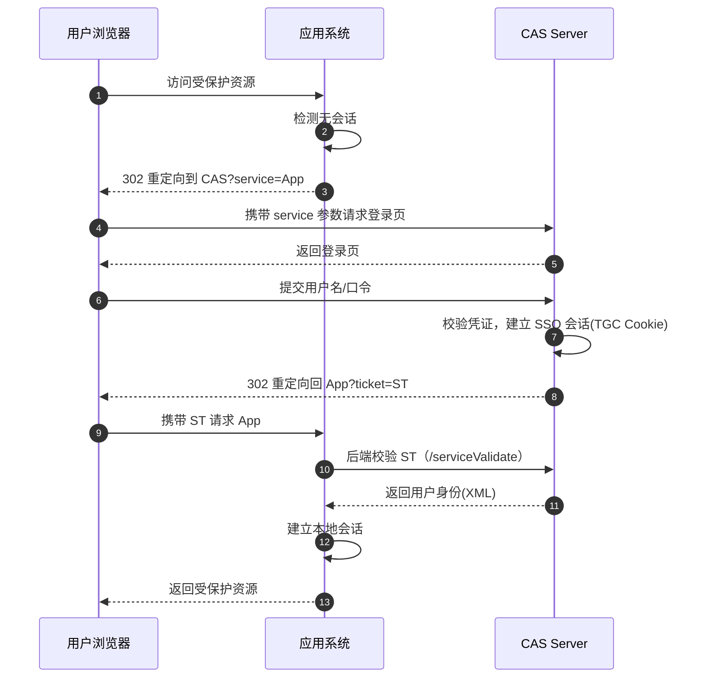
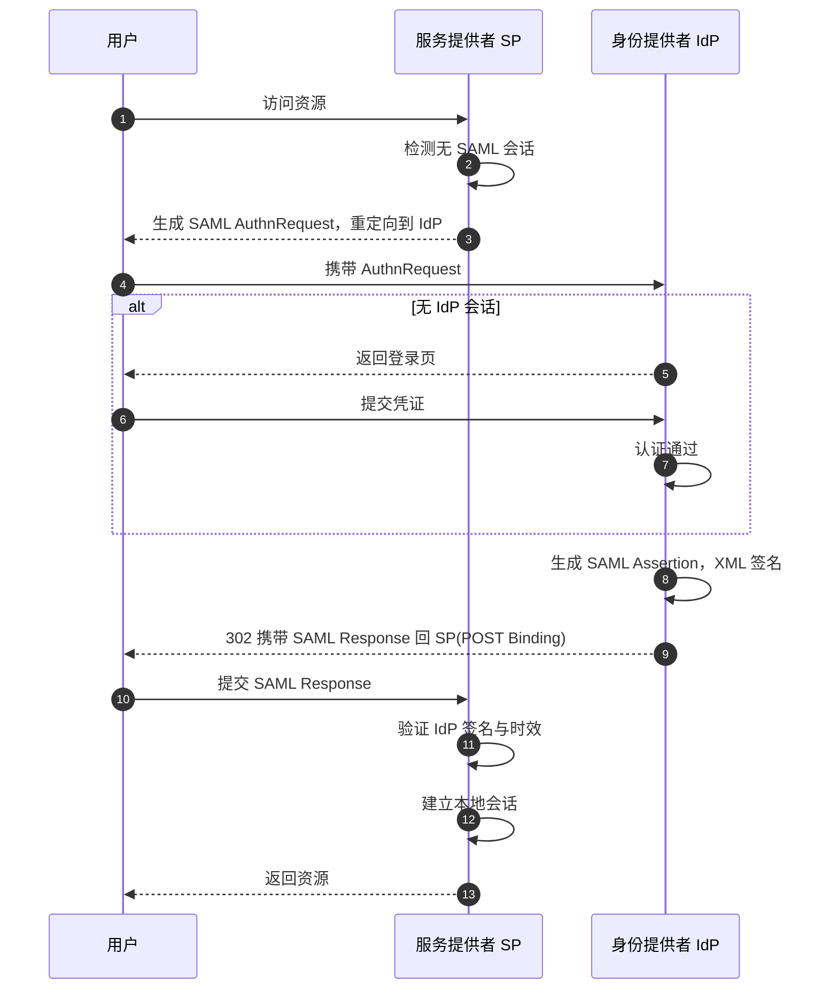
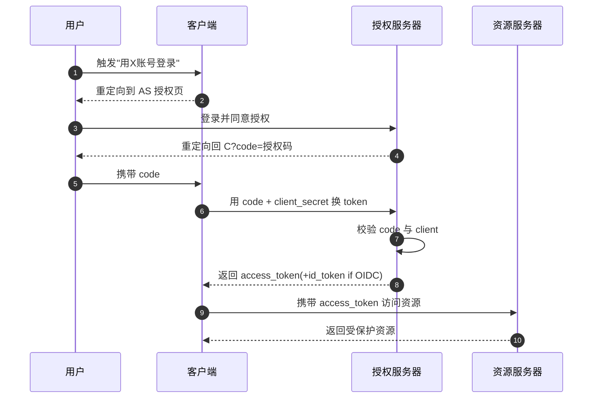

# 3.2 单点登录、多因素认证 MFA

> [!abstract] 本节概述
> 本节解决两个工程问题：一是用户面对众多系统时如何**一次认证、处处通行**（SSO），二是单因素认证强度不足时如何**叠加多种因素**提升安全性（MFA）。SSO 解决"便利与一致性"，MFA 解决"单点强度"，二者常组合部署。

## 单点登录 SSO

> [!definition] 单点登录（SSO, Single Sign-On）
> 用户在**认证中心**完成一次身份认证后，即可在相互信任的多个应用系统中访问，无需重复登录。其本质是把"身份验证"从各应用系统**集中**到认证中心，应用系统只负责"授权决策"。

> [!info] 资产与信任边界
> - **核心资产**：认证中心签发的票据/令牌（Ticket/Token），泄露即等价于口令泄露
> - **信任边界**：认证中心 ↔ 应用系统之间，须用签名/加密保障票据不可伪造、不可篡改
> - **安全目标**：一次认证、票据可验证、会话可集中撤销；单点登出（SLO）是难点

### SSO 的核心价值与风险

| 维度 | 收益 | 风险 |
| ---- | ---- | ---- |
| 用户体验 | 一次登录访问多系统 | — |
| 安全管理 | 凭证集中保管、统一策略 | 认证中心成为**单点失败点**，一旦被攻破全线沦陷 |
| 运维 | 应用系统无需自建认证 | 协议复杂、对接成本高 |
| 审计 | 登录行为集中可追溯 | 单点登出（SLO）跨域困难，残留会话风险 |

> [!warning] SSO 的双刃剑
> SSO 把风险**集中**而非"消除"。认证中心被攻破的代价极高，因此认证中心本身必须部署 MFA、强凭证保护、严格审计，见 [[3.4 权限管理、最小权限原则|3.4 权限管理]]。

## 主流 SSO 协议

### 协议对比

| 协议 | 全称 | 典型场景 | 数据格式 | 认证/授权定位 |
| ---- | ---- | -------- | -------- | ------------- |
| CAS | Central Authentication Service | 高校、企业内网 | 票据（Ticket） | 偏认证 |
| SAML 2.0 | Security Assertion Markup Language | 企业 B2B、教育联邦 | XML | 认证为主，含属性 |
| OAuth 2.0 | Open Authorization 2.0 | 第三方授权（如"用微信登录"） | JSON | **授权**框架，非认证 |
| OIDC | OpenID Connect | 互联网身份、移动端 | JSON（JWT） | 在 OAuth 2.0 上加**认证层** |

> [!warning] OAuth 2.0 ≠ 认证协议
> OAuth 2.0 是**授权框架**，解决"让第三方应用在用户授权下访问用户资源"，本身不提供身份认证。把它当认证用会出严重漏洞（如用 access_token 直接当身份凭证）。OIDC 才是在 OAuth 2.0 之上**专门补齐认证**的标准，通过 `id_token`（JWT）证明用户身份。

### CAS 工作流程

> [!info] CAS（耶鲁大学开源）
> 典型 Web SSO 方案，使用**服务票据（Service Ticket, ST）**机制：用户被重定向到 CAS Server 登录，成功后获得 ST，应用系统后端用 ST 向 CAS Server 校验真伪。

> [!note] CAS 关键设计
> - **TGC（Ticket Granting Cookie）**：存于 CAS 域，代表 SSO 会话，是后续免登录的依据
> - **ST（Service Ticket）**：一次性、仅对单个应用有效、短时效（通常 10 秒），防重放
> - 应用系统后端用 ST 反向校验，**用户永远拿不到 ST 明文校验结果**，防伪造

### SAML 2.0 流程

> [!info] SAML 角色
> - **IdP（Identity Provider，身份提供者）**：认证中心，签发断言
> - **SP（Service Provider，服务提供者）**：应用系统，消费断言
> - **Assertion（断言）**：IdP 用 XML 签名声明的"该用户已认证、属性如下"凭证

> [!tip] SAML vs CAS
> SAML 是**跨组织联邦标准**（如 Shibboleth 教育网联邦），用 XML 签名保证跨域可信；CAS 更偏**单组织内网**，协议轻量。SAML 因 XML + XML 签名实现复杂、历史漏洞多（XML 签名包装攻击），新项目倾向 OIDC。

### OAuth 2.0 与 OIDC

> [!info] OAuth 2.0 授权码流程（最常用）
> 四个角色：资源拥有者（用户）、客户端（第三方应用）、授权服务器、资源服务器。核心是用 `authorization_code` 换 `access_token`，避免令牌经过浏览器。

> [!definition] OIDC 的 id_token
> OIDC 在 OAuth 2.0 基础上增加 `id_token`（JWT 格式），由授权服务器签名，内含用户身份声明（sub、iss、aud、exp 等）。客户端**通过验证 id_token 签名获得认证结果**，而非把 access_token 当身份用。这是"OAuth 当认证"漏洞的标准修复。

> [!example] 三者定位区分
> - 想让员工**一次登录访问公司内网多个系统** → CAS 或 SAML
> - 想让用户**用微信账号登录第三方 App** → OAuth 2.0（授权）+ OIDC（认证）
> - 想在移动端做**标准化身份联合** → OIDC（JSON/JWT 比 SAML XML 更友好）

## 多因素认证 MFA

> [!definition] 多因素认证（MFA, Multi-Factor Authentication）
> 要求用户同时提供**两种或以上不同类别**的认证因素方可通过认证。强调"不同类别"——口令 + 密保问题都是"你知道什么"，不算 MFA。

> [!info] 安全目标
> 单因素泄露不足以攻破认证：口令被钓鱼，但攻击者没有 OTP；手机被盗，但没有口令。MFA 把攻破成本从"攻破一个因素"提升到"攻破多个独立因素"。

### MFA 实现方式对比

| 方式 | 所属因素 | 优势 | 威胁 |
| ---- | -------- | ---- | ---- |
| 短信验证码 | 你拥有（手机） | 普及、零门槛 | SIM 劫持、SS7 拦截、钓鱼转发 |
| TOTP App | 你拥有（设备） | 离线生成、无运营商依赖 | 实时钓鱼、设备 root |
| 推送通知 | 你拥有（设备） | 体验好、可显示登录上下文 | 通知疲劳误点、设备失窃 |
| 硬件密钥 U2F/FIDO2 | 你拥有（硬件） | 抗钓鱼、私钥不出设备 | 成本、兼容性 |
| 生物特征 | 你是什么 | 便捷 | 模板泄露不可撤销 |

> [!warning] 短信验证码已不推荐用于高安全场景
> SIM 劫持（攻击者骗运营商补卡）和 SS7 协议漏洞可使攻击者截获短信。NIST SP 800-63B 已将 SMS 列为受限使用。新系统应优先 TOTP App 或 FIDO2。

### MFA 的典型组合

> [!example] 常见组合
> - **口令 + TOTP**：Web 登录最常见组合，性价比高
> - **口令 + 短信**：早期银行、社交普遍，正在被淘汰
> - **口令 + FIDO2**：Google、GitHub 强安全账户推荐
> - **TOTP + 生物特征**：移动端无口令方案，手机解锁即第二因素
> - **口令 + 推送 + 生物特征**：高价值账户（如云管理控制台）

### MFA 的风险与缓解

> [!warning] MFA 疲劳攻击（MFA Fatigue）
> 攻击者掌握了用户口令后，反复触发 MFA 推送通知，期待用户不耐烦误点"批准"。缓解：推送须显示登录地点/设备/时间；限制推送次数；改用需在设备上输入匹配数字的挑战-响应式推送。

> [!warning] 实时钓鱼（Real-time Phishing）
> 攻击者搭建伪登录页，实时把用户输入的口令和 OTP 转发到真站完成认证。TOTP 短信对此无抵抗力。**FIDO2 基于源站域的挑战-响应可抗此类攻击**，详见 [[3.1 认证方式：口令、生物特征、硬件令牌|3.1 FIDO2]]。

> [!tip] MFA 部署要点
> - 提供备用因素：用户丢失主因素时可用备用码/二次验证恢复，避免被锁死
> - 高权限账号强制 MFA：管理员、财务、开发运维特权账号
> - 风险自适应（Adaptive/Step-up）：检测到异常登录（新设备、异地）时升级要求多因素
> - 备份恢复码一次性使用并加密存储

## 案例：企业 CAS 单点登录

> [!example] 某高校 CAS 部署
> - **认证中心**：CAS Server 统一对接学校 LDAP/统一身份库
> - **接入系统**：教务系统、图书馆、邮件、OA、VPN 等十余个系统均改造为 CAS 客户端
> - **登录体验**：学生首次访问教务被重定向到 CAS 登录页，认证后返回教务；后续访问图书馆不再需要登录（CAS TGC 仍有效）
> - **安全加固**：CAS 强制启用 MFA（TOTP），教务等高敏系统启用 step-up；所有 ST 走 HTTPS 后端校验
> - **单点登出**：CAS 通知各应用销毁本地会话，但跨域 SLO 仍存在时序窗口，配合短会话超时缓解

## 案例：Google 账户 MFA

> [!example] Google 两步验证 → Passkey
> 1. **两步验证（2SV）**：口令通过后，向注册手机推送"Google 登录提示"或要求 TOTP；用户在设备上点"是"即完成第二因素
> 2. **推送显示上下文**：推送通知显示登录地点、设备型号、时间，防 MFA 疲劳误点
> 3. **Passkey 升级**：基于 FIDO2 / WebAuthn，用户用设备解锁（指纹/PIN）触发私钥签名，**无口令**完成认证，抗钓鱼且体验更顺滑
> 4. **风险自适应**：异地登录、新设备会触发额外验证（如要求使用备用恢复码）

## 本节小结

> [!note] SSO 与 MFA 的关系
> SSO 解决"集中认证、减少重复登录"，MFA 解决"单点强度不足"。强认证中心通常**SSO + MFA 并用**：用户在认证中心做一次 MFA 强认证，拿到短期票据访问多个应用，应用无需各自实现 MFA。但这也意味着认证中心的会话保护必须极强，否则 SSO 把便利给了攻击者。

## 章节导航

- 上级：[[MOC - 信息安全技术|信息安全技术总览]]
- 本章：[[MOC - 第3章|第3章 身份认证与访问控制]]
- 上一节：[[3.1 认证方式：口令、生物特征、硬件令牌|3.1 认证方式]]
- 下一节：[[3.3 访问控制模型：自主、强制、角色 RBAC|3.3 访问控制模型]]
- 习题：[[MOC - 第3章习题|第3章 习题]]