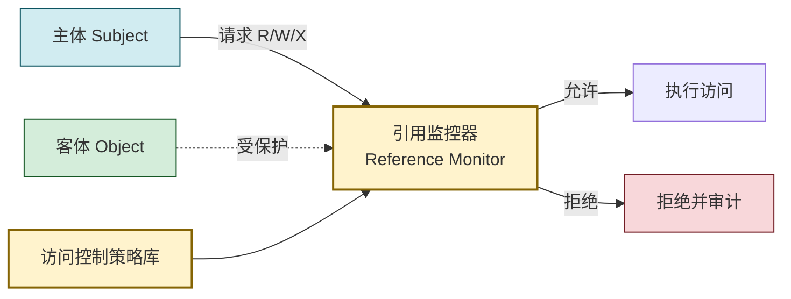
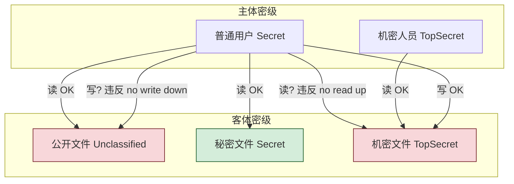
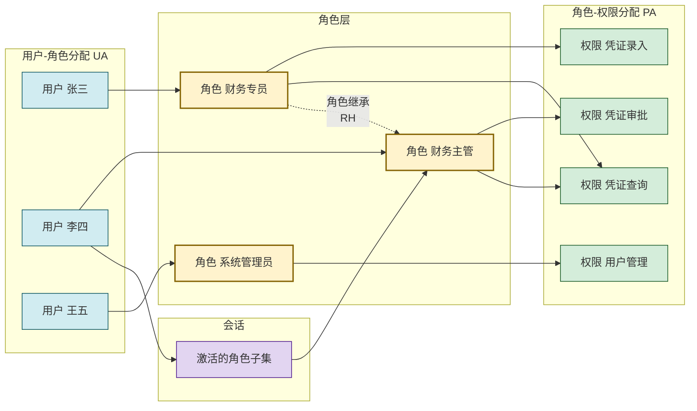

# 3.3 访问控制模型：自主、强制、角色 RBAC

> [!abstract] 本节概述
> 本节解决"用户身份已通过认证后，系统如何决定其能对哪些资源执行哪些操作"这一授权问题。围绕 **DAC、MAC、RBAC、ABAC** 四类经典模型，梳理其决策依据、适用场景与工程实现，是 [[3.4 权限管理、最小权限原则|3.4 权限治理]] 的理论基础。

> [!info] 资产与信任边界
> - **核心资产**：访问控制策略库、ACL/能力表、安全标签、角色-权限映射表
> - **信任边界**：访问控制决策点（PDP）与执行点（PEP）之间；策略一旦被绕过则全盘失守
> - **安全目标**：每次访问都经过显式判定，拒绝为默认；策略与组织职责对齐

## 访问控制基本概念

> [!definition] 访问控制三要素
> - **主体（Subject）**：发起访问的实体，通常是用户、进程、服务
> - **客体（Object）**：被访问的资源，如文件、数据库表、API、设备
> - **操作（Action/Access Mode）**：主体对客体执行的动作，如读、写、执行、删除

> [!definition] 引用监控器（Reference Monitor）
> 所有访问请求都必须经过的**仲裁机制**，依据访问控制策略对每次"主体-操作-客体"组合做出允许/拒绝判定。它须满足：不可绕过、可验证、足够小到可被严格分析。



## DAC：自主访问控制

> [!definition] 自主访问控制（DAC, Discretionary Access Control）
> 资源**所有者**可自主决定将访问权限授予其他主体。决策依据是所有者设定的访问规则。"自主"指所有者有权传递权限。

> [!info] 典型实现：ACL（访问控制列表）
> 每个客体关联一个列表，记录"哪些主体可对其执行哪些操作"。

| 客体 | 主体 | 权限 |
| ---- | ---- | ---- |
| report.doc | alice | 读写 |
| report.doc | bob | 只读 |
| report.doc | finance_group | 读写执行 |

> [!example] Linux 文件权限（DAC 典型）
> Linux 用 9 位权限位 `rwxrwxrwx` 分别表示属主、属组、其他的读写执行：
> ```
> $ ls -l report.txt
> -rw-r--r-- 1 alice finance 1024 Aug 3 10:00 report.txt
> ```
> - 属主 alice：`rw-`（读写）
> - 属组 finance：`r--`（只读）
> - 其他：`r--`（只读）
> 属主 alice 可用 `chmod`/`chown` 自主修改权限，这是 DAC 的"自主"体现。

> [!warning] DAC 的局限
> - **权限可传递**：拿到权限的主体可能再传递，导致权限蔓延失控
> - **信息流难控**：用户读到的数据可复制到无权客体，DAC 无法阻止
> - **管理成本高**：大规模环境下逐客体配 ACL 易出错、难审计

## MAC：强制访问控制

> [!definition] 强制访问控制（MAC, Mandatory Access Control）
> 系统依据**安全标签**统一强制实施访问策略，主体与客体都被赋予密级/标签，访问是否允许由**系统策略**决定，单个用户（甚至资源所有者）**无权自主更改**。

> [!info] Bell-LaPadula 模型（BLP）
> 针对**保密性**的经典 MAC 模型，核心是防止高密级信息流向低密级主体：
> - **简单安全属性（向下读，no read up）**：主体密级 $\geq$ 客体密级才可读
> - ***-属性（向上写，no write down）**：主体密级 $\leq$ 客体密级才可写
>
> 直觉：机密文件不能被普通用户读（防泄露）；普通用户不能往机密文件写（防投毒/隐信道标注），但允许往上写以汇总信息。



> [!warning] BLP 的"向上写"易错点
> - 普通用户**可以**往机密文件写——这看似反常，但目的是允许低密级数据汇总上报而不发生反向泄露
> - BLP **只保证保密性，不保证完整性**；完整性由 Biba 模型（"向上读、向下写"）补充
> - BLP 不能阻止**隐信道**（如通过时间、磁盘空间侧信道传信息）

> [!example] 军方密级系统（MAC 典型）
> 文件标"机密/绝密"，人员持相应涉密等级许可。普通士兵不能读机密文件（no read up）；即便是机密文件所有者，也无权把文件降级为"公开"——这必须经专门脱密程序，体现 MAC 的"强制"。

## RBAC：角色访问控制

> [!definition] 角色访问控制（RBAC, Role-Based Access Control）
> 在用户与权限之间引入**角色**层：权限授予角色，用户被分配角色，用户通过角色继承权限。决策依据是"用户拥有哪些角色，这些角色有哪些权限"。

> [!info] RBAC 的核心动机
> 直接维护"用户-权限"二元关系在大规模系统中不可维护（用户多、权限多、频繁变动）。角色作为中间层对应**组织职责**，相对稳定：人员变动只需调整"用户-角色"，职责调整只需调整"角色-权限"，二者解耦。

### RBAC 模型结构



> [!note] RBAC 标准层级（NIST RBAC）
> - **RBAC0（基础）**：用户-角色（UA）、角色-权限（PA）、会话
> - **RBAC1（含层级）**：引入角色继承（RH），主管继承专员权限
> - **RBAC2（含约束）**：加入约束，如互斥角色、角色基数限制
> - **RBAC3（统一）**：RBAC1 + RBAC2

> [!tip] RBAC 关键约束
> - **职责分离（SoD）**：互斥角色不可同时分配（如"制单"与"审批"不能同一人），见 [[3.4 权限管理、最小权限原则|3.4 权限分离]]
> - **角色基数**：某角色最多 N 人（如"超级管理员"仅 2 人）
> - **会话激活**：用户登录会话只激活其角色子集，做到"按需启用"，降低误操作风险

> [!example] 企业 ERP（RBAC 典型）
> - 角色"采购员"可创建采购订单；"采购主管"可审批订单且继承采购员权限；"财务"可付款
> - 张三离职 → 移除其"采购员"角色，所有相关权限一并回收，无需逐项清理
> - 新增"退货处理"业务 → 新建角色并授予权限，分配给相关人员，不影响现有角色

## ABAC：属性访问控制

> [!definition] 属性访问控制（ABAC, Attribute-Based Access Control）
> 基于主体属性、客体属性、操作属性、环境属性的**策略表达式**做出访问决策。决策依据是"属性 + 规则"，可表达细粒度、动态的策略。

> [!example] ABAC 策略示例
> "允许 主体.部门=财务 且 主体.职级≥经理 且 客体.类型=凭证 且 客体.金额≤10万 且 环境.时间=工作时间 且 环境.IP∈公司网段" → 执行"审批"
>
> 同一身份在不同时间、地点、对不同金额的凭证，权限动态变化——这是 RBAC 难以表达的。

| 模型 | 决策依据 | 灵活性 | 典型场景 |
| ---- | -------- | ------ | -------- |
| DAC | 所有者自主 | 高 | Linux 文件权限 |
| MAC | 安全标签 | 低 | 军方、涉密系统 |
| RBAC | 角色分配 | 中 | 企业 ERP、OA |
| ABAC | 属性策略 | 高 | 云平台、零信任 |

> [!warning] ABAC 的复杂度代价
> ABAC 表达力最强，但策略数量随属性组合爆炸，**可读性、可审计性下降**，规则冲突难以排查。工程上常以 RBAC 为主、ABAC 为辅（角色 + 属性叠加），而非纯 ABAC。

## 四模型综合对比

| 维度 | DAC | MAC | RBAC | ABAC |
| ---- | --- | --- | ---- | ---- |
| 决策依据 | 所有者意愿 | 安全标签 | 角色 | 属性 + 策略 |
| 谁定权限 | 资源所有者 | 系统统一策略 | 管理员配角色 | 策略引擎 |
| 用户能否自主授权 | 能 | 不能 | 不能（仅管理员） | 不能（仅策略） |
| 灵活性 | 高 | 低 | 中 | 高 |
| 管理成本 | 客体越多越贵 | 标签维护贵 | 角色相对稳定 | 策略复杂 |
| 信息流控制 | 弱 | 强（BLP） | 中 | 强 |
| 典型场景 | Linux 文件 | 军方密级 | 企业 ERP | 云平台/零信任 |
| 标准/模型 | ACL | BLP/Biba | NIST RBAC | XACML |

> [!note] 选型直觉
> - **小规模协作** → DAC 够用
> - **强保密/合规** → MAC
> - **企业职能清晰** → RBAC（最主流）
> - **细粒度、动态、零信任** → ABAC（或 RBAC + ABAC 混合）

## 案例对照

> [!example] 三种场景的模型选择
> 1. **Linux 文件权限（DAC）**：用户自有目录的文件，由用户自主 `chmod` 决定他人能否读
> 2. **军方涉密系统（MAC）**：文件贴"绝密"标签，士兵持"秘密"许可，系统强制禁止读，所有者无权降级
> 3. **企业 ERP（RBAC）**：财务专员角色统一授"凭证录入"，张三入职分到该角色即获权，离职即回收
> 4. **云平台细粒度（ABAC/RBAC 混合）**：基础权限按角色，敏感操作叠加"仅工作时间、仅公司 IP、仅低敏感数据"属性条件

## 本节小结

> [!tip] 模型不是非此即彼
> 现代系统常**多模型叠加**：操作系统用 DAC 管文件、用 MAC 管特权进程（SELinux）；应用层用 RBAC 管角色、用 ABAC 管细粒度。理解每个模型解决的核心矛盾（信息流/职责/属性），比记住"哪个最好"更重要。模型选定后，权限的全生命周期治理见 [[3.4 权限管理、最小权限原则|3.4 权限管理]]。

## 章节导航

- 上级：[[MOC - 信息安全技术|信息安全技术总览]]
- 本章：[[MOC - 第3章|第3章 身份认证与访问控制]]
- 上一节：[[3.2 单点登录、多因素认证 MFA|3.2 单点登录、MFA]]
- 下一节：[[3.4 权限管理、最小权限原则|3.4 权限管理、最小权限原则]]
- 习题：[[MOC - 第3章习题|第3章 习题]]
