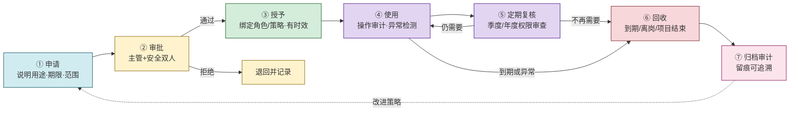

# 3.4 权限管理、最小权限原则

> [!abstract] 本节概述
> 本节解决"如何在工程上治理权限全生命周期，避免权限滥用与积累"的问题。访问控制模型（[[3.3 访问控制模型：自主、强制、角色 RBAC|3.3]]）回答"如何判定一次访问"，本节回答"如何决定一个主体**应当**有哪些权限、如何发放、如何回收、如何审计"。

> [!info] 资产与信任边界
> - **核心资产**：权限策略库、特权账号凭证、审批流记录、审计日志
> - **信任边界**：权限发放（管理员/审批人）↔ 权限使用（用户）↔ 权限回收（系统/审计）
> - **安全目标**：权限最小化、可追溯、可回收；特权操作全程留痕

## 最小权限原则

> [!definition] 最小权限原则（Principle of Least Privilege, PoLP）
> 每个主体（用户、进程、系统）只应被授予**完成其合法任务所必需的最小权限**，且该权限仅在**需要时**、**需要的最短时间内**有效。

> [!info] 安全目标
> 缩小"攻击面"与"爆炸半径"：
> - 账号被盗 → 攻击者能做的事被权限范围限定
> - 内部误操作 → 影响范围被最小化
> - 漏洞被利用 → 提权路径变长

> [!example] 最小权限的具体表现
> - 普通员工不应有"管理员"角色，即便"偶尔需要装软件"也应走工单临时提权
> - Web 应用进程不应以 root 运行，而以低权限专用账号运行
> - 数据库查询账号只授 SELECT，写操作走另一受限账号
> - CI/CD 构建机器的部署密钥只对生产环境特定目录可写，而非全集群

> [!warning] 常见反模式：权限积累
> - **权限只增不减**：员工调岗、项目结束后旧权限未回收，形成"权限雪球"
> - **默认高权限**：为图方便给"管理员"角色，违反最小权限
> - **共享特权账号**：多人共用 root/admin，无法定位操作人
> 这些都是审计与等保检查的典型扣分项。

## 权限分离

> [!definition] 权限分离（Separation of Duties, SoD）
> 将一项敏感操作的完成拆分给**多个互斥角色**，使任何单一主体都无法独立完成全流程，从而防止单点欺诈或破坏。

> [!info] 安全目标
> 强制"串谋"才能违规，把内部单人作案风险降到极低。

| 业务场景 | 角色拆分 | 体现的 SoD |
| -------- | -------- | ---------- |
| 财务付款 | 制单人 ≠ 审批人 ≠ 付款人 | 防单人挪用 |
| 代码上线 | 开发 ≠ 代码评审 ≠ 发布 | 防后门植入 |
| 用户管理 | 申请者 ≠ 审批者 ≠ 执行管理员 | 防私授特权 |
| 密钥管理 | 密钥生成 ≠ 密钥使用 ≠ 密钥销毁 | 防单人掌控全链 |

> [!tip] RBAC 中的 SoD 落地
> 在 [[3.3 访问控制模型：自主、强制、角色 RBAC|3.3 RBAC]] 中通过**互斥角色约束**实现：定义"制单"与"审批"互斥，系统拒绝把二者同时分配给同一用户。这是 RBAC2 的核心约束之一。

> [!note] SoD 的代价
> SoD 会增加流程环节与人力成本，**并非所有操作都适合**。应仅对高敏感操作（金额超阈值、影响生产环境、涉密数据）强制 SoD，日常低风险操作仍按效率优先。

## 权限生命周期

> [!info] 权限是一种资产，有始有终
> 权限不应"一旦授予永久有效"。完整的权限治理要求每个权限都经历：申请 → 审批 → 授予 → 使用 → 回收（或定期复核）的闭环。

### 各阶段要点

| 阶段 | 关键控制 | 常见缺陷 |
| ---- | -------- | -------- |
| ① 申请 | 必须说明用途、期限、范围；口头申请无效 | "先给我管理员，回头再退" |
| ② 审批 | 主管 + 安全双签；高权限需 SoD | 一人批自己人 |
| ③ 授予 | 绑定角色/策略；设到期时间；默认拒绝 | 永久权限、过宽策略 |
| ④ 使用 | 操作全程审计；异常行为检测 | 无日志、不告警 |
| ⑤ 复核 | 季度/年度审查；离职/调岗触发 | 只授不审 |
| ⑥ 回收 | 到期自动回收；离岗即停 | 项目结束权限仍在 |
| ⑦ 归档 | 审计日志留存且不可篡改 | 日志可被管理员删除 |

> [!warning] 离职/调岗是权限回收的高危节点
> 大量内部数据泄露发生在员工离职前后。规范要求：HR 离职流程与 IT 权限回收**强耦合**——离职当日（甚至提前）自动触发权限回收与账号停用，而非依赖人工通知。

## 特权账号管理（PAM）

> [!definition] 特权账号管理（PAM, Privileged Access Management）
> 专门针对 root、administrator、数据库 DBA、云控台管理员等**高权限账号**的集中管理方案。核心能力：凭证保管、临时授权、会话录制、操作审计。

> [!info] 为什么普通权限管理不够
> 特权账号能绕过绝大多数访问控制（[[3.3 访问控制模型：自主、强制、角色 RBAC|3.3 引用监控器]]本身由特权账号维护）。一旦特权账号被盗，整套访问控制形同虚设。因此 PAM 是权限治理的"重中之重"。

### PAM 的核心能力

| 能力 | 说明 | 解决的问题 |
| ---- | ---- | ---------- |
| 凭证保险箱 | 特权口令/密钥集中加密保管，用户不接触明文 | 口令散落、共享、硬编码 |
| 临时授权 | 按需申请、限时（如 1 小时）授予，到期自动回收 | 永久特权积累 |
| 会话代理 | 用户经 PAM 代理登录目标，PAM 代为注入凭证 | 凭证经手人多 |
| 会话录制 | 录屏/录键，操作可回放 | 特权操作不可追溯 |
| 命令审计 | 记录执行的每条命令，可告警高危命令 | 误操作/恶意操作无据 |
| 密码轮换 | 每次使用后自动更换目标特权口令 | 口令泄露后长期可用 |

> [!example] PAM 工作流
> 1. 运维张三需登录生产数据库排查问题 → 在 PAM 提交申请，填理由、申请 30 分钟
> 2. 主管 + DBA 审批通过 → PAM 临时授予张三访问代理通道，**张三始终不知道数据库真实口令**
> 3. 张三通过 PAM 代理 SSH/数据库会话操作，全程录屏
> 4. 30 分钟到期 → PAM 自动切断会话、回收权限、轮换数据库口令
> 5. 操作录像与命令日志归档，安全团队可按需回放审查

## 权限审计与合规

> [!definition] 权限审计
> 定期或不定期核查"谁有什么权限、是否合规、是否被滥用"的过程，是权限治理的闭环反馈。

> [!info] 审计的内容
> - **权限分配审查**：角色-权限映射是否符合最小权限；是否存在冗余/孤儿权限
> - **使用情况审查**：哪些权限长期未使用（应回收）；哪些异常高频（可能被盗）
> - **变更审查**：权限发放/回收是否走审批流；变更记录与审批是否一致
> - **特权审查**：特权账号清单、使用记录、会话录像抽样复核

> [!tip] 合规驱动
> 等保 2.0、ISO 27001、SOX 等均要求**访问控制审计**。建议：
> - 用 Dataview/脚本定期生成"权限-用户"快照报表，对比上次快照发现新增/回收
> - 设权限复核周期：高敏权限季度审、普通权限半年审
> - 审计日志独立存储，特权账号也无权删改（防"删日志灭迹"）

## 案例：某企业特权账号管理实践

> [!example] 整改前后对照
> **整改前问题**：
> - 6 名运维共享一个 root 口令，写在团队 wiki
> - 多个离职人员 root 权限未回收
> - 生产数据库 DBA 口令半年未换
> - 出过一次误删库事故，无法定位操作人
>
> **整改措施**：
> 1. 引入 PAM 系统，收回所有共享 root；root 口令入保险箱，每人按需申请
> 2. 运维登录走 PAM 代理 + [[3.2 单点登录、多因素认证 MFA|MFA]]，会话全程录屏
> 3. 高危命令（`rm -rf`、`DROP TABLE`）实时告警安全值班
> 4. HR 离职流程对接 PAM，离职当日自动停用所有特权
> 5. 季度权限复核，长期未用权限自动回收
>
> **整改成效**：
> - 特权账号从"共享 1 个"变为"按需临时授权，平均日活 < 5 次"
> - 操作可定位到人，事后回放 5 分钟内可还原
> - 等保 2.0 三级测评中"访问控制"项从扣分到符合

## 本节小结

> [!note] 最小权限是"原则"，PAM 是"工具"，审计是"闭环"
> 最小权限原则要求"只给必要的"；PAM 把这一原则**工程化**到特权账号场景，做到按需发放、自动回收、全程录屏；审计则验证原则是否被遵守，形成改进闭环。三者结合，配合 [[3.3 访问控制模型：自主、强制、角色 RBAC|3.3 RBAC]] 的模型支撑，构成完整的权限治理体系。

## 章节导航

- 上级：[[MOC - 信息安全技术|信息安全技术总览]]
- 本章：[[MOC - 第3章|第3章 身份认证与访问控制]]
- 上一节：[[3.3 访问控制模型：自主、强制、角色 RBAC|3.3 访问控制模型]]
- 下一章：[[MOC - 第4章|第4章 网络攻击与防御技术]]
- 习题：[[MOC - 第3章习题|第3章 习题]]
