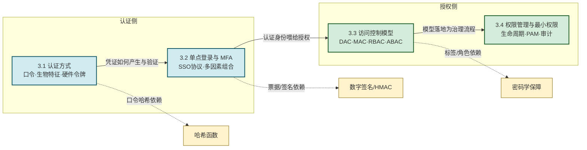

# MOC - 第3章 身份认证与访问控制

本章解决的核心问题是：**在开放网络环境中，如何可靠地确认用户身份（认证），并据此精确控制其对资源的访问（授权）**。认证回答"你是谁"，授权回答"你能做什么"，二者共同构成信息系统安全的第一道防线。

> [!info] 本章定位
> - **前置依赖**：[[MOC - 第1章|第1章]] 建立 CIA 三要素与安全模型认识；[[MOC - 第2章|第2章]] 提供哈希、对称/非对称加密、数字签名、HMAC 等密码学原语
> - **本章主线**：认证因素 → 认证协议（SSO/MFA）→ 访问控制模型 → 权限治理
> - **后续应用**：[[MOC - 第4章|第4章]] Web 攻击中的身份会话劫持、[[MOC - 第7章|第7章]] TLS 客户端认证、[[MOC - 第8章|第8章]] 等保 2.0 中的访问控制要求
> - **资产与信任边界**：身份凭证数据库、认证服务器、会话令牌是核心资产；信任边界位于用户终端与认证服务之间、认证服务与应用系统之间

> [!warning] 安全目标与前置条件
> - **安全目标**：防止身份冒充、越权访问、权限滥用、凭证泄露
> - **前置条件**：已建立 [[MOC - 第2章|密码学基础]]（哈希、HMAC、公钥加密）；理解 [[MOC - 第1章|CIA 三要素]]
> - **缓解措施方向**：多因素叠加、最小权限、权限分离、生命周期管理、审计留痕

## 本章知识路线

> [!note] 认证与授权的分界
> - **认证（Authentication, AuthN）**：验证实体是否为其声称的身份，结果为"是/否"
> - **授权（Authorization, AuthZ）**：在身份已知的前提下，决定该身份可对哪些资源执行何种操作
> - 工程中常缩写为 AuthN / AuthZ 以避免混淆；本章 3.1–3.2 偏 AuthN，3.3–3.4 偏 AuthZ

## 知识点导航

| 小节 | 标题 | 核心问题 | 关键术语 |
| ---- | ---- | -------- | -------- |
| [[3.1 认证方式：口令、生物特征、硬件令牌\|3.1]] | 认证方式：口令、生物特征、硬件令牌 | 三类认证因素如何各自产生与验证 | 口令哈希、加盐、bcrypt、FAR/FRR、HOTP/TOTP、FIDO2 |
| [[3.2 单点登录、多因素认证 MFA\|3.2]] | 单点登录、多因素认证 MFA | 如何一次认证访问多系统、如何叠加因素 | SSO、CAS、SAML、OAuth 2.0、OIDC、MFA |
| [[3.3 访问控制模型：自主、强制、角色 RBAC\|3.3]] | 访问控制模型：自主、强制、角色 RBAC | 已知身份后如何决定其权限 | DAC、MAC、Bell-LaPadula、RBAC、ABAC、ACL |
| [[3.4 权限管理、最小权限原则\|3.4]] | 权限管理、最小权限原则 | 如何在工程上治理权限全生命周期 | 最小权限、权限分离、PAM、权限回收、审计 |

## 核心考点

> [!tip] 高频考点速览
> 1. **认证 vs 授权**概念辨析（选择/简答常考）
> 2. **三种认证因素**：你知道什么 / 你拥有什么 / 你是什么，及典型代表
> 3. **口令存储**：明文 → 哈希 → 加盐哈希 → 慢哈希（bcrypt/scrypt）的演进与防御对象（彩虹表、字典攻击、暴力破解）
> 4. **生物特征指标 FAR / FRR / EER** 的含义与权衡关系
> 5. **HOTP vs TOTP** 区别（计数器 vs 时间步）；TOTP 生成流程
> 6. **SSO 协议族**：CAS / SAML / OAuth 2.0 / OIDC 的定位与典型场景
> 7. **DAC / MAC / RBAC / ABAC** 四模型对比，Bell-LaPadula "向下写、向上读" 安全规则
> 8. **最小权限原则**与**权限分离**在工程中的落地（PAM、特权账号管理、权限回收）

## 关键概念速查

### 认证三因素

| 因素类别 | 英文 | 典型凭证 | 主要威胁 |
| -------- | ---- | -------- | -------- |
| 你知道什么 | Something you know | 口令、PIN、密保问题 | 钓鱼、字典攻击、社会工程 |
| 你拥有什么 | Something you have | OTP 令牌、U2F 密钥、手机 | 设备丢失、SIM 劫持 |
| 你是什么 | Something you are | 指纹、人脸、虹膜 | 模板泄露、呈现攻击、不可撤销 |

### 访问控制模型对比

| 模型 | 决策依据 | 灵活性 | 典型场景 |
| ---- | -------- | ------ | -------- |
| DAC | 资源所有者 | 高 | Linux 文件权限 |
| MAC | 安全标签 | 低 | 军方、涉密系统 |
| RBAC | 角色分配 | 中 | 企业 ERP、OA |
| ABAC | 属性策略 | 高 | 云平台、零信任 |

## 章节导航

- 上级：[[MOC - 信息安全技术|信息安全技术总览]]
- 上一章：[[MOC - 第2章|第2章 密码学基础]]
- 下一章：[[MOC - 第4章|第4章 网络攻击与防御技术]]
- 本章习题：[[MOC - 第3章习题|第3章 习题]]
