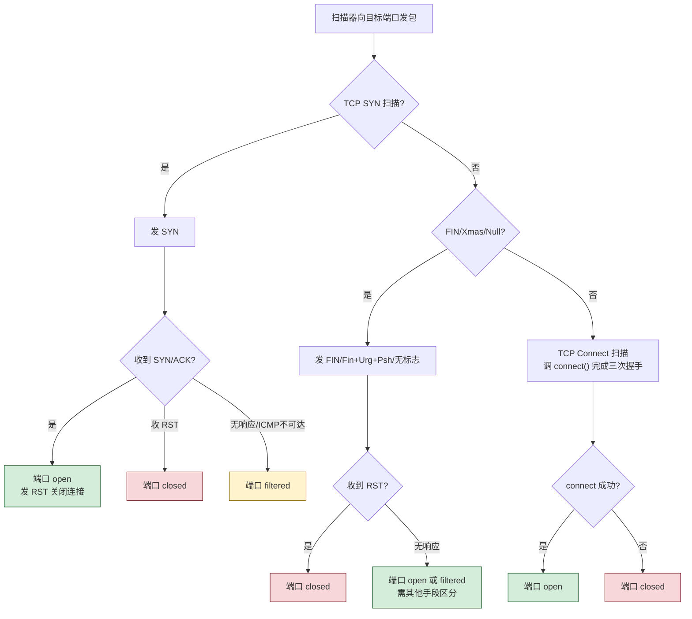

# 4.1 信息收集、端口扫描、嗅探技术

> [!abstract] 本节概述
> 本节解决"攻击者在发起实质入侵前如何了解目标"这一侦察阶段问题。信息收集回答"目标是谁、有什么资产"，端口扫描回答"目标开了哪些门"，嗅探回答"门后面在传什么"。三者构成典型 kill chain 的侦察环节，是后续 [[4.2 DoS、DDoS 攻击原理与防御|DoS]]、[[4.3 ARP 欺骗、中间人攻击|MITM]]、[[4.4 Web 安全：SQL 注入、XSS、CSRF|Web 攻击]] 的前置步骤。理解侦察手段才能反过来设计"最小开放面 + 流量加密 + 监测告警"的防御体系。

> [!info] 资产与信任边界
> - **核心资产**：域名/IP 资产清单、开放端口与服务版本、网络流量内容
> - **信任边界**：Internet↔目标网络边界；交换机内部端口间信任关系；无线信道广播性
> - **攻击者能力假设**：能查询公开数据源（DNS/WHOIS/搜索引擎）、能向目标 IP 段发送探测包、能接入目标所在链路（共享网段或交换网段）
> - **威胁模型**：被动监听（嗅探，不改流量）与主动探测（扫描，会留痕）；前者难检测，后者可在边界日志发现
> - **安全目标**：最小化可探测面（关闭非必要端口）、保护流量机密性（加密）、监测异常扫描行为
> - **缓解措施方向**：防火墙过滤、端口关闭、交换网络隔离、流量加密（TLS/IPSec）、IDS 告警

> [!warning] 仅限授权实验环境使用
> 本节涉及的 nmap、Wireshark、MAC 泛洪等工具与命令**仅可在明确授权的实验环境（如自建靶场、CTF 平台、授权渗透测试合同范围内）使用**。对任何未经书面授权的真实第三方系统执行扫描或嗅探均属违法行为，可能触犯《网络安全法》《刑法》第 285 条非法侵入计算机信息系统罪。实验前确认目标 IP 段属于授权范围，实验后恢复网络设备配置。

## 信息收集阶段

信息收集是攻击的第一步，目标是构建目标的"数字画像"：域名、IP 段、组织信息、开放服务、技术栈、员工信息等。该阶段主要利用**公开数据源**（OSINT, Open-Source Intelligence），不直接触碰目标系统，因此难以从目标侧检测。

### 主要手段

| 手段 | 获取信息 | 典型工具/来源 | 检测难度 |
| ---- | -------- | ------------- | -------- |
| DNS 查询 | 域名对应 IP、子域名、邮件服务器 | `nslookup`、`dig`、区域传送 | 极低（公开查询） |
| WHOIS | 注册人、注册机构、联系方式、注册商 | whois 服务器、ICANN | 极低（公开数据库） |
| 搜索引擎 dorking | 后台页面、敏感文件、错误信息 | Google 高级语法（`site:`、`filetype:`、`inurl:`） | 低 |
| 网络空间测绘 | 全球 IP 的开放端口与服务指纹 | Shodan、Censys、FOFA | 低（被动查询） |
| 社会工程 | 员工、组织架构、技术栈 | LinkedIn、GitHub、企业官网 | 低 |

> [!example] DNS 查询示例（授权环境，Linux Bash）
> ```bash
> # 查询 example.com 的 A 记录（IPv4 地址）
> dig example.com A
> # 查询邮件服务器
> dig example.com MX
> # 尝试区域传送（若管理员误配为允许任意主机传送则可获取全部子域名）
> dig axfr @ns.example.com example.com
> ```
> 风险：区域传送（AXFR）若被攻击者成功获取，会一次性泄露该域全部主机记录。恢复/防御：DNS 服务器仅允许信任从机进行区域传送。

> [!tip] Google Hacking / Dorking 常见语法
> - `site:target.com` 限定目标站点
> - `filetype:pdf` 查找特定类型文件（常用于找泄露的内部文档）
> - `inurl:admin` 查找 URL 含 admin 的页面（后台入口）
> - `intitle:"index of"` 查找目录列表暴露
> 防御：定期用同样语法自查，发现敏感页面后及时下线或加访问控制。

## 端口扫描原理

端口扫描通过向目标 TCP/UDP 端口发送特定构造的数据包，根据响应判断端口状态（开放、关闭、被过滤），从而了解目标运行了哪些服务。它是侦察阶段从"公开信息"过渡到"主动探测"的关键环节。

> [!definition] 端口状态（nmap 定义）
> - **open（开放）**：应用程序正在该端口监听连接
> - **closed（关闭）**：端口可达但无应用监听
> - **filtered（过滤）**：防火墙或包过滤器阻止探测包到达端口，无法判断状态
> - **unfiltered（未过滤）**：端口可达但 nmap 无法判断开放/关闭

### TCP 扫描类型

| 扫描类型 | 原理 | 优点 | 缺点 |
| -------- | ---- | ---- | ---- |
| **TCP SYN（半开扫描）** | 发 SYN，收 SYN/ACK 判开放，收 RST 判关闭，不发 ACK 完成握手 | 隐蔽（不建立完整连接）、速度快 | 需 root 权限（原始套接字） |
| **TCP Connect（全开扫描）** | 调用 `connect()` 完成完整三次握手 | 不需特权、兼容性好 | 易被应用日志记录、速度慢 |
| **FIN/Xmas/Null（隐蔽扫描）** | 发 FIN/FIN+URG+PSH/无标志位，收 RST 判关闭，无响应判开放 | 比 SYN 更隐蔽（绕过部分防火墙） | 不区分 open 与 filtered；Windows/某些栈行为不同 |
| **ACK 扫描** | 发 ACK，收 RST 判 unfiltered，无响应判 filtered | 用于探测防火墙规则，不判端口开放 | 只能判断是否被过滤 |

> [!note] 隐蔽扫描的协议依据
> RFC 793 规定：对未发送过 SYN 的连接收到 FIN/Null 等非标准标志包，**关闭端口应回 RST，开放端口应忽略（无响应）**。攻击者据此反向推断端口状态。但现代 OS（尤其 Windows）行为不完全遵循 RFC，故此类扫描对 Linux/Unix 更可靠。这正说明"协议未强制的行为"会被攻击者利用。



### UDP 扫描

UDP 是无连接协议，扫描难度大、速度慢：
- 向目标 UDP 端口发空包，收 ICMP "端口不可达"（type 3, code 3）判 **closed**
- 收到 UDP 响应判 **open**
- 无任何响应判 **open\|filtered**（可能开放，也可能被过滤）
- ICMP 速率限制（Linux 默认每秒 1 次）使 UDP 扫描非常慢

> [!tip] 为什么 UDP 扫描慢
> 操作系统对 ICMP 不可达报文做了速率限制（防止 ICMP 风暴），nmap 必须放慢发送速率避免漏判。一个 65536 端口的 UDP 全扫可能需要数十分钟到数小时，而 TCP SYN 扫描通常几分钟内完成。这也是为什么 DNS/SNMP 等 UDP 服务常被攻击者当作"难以被全扫发现"的服务。

### nmap 参数说明（仅限授权环境）

> [!warning] 仅限授权实验环境使用
> 以下命令仅在授权靶场演示。执行前确认目标 IP 段属于授权范围。

| 参数 | 含义 |
| ---- | ---- |
| `-sS` | TCP SYN 半开扫描（默认，需 root） |
| `-sT` | TCP Connect 全开扫描（无特权时用） |
| `-sU` | UDP 扫描 |
| `-sF` / `-sX` / `-sN` | FIN / Xmas / Null 隐蔽扫描 |
| `-sA` | ACK 扫描（探测防火墙） |
| `-p 1-65535` | 指定端口范围 |
| `-p-` | 扫描全部 65535 端口 |
| `-O` | 操作系统指纹识别 |
| `-sV` | 服务版本探测 |
| `-A` | 综合探测（OS + 版本 + 脚本 + 路由跟踪） |
| `-T4` | 加快时序模板（0-5，越大越快越吵） |
| `--top-ports 100` | 只扫最常见 100 端口 |
| `-oN/-oX/-oG` | 输出为普通/XML/Grepable 格式 |

> [!example] 授权环境 nmap 扫描示例（Linux Bash）
> ```bash
> # 授权靶场：扫描 192.168.56.0/24 存活主机
> nmap -sn 192.168.56.0/24
> # 授权靶场：对存活主机做 SYN 扫描 + 版本探测
> nmap -sS -sV -T4 192.168.56.0/24
> # 授权靶场：全端口 + OS 指纹 + 脚本
> nmap -sS -p- -O -A 192.168.56.10
> ```
> 目标范围：仅限授权的 192.168.56.0/24 靶场。风险：扫描会产生大量日志，可能触发 IDS 告警；`-O`/`-A` 会发送非标数据包，可能影响脆弱协议栈。恢复：实验后清理靶场快照。

## 嗅探技术

> [!definition] 嗅探（Sniffing）
> 将网卡设置为**混杂模式（Promiscuous Mode）**，使其接收链路上所有数据帧（而非仅目的 MAC 为自己的帧），从而捕获并分析流经本网段的网络流量。嗅探是**被动**行为，不修改流量，因此极难被检测。

### 共享网络嗅探

共享式以太网使用 Hub（集线器）：Hub 将收到的电信号向**所有端口**广播，因此接在同一 Hub 下的任何主机把网卡设为混杂模式即可监听其他主机的全部流量。

> [!note] Hub 已基本淘汰
> 现代网络几乎不再使用 Hub，但无线网络天然是"共享介质"（电磁波广播），因此 Wi-Fi 在未加密或弱加密（WEP）下仍可被嗅探。这是无线安全要求 WPA2/3 加密的根本原因。

### 交换网络嗅探

交换机根据 MAC 地址表定向转发，默认情况下主机只能收到发往自己的帧，嗅探难度增大。攻击者通过以下手段绕过：

| 手段 | 原理 | 影响 |
| ---- | ---- | ---- |
| **MAC 泛洪（MAC Flooding）** | 向交换机发送大量伪造源 MAC 的帧，撑爆 CAM 表，交换机退化为 Hub 广播 | 流量被广播，攻击者可嗅探；影响交换机性能 |
| **端口镜像（SPAN）** | 合法管理功能，把某端口流量复制到监控端口；攻击者若能配置即可嗅探 | 需交换机管理权限 |
| **ARP 欺骗** | 伪造 ARP 响应把网关 MAC 指向攻击者，详见 [[4.3 ARP 欺骗、中间人攻击|4.3]] | 流量被劫持到攻击者 |

> [!warning] MAC 泛洪属于主动攻击
> MAC 泛洪会向交换机灌入大量帧，产生明显异常流量，可被交换机端口安全（限制 MAC 数量）或 IDS 检测。防御：在交换机端口配置 `port-security` 限制可学习 MAC 数量，超限即 shutdown 或 restrict。

### Wireshark 使用（仅限授权环境）

> [!warning] 仅限授权实验环境使用
> Wireshark 捕获本机或镜像端口的原始流量，**仅可在授权环境捕获自己拥有或被授权分析的流量**。在公共网络嗅探他人流量属违法行为。

| 常用功能 | 操作 |
| -------- | ---- |
| 捕获过滤器（BPF） | `host 192.168.1.1 and port 80` 仅捕特定主机端口 |
| 显示过滤器 | `http.request.method == "POST"` 过滤 POST 请求 |
| `tcp.port == 443` | 过滤 HTTPS 流量 |
| `http` | 仅显示 HTTP 协议包 |
| `tcp.stream eq N` | 跟踪某条 TCP 流 |
| 统计 → 协议分级 | 查看各协议流量占比 |
| 统计 → 会话 | 查看端点间会话列表 |

> [!tip] 捕获过滤器 vs 显示过滤器
> - **捕获过滤器**（BPF 语法）在抓包时生效，丢弃不匹配的包以减少性能开销；语法如 `tcp port 80`
> - **显示过滤器**（Wireshark 语法）在抓包后生效，灵活但已抓的包仍占空间；语法如 `tcp.port == 80`
> 生产环境长时间抓包应优先用捕获过滤器，避免磁盘被填满。

## 防御措施

| 防御方向 | 具体措施 | 针对的威胁 |
| -------- | -------- | ---------- |
| 最小开放面 | 关闭非必要端口、卸载不用的服务 | 端口扫描发现攻击面 |
| 边界过滤 | 防火墙仅放行必要端口，丢弃外部探测包 | SYN/Connect 扫描 |
| 协议加固 | DNS 禁止任意区域传送、关闭 DNS 版本查询 | DNS 信息收集 |
| 流量加密 | TLS/HTTPS/IPSec/SSH 替代明文协议 | 嗅探窃取明文凭证 |
| 交换机安全 | 端口安全限制 MAC 数量、动态 ARP 检测 | MAC 泛洪、ARP 欺骗 |
| 入侵检测 | IDS 监测扫描特征（短时间内大量 SYN 到多端口） | 端口扫描行为 |
| OS 指纹混淆 | 修改 TCP/IP 栈默认响应行为（如 pfSense、scrub） | OS 指纹识别 |
| 自查 | 定期用 Google dorking 与 nmap 自扫，发现暴露面 | 信息泄露 |

## 案例：授权实验环境中的 nmap 扫描

> [!example] 实验场景：扫描自建靶机
> - **环境**：本地虚拟机 NAT 网络，攻击机 Kali（192.168.56.5），靶机 Metasploitable2（192.168.56.10），全程离线，无真实第三方
> - **目标**：演示 SYN 扫描与服务版本探测
> - **命令**：`nmap -sS -sV -T4 192.168.56.10`
> - **预期结果**：发现靶机开放 21(FTP)、22(SSH)、23(Telnet)、80(HTTP)、445(SMB)、3306(MySQL) 等端口及对应服务版本
> - **风险与恢复**：靶机为快照虚拟机，实验后还原快照；扫描流量局限在 NAT 网段，不影响外部
>
> **教学意义**：扫描结果直接揭示靶机存在 Telnet（明文）、旧版 vsftpd 后门、SMB 漏洞等典型攻击面，为后续 [[4.4 Web 安全：SQL 注入、XSS、CSRF|Web 攻击]] 与 [[4.5 防火墙、入侵检测 IDS、IPS 基础|防御部署]] 提供入口。

## 本节小结

> [!note] 侦察阶段的攻防对称性
> - 攻击者：信息收集（OSINT）→ 端口扫描（主动探测）→ 嗅探（被动监听）→ 拓扑与服务画像
> - 防御者：最小开放面 → 防火墙过滤 → 流量加密 → 交换机安全 → IDS 告警 → 自查
> - 侦察难以完全阻止（公开数据无法回收），但可大幅提高成本并让攻击者"踩点即被发现"

## 章节导航

- 上级：[[MOC - 信息安全技术|信息安全技术总览]]
- 本章：[[MOC - 第4章|第4章 网络攻击与防御技术]]
- 上一节：[[3.4 权限管理、最小权限原则|3.4 权限管理（先修）]]
- 下一节：[[4.2 DoS、DDoS 攻击原理与防御|4.2 DoS、DDoS 攻击原理与防御]]
- 习题：[[MOC - 第4章习题|第4章 习题]]
