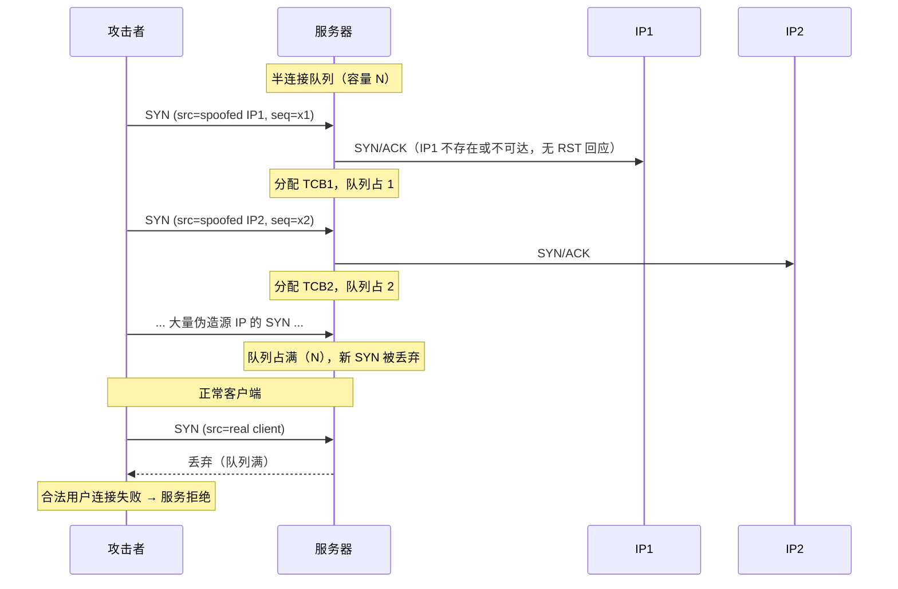
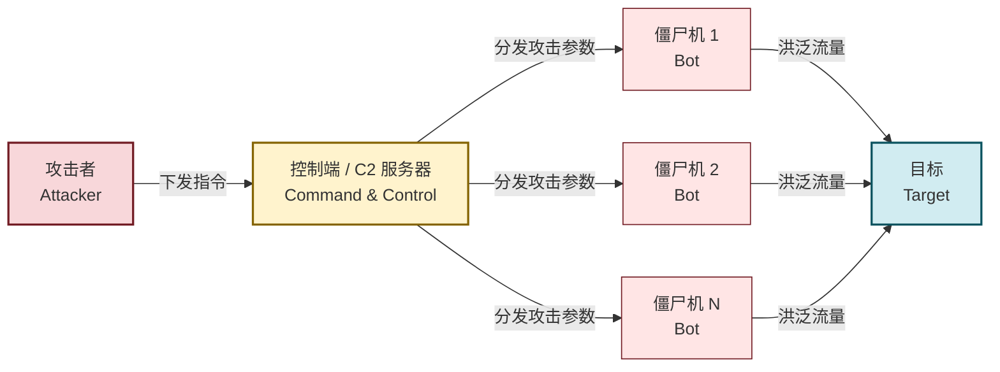
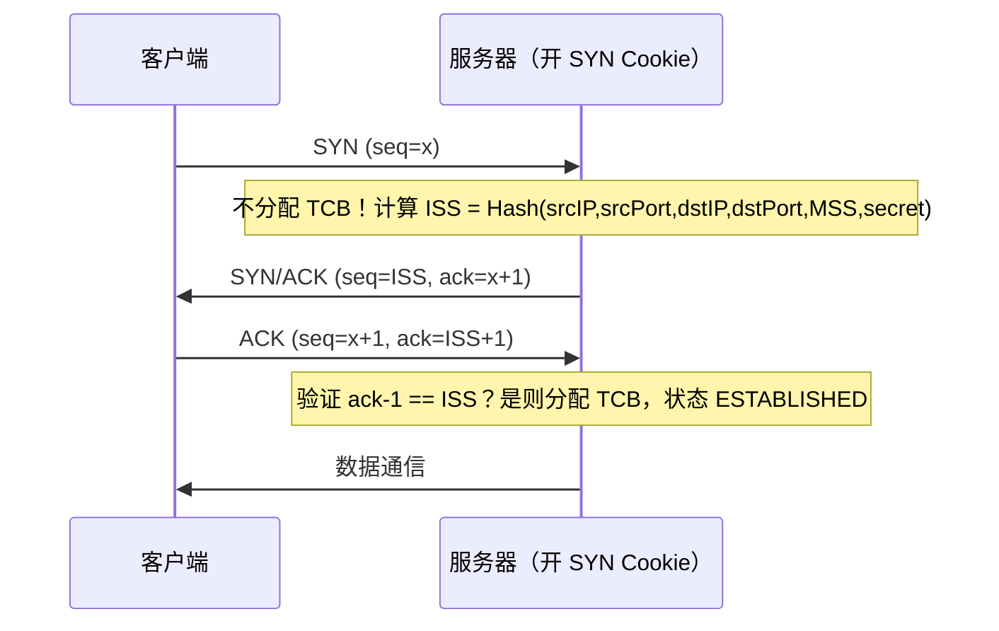

# 4.2 DoS、DDoS 攻击原理与防御

> [!abstract] 本节概述
> 本节解决"攻击者如何让合法用户无法访问服务"这一**可用性**威胁问题。DoS（Denial of Service）从单点发起资源耗尽攻击，DDoS（Distributed DoS）通过僵尸网络把攻击放大数个数量级。本节重点拆解 SYN Flood 对 TCP 半连接队列的利用、DDoS 三级控制架构、带宽型/协议型/应用层三类攻击的特征，以及流量清洗、CDN、SYN Cookie、限流等防御手段。这是 [[MOC - 第1章|CIA 三要素]] 中可用性维度的核心攻防。

> [!info] 资产与信任边界
> - **核心资产**：网络带宽、服务器 CPU/内存/连接表、应用并发处理能力
> - **信任边界**：Internet↔目标网络入口；任何外部主机都能向开放端口发包，攻击者无需进入内网
> - **攻击者能力假设**：能向目标发送任意构造的 IP/TCP/UDP/HTTP 包；DDoS 还需控制大量"肉鸡"形成僵尸网络；可能利用放大器（DNS/NTP/Memcached）实现反射放大
> - **威胁模型**：单机 DoS（资源不对称耗尽）vs 分布式 DDoS（带宽洪泛）；突发型 vs 慢速低慢型
> - **安全目标**：保障可用性——合法用户在攻击下仍能访问服务（弹性），攻击流量被识别并清洗（韧性）
> - **缓解措施方向**：扩容与冗余、近源清洗、协议加固（SYN Cookie）、限流降级、CDN 分散

> [!warning] 仅限授权实验环境使用
> 本节涉及 SYN Flood、慢攻击等描述**仅作原理分析与授权靶场复现**。任何针对真实第三方的 DoS/DDoS 行为均属违法，可能触犯《刑法》第 286 条破坏计算机信息系统罪。实验仅在隔离靶场对自有服务发起，且严格限制发包速率，避免影响共享链路。

## DoS 攻击原理：资源耗尽

> [!definition] DoS（拒绝服务攻击）
> 单一攻击源向目标发送精心构造的请求或海量流量，耗尽目标的某种有限资源（带宽、CPU、内存、连接数、文件描述符等），导致合法用户无法获得服务。DoS 的本质是**资源不对称**：攻击者用少量资源换取目标大量资源消耗。

资源耗尽可分为三类：

| 资源类型 | 典型攻击 | 耗尽机制 |
| -------- | -------- | -------- |
| 网络带宽 | UDP Flood、ICMP Flood、放大攻击 | 填满入口链路，合法包被丢弃 |
| 协议状态 | SYN Flood、连接耗尽 | 占满半连接/全连接队列 |
| 应用资源 | HTTP Flood、慢攻击（Slowloris） | 占满线程池/连接池 |

## SYN Flood 攻击原理

SYN Flood 是最经典的协议型 DoS，利用 TCP 三次握手的**半连接队列**缺陷。

> [!note] TCP 半连接队列
> 服务器收到 SYN 后会分配 TCB（Transmission Control Block）并放入**半连接队列（SYN Queue）**，状态为 SYN_RCVD，等待客户端的 ACK 完成握手。半连接队列大小有限（Linux `tcp_max_syn_backlog`，通常数百到数千）。队列满后新 SYN 将被丢弃。

### 攻击流程

> [!tip] 为什么 SYN Flood 难防
> 1. SYN 包本身合法，单包看无恶意特征，签名检测困难
> 2. 源 IP 伪造，难以追溯真实攻击者
> 3. 攻击者用很小的 SYN 包换取服务器较大的 TCB 与重传开销，**资源不对称**（典型 1:数十倍）
> 4. 半连接超时前队列一直被占（Linux 默认 SYN/ACK 重传 5 次约 30 秒）

## DDoS 攻击架构

> [!definition] DDoS（分布式拒绝服务攻击）
> 攻击者通过控制大量被植入木马/僵尸程序的主机（僵尸网络，Botnet）同时向目标发起拒绝服务攻击，使攻击流量呈数量级放大，且源 IP 分散于全球，难以通过封禁单个 IP 阻断。

### 三级控制架构

> [!note] 为什么分三级
> - **攻击者→控制端**：隔离真实身份，攻击者只与少数 C2 通信，C2 可随时更换
> - **控制端→僵尸机**：C2 通过 IRC/HTTP/P2P 协议下发指令，僵尸机平时静默，接到指令才发包
> - **僵尸机→目标**：海量源 IP 分散流量，封禁单 IP 无效；僵尸机常为 IoT 设备（默认弱口令）、家庭路由器、被入侵服务器

## DDoS 分类

### 按攻击层次分类

| 类型 | 原理 | 典型代表 | 特征 |
| ---- | ---- | -------- | ---- |
| **带宽型（体积型）** | 填满入口链路带宽 | UDP Flood、ICMP Flood、放大攻击 | 流量大（Gbps~Tbps）、易被流量清洗识别 |
| **协议型** | 耗尽协议状态资源 | SYN Flood、连接耗尽、慢攻击 | 流量中等，针对协议缺陷 |
| **应用层** | 模拟合法请求耗尽应用资源 | HTTP Flood、CC 攻击、慢速 POST | 流量小，难与正常流量区分 |

### 带宽型典型攻击

| 攻击 | 原理 | 放大倍数 |
| ---- | ---- | -------- |
| UDP Flood | 向目标随机端口发大量 UDP 包，目标回 ICMP 不可达 | 无放大 |
| ICMP Flood | 大量 ping 包耗尽带宽 | 无放大 |
| **DNS 放大** | 伪造源 IP 为目标，向开放 DNS 解析器发 ANY 查询，响应远大于请求 | ~50-100x |
| **NTP 放大** | 利用 monlist 命令返回监控列表 | ~556x |
| **Memcached 放大** | 伪造源 IP 向开放 Memcached 发 get 请求 | 最高 ~51000x |

> [!tip] 反射放大攻击的共同模式
> 攻击者伪造**源 IP 为目标 IP**，向**开放了某种无认证 UDP 服务**的第三方服务器发请求，第三方响应被反射到目标。放大倍数 = 响应大小 / 请求大小。防御核心：运营商实施源地址验证（BCP38/uRPF），杜绝 IP 伪造。

### 协议型：慢攻击

> [!definition] 慢攻击（Slowloris、Slow POST）
> 与高速洪泛相反，慢攻击以**极慢的速率**发送不完整的 HTTP 请求，长时间占用 Web 服务器连接线程。攻击者用极小带宽即可耗尽服务器线程池，使正常用户无法获得线程。

| 攻击 | 手法 |
| ---- | ---- |
| Slowloris | 持续发送不完整 HTTP 头，每隔几秒补一个，保持连接不超时 |
| Slow POST | 声明很大的 Content-Length，但极慢发送 body |
| Slow Read | 故意把 TCP 接收窗口设为极小，迫使服务器慢慢发 |

防御：限制单连接最大持续时间、限制并发连接数、使用异步非阻塞服务器（nginx 默认抗慢攻击能力强于 Apache prefork）。

## 防御措施

### 协议层防御：SYN Cookie

> [!definition] SYN Cookie
> 服务器在收到 SYN 时**不分配半连接资源**，而是把连接的四元组与 MSS 编码进 SYN/ACK 的初始序列号（ISS）返回。当收到客户端 ACK 时，从 ACK 的确认号反算验证是否为合法回应，验证通过才分配资源。这样半连接队列不再被占满。

> [!note] SYN Cookie 的代价
> - 优点：服务器无需维护半连接队列，SYN Flood 失效
> - 代价：丢失 TCP 选项（窗口缩放、SACK、时间戳），因为 ISS 被 cookie 占用；连接建立略慢
> - 启用：Linux `sysctl net.ipv4.tcp_syncookies=1`（默认开启）

### 其他防御手段

| 手段 | 层次 | 作用 |
| ---- | ---- | ---- |
| **流量清洗** | 网络层 | 上游清洗中心识别并丢弃攻击流量，仅放行干净流量到目标 |
| **CDN/Anycast** | 网络层 | 把流量分散到全球节点，单点带宽不足时由全网吸收 |
| **限流（Rate Limit）** | 协议/应用层 | 限制单 IP/会话的请求速率，超限丢弃或验证码 |
| **SYN Cookie / SYN Proxy** | 协议层 | 防火墙代理握手，验证后再建立到服务器的连接 |
| **连接数限制** | 协议层 | 限制单 IP 并发连接数，防连接耗尽 |
| **应用层 WAF** | 应用层 | 识别 HTTP Flood、CC，结合行为分析与人机验证 |
| **源地址验证（BCP38/uRPF）** | 运营商层 | 从根本杜绝 IP 伪造，治本但需运营商配合 |
| **弹性扩容** | 资源层 | 自动扩容应对突发，治标不治本但买时间 |

> [!tip] 纵深防御组合
> 实战中通常组合使用：CDN 分散流量 → 上游流量清洗 → 边界防火墙限速 → 服务器 SYN Cookie + 连接数限制 → 应用 WAF + 限流降级。任何单一手段都无法应对 Tbps 级 DDoS。

## 案例：2016 年 Mirai 僵尸网络攻击 Dyn 事件

> [!example] Mirai 攻击 Dyn（2016-10-21）
> - **事件**：DNS 服务商 Dyn 遭到大规模 DDoS，导致 Twitter、GitHub、PayPal、Netflix 等大量美国东海岸网站数小时无法访问
> - **僵尸网络**：Mirai 蠕虫通过扫描 IoT 设备（网络摄像头、路由器、DVR）的 Telnet 23/2323 端口，使用 60 余个默认弱口令（admin/admin、root/xc3511 等）登录感染，构建了约 10 万~50 万台的僵尸网络
> - **攻击手法**：以 DNS 放大 + 带宽洪泛为主，峰值流量约 1.2 Tbps
> - **暴露的问题**：IoT 设备默认弱口令、固件无法升级、运营商未做源地址验证
> - **教训**：IoT 安全基线（强制改默认口令、关闭 Telnet、签名固件）、运营商 BCP38 落地、关键 DNS 服务多供应商冗余
>
> Mirai 源码后被公开，衍生多个变种，持续威胁 IoT 生态。本案例对应 [[MOC - 第5章|第5章 恶意代码防护]] 中蠕虫传播与僵尸网络控制内容。

## 本节小结

> [!note] DoS/DDoS 的不对称性
> - **资源不对称**：攻击者小成本换目标大消耗（SYN 1:数十倍，放大攻击 1:数万倍）
> - **责任不对称**：防御方需独自承受，运营商源地址验证是治本但未普及
> - **检测不对称**：带宽型易识别，应用层与慢攻击难与正常流量区分
> - 应对核心：扩容买时间 + 清洗丢流量 + 协议加固减消耗 + 应用层智能识别

## 章节导航

- 上级：[[MOC - 信息安全技术|信息安全技术总览]]
- 本章：[[MOC - 第4章|第4章 网络攻击与防御技术]]
- 上一节：[[4.1 信息收集、端口扫描、嗅探技术|4.1 信息收集、端口扫描、嗅探技术]]
- 下一节：[[4.3 ARP 欺骗、中间人攻击|4.3 ARP 欺骗、中间人攻击]]
- 习题：[[MOC - 第4章习题|第4章 习题]]
