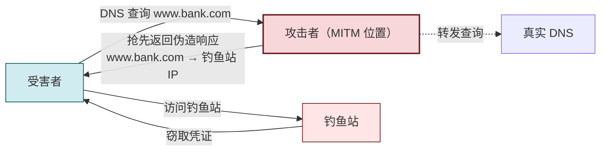

# 4.3 ARP 欺骗、中间人攻击

> [!abstract] 本节概述
> 本节解决"攻击者如何利用链路层协议缺陷劫持同网段流量"这一**机密性与完整性**威胁问题。ARP 协议为简化设计而**无任何认证**，攻击者可伪造 ARP 响应把网关或同网段主机的 MAC 指向自己，从而把流量绕到攻击者转发，形成中间人（MITM）。本节拆解 ARP 漏洞根源、MITM 完整流程、DNS 欺骗配合手段，以及静态 ARP、DHCP Snooping、动态 ARP 检测三类防御。这是协议设计"为效率牺牲安全"的经典反面教材。

> [!info] 资产与信任边界
> - **核心资产**：同网段主机间的链路层流量、网关到主机的所有进出流量
> - **信任边界**：同一广播域内的所有主机相互信任 ARP 广播/响应（这是漏洞根源）；信任边界应被交换机端口安全强化
> - **攻击者能力假设**：能接入目标所在同一广播域（同网段或同 VLAN），能向目标发送任意构造的 ARP 包
> - **威胁模型**：被动嗅探升级为主动劫持——攻击者不仅可监听，还可篡改流量内容（完整性威胁）
> - **安全目标**：保障机密性（流量不被窃听）与完整性（流量不被篡改）；维持主机与网关 MAC 映射的真实性
> - **缓解措施方向**：交换机层防御（DHCP Snooping + 动态 ARP 检测）、终端层防御（静态 ARP 绑定）、协议层根本缓解（IPSec/TLS 加密使劫持无意义）

> [!warning] 仅限授权实验环境使用
> 本节涉及的 ARP 欺骗、MITM、DNS 欺骗工具与命令**仅可在明确授权的隔离实验网络（自建虚拟网段、授权实训平台）使用**。在公共 Wi-Fi、企业内网、宿舍局域网对他人执行 ARP 欺骗属违法行为，可能触犯《刑法》第 285、286 条。实验须在隔离网段，实验后恢复网络设备配置。

## ARP 协议原理与漏洞

> [!definition] ARP（Address Resolution Protocol，地址解析协议）
> 将 IP 地址解析为 MAC 地址的链路层协议。当主机需向同网段某 IP 发包时，先查本地 ARP 缓存，未命中则广播 ARP 请求"谁是 X.X.X.X？告诉我"，对应主机单播回 ARP 响应"X.X.X.X 的 MAC 是 YY:YY:..."，请求方缓存该映射。

### ARP 协议的设计简化

| 设计选择 | 出发点 | 带来的漏洞 |
| -------- | ------ | ---------- |
| 请求用广播，响应用单播 | 减少广播开销 | 任意主机都可被动收到响应 |
| 响应**无认证** | 协议简洁、零配置 | 任何人都能伪造响应 |
| **主动响应会被无条件接受** | 支持 IP 冲突检测与热切换 | 攻击者可随时更新受害者缓存 |
| 缓存有过期但无验证 | 容错、自适应 | 持续欺骗可一直续期 |

> [!note] 漏洞根源：协议无认证
> ARP 是 1982 年设计的极简协议，假设"同网段都是可信主机"。它**没有任何机制验证 ARP 响应是否来自真实持有者**。攻击者只要能在同网段发包，就能让目标把任意 IP 的 MAC 改成攻击者的 MAC。这是典型的"为效率牺牲安全"——在 80 年代封闭科研网络成立，在如今开放办公网与公共 Wi-Fi 下致命。

## ARP 欺骗原理

> [!definition] ARP 欺骗（ARP Spoofing / ARP Poisoning）
> 攻击者向目标主机发送**伪造的 ARP 响应**，声称"网关 IP 的 MAC 是攻击者的 MAC"（或反之，向网关声称"目标 IP 的 MAC 是攻击者的 MAC"），使目标把发往网关的流量送到攻击者，攻击者再转发到真实网关，形成中间人位置。

### 双向欺骗

完整 MITM 需要**双向欺骗**：

| 欺骗方向 | 伪造内容 | 效果 |
| -------- | -------- | ---- |
| 对受害者 | "网关 IP → 攻击者 MAC" | 受害者上行流量经攻击者 |
| 对网关 | "受害者 IP → 攻击者 MAC" | 网关下行流量经攻击者 |

只欺骗单向会导致流量黑洞（受害者断网），双向欺骗并开启转发才能维持受害者正常上网且不被察觉。

## 中间人攻击（MITM）流程

```mermaid
sequenceDiagram
    participant V as 受害者 Victim
    participant A as 攻击者 Attacker
    participant G as 网关 Gateway
    Note over V: ARP 缓存：网关IP → 网关MAC（正常）
    Note over G: ARP 缓存：受害者IP → 受害者MAC（正常）
    A->>V: 伪造 ARP 响应：网关IP → 攻击者MAC
    Note over V: 缓存被篡改：网关IP → 攻击者MAC
    A->>G: 伪造 ARP 响应：受害者IP → 攻击者MAC
    Note over G: 缓存被篡改：受害者IP → 攻击者MAC
    Note over V,A,G: 现在流量必须经过攻击者
    V->>A: 上行流量（发往网关）
    A->>G: 转发上行（攻击者可监听/篡改）
    G->>A: 下行流量（发往受害者）
    A->>V: 转发下行（攻击者可监听/篡改）
    Note over A: 攻击者看到全部明文流量<br/>可篡改 HTTP 页面、注入脚本、窃取 Cookie
```

> [!tip] 维持欺骗的技巧
> 攻击者需**周期性**（如每秒 1 次）重发伪造 ARP 响应，防止受害者缓存过期或被真实网关的响应纠正。同时攻击者必须**开启 IP 转发**（`sysctl net.ipv4.ip_forward=1`），否则流量到攻击者即被丢弃，受害者断网会发现异常。

## DNS 欺骗配合

ARP 欺骗把流量劫持到攻击者后，攻击者可进一步实施 **DNS 欺骗**：当受害者发起 DNS 查询时，攻击者抢在真实 DNS 服务器之前返回伪造的 DNS 响应，把 `www.bank.com` 解析到攻击者的钓鱼站 IP。



> [!note] DNS 欺骗的生效条件
> - 攻击者已在 MITM 位置（ARP 欺骗成功）
> - 抢先于真实 DNS 响应（响应更快或真实响应被丢弃）
> - DNS 查询为 UDP（无连接，攻击者可直接伪造响应包）
> 防御：DNSSEC 对 DNS 响应做签名验证；DoH/DoT 把 DNS 查询加密到可信递归服务器，绕过本地 MITM。

## 防御措施

| 层次 | 措施 | 原理 | 适用场景 |
| ---- | ---- | ---- | -------- |
| **终端层** | 静态 ARP 绑定 | 手动绑定网关 IP→MAC，不接受伪造响应 | 服务器、关键主机 |
| **交换机层** | DHCP Snooping | 交换机监听 DHCP 建立 IP↔MAC↔端口绑定表 | 企业接入交换机 |
| **交换机层** | 动态 ARP 检测（DAI） | 基于 DHCP Snooping 表验证 ARP 响应合法性 | 企业接入交换机 |
| **交换机层** | 端口安全 | 限制端口可学习 MAC 数量，防 MAC 泛洪配合 | 接入交换机 |
| **协议层** | IPSec/TLS 加密 | 即使流量被劫持也无法解密篡改 | 跨网段通信、Web |
| **协议层** | DNSSEC / DoH | 防 DNS 欺骗 | 域名解析 |

> [!example] 静态 ARP 绑定（Linux，授权环境）
> ```bash
> # 查看当前 ARP 缓存
> ip neigh show
> # 绑定网关 192.168.1.1 的 MAC（须先确认真实 MAC）
> sudo ip neigh add 192.168.1.1 lladdr aa:bb:cc:dd:ee:ff dev eth0 nud permanent
> # 或修改现有条目为永久
> sudo ip neigh change 192.168.1.1 lladdr aa:bb:cc:dd:ee:ff dev eth0 nud permanent
> ```
> 适用：关键服务器静态绑定网关。局限：终端数量多时维护成本高，且需同时绑定网关与所有通信对端。

> [!tip] DHCP Snooping + DAI 的协同
> 1. **DHCP Snooping**：交换机把端口分为信任端口（接 DHCP 服务器）与非信任端口（接终端）。仅信任端口可回 DHCP 响应；非信任端口收到 DHCP OFFER/ACK 即丢弃。同时建立 IP↔MAC↔端口绑定表
> 2. **DAI（Dynamic ARP Inspection）**：基于 Snooping 绑定表验证 ARP 包，源 IP/MAC 与表不符即丢弃
> 二者配合从交换机层根本阻断 ARP 欺骗，是企业接入层最佳实践。

## 案例：局域网 ARP 欺骗实验（授权环境）

> [!example] 实验场景：Kali + Metasploitable + 网关
> - **环境**：VirtualBox 内部网络（隔离），三台虚拟机同网段
>   - 受害者 Win7（192.168.56.10）
>   - 攻击者 Kali（192.168.56.5）
>   - 网关（192.168.56.1）
> - **目标**：演示 ARP 欺骗 + 流量嗅探
> - **步骤（仅授权环境）**：
>   1. 攻击者开启 IP 转发：`sysctl -w net.ipv4.ip_forward=1`
>   2. 双向 ARP 欺骗：`arpspoof -i eth0 -t 192.168.56.10 192.168.56.1` 与反向同时运行
>   3. 嗅探：`wireshark` 或 `bettercap` 观察受害者明文 HTTP 流量
>   4. 恢复：停止 arpspoof，受害者 ARP 缓存自然过期或主动清空 `arp -d *`
> - **预期结果**：受害者上网正常（IP 转发维持），但攻击者可见全部明文 HTTP 流量、Cookie、表单提交
> - **风险与恢复**：实验全程在隔离内部网络；停止 arpspoof 后受害者 ARP 缓存几分钟内恢复；若开启 SSL Strip 篡改 HTTPS 须确保仅授权范围
>
> **教学意义**：直观说明为何公共 Wi-Fi 下未加密 HTTP 极不安全，以及为何 HTTPS（[[MOC - 第7章|TLS]]）是 MITM 的根本缓解。

## 本节小结

> [!note] ARP 欺骗的攻防要点
> - **漏洞根源**：ARP 无认证，同网段任何人可伪造响应
> - **MITM 三步**：双向 ARP 欺骗 → 开启转发 → 嗅探/篡改（可叠加 DNS 欺骗）
> - **防御三层**：终端静态绑定（小规模）、交换机 DHCP Snooping + DAI（企业最佳）、协议加密（根本缓解）
> - **加密是终极防线**：即使被 MITM，TLS/IPSec 让攻击者只能看到密文，机密性与完整性得以保障

## 章节导航

- 上级：[[MOC - 信息安全技术|信息安全技术总览]]
- 本章：[[MOC - 第4章|第4章 网络攻击与防御技术]]
- 上一节：[[4.2 DoS、DDoS 攻击原理与防御|4.2 DoS、DDoS 攻击原理与防御]]
- 下一节：[[4.4 Web 安全：SQL 注入、XSS、CSRF|4.4 Web 安全：SQL 注入、XSS、CSRF]]
- 习题：[[MOC - 第4章习题|第4章 习题]]
