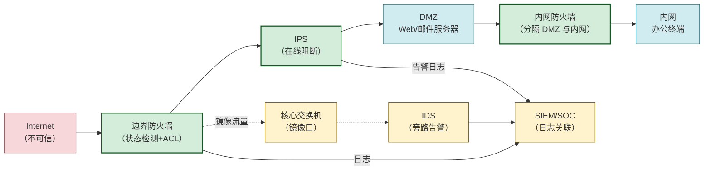

# 4.5 防火墙、入侵检测 IDS/IPS 基础

> [!abstract] 本节概述
> 本节解决"如何构建网络层纵深防御体系"这一**综合防御**问题。前四节分别从侦察、拒绝服务、协议劫持、应用漏洞四个角度看了攻击手段，本节把它们收束到防御侧——防火墙在边界做访问控制，IDS/IPS 在流量中识别与阻断恶意行为。本节拆解防火墙三代技术（包过滤→状态检测→应用层网关）、IDS 两种检测模型（误用 vs 异常）、IDS 与 IPS 的旁路 vs 在线差异，以及 Snort/Suricata 规则基础，最后给出企业边界部署架构案例。这是把 4.1–4.4 的"点防御"整合为"体系防御"的收官小节。

> [!info] 资产与信任边界
> - **核心资产**：内网主机、服务器、业务系统；信任边界由防火墙显式定义
> - **信任边界**：Internet↔边界防火墙（不可信→半可信）；内网↔DMZ（半可信→可信）；DMZ 内 Web↔DB（最小授权）
> - **防御者能力假设**：能在网络边界部署在线设备（防火墙/IPS），能在关键节点镜像流量（IDS），能维护规则库与基线
> - **威胁模型**：已知攻击（签名可匹配）vs 未知攻击/0day（需异常检测）；外部攻击（边界可拦）vs 内部攻击（需分段与监测）
> - **安全目标**：最小开放面、显式允许默认拒绝、攻击可见可阻断、误报漏报可控
> - **缓解措施方向**：纵深防御（多层异构设备）、最小权限（按需放行）、默认拒绝、持续更新规则与基线

> [!warning] 仅限授权实验环境使用
> 本节涉及的 Snort/Suricata 规则与 iptables 命令**应在授权实验网络配置与测试**。生产环境部署前须在测试环境验证规则，避免误拦截导致业务中断。规则变更须走变更流程并留存回退方案。

## 防火墙原理

> [!definition] 防火墙（Firewall）
> 部署在网络边界或主机上的访问控制设备/软件，根据预设规则对经过的流量进行**允许或拒绝**，从而在信任边界上实施网络层访问控制。核心原则是**默认拒绝（Default Deny）**：除非显式允许，否则一律拒绝。

### 防火墙三代技术

| 代际 | 技术 | 决策依据 | 优点 | 缺点 |
| ---- | ---- | -------- | ---- | ---- |
| **第一代** | 包过滤（Packet Filtering） | 单包的 IP/端口/标志位 | 速度快、无状态 | 无法关联包，无法防伪造，应用层盲 |
| **第二代** | 状态检测（Stateful Inspection） | 连接状态表 + 单包字段 | 跟踪 TCP 会话状态，决策更准 | 仍不深检应用层，状态表占内存 |
| **第三代** | 应用层网关（ALG/Proxy） | 应用层协议内容 | 可识别应用语义（如 FTP 主动模式） | 性能开销大，需为每协议写代理 |

> [!note] 状态检测的核心：连接表
> 状态检测防火墙维护一张**连接状态表**，记录每条已建立连接的五元组（srcIP, srcPort, dstIP, dstPort, proto）与状态。对返回包，若状态表中有匹配条目则放行（即使规则未显式允许返回端口），从而支持动态端口协议（如 FTP 数据连接）并防伪造包。这是它相对无状态包过滤的根本优势。

> [!tip] 包过滤与状态检测的差别（以 TCP 为例）
> - 包过滤：只能逐包看标志位，无法判断"这个 SYN/ACK 是否属于我放行的 SYN 的回应"
> - 状态检测：看到出站 SYN 后在状态表建条目，入站 SYN/ACK 匹配条目即放行，伪造的孤立 SYN/ACK 被丢弃
> 这也是为什么现代防火墙默认都至少是状态检测，纯包过滤（如早期 ACL）已很少单独使用。

### 应用层网关（ALG）示例

> [!example] FTP 主动模式的 ALG 处理
> FTP 主动模式：客户端连服务端 21 控制口后，客户端告知服务端"我从 PORT P 端口监听，你来连我取数据"，服务端从 20 端口反向连客户端 P 端口传数据。
> - 无 ALG 的状态检测防火墙：会拒绝服务端→客户端的反向连接（未在规则放行）
> - ALG：深入解析 FTP 控制连接的 `PORT` 命令，**动态**在防火墙开放对应端口，数据连接结束后立即关闭
> ALG 让状态检测支持"控制连接协商动态端口"的协议，是第二代与第三代的过渡。

## 防火墙部署

| 部署形态 | 位置 | 典型代表 |
| -------- | ---- | -------- |
| **边界防火墙** | 内网与 Internet 之间 | 企业出口防火墙、UTM |
| **DMZ 防火墙** | Internet↔DMZ↔内网 多防火墙分层 | 双防火墙/三明治结构 |
| **主机防火墙** | 单机操作系统内 | Windows Defender Firewall、iptables、ufw |
| **下一代防火墙（NGFW）** | 边界，集成 IDS/IPS/应用识别/URL 过滤 | Palo Alto、Fortinet、深信服 |
| **WAF** | Web 服务器前，应用层 | 防 [[4.4 Web 安全：SQL 注入、XSS、CSRF\|SQL 注入/XSS]] |

> [!note] NGFW 的本质
> 下一代防火墙（Next-Generation Firewall）把传统防火墙 + IDS/IPS + 应用识别 + URL 过滤 + 用户身份集成在一台设备，能基于"应用"而非"端口"做策略（如识别"端口 443 上的某 App"并按应用控制）。它模糊了防火墙与 IPS 的边界，是当前企业边界主流形态。

## IDS 入侵检测

> [!definition] IDS（Intrusion Detection System，入侵检测系统）
> 监听网络流量或主机行为，识别其中的攻击行为并**告警**（不阻断）的系统。IDS 通常以**旁路镜像**方式部署，对业务无影响，但只能事后告警，需人工或联动设备响应。

### 两种检测模型

| 模型 | 别名 | 原理 | 优点 | 缺点 |
| ---- | ---- | ---- | ---- | ---- |
| **基于特征（Signature-based）** | 误用检测 | 把已知攻击特征写成规则，匹配即告警 | 准确率高、误报低、可解释 | 漏报未知攻击/0day，依赖规则更新 |
| **基于异常（Anomaly-based）** | 异常检测 | 先建立正常行为基线，偏离基线即告警 | 可发现未知攻击 | 误报高，基线难维护，需训练期 |

> [!note] "误用检测"的命名由来
> "误用（Misuse）"在此并非"被滥用"，而是指"对系统的**错误使用**"——攻击行为本身就是对系统的误用。该模型把"误用模式"编码成规则去匹配，故称误用检测。它等价于"基于特征/签名的检测"，与"异常检测"相对。

> [!tip] 两种模型互补
> 实战中两者结合：特征检测覆盖已知攻击（低误报），异常检测补充未知攻击（高误报但能发现 0day）。SIEM/SOC 平台常把两者告警与日志关联，降低整体误报率。

## IPS 入侵防御

> [!definition] IPS（Intrusion Prevention System，入侵防御系统）
> 在 IDS 基础上以**在线串联**方式部署，识别攻击后**实时阻断**（丢弃数据包、重置连接）。IPS 是 IDS 的"主动"版本，能将检测转化为即时防御，但故障会直接影响业务可用性。

### IDS vs IPS

| 维度 | IDS | IPS |
| ---- | --- | --- |
| **部署方式** | 旁路镜像（被动监听） | 在线串联（流量必经） |
| **响应** | 告警，不阻断 | 实时丢弃/重置 |
| **对业务影响** | 无（故障不影响连通） | 故障会断网，需 bypass 机制 |
| **漏报后果** | 攻击未被发现 | 攻击被放行（同 IDS） |
| **误报后果** | 仅产生噪音告警 | **正常流量被阻断**，影响业务 |
| **部署位置** | 核心交换机镜像口 | 边界防火墙后、关键路径 |
| **典型场景** | 全流量监测、溯源 | 边界实时阻断 |

> [!warning] IPS 误报的代价
> IDS 误报只是产生噪音告警，运维可忽略；IPS 误报会**直接阻断正常流量**，可能导致业务中断。因此 IPS 规则通常比 IDS 更保守，新规则先以"仅告警"模式观察一段时间，确认无误报再切"阻断"模式。这是 IDS 与 IPS 在规则管理上的关键差异。

## Snort / Suricata 规则基础

Snort 与 Suricata 是开源 IDS/IPS 引擎，规则语法高度相似。一条规则由**规则头**（动作/协议/源/目的）与**规则选项**（匹配条件）组成。

> [!example] Snort 规则语法结构
> ```
> 动作 协议 源IP 源端口 -> 目的IP 目的端口 (选项1: 值1; 选项2: 值2;)
> ```
> 示例规则：
> ```
> # 检测对内网 Web 的已知 SQL 注入特征（仅作语法演示）
> alert tcp $EXTERNAL_NET any -> $HOME_NET 80 (msg:"SQL Injection attempt"; content:"' OR '1'='1"; nocase; sid:1000001; rev:1;)
> ```
> 各部分含义：
> - `alert`：动作（告警），还可 `log`/`drop`/`reject`
> - `tcp`：协议
> - `$EXTERNAL_NET any -> $HOME_NET 80`：源任意→目的 80 端口
> - `msg`：告警信息
> - `content`：匹配的负载特征
> - `nocase`：大小写不敏感
> - `sid`：规则唯一 ID，`rev`：版本号

> [!tip] IDS/IPS 规则维护要点
> - 规则库需持续更新（订阅 Emerging Threats、Talos 等规则源）
> - 新规则先 IDS 模式观察，确认无误报再转 IPS 阻断
> - 关键业务前 IPS 规则要谨慎，误阻断比漏报更影响业务
> - 结合 SIEM 做告警关联与降噪，避免告警风暴

## 防火墙 + IDS/IPS 部署架构



> [!note] 纵深防御的层级
> 1. **边界防火墙**：默认拒绝，仅放行 80/443 到 DMZ、25 到邮件服务器
> 2. **IPS**：在线阻断已知攻击（如 [[4.2 DoS、DDoS 攻击原理与防御|SYN Flood]] 特征、Web 攻击特征）
> 3. **DMZ 隔离**：DMZ 与内网用第二道防火墙分隔，DMZ 被攻破不直接威胁内网
> 4. **IDS 旁路监测**：全流量镜像，发现 IPS 漏报的隐蔽攻击，用于溯源
> 5. **SIEM 关联**：汇聚防火墙/IPS/IDS/系统日志，关联分析降低误报
> 6. **主机层**：服务器主机防火墙 + EDR，防内部横向移动

## 案例：企业边界安全部署

> [!example] 某中型企业边界部署
> - **场景**：500 人企业，对互联网提供 Web 与邮件服务，需防护扫描、DDoS、Web 攻击
> - **部署**：
>   - 出口：抗 DDoS 流量清洗（运营商或云清洗）→ 边界 NGFW（状态检测+IPS+应用识别）
>   - DMZ：Web 服务器前 WAF（防 [[4.4 Web 安全：SQL 注入、XSS、CSRF|SQL 注入/XSS]]），邮件服务器前反垃圾
>   - DMZ↔内网：第二道防火墙，仅放行内网→DMZ 的 443 管理、DMZ Web→内网 DB 的 3306（限制源 IP）
>   - 内网核心交换机镜像口接 IDS，全流量监测
>   - 日志汇聚到 SIEM，配置告警规则与值班响应
> - **效果**：外部扫描被防火墙过滤，Web 攻击被 WAF/IPS 拦截，DDoS 被清洗分流，内部异常被 IDS 发现并溯源
>
> **教训**：单一设备无法应对所有威胁，纵深防御 + 持续运维（规则更新、告警响应）才是关键。

## 防火墙 vs IDS vs IPS 对比

| 维度 | 防火墙 | IDS | IPS |
| ---- | ------ | --- | --- |
| **主要职责** | 访问控制 | 攻击检测告警 | 攻击检测阻断 |
| **部署方式** | 在线串联 | 旁路镜像 | 在线串联 |
| **响应** | 允许/拒绝 | 仅告警 | 告警 + 丢弃/重置 |
| **检测能力** | 基于规则的状态过滤 | 特征 + 异常 | 特征 + 异常 |
| **对业务影响** | 高（必经路径） | 无 | 高（必经路径） |
| **误报代价** | 拒绝正常流量 | 噪音告警 | 阻断正常流量 |
| **典型组合** | 边界访问控制 | 全流量监测溯源 | 边界实时阻断 |

## 本节小结

> [!note] 纵深防御的要点
> - **防火墙**管"能不能通"——基于状态表与规则做访问控制，是边界第一道
> - **IDS**管"看见什么"——旁路全流量监测，覆盖 IPS 漏报，做溯源
> - **IPS**管"拦不拦"——在线阻断已知攻击，把检测转化为即时防御
> - **三者互补**：防火墙过滤粗粒度，IPS 阻断已知攻击，IDS 发现未知与隐蔽攻击，SIEM 关联三者日志
> - **NGFW 趋势**：把三者集成到一台设备，但旁路 IDS 仍有独立价值（避免单点故障与盲区）

## 章节导航

- 上级：[[MOC - 信息安全技术|信息安全技术总览]]
- 本章：[[MOC - 第4章|第4章 网络攻击与防御技术]]
- 上一节：[[4.4 Web 安全：SQL 注入、XSS、CSRF|4.4 Web 安全：SQL 注入、XSS、CSRF]]
- 下一章：[[MOC - 第5章|第5章 恶意代码防护]]
- 习题：[[MOC - 第4章习题|第4章 习题]]
