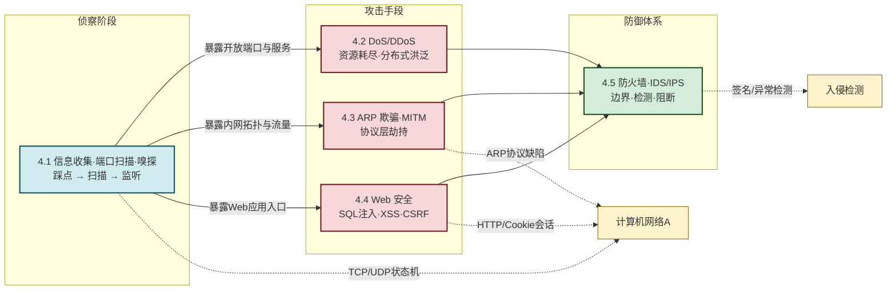

# MOC - 第4章 网络攻击与防御技术

本章解决的核心问题是：**在开放网络环境中，攻击者如何踩点、入侵、破坏与持久化，防御方又如何在边界、协议、应用三个层面识别与阻断这些威胁**。前几章建立了 CIA 三要素、密码学原语和身份认证体系，本章把它们放进真实攻防场景中检验——攻击者利用协议缺陷与应用漏洞绕过认证、危及机密性、耗尽可用性；防御方则用防火墙、IDS/IPS、安全编码与流量清洗构建纵深防线。

> [!info] 本章定位
> - **前置依赖**：[[MOC - 第1章|第1章]] 建立 CIA 三要素与威胁分类框架；[[MOC - 第2章|第2章]] 提供加密、哈希、HMAC 等密码学原语；[[MOC - 第3章|第3章]] 提供认证、授权、会话等概念
> - **本章主线**：侦察（4.1 信息收集与嗅探）→ 拒绝服务（4.2 DoS/DDoS）→ 协议层劫持（4.3 ARP/MITM）→ 应用层漏洞（4.4 Web 安全）→ 防御体系（4.5 防火墙/IDS/IPS）
> - **后续应用**：[[MOC - 第5章|第5章]] 恶意代码常以本章攻击技术为传播与控制手段；[[MOC - 第7章|第7章]] TLS/IPSec 等安全协议直接缓解嗅探与中间人攻击
> - **资产与信任边界**：网络流量、开放端口、Web 应用与会话令牌是核心资产；信任边界位于 Internet↔边界防火墙、内网↔DMZ、客户端浏览器↔Web 服务之间

> [!warning] 安全目标与前置条件
> - **安全目标**：保障机密性（防嗅探窃听）、完整性（防 ARP 劫持篡改）、可用性（防 DoS/DDoS 耗尽）、认证与会话安全（防 SQL 注入绕过登录、CSRF 冒用会话）
> - **攻击者能力假设**：能接入网络链路（嗅探前提）、能向目标发送伪造数据包（DoS/ARP 欺骗前提）、能诱导用户访问恶意页面（XSS/CSRF 前提）、能控制僵尸网络（DDoS 前提）
> - **前置条件**：理解 TCP/UDP/ARP 协议状态机、HTTP 请求/响应模型、Cookie 与会话机制
> - **缓解措施方向**：最小开放面、纵深防御、协议加固、安全编码、流量监测与阻断
> - **伦理红线**：本章所有攻击与扫描命令**仅限授权实验环境**使用，禁止对真实第三方系统操作

## 本章知识路线

> [!note] 攻击与防御的对称结构
> 本章按"攻击者视角"组织 4.1–4.4，按"防御者视角"组织 4.5，但每个攻击小节内部都嵌入了对应防御措施。复习时建议把 4.1–4.4 的防御段落与 4.5 的体系化防御对照阅读，理解"点防御"与"纵深防御"的关系。

## 知识点导航

| 小节 | 标题 | 核心问题 | 关键术语 |
| ---- | ---- | -------- | -------- |
| [[4.1 信息收集、端口扫描、嗅探技术\|4.1]] | 信息收集、端口扫描、嗅探技术 | 攻击者如何踩点、扫描与监听 | DNS/WHOIS、dorking、SYN 扫描、FIN/Xmas/Null、Wireshark、MAC 泛洪 |
| [[4.2 DoS、DDoS 攻击原理与防御\|4.2]] | DoS、DDoS 攻击原理与防御 | 如何耗尽目标资源、如何分布式放大 | SYN Flood、半连接、僵尸网络、UDP/ICMP Flood、SYN Cookie、流量清洗 |
| [[4.3 ARP 欺骗、中间人攻击\|4.3]] | ARP 欺骗、中间人攻击 | 如何利用协议无认证特性劫持流量 | ARP 欺骗、MITM、DNS 欺骗、静态 ARP、DHCP Snooping |
| [[4.4 Web 安全：SQL 注入、XSS、CSRF\|4.4]] | Web 安全：SQL 注入、XSS、CSRF | 应用层三大经典漏洞如何利用与防御 | SQL 注入、盲注、XSS（反射/存储/DOM）、CSRF、参数化查询、CSP、SameSite |
| [[4.5 防火墙、入侵检测 IDS、IPS 基础\|4.5]] | 防火墙、入侵检测 IDS/IPS 基础 | 如何构建网络层纵深防御 | 包过滤、状态检测、应用层网关、误用/异常检测、Snort/Suricata、旁路 vs 在线 |

## 核心考点

> [!tip] 高频考点速览
> 1. **端口扫描类型辨析**：TCP SYN（半开）vs TCP Connect（全开）vs FIN/Xmas/Null（隐蔽）vs UDP（难且慢）的原理与差异
> 2. **嗅探技术分层**：共享网络（混杂模式）vs 交换网络（MAC 泛洪、端口镜像）的原理与对应防御
> 3. **SYN Flood 原理**：利用 TCP 半连接队列耗尽资源；SYN Cookie 防御机制
> 4. **DDoS 架构与分类**：攻击者→控制端→僵尸网络→目标；带宽型/协议型/应用层的特征与典型代表
> 5. **ARP 欺骗 + MITM 流程**：伪造 ARP 响应→流量劫持→数据篡改/窃取；静态 ARP、DHCP Snooping 防御
> 6. **Web 三大漏洞对比**：SQL 注入（数据库）、XSS（用户浏览器）、CSRF（会话冒用）的原理、类型与防御
> 7. **XSS 三型与 CSP/HttpOnly**：反射型、存储型、DOM 型的区别；输出编码、CSP、HttpOnly Cookie 的作用边界
> 8. **防火墙 vs IDS vs IPS**：包过滤/状态检测/应用层网关；误用 vs 异常检测；旁路检测 vs 在线阻断

## 关键概念速查

### 攻击技术分层

| 层次 | 典型攻击 | 利用的缺陷 | 核心防御 |
| ---- | -------- | ---------- | -------- |
| 侦察层 | 端口扫描、嗅探 | 服务开放、链路可监听 | 关闭端口、加密、交换网络隔离 |
| 协议层 | SYN Flood、ARP 欺骗 | TCP/ARP 协议无认证 | SYN Cookie、静态 ARP、DHCP Snooping |
| 应用层 | SQL 注入、XSS、CSRF | 输入未过滤、输出未编码、会话冒用 | 参数化查询、输出编码、CSRF Token |
| 分布式层 | DDoS | 带宽/资源不对称 | 流量清洗、CDN、限流 |

### Web 三大漏洞对比

| 维度 | SQL 注入 | XSS | CSRF |
| ---- | -------- | --- | ---- |
| 攻击目标 | 数据库 | 用户浏览器 | 服务器会话 |
| 根因 | SQL 拼接 | 输出未编码 | Cookie 自动携带 |
| 危及的安全目标 | 机密性/完整性/认证 | 完整性/机密性（用户侧） | 完整性（业务操作） |
| 首选防御 | 参数化查询 | 输出编码 + CSP | CSRF Token + SameSite |

### 防御设备对比

| 设备 | 位置 | 工作方式 | 主要能力 |
| ---- | ---- | -------- | -------- |
| 防火墙 | 网络边界 | 在线过滤 | 访问控制、状态检测 |
| IDS | 旁路镜像 | 被动检测 | 告警、溯源 |
| IPS | 在线串联 | 主动阻断 | 实时丢弃恶意包 |

## 章节导航

- 上级：[[MOC - 信息安全技术|信息安全技术总览]]
- 上一章：[[MOC - 第3章|第3章 身份认证与访问控制]]
- 下一章：[[MOC - 第5章|第5章 恶意代码防护]]
- 本章习题：[[MOC - 第4章习题|第4章 习题]]
