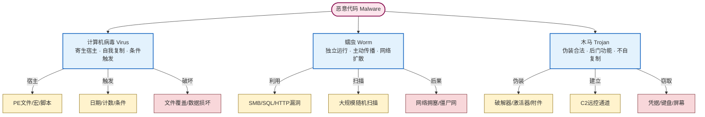

# 5.1 计算机病毒、蠕虫、木马区别

> [!abstract] 本节概述
> 恶意代码（Malware, Malicious Software）是攻击者破坏 [[1.1 信息安全三大目标：保密性、完整性、可用性|CIA 三要素]] 最直接的载体。本节聚焦三种最经典、最易混淆的恶意代码形态——**计算机病毒（Virus）、蠕虫（Worm）、木马（Trojan）**，从"是否需要宿主、是否自我复制、传播方式、目的"四个维度建立区分框架，并扩展到由受控节点组成的**僵尸网络（Botnet）**。理解三者的差异是后续 [[5.2 勒索病毒原理与防范方案|勒索软件]] 分析与 [[5.4 杀毒软件、EDR 防护机制|EDR 检测机制]] 选型的前提。

## 一、安全语境与威胁模型

> [!info] 资产、信任边界与攻击者能力
> - **信息资产**：终端操作系统、用户数据、可信凭据、业务系统可用性。
> - **信任边界**：内网终端（相对可信）／外部介质与互联网下载（不可信）／受控节点回连的 C2（命令控制，Command & Control）通道。
> - **攻击者能力**：可投递钓鱼附件、可引诱用户执行、可利用已知漏洞、可在用户交互下提权。
> - **安全目标**：阻止恶意代码进入终端、阻止其在主机间扩散、阻止其建立持久化后门。
> - **前置条件**：掌握 [[1.2 信息安全威胁、风险、漏洞、攻击分类|威胁/漏洞/风险]] 概念与 [[4-章 网络攻击与防御技术|第4章 网络攻防]] 的常见手法。

## 二、计算机病毒（Virus）

> [!definition] 计算机病毒
> 计算机病毒（Computer Virus）是一种**需要依附宿主程序**、当宿主被运行时**自我复制**到其他程序或存储介质、并按特定条件**触发激活**的恶意代码。"病毒"之名正取自其生物寄生与传染特性。

三个核心特征：

1. **寄生性（依附宿主）**：不能独立存在，必须将自身注入到 PE 文件、Office 宏、脚本等宿主中。
2. **传染性（自我复制）**：宿主运行后，病毒会寻找其他可感染目标并写入自身副本。
3. **触发性（条件激活）**：依赖特定日期、文件计数、运行次数等条件触发破坏载荷。

> [!example] CIH 病毒（1998）
> CIH 又称 Chernobyl 病毒，感染 Windows 9x 平台 PE 文件。每年 4 月 26 日触发，尝试覆写主板 BIOS 与硬盘主引导记录，导致主机无法启动。CIH 是经典的"寄生 + 触发"型文件病毒，曾在 1999 年大规模爆发，感染逾 6000 万台主机。

## 三、蠕虫（Worm）

> [!definition] 蠕虫
> 蠕虫（Worm）是一种**无需宿主、可独立运行**、利用网络或系统漏洞**主动自我传播**的恶意代码。它不需要用户交互触发，也不依赖被感染文件，而是把自身副本直接发送给其他脆弱主机。

三个核心特征：

1. **独立性（无需宿主）**：蠕虫本身就是一个完整可执行体，不依附其他程序。
2. **主动性（主动传播）**：利用网络服务漏洞、弱口令、共享通道等自行扩散。
3. **网络消耗性**：高速扫描与攻击会占用大量带宽，常引发网络拥塞这一副作用。

> [!example] Conficker 蠕虫（2008）
> Conficker 利用 Windows MS08-067（SMB 服务远程代码执行）漏洞主动传播，感染估计逾千万台主机，组建了大型僵尸网络用于出租。即便补丁早已发布，由于大量未打补丁主机存在，蠕虫仍持续多年活跃——这印证了"已知漏洞未修复"是蠕虫扩散的最主要土壤。

## 四、木马（Trojan）

> [!definition] 木马
> 木马（Trojan Horse）是一种**伪装成合法或有用程序**诱导用户运行、暗中实现**后门、窃密、远控**等恶意功能，但**自身不自我复制**的恶意代码。其名取自希腊神话"特洛伊木马"——表面无害，内部藏兵。

三个核心特征：

1. **伪装性**：以系统工具、破解版软件、激活器、文档附件等面目出现，骗取用户执行。
2. **后门功能**：运行后建立 C2 通道，实现远程控制、键盘记录、屏幕截取、文件窃取。
3. **非自复制**：木马本身不会主动感染其他文件或主机——这是它与病毒/蠕虫最显著的区别。

> [!example] Zeus 木马（2007 起）
> Zeus 是著名的银行窃密木马家族，伪装成合法程序投递，运行后注入浏览器进程，通过 form grabbing 与键盘记录窃取网银凭据，并把数据回传 C2。Zeus 不自我复制，而是靠钓鱼邮件、挂马网页分发，但通过其生成的 P2P 僵尸网络实现了规模化。

## 五、三种恶意代码对比

| 维度 | 计算机病毒 Virus | 蠕虫 Worm | 木马 Trojan |
| ---- | ---------------- | --------- | ----------- |
| **宿主依赖** | 必须依附宿主程序 | 独立运行，无需宿主 | 独立运行，无宿主 |
| **自我复制** | 是，感染其他文件 | 是，主动跨主机复制 | 否，依靠分发渠道投递 |
| **传播方式** | 文件感染被动跟随 | 主动利用漏洞/网络服务 | 钓鱼/挂马/捆绑下载 |
| **用户交互** | 通常需要运行被感染文件 | 可无需用户交互 | 需要用户被骗运行 |
| **典型目的** | 破坏、炫耀 | 扩散、占用资源、构建僵尸网 | 后门、窃密、远控 |
| **典型案例** | CIH、Melissa | Conficker、Slammer、Nimda | Zeus、灰鸽子 |
| **主要威胁属性** | 完整性、可用性 | 可用性、保密性 | 保密性、可用性 |

> [!tip] 一句话区分
> - **病毒**："我寄生在你身上，你跑我就跟着跑。"
> - **蠕虫**："我自己走，不用你带，我会主动找下一家。"
> - **木马**："我不复制，但我骗你请我进门，进门后我就开后门。"

## 六、三种恶意代码特征对比图

## 七、僵尸网络（Botnet）

> [!definition] 僵尸网络
> 僵尸网络（Botnet）是由被恶意代码（多为蠕虫或木马）感染并受攻击者远程控制的**大量主机（僵尸节点，Bots/Zombies）**组成的网络。控制者通过 C2 服务器下发指令，统一调度这些节点发起 DDoS、垃圾邮件、窃密、挖矿等攻击。

僵尸网络的组成：

- **Bot（僵尸节点）**：被植入 bots 程序的受控终端，常驻后台等待指令。
- **C2（命令控制服务器）**：下发指令、回收数据。早期多采用 IRC/HTTP 集中式，现今多见 P2P 去中心化结构以增强抗打击能力。
- **控制者（Botmaster）**：通过 C2 操作整个网络，可对外出租"攻击即服务"。

> [!note] Botnet 与病毒/蠕虫/木马的关系
> Botnet 是"应用形态"概念，而非与病毒/蠕虫/木马并列的新类别。它是蠕虫或木马的**运营层产物**：蠕虫提供大规模感染能力，木马提供后门与远控能力，二者组合即可构建僵尸网络。例如 Conficker（蠕虫型感染）+ 远控模块 = 僵尸网络；Zeus（木马型感染）+ P2P C2 = 僵尸网络。

## 八、案例综合分析

> [!example] 三类案例横向对照
>
> | 案例 | 类型 | 关键技术 | 破坏属性 | 教训 |
> | ---- | ---- | -------- | -------- | ---- |
> | CIH（1998） | 文件病毒 | PE 文件寄生、4 月 26 日触发 | 完整性（覆写 BIOS/MBR）、可用性（无法启动） | 终端加固与病毒查杀的基础需求 |
> | Conficker（2008） | 蠕虫 | MS08-067 漏洞主动传播、P2P C2 | 可用性（网络拥塞）、保密性（构建 Botnet） | 补丁管理与网络分段阻断扩散 |
> | Zeus（2007 起） | 木马 | 浏览器进程注入、键盘记录 | 保密性（网银凭据）、可用性（受控） | 邮件安全、行为检测、最小权限 |
>
> **共同教训**：补丁管理、终端防护、用户意识三者缺一不可；任何单一技术措施都无法覆盖全部传播路径。

## 九、易错点

> [!warning] 常见误区
> 1. **把蠕虫当作病毒**：蠕虫独立运行、不依附宿主，这是与病毒最本质的差异；考试中常以"是否需要宿主"作为判别。
> 2. **认为木马会自我复制**：木马的核心特征之一即"不自复制"，它靠分发渠道扩散而非自身复制。
> 3. **混淆"恶意代码分类"与"恶意代码家族"**：病毒/蠕虫/木马是按传播机制的功能分类；WannaCry、Zeus 是具体家族，且一个家族可能兼具多种特征（如 WannaCry 是"蠕虫型勒索软件"）。
> 4. **僵尸网络当作第四类恶意代码**：Botnet 是由蠕虫/木马组建的"网络化运营形态"，不与三类并列。
> 5. **忽视"触发条件"**：病毒的"潜伏-触发"机制使其具备低检测率与高破坏性，是检测设计的难点。

## 章节导航

- 上级：[[MOC - 第5章|第5章 恶意代码防护]]
- 上一节：[[MOC - 第4章|第4章 网络攻击与防御技术]]
- 下一节：[[5.2 勒索病毒原理与防范方案|5.2 勒索病毒原理与防范方案]]
- 习题：[[MOC - 第5章习题|第5章 习题]]
