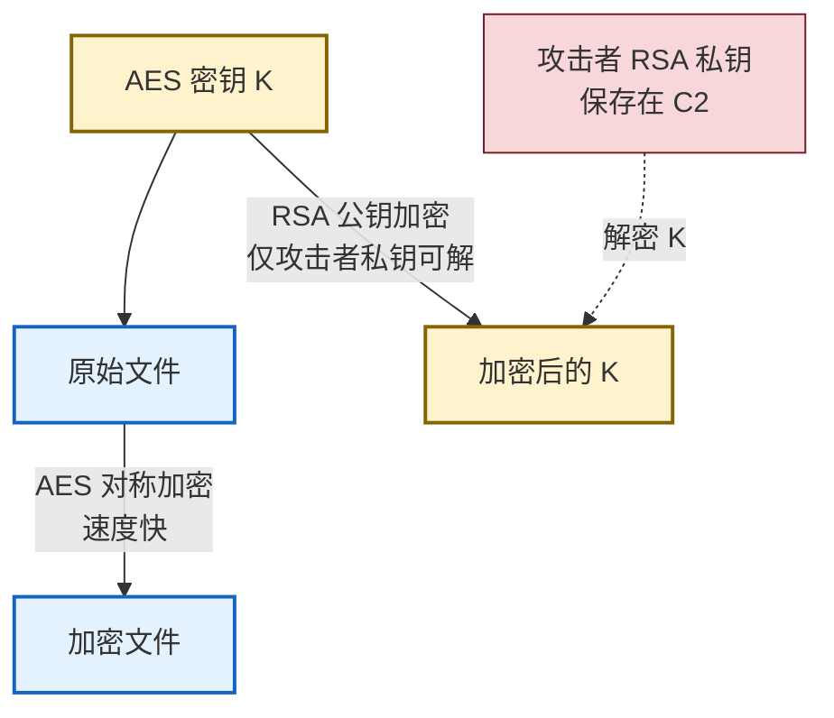

# 5.2 勒索病毒原理与防范方案

> [!abstract] 本节概述
> 勒索软件（Ransomware）是近年最具破坏力的恶意代码形态，它通过**加密受害者的核心数据**迫使其支付赎金以换取解密密钥，直接打击 [[1.1 信息安全三大目标：保密性、完整性、可用性|可用性与完整性]]。本节从勒索软件的运行原理出发，解析其"投递—加密—勒索—变现"攻击链，重点拆解"对称加密文件 + 非对称加密密钥"的混合加密设计，并以 WannaCry、Conti、LockBit 为代表分析家族演进，最后给出"备份 + 补丁 + 邮件安全 + 终端防护"的多层防御方案。本节建立在 [[5.1 计算机病毒、蠕虫、木马区别|5.1 恶意代码分类]] 与 [[2.2 对称加密算法：DES、AES 原理|AES]]/[[2.3 非对称加密：RSA、公钥私钥机制|RSA]] 之上。

## 一、安全语境与威胁模型

> [!info] 资产、信任边界与攻击者能力
> - **信息资产**：业务数据文件（文档、数据库、备份）、密钥与凭据、终端与服务器的可用性。
> - **信任边界**：办公终端与生产服务器（内部）／邮件附件与 RDP 公网入口（不可信外部）／备份存储（应隔离的信任域）。
> - **攻击者能力**：可投递钓鱼邮件、可扫描暴露 RDP、可利用 EternalBlue 等已知漏洞横向移动、可托管 C2 与赎金清算。
> - **安全目标**：阻止勒索软件落地、阻止其横向扩散、保证数据可恢复、降低赎金支付必要性。
> - **前置条件**：掌握 [[2.4 哈希函数、MD5、SHA 系列、消息摘要|对称/非对称加密]] 与 [[5.1 计算机病毒、蠕虫、木马区别|5.1 恶意代码分类]]。

## 二、勒索软件定义与原理

> [!definition] 勒索软件
> 勒索软件（Ransomware）是一类以**加密或锁定受害者数据**为手段、以**勒索赎金**为目的的恶意代码。其本质是把"可用性"作为人质，迫使受害者在"支付赎金"与"永久丢失数据"之间二选一。

勒索软件按破坏方式分两类：

| 类型 | 英文 | 行为 | 是否可恢复 |
| ---- | ---- | ---- | ---------- |
| **加密型** | Crypto Ransomware | 加密用户文件，保留系统可用以显示勒索说明 | 一般不可，除非拿到密钥或漏洞 |
| **锁定型** | Locker Ransomware | 锁定系统/屏幕，禁止用户进入 | 较易，常可解锁或绕过 |

> [!note] 现代勒索软件以加密型为主
> 加密型勒索因"无密钥即不可逆"的特性，威慑力远高于锁定型，已成为绝对主流。本节后续讨论默认指加密型。

## 三、勒索软件攻击链

```mermaid
flowchart LR
    A[1. 初始投递<br/>钓鱼邮件/RDP爆破/漏洞利用] --> B[2. 落地执行<br/>释放载荷/绕过防御]
    B --> C[3. 横向移动<br/>SMB/凭据/漏洞扩散]
    C --> D[4. 数据窃取<br/>外泄作为双重勒索筹码]
    D --> E[5. 加密数据<br/>AES加密文件 · RSA加密AES密钥]
    E --> F[6. 勒索通知<br/>README/壁纸/弹窗]
    F --> G[7. 赎金支付<br/>加密货币/洋葱路由]
    G -.解密密钥.-> H{是否提供解密?}
    H -.|不保证|-> I[数据永久丢失/公开]

    classDef stage fill:#e3f2fd,stroke:#1565c0,stroke-width:2px
    classDef critical fill:#f8d7da,stroke:#721c24,stroke-width:2px
    classDef risk fill:#fff3cd,stroke:#856404,stroke-width:1px
    class A,B,C,D,F stage
    class E critical
    class G,H,I risk
```

> [!tip] 双重勒索（Double Extortion）
> 现代勒索家族（如 Conti、LockBit）普遍采用**双重勒索**：先窃取数据外泄，再加密。即便受害方有备份可恢复，仍面临"不付赎金就公开数据"的二次威胁。这意味着仅靠备份已不足以完全缓解勒索风险，必须叠加数据外泄检测与防泄露措施。

## 四、混合加密机制：对称 + 非对称

勒索软件的高明之处在于其加密设计——既保证加密速度（对称），又保证只有攻击者能解密（非对称）。

> [!definition] 勒索软件的混合加密设计
> 1. 攻击者为每台受害主机生成一对 RSA 密钥对，**私钥保存在 C2 服务器**，公钥随载荷下发。
> 2. 对每个待加密文件，生成**随机 AES 对称密钥** $K_{file}$。
> 3. 用 $K_{file}$ 以 AES（多为 AES-128/256）加密文件内容——对称加密速度快，适合批量大文件。
> 4. 用**攻击者公钥** $PK_A$ 加密 $K_{file}$，得到 $C_K = E_{PK_A}(K_{file})$。
> 5. 把 $C_K$ 与加密后的文件一同保存，删除原始 $K_{file}$ 与卷影副本（VSS）。



> [!warning] 为什么受害者自己解不开
> 受害者本地只有加密后的文件和加密后的 AES 密钥 $C_K$。要还原文件，需要先解出 $K_{file}$，而 $C_K$ 用的是攻击者的 RSA 公钥——只有攻击者保管的私钥才能解开。这正是 [[2.3 非对称加密：RSA、公钥私钥机制|RSA]] 的单向性在恶意场景下的应用：密码学本身是中性的。

## 五、传播方式

| 传播途径 | 描述 | 典型勒索家族 |
| -------- | ---- | ------------ |
| **钓鱼邮件** | 携带恶意宏的 Office 附件、伪装发票/快递单的 zip | LockBit、Conti |
| **RDP 暴力破解** | 扫描暴露 3389 端口，弱口令爆破后手动投递 | Ryuk、Conti |
| **漏洞利用** | 利用 EternalBlue（MS17-010）等已知漏洞横向扩散 | WannaCry、NotPetya |
| **恶意下载/挂马** | 浏览器漏洞或伪装工具静默下载 | 各种 RaaS 变种 |
| **供应链/远程管理工具滥用** | 攻击 MSP/Vendor 凭据横向植入 | Kaseya REvil |

> [!note] EternalBlue（MS17-010）与勒索扩散
> EternalBlue 是泄露自 NSA 的 Windows SMBv1 远程代码执行漏洞利用代码，可让攻击者无需凭据在暴露 445 端口的主机上执行任意代码。WannaCry 与 NotPetya 正是借助它实现了"蠕虫式"自动横向扩散，导致勒索软件的传播效率发生质变。补丁已于 2017 年 3 月发布（MS17-010），但暴露未打补丁主机至今仍存在。

## 六、典型勒索家族对比

| 家族 | 出现年份 | 传播特点 | 加密方式 | 显著特征 |
| ---- | -------- | -------- | -------- | -------- |
| **WannaCry** | 2017 | EternalBlue 蠕虫式扩散 | AES + RSA-2048 | "Kill Switch"域名可暂停扩散 |
| **Conti** | 2020–2022 | 手动渗透 + RDP + Cobalt Strike | AES-256 + RSA | 双重勒索、RaaS 模式、2022 源码泄露 |
| **LockBit** | 2019 起 | RaaS、自动化渗透 | AES + RSA | 双重/三重勒索、跨平台（Win/Linux） |

> [!info] RaaS（Ransomware-as-a-Service）模式
> 现代勒索家族普遍采用 RaaS：开发者提供勒索软件、C2、谈判界面， Affiliate（加盟者）负责投递与渗透，赎金分成。这种分工使勒索软件从"小作坊"演变为"产业链"，扩散速度与质量都大幅提升。

## 七、案例：2017 年 WannaCry 全球爆发

> [!example] WannaCry 事件分析
> 2017 年 5 月 12 日起，WannaCry 借助 EternalBlue 在数十小时内感染 150 余国家、逾 30 万台主机。英国 NHS、西班牙电信、FedEx 等基础设施受冲击严重。
>
> **攻击链复盘**：
> 1. 初始投递：钓鱼邮件 + EternalBlue 横向扩散；
> 2. 加密载荷：AES-128 加密文件，RSA-2048 加密 AES 密钥；
> 3. 赎金：要求 300–600 美元比特币，赎回率极低；
> 4. 拐点：安全研究员 MalwareTech 注册了代码中的"Kill Switch"域名，域名上线后触发 WannaCry 自停逻辑，疫情迅速缓解。
>
> **教训**：
> - 补丁管理失灵：MS17-010 补丁发布两个月后仍有大规模未修复主机；
> - 终端防护失效：传统特征码无法覆盖零日变种；
> - 备份与隔离缺失：NHS 部分医院无可用离线备份，被迫停诊；
> - 网络分段不足：暴露 SMB 端口直接面向公网。

## 八、防范方案

> [!tip] 多层防御策略
> 勒索软件没有"银弹"，必须按 [[1.3 信息安全模型、安全体系框架|深度防御]] 分层叠加：

| 防御层 | 措施 | 缓解的攻击环节 |
| ------ | ---- | -------------- |
| **备份恢复** | 3-2-1 备份、离线/不可变备份、定期恢复演练 | 加密后的数据可恢复，降低赎金必要性 |
| **补丁管理** | 操作系统与应用补丁 SLA、SCA 第三方组件追踪 | 阻断 EternalBlue 等漏洞利用 |
| **邮件安全** | 网关沙箱、宏默认禁用、附件类型限制、用户意识培训 | 阻断钓鱼邮件投递 |
| **终端防护** | [[5.4 杀毒软件、EDR 防护机制\|EDR]] 行为监控、防勒索模块、卷影副本保护 | 落地执行与加密阶段拦截 |
| **网络分段** | 微隔离、关闭 SMB/RDP 公网暴露、堡垒机审计 | 阻断横向移动 |
| **RDP 加固** | 限制源 IP、NLA、强口令 + MFA、跳板机 | 阻断 RDP 爆破 |
| **应急响应** | 隔离预案、断网分级、取证保留、复盘改进 | 缩小爆炸半径、加速恢复 |

> [!warning] 备份的"不可变"原则
> 勒索软件会主动删除卷影副本（VSS）并尝试感染可写备份目标。备份必须满足：① **离线**或**不可变（Immutable/WORM）**，攻击者无法删除或覆盖；② **定期验证可恢复性**，否则备份可能"形同虚设"。

> [!warning] 是否支付赎金
> 支付赎金不保证获得解密密钥（部分家族根本不存私钥）、助长黑色产业、可能违反法律法规。多数国家执法机构建议不支付。决策应基于数据价值、合规要求与备份恢复可行性，由法务与高管共同评估。

## 九、易错点

> [!warning] 常见误区
> 1. **认为有备份就万事大吉**：双重勒索下，备份只能解决"加密"，不能解决"数据外泄"。需叠加防泄露与外泄检测。
> 2. **混淆"勒索软件"与"蠕虫/木马"**：勒索软件按目的分类，蠕虫/木马按传播机制分类。WannaCry 同时是"蠕虫型 + 勒索目的"。
> 3. **以为只要清掉病毒即可恢复**：被加密文件未恢复前，单纯杀毒无济于事；必须从备份或解密恢复数据。
> 4. **忽视 RDP 公网暴露**：RDP 爆破是 Conti、Ryuk 等手动渗透型勒索的首选入口，关闭公网 RDP 是高性价比措施。
> 5. **Kill Switch ≠ 补丁**：WannaCry 因 Kill Switch 暂停只是巧合式缓解，根本解决仍靠补丁与终端防护，不能依赖"运气"。

## 章节导航

- 上级：[[MOC - 第5章|第5章 恶意代码防护]]
- 上一节：[[5.1 计算机病毒、蠕虫、木马区别|5.1 病毒、蠕虫、木马区别]]
- 下一节：[[5.3 恶意代码传播途径、特征识别|5.3 传播途径、特征识别]]
- 习题：[[MOC - 第5章习题|第5章 习题]]
