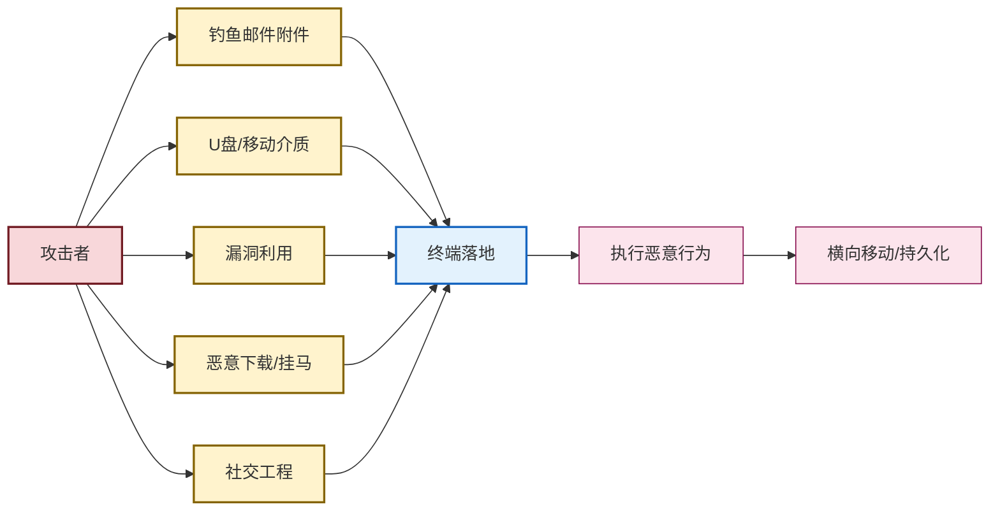

# 5.3 恶意代码传播途径、特征识别

> [!abstract] 本节概述
> 检测恶意代码的前提是理解它**如何进入终端**以及**如何被识别**。本节从两个互补维度展开：第一，梳理恶意代码的**传播途径**——邮件附件、U 盘、漏洞利用、恶意下载、社交工程；第二，介绍**特征识别**的两种主流方法——**静态特征**（哈希、字符串、YARA 规则）与**动态特征**（行为分析、沙箱运行）。理解"传播 → 落地 → 行为"的链条，是 [[5.4 杀毒软件、EDR 防护机制|5.4 终端防护]] 选型与 APT（Advanced Persistent Threat，高级持续性威胁）取证的基础。

## 一、安全语境与威胁模型

> [!info] 资产、信任边界与攻击者能力
> - **信息资产**：终端操作系统、用户凭据、业务数据、横向移动可达的服务器。
> - **信任边界**：内网终端（相对可信）／邮件网关、外接介质、互联网下载（不可信）／关键业务服务器（高价值目标）。
> - **攻击者能力**：可投递钓鱼附件、可制作 U 盘诱饵、可挂马网页、可利用未公开漏洞（APT）、可社工欺骗。
> - **安全目标**：阻断已知传播路径、识别已知与未知恶意代码、还原攻击链支撑取证。
> - **前置条件**：掌握 [[5.1 计算机病毒、蠕虫、木马区别|5.1 恶意代码分类]] 与 [[5.2 勒索病毒原理与防范方案|5.2 勒索软件]]。

## 二、恶意代码传播途径



### 2.1 邮件附件

最经典也最高频的途径。附件形式多样：

- **Office 文档带恶意宏**：利用 VBA 宏下载并执行载荷，常伪装为发票、简历、合同。
- **可执行附件**：伪装 PDF/zip 的 PE 文件，诱导双击。
- **链接型钓鱼**：邮件正文链接指向伪造登录页或漏洞利用页面。

> [!tip] 宏默认禁用是高性价比措施
> Office 自 2016 起默认标记来自互联网的文档并禁用宏，从源头上阻断 VBA 载荷。组织应在策略层强制保持禁用，并对启用宏设置白名单与审计。

### 2.2 U 盘与移动介质

历史上 Stuxnet 即通过 U 盘传播。现今仍是物理隔离网络（如工控、涉密网络）的主要突破手段：

- **Autorun**：早期利用 `autorun.inf` 自动执行，已被系统层面禁用。
- **诱饵投递**：在目标单位周边散落"捡到的 U 盘"诱导员工插入。
- **LNK 文件伪装**：U 盘中以文件夹图标伪装的 `.lnk` 实际指向恶意脚本。

### 2.3 漏洞利用

包括终端侧与网络服务侧漏洞：

- **客户端漏洞**：浏览器、Office、PDF 阅读器解析漏洞，挂马网页触发。
- **服务端漏洞**：SMB（EternalBlue）、SMBGhost、Exchange ProxyLogon 等远程代码执行。
- **零日漏洞**：APT 常用未公开漏洞，传统特征检测难覆盖，需行为与异常检测。

### 2.4 恶意下载与挂马

- **挂马网页**：合法网站被植入恶意脚本（Drive-by Download），访问即触发浏览器漏洞。
- **伪软件下载站**：捆绑安装恶意软件，常以"破解版""绿色版"诱饵。
- **更新劫持**：劫持软件更新通道下发恶意签名载荷（如 NotPetya 通过 MEDoc 更新）。

### 2.5 社交工程

不直接利用技术漏洞，而是利用人性：

- **冒充客服/IT**：电话或即时通讯诱导执行"远程协助"或安装"维护工具"。
- **水坑攻击**：攻击目标群体常访问的合法网站，注入恶意载荷。
- **诱饵链接**：伪造红包、求职信息、敏感新闻等诱导点击。

## 三、静态特征识别

> [!definition] 静态分析
> 静态分析（Static Analysis）指**不运行恶意代码**，通过反汇编、反编译、文件结构解析等手段提取特征并判定。优点是安全、快速、可批量；缺点是无法发现加壳、混淆与零日变种。

| 静态特征 | 描述 | 应用 |
| -------- | ---- | ---- |
| **文件哈希** | MD5/SHA-1/SHA-256 计算文件指纹 | IOC 比对、黑白名单、威胁情报匹配 |
| **字符串特征** | 提取可读字符串（C2 域名、API 名、错误信息） | 家族归类、可疑线索 |
| **导入表/导出表** | 分析 PE 文件的 API 调用模式 | 行为倾向推断（如 `CreateRemoteThread`、`VirtualAllocEx` 暗示进程注入） |
| **熵值分析** | 计算文件段熵，判断是否加壳 | 加壳检测、可疑度评估 |
| **YARA 规则** | 基于模式匹配的字节/字符串规则语言 | 大规模扫描、家族识别 |

> [!example] YARA 规则示例
> ```yara
> rule Example_Trojan_Generic {
>     meta:
>         description = "Example trojan detection"
>         author = "SecTeam"
>         date = "2026-08-03"
>     strings:
>         $s1 = "C:\\Temp\\update.exe" wide ascii
>         $s2 = { 6A 30 68 ?? ?? ?? ?? 6A 00 E8 }   // 调用模式
>         $s3 = "fake-update.example.com" nocase
>     condition:
>         uint16(0) == 0x5A4D and 2 of ($s*)
> }
> ```
> 该规则匹配 MZ 头（PE 文件特征）并要求至少命中 2 条字符串模式，是典型 YARA 写法。规则需在受控环境验证，避免误报。

## 四、动态特征识别

> [!definition] 动态分析
> 动态分析（Dynamic Analysis）指**在受控环境中运行恶意代码**，观察其行为以提取特征。优点是能识别未知变种、揭示真实行为；缺点是耗时、可能被反沙箱对抗。

动态分析关注的行为类型：

| 行为类型 | 观察对象 | 恶意指标 |
| -------- | -------- | -------- |
| **文件操作** | 文件创建、修改、删除 | 释放 PE 到 `%AppData%`、删除卷影副本 |
| **注册表修改** | 自启动项、关联劫持 | 写入 `Run` 键、修改文件关联 |
| **进程操作** | 进程注入、进程镂空 | `CreateRemoteThread` + `WriteProcessMemory` |
| **网络通信** | C2 回连、DNS 查询 | 异常 DGA 域名、固定 IP/端口连接 |
| **权限提升** | 利用提权漏洞 | 令牌窃取、UAC 绕过 |
| **横向移动** | SMB/RDP/PsExec 调用 | 内网扫描、凭据传递 |

## 五、沙箱技术

> [!definition] 沙箱
> 沙箱（Sandbox）是一种**隔离的可执行环境**，用于安全地运行可疑样本并自动采集其行为日志。沙箱通常基于虚拟机或容器构建，配合 API Hook、文件系统监控、网络流量捕获等手段形成完整行为画像。


> [!note] 反沙箱对抗
> 现代恶意代码普遍具备反沙箱能力：检测鼠标移动、内存大小、用户交互时长、特定进程名（vmtools、sandboxie）等，符合沙箱特征时则"装死"不执行恶意行为。对抗手段包括：①使用真实硬件或裸金属沙箱；②模拟用户交互；③延迟 detonation；④多环境交叉验证。

## 六、案例：APT 攻击链分析

> [!example] APT 攻击链典型结构
> APT（Advanced Persistent Threat，高级持续性威胁）通常针对特定目标长期渗透，攻击链可拆分为情报收集→初始突破→驻留→横向移动→数据外泄等阶段（参考 Lockheed Martin Cyber Kill Chain）。
>
> | 阶段 | 典型手段 | 检测/防御环节 |
> | ---- | -------- | -------------- |
> | 侦察 | OSINT、扫描暴露资产 | 资产收敛、攻击面管理 |
> | 武器化 | 制作针对性钓鱼/0day 载荷 | 威胁情报订阅、样本预研 |
> | 投递 | 鱼叉邮件、水坑、U 盘 | 邮件网关沙箱、终端防护 |
> | 利用 | 漏洞触发、宏执行 | 补丁、宏禁用 |
> | 安装 | 植入后门、远控 | [[5.4 杀毒软件、EDR 防护机制\|EDR]] 行为检测 |
> | 命令控制 | C2 通信、隐蔽通道 | 流量分析、DNS 监控 |
> | 行动目标 | 横向移动、数据外泄 | 数据防泄露、审计 |
>
> APT 检测要点：①不能依赖单一特征，需跨阶段关联；②重视异常行为而非已知 IoC；③需要长时间窗口的 telemetry 与威胁狩猎。

## 七、易错点

> [!warning] 常见误区
> 1. **混淆静态分析与动态分析**：静态不运行样本，动态需运行；前者快但易被加壳绕过，后者慢但能揭示真实行为。
> 2. **认为文件哈希是可靠检测**：哈希只能匹配已知样本，攻击者通过微小修改即可产生新哈希。哈希应与其他特征组合使用。
> 3. **忽视沙箱的局限性**：反沙箱技术使部分样本在沙箱中"装死"；沙箱阴性不等于安全，需结合人工分析与多环境验证。
> 4. **把传播途径当作分类**：邮件/U盘/漏洞是"传播方式"，与 [[5.1 计算机病毒、蠕虫、木马区别|5.1 病毒/蠕虫/木马]] 是不同维度，不可混用。
> 5. **APT 只靠特征检测**：APT 通常使用 0day 与定制载荷，特征码难以覆盖；应以行为基线、异常检测、长期 telemetry 为主。

## 章节导航

- 上级：[[MOC - 第5章|第5章 恶意代码防护]]
- 上一节：[[5.2 勒索病毒原理与防范方案|5.2 勒索病毒原理与防范方案]]
- 下一节：[[5.4 杀毒软件、EDR 防护机制|5.4 杀毒软件、EDR 防护机制]]
- 习题：[[MOC - 第5章习题|第5章 习题]]
